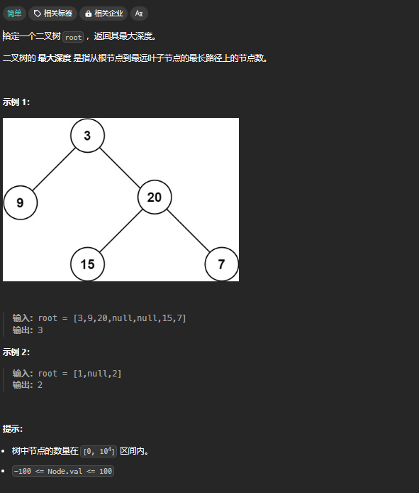

	
## 解题思维
### 「遍历」思维
通过遍历一遍二叉树得到答案
用一个 `traverse` 函数配合**外部变量**解决。（回溯算法）
### 「分解问题」思维
子问题（子树）的答案推导出原问题的答案，写出递归函数的定义，并充分利用**返回值**。（动态规划）
### 思考步骤
两个思维解题共同点：
1. 单独抽出一个二叉树节点。（这一步很重要，思想上要面向一个节点）
2. 在这个二叉树需要做什么事?
3. 需要在 **（前/中/后序位置）** 分别做什么?

重点：**思维不要往下递归**，脑子的空间不够递归几次的。只要面对一个二叉树节点，递归函数会在所有节点执行相同的操作。

## 快速排序与归并排序
### 快速排序-前序遍历
对 `nums[low..high]` 进行排序，快排思路： 
1. 先找一个分界点 `p`
2. 通过交换元素使得 `nums[low..p-1]` 都小于等于 `nums[p]`，且 `nums[p+1..high]` 都大于 `nums[p]`
3. 递归地去 `nums[low..p-1]` 和 `nums[p+1..high]` 中寻找新的分界点，整个数组就被排序了

```js
// 重点关注前序遍历位置
const sort = (nums, low, high) => {
	/****** 前序遍历位置 ******/
	// 通过交换元素构建分界点 p
    const p = partition(nums, low, high);
    /************************/
    
	sort(nums, low, p - 1)
	sort(nums, p + 1, high)
}

```
构造一个分界点，然后对左右子数组分别构造分界点。
先做操作，再递归。
这跟**二叉树的前序遍历**一致。
先对当前二叉树节点处理，然后对左右子树分别进行递归处理。

`partition` 是快排分区的代码可以不看，只要记得上面的代码结构即可
```js
// partition 是快排分区的代码，可以不看，只要记得上面的代码结构即可
function partition(nums, low, high) {
	// 定义基准元素
    const pivot = nums[high];
    let i = low - 1;
  
    for (let j = low; j < high; j++) {
      // 如果当前元素小于基准元素
      if (nums[j] < pivot) {
        i++;
  
        // 交换 arr[i] 和 arr[j]
        const temp = nums[i];
        nums[i] = nums[j];
        nums[j] = temp;
      }
    }
  
    // 交换 arr[i+1] 和 arr[high]
    const pivotIndex = i + 1;
    const temp = nums[pivotIndex];
    nums[pivotIndex] = nums[high];
    nums[high] = temp;
    
	return pivotIndex // 返回分界点
}
```

### 归并排序
对 `nums[low..high]` 进行排序，归并排序思路：
1. 去中点 `mid`， 对 ` nums[low..mid]` 进行排序，再对 ` nums[mid+1..high]` 排序
2. 最后把这两个有序的子数组合并，整个数组就排好序了
归并排序是一个**后序遍历**。
```js
// 定义：排序 nums[low..high]
// 重点关注后序遍历位置
function mergeSort(nums, low, high) {
	if (low >= high) return
    const mid = (low + high) / 2;
	    
    // 排序 nums[low..mid]
    mergeSort(nums, low, mid);
    // 排序 nums[mid+1..hi]
    mergeSort(nums, mid + 1, high);

    /****** 后序位置 ******/
    // 合并 nums[low..mid] 和 nums[mid+1..high]
    merge(nums, low, mid, high);
    /*********************/
}
```
先递归，再做操作。
这跟**二叉树的后序遍历**一致。
先对左右子树分别进行递归处理，然后对当前二叉树节点处理。


## 数组和链表的前/后序

   
```js
/* 数组-迭代遍历 */
for(let i = 0; i < arr.length; i++) {
    /* some codes */
}

/* 数组-递归遍历 */
function traverse(arr, i = 0) {
    if(arr.length === i) return

    /* some codes 前序位置 */
    traverse(arr, ++i)
    /* some codes 后序位置 */
}

/* ----------- */
/* 链表-迭代遍历 */
for(let p = head; p; p = p.next) {
    /* some codes */
}

/* 链表-递归遍历 */
function traverse(head) {
    if(!head) return

    /* some codes 前序位置 */
    traverse(head.next)
    /* some codes 后序位置 */
}

```
可以看出    
- 前序位置：刚进入节点时
- 后序位置：即将离开节点时

数组和链表都可以迭代和递归，**二叉树本质是二叉链表**，但不好简单实现迭代，所以见到的都是递归遍历。    

前序位置如果只写了打印，那便是前序遍历（中序后序同理），**只要关注当前节点**，在该位置写代码，迭代遍历将会在**所有节点**上都执行**相同操作**。

## 二叉树前/中/后序位置的区别
### 时间点
前/中/后序位置，对节点而言，本质上是时间点的不同。
   
```js
/* 二叉树遍历 */
function traverse(root) {
    if(!root) return
    
    /* some codes 前序位置 */
    traverse(root.left)
    /* some codes 中序位置 */
    traverse(root.right)
    /* some codes 后序位置 */
}
```
从以上代码和图可以看出
- 前序位置：刚进入了节点时
- 中序位置：离开左节点后，进入右节点前
- 后序位置：即将离开节点时

这也是多叉树没有「唯一」中序位置的原因，因为有太多子节点，会切换子节点树去遍历，该时间点没太大作用。     
中序位置可以用于二叉搜索树，二叉搜索树在中序遍历的过程中，就是有序序列。     


### 可获取的数据
- 前序位置：只能从函数参数中获取**父节点传递来的参数数据**，
- 后序位置：不仅可以获取**参数数据**，还可以获取到**子树**通过函数**返回值传递回来的数据**。
- 换句话说，只有后续位置才能**拿到所有子树返回信息**。如果题目是跟子树有关，大概率要在后序位置写代码，且**设置好返回值**。

- 题目：输出一棵树的每个节点的层数。    
   此题层数是函数参数传进来的，不需要子节点数据推导，所以可以写在前序位置。
- 题目：输出每个节点的左右子树各有多少节点    
   此题子节点个数，只能通过递归遍历完才能知道子节点数据，依赖函数返回值传递回来的数据，所以只能写在后序位置。


## 思维「遍历」「分解问题」的运用
[104. 二叉树的最大深度 - 力扣（LeetCode）](https://leetcode.cn/problems/maximum-depth-of-binary-tree/description/)


### 「遍历」- 回溯算法
通过遍历一遍二叉树得到答案
用一个 `traverse` 函数配合**外部变量**解决。（回溯算法）

```js
/* 注重遍历，不注重返回值。借用外部遍历， 回溯算法*/
function maxDepth(root) {
	let depth = 0,
	maxDepth = 0;

	function traverse(root) {
		if(!root) return
		
	   
		depth++ // 做选择
		
		maxDepth = Math.max(maxDepth, depth)
		// 前序位置
		traverse(root.left)
		traverse(root.right)
		// 后序位置
		
		depth-- // 撤销选择
	}
	traverse(root)

	return maxDepth
}
```
回溯算法就是二叉树遍历的「遍历」思维，借助外部变量，遍历时在前序做选择，在后序撤销选择    

### 「分解问题」- 动态规划
一棵二叉树的最大深度可以通过子树的最大深度推导出来，这就是「分解问题」。

```js
/* 注重返回，从子问题推出原问题答案，动态规划 */
function maxDepth(root) {
	if(!root) return 0
	// 当前子节点作为根节点，求最大深度，为其左右节点的最大深度+1
	// 由此推出原答案

	// 前序位置
	const left = maxDepth(root.left)
	const right = maxDepth(root.right)
	// 后序位置

	// 计算只能在后序，即将离开该节点，左右节点迭代遍历完才有对应数据
	return 1 + Math.max(left, right)
}

```

## 6. 解题总结
两种思维都是可以的，但某些题型特定思维会快捷很多，可以按照以下解题顺序来判断   
1. 是否能通过遍历一遍二叉树得到答案，可以的话则借用外部变量，用遍历思维解题。
2. 是否能通过子问题推导得到答案，可以的话写出函数拆分子问题，利用返回值，用分解问题思维解题。
3. 单独抽出一个子节点，需要做什么，在前、中、后序位置哪个时候做


## 7. 题型总结
### 7.1 递增搜索树
> 897. 递增顺序搜索树 给你一棵二叉搜索树的 root ，请你 按中序遍历 将其重新排列为一棵递增顺序搜索树，使树中最左边的节点成为树的根节点，并且每个节点没有左子节点，只有一个右子节点。
 
```js
// 1. 借用外部参数，中序位置维护关系。
var increasingBST = function(root) {
    let prev
    const traverse = root => {
        if(!root) return null

        let left = traverse(root.left)
        
        if(prev) {
            prev.right = root
        }
        prev = root

        traverse(root.right)

        root.left = null
        return left || root
    }

    return traverse(root)
}


// 2. 分解问题，对于每个节点
// 拉平左子树，拉平右子树，
// 左子树的最右节点，右节点连接本节点
// 本节点右节点连接 右子树的最左节点
var increasingBST = function(root) {
    if(!root) return null


    let left = increasingBST(root.left)
    
    root.right = increasingBST(root.right)
    
    let temp = left
    while(temp && temp.right) {
        temp = temp.right
    }
    if(temp) {
        temp.right = root
    }


    root.left = null
    return left || root
}
```


### 7.2 删点成林
> 给出二叉树的根节点 root，树上每个节点都有一个不同的值。
如果节点值在 to_delete 中出现，我们就把该节点从树上删去，最后得到一个森林（一些不相交的树构成的集合）。
返回森林中的每棵树。你可以按任意顺序组织答案。    
来源：力扣（LeetCode）
链接：https://leetcode.cn/problems/delete-nodes-and-return-forest

后续遇到需要删除的，都优先考虑返回 null：这种题目我自己陷入一个错误的方向，总认为自身节点被删，要通过某个特殊的返回值告知父节点，其实一个 null 便可以代表。
```js

// 分解子问题
// 当前点被删
// 1. 自身被删，告知子节点。你是根节点
// 2. 自身如果没被删，且是根节点，推入
// 3. 递归子节点, 并进行赋值
// 4. 如果自身被删，返回null，否则返回本身

var delNodes = function(root, to_delete) {
    const ret = []

    const traverse = (root, isRoot) => {
        let isDel = false
        if (!root) return null

        isDel = to_delete.includes(root.val)

        if (!isDel && isRoot) {
            ret.push(root)
        }


        root.left = traverse(root.left, isDel)
        root.right = traverse(root.right, isDel)

        return isDel? null: root 

    }

    traverse(root, to_delete, true)
    return ret
};

```


## 课后疑问


## 参考资料
- <span id="1"></span>[1] [labuladong笔记：https://labuladong.gitee.io/algo/1/4/](https://labuladong.gitee.io/algo/1/4/)


