## 解题思维

### 「遍历」思维

通过遍历一遍二叉树得到答案
用一个 `traverse` 函数配合**外部变量**解决。（回溯算法）

### 「分解问题」思维

子问题（子树）的答案推导出原问题的答案，写出递归函数的定义，并充分利用**返回值**。（动态规划）

### 思考步骤

两种思维都可以解题，但某些题型用对思维会方便很多。

**一旦发现题目和子树有关，那大概率要给函数设置合理的定义和返回值，在后序位置写代码**。如果第一思路判断需要借助函数返回值，直接用「分解问题」思维解题。（因为当前节点接收并利用了子树返回的信息，这就意味着你把原问题分解成了当前节点 + 左右子树的子问题。）

判断思维步骤。

1. 是否能通过遍历一遍二叉树得到答案，可以的话则借用外部变量，用「遍历」思维解题。
2. 是否能通过子问题推导得到答案，可以的话写出函数的定义，拆解子问题，利用返回值，用「分解问题」思维解题。
1. 思考函数的定义是什么？
2. 结合定义，在当前函数执行递归函数，意味着子树怎么了？
3. 在后序位置，利用返回值执行操作，并结合操作需要去定义返回值，完成定义闭环。

- eg: 我们定义函数 `invertTree` 为翻转左右树， `invertTree(root.left)` 返回翻转后的左树，`invertTree(root.right)` 返回翻转后的右树，最后在后序位置进行翻转操作，并返回 `root`，代表以 root 为根的这棵二叉树已经被翻转，完成定义的闭环。

1. 单独抽出一个子节点，需要做什么，在前、中、后序位置哪个时候做

两个思维解题共同点：

1. 单独抽出一个二叉树节点。（这一步很重要，思想上要面向一个节点）
2. 在这个二叉树需要做什么事?
3. 需要在 **（前/中/后序位置）** 分别做什么?

重点：**思维不要往下递归**，脑子的空间不够递归几次的。只要面对一个二叉树节点，递归函数会在所有节点执行相同的操作。

## 快速排序与归并排序

### 快速排序-前序遍历

对 `nums[low..high]` 进行排序，快排思路：

1. 先找一个分界点 `p`
2. 通过交换元素使得 `nums[low..p-1]` 都小于等于 `nums[p]`，且 `nums[p+1..high]` 都大于 `nums[p]`
3. 递归地去 `nums[low..p-1]` 和 `nums[p+1..high]` 中寻找新的分界点，整个数组就被排序了

```js
// 重点关注前序遍历位置
const sort = (nums, low, high) => {
	/****** 前序遍历位置 ******/
	// 通过交换元素构建分界点 p
	const p = partition(nums, low, high);
	/************************/
	
	sort(nums, low, p - 1)
	sort(nums, p + 1, high)
}

```

构造一个分界点，然后对左右子数组分别构造分界点。
先做操作，再递归。
这跟**二叉树的前序遍历**一致。
先对当前二叉树节点处理，然后对左右子树分别进行递归处理。

`partition` 是快排分区的代码可以不看，只要记得上面的代码结构即可

```js
// partition 是快排分区的代码，可以不看，只要记得上面的代码结构即可
function partition(nums, low, high) {
 // 定义基准元素
    const pivot = nums[high];
    let i = low - 1;
  
    for (let j = low; j < high; j++) {
      // 如果当前元素小于基准元素
      if (nums[j] < pivot) {
        i++;
  
        // 交换 arr[i] 和 arr[j]
        const temp = nums[i];
        nums[i] = nums[j];
        nums[j] = temp;
      }
    }
  
    // 交换 arr[i+1] 和 arr[high]
    const pivotIndex = i + 1;
    const temp = nums[pivotIndex];
    nums[pivotIndex] = nums[high];
    nums[high] = temp;
    
 return pivotIndex // 返回分界点
}
```

### 归并排序

对 `nums[low..high]` 进行排序，归并排序思路：

1. 去中点 `mid`， 对 `nums[low..mid]` 进行排序，再对 `nums[mid+1..high]` 排序
2. 最后把这两个有序的子数组合并，整个数组就排好序了
归并排序是一个**后序遍历**。

```js
// 定义：排序 nums[low..high]
// 重点关注后序遍历位置
function mergeSort(nums, low, high) {
 if (low >= high) return
    const mid = (low + high) / 2;
     
    // 排序 nums[low..mid]
    mergeSort(nums, low, mid);
    // 排序 nums[mid+1..hi]
    mergeSort(nums, mid + 1, high);

    /****** 后序位置 ******/
    // 此时两部分子数组已经被排好序
    // 合并 nums[low..mid] 和 nums[mid+1..high]
    merge(nums, low, mid, high);
    /*********************/
}
```

先递归，再做操作。
这跟**二叉树的后序遍历**一致。
先对左右子树分别进行递归处理，然后对当前二叉树节点处理。

## 数组和链表的前/后序


```js
/* 数组-迭代遍历 */
for(let i = 0; i < arr.length; i++) {
    /* some codes */
}

/* 数组-递归遍历 */
function traverse(arr, i = 0) {
    if(arr.length === i) return

    /* some codes 前序位置 */
    traverse(arr, ++i)
    /* some codes 后序位置 */
}

/* ----------- */
/* 链表-迭代遍历 */
for(let p = head; p; p = p.next) {
    /* some codes */
}

/* 链表-递归遍历 */
function traverse(head) {
    if(!head) return

    /* some codes 前序位置 */
    traverse(head.next)
    /* some codes 后序位置 */
}

```

可以看出

- 前序位置：刚进入节点时
- 后序位置：即将离开节点时

数组和链表都可以迭代和递归，**二叉树本质是二叉链表**，但不好简单实现迭代，所以见到的都是递归遍历。

前序位置如果只写了打印，那便是前序遍历（中序后序同理），**只要关注当前节点**，在该位置写代码，迭代遍历将会在**所有节点**上都执行**相同操作**。

## 二叉树前/中/后序位置的区别

### 时间点

前/中/后序位置，对节点而言，本质上是时间点的不同。

- 前序位置：刚进入了节点时
- 中序位置：离开左节点后，进入右节点前
- 后序位置：即将离开节点时

前序位置的代码执行是**自顶向下**。
后序位置的代码执行是**自底向上**。


```js
/* 二叉树遍历 */
function traverse(root) {
    if(!root) return
    
    /* some codes 前序位置 */
    traverse(root.left)
    /* some codes 中序位置 */
    traverse(root.right)
    /* some codes 后序位置 */
}
```

多叉树没有「唯一」中序位置的原因，因为有太多子节点，会切换子节点树去遍历，该时间点没太大作用。

中序位置可以用于二叉搜索树，二叉搜索树在中序遍历的过程中，就是有序序列。

### 可获取的数据

- 前序位置：只能从函数参数中获取**父节点传递来的参数数据**，对获取数据不敏感的代码可以写在前序位置。
- 后序位置：不仅可以获取**参数数据**，还可以获取到**子树**通过函数**返回值传递回来的数据**。
换句话说，只有后续位置才能**拿到所有子树返回信息**。如果题目是跟子树有关，大概率要在后序位置写代码，且**设置好返回值**。

- 题目：输出一棵树的每个节点所在的层数。
   此题层数是函数参数传进来的，不需要子节点数据推导，所以可以写在前序位置。
- 题目：输出每个节点的左右子树各有多少节点
   此题子节点个数，只能通过递归遍历完才能知道子节点数据，依赖函数返回值传递回来的数据，所以只能写在后序位置。

### 前/中/后序位置适用题型

前序位置：对前中后序位置不敏感的代码写在前序位置。
中序位置：主要用在 `BST` 场景、或者二叉搜索树（有序序列）。
后序位置：主要都是「分解问题」，因为当前节点接收并利用了子树返回的信息，这就意味着你把原问题分解成了当前节点 + 左右子树的子问题。

## 思维「遍历」「分解问题」的运用

[104. 二叉树的最大深度 - 力扣（LeetCode）](https://leetcode.cn/problems/maximum-depth-of-binary-tree/description/)


### 「遍历」

通过遍历一遍二叉树得到答案
用一个 `traverse` 函数配合**外部变量**解决。（回溯算法）

```js
/* 注重遍历，不注重返回值。借用外部遍历， 回溯算法*/
function maxDepth(root) {
 let depth = 0,
 maxDepth = 0;

 function traverse(root) {
  if(!root) return
  
    
  depth++ // 做选择
  
  maxDepth = Math.max(maxDepth, depth)
  // 前序位置
  traverse(root.left)
  traverse(root.right)
  // 后序位置
  
  depth-- // 撤销选择
 }
 traverse(root)

 return maxDepth
}
```

回溯算法就是二叉树遍历的「遍历」思维，借助外部变量，遍历时在前序做选择，在后序撤销选择

### 「分解问题」

子问题（子树）的答案推导出原问题的答案，写出递归函数的定义，并充分利用**返回值**。（动态规划）
一棵二叉树的最大深度可以通过子树的最大深度推导出来，这就是「分解问题」。

```js
/* 注重返回，从子问题推出原问题答案，动态规划 */
function maxDepth(root) {
 if(!root) return 0
 // 当前子节点作为根节点，求最大深度，为其左右节点的最大深度+1
 // 由此推出原答案

 // 前序位置
 const left = maxDepth(root.left)
 const right = maxDepth(root.right)
 // 后序位置

 // 计算只能在后序，即将离开该节点，左右节点迭代遍历完才有对应数据
 return 1 + Math.max(left, right)
}

```

## 以树的视角看动态规划/回溯算法/DFS 算法的区别和联系

**动态规划/DFS/回溯算法都可以看做二叉树问题的扩展，只是它们的关注点不同**：

- **动态规划算法属于「分解问题」的思路，它的关注点在整棵「子树」**。
- **回溯算法属于「遍历」的思路，它的关注点在节点间的「树枝」**。
- **DFS 算法属于「遍历」的思路，它的关注点在单个「节点」**。

### 动态规划属于「分解问题」，它的关注点在整棵「子树」

请你用分解问题的思路写一个 `count` 函数，计算这棵二叉树共有多少个节点。

```js
function count(root) {
 if (!root) return 0;

 const left = count(root.left);
 const right = count(root.right);

 // 后序位置，左右子树节点数加上自己就是整棵树的节点数
 return left + right + 1; 
}
```

**动态规划分解问题的思路，它的着眼点永远是结构相同的整个子问题，类比到二叉树上就是「子树」。**

对比斐波那契动态规划的代码，关注点在一个个子问题的返回值上。

```js
function fib(N) {
    if (N == 1 || N == 2) return 1;
    
    return fib(N - 1) + fib(N - 2); // 关注点在一个个子问题的返回值上
}
```

### **回溯算法属于「遍历」，它的关注点在节点间的「树枝」**

请你用遍历的思路写一个 `traverse` 函数，打印出遍历这棵二叉树的过程

```js
function traverse(root) {
 if (!root) return;

 console.log("从节点 %s 进入节点 %s", root, root.left);
 traverse(root.left);
 console.log("从节点 %s 回到节点 %s", root.left, root);
 
 console.log("从节点 %s 进入节点 %s", root, root.right);
 traverse(root.right);
 console.log("从节点 %s 回到节点 %s", root.right, root);
}
```

进化成多叉树，代码为

```js
function traverse(root) {
 if (!root) return;
 
 for (const child of root.children) {
  console.log("从节点 %s 进入节点 %s", root, child);
  traverse(child);
  console.log("从节点 %s 回到节点 %s", child, root);
 }
}
```

回溯算法框架：

```js
function backtrack(...) {
    for (int i = 0; i < ...; i++) {
        // 做选择
        ...
        // 例如 used[i] = true

        // 进入下一层决策树
        backtrack(...);

        // 撤销刚才做的选择
        // 例如 used[i] = false
        ...
    }
}
```

**回溯算法遍历的思路，它的着眼点永远是在子节点之间移动的过程，类比到二叉树上就是「树枝」**。

### DFS 算法属于「遍历」，它的关注点在单个「节点」

请你写一个 `traverse` 函数，把二叉树上的每个节点的值都加一。

```js
function traverse(root) {
 if (!root) return

 root.val++
 traverse(root.left)
 traverse(root.right)
}
```

`DFS` 算法框架

```js
var dfs = function(root) {
    if (root == null) return;
    // 做选择
    console.log("我已经进入节点 "+ root +" 啦");
    for (var i in root.children) {
        dfs(root.children[i]);
    }
    // 撤销选择
    console.log("我将要离开节点 "+ root +" 啦");
}
```

 **DFS 算法遍历的思路，它的着眼点永远是在单一的节点上，类比到二叉树上就是处理每个「节点」**

### DFS 算法和回溯算法的紧密关系

DFS 算法和回溯算法非常类似，只是在细节上有所区别

「做选择」和「撤销选择」在 for 循环里面还是外面的区别

- **回溯算法**在**里**面
- **DFS 算法**在**外**面。

```js
// 回溯算法把「做选择」「撤销选择」的逻辑放在 for 循环里面
var backtrack = function(root) {
    if (root == null) return;
    for (var i in root.children) {
        // 做选择
        console.log("我站在节点 "+ root +" 到节点 "+ root.children[i] +" 的树枝上");
        backtrack(root.children[i]);
        // 撤销选择
        console.log("我将要离开节点 "+ root.children[i] +" 到节点 "+ root +" 的树枝上");
    }
}

// DFS 算法把「做选择」「撤销选择」的逻辑放在 for 循环外面
var dfs = function(root) {
    if (root == null) return;
    // 做选择
    console.log("我已经进入节点 "+ root +" 啦");
    for (var i in root.children) {
        dfs(root.children[i]);
    }
    // 撤销选择
    console.log("我将要离开节点 "+ root +" 啦");
}
```

## 层序遍历

前、中、后序基本都是培养**递归**思路的，而层序遍历属于**迭代**遍历。

代码模版

```js
var levelTraverse = function(root) {
    if (!root) return;
    const q = [];
    q.push(root);

    // 从上到下遍历二叉树的每一层
    while (q.length) {
        const sz = q.length;
        
        // 从左到右遍历每一层的每个节点
        for (let i = 0; i < sz; i++) {
            const cur = q.shift();
            // 将下一层节点放入队列
            cur.left && q.push(cur.left);
            cur.right && q.push(cur.right);
        }
        
     // 当前这一层遍历结束
    }
}
```

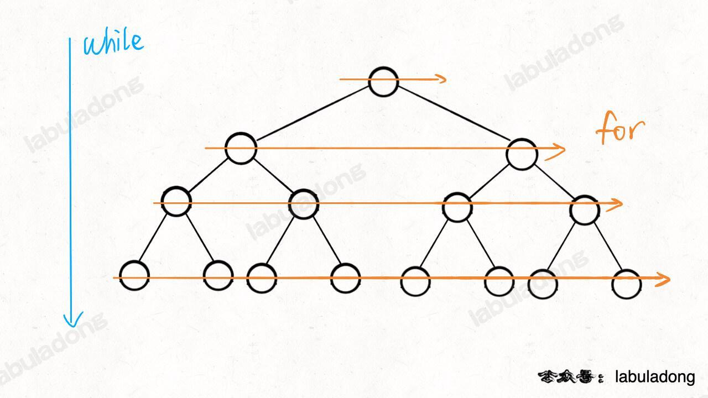

`BFS` 代码框架就是从二叉树的层序遍历扩展出来的，常用于求无权图的**最短路径**。

## 思维「遍历」「分解问题」题型

### 二叉树直径

[543. 二叉树的直径 - 力扣（LeetCode）](https://leetcode.cn/problems/diameter-of-binary-tree/description/)
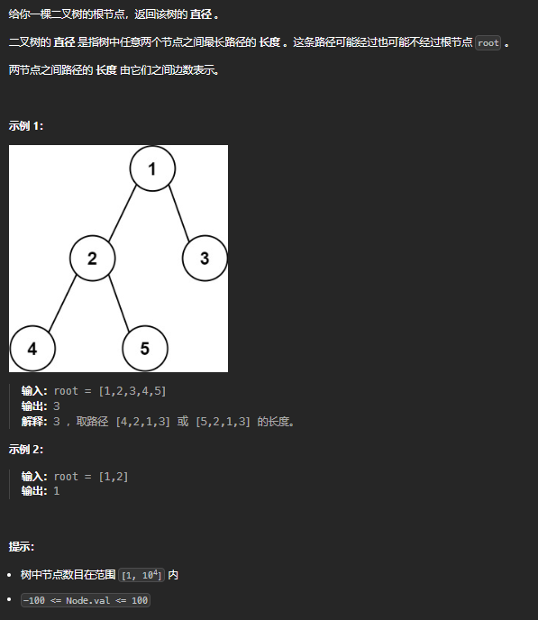

最长直径，即当前节点左右子节点最大深度和。

按照思考步骤来
最大深度需要递归函数返回，如果第一思路判断需要借助函数返回值，直接用「分解问题」思维解题。

尝试 「分解问题」思维
是否能通过子问题推导得到答案，可以的话写出函数的定义，拆解子问题，利用返回值。
>
> 1. 思考函数的定义是什么？
> 2. 结合定义，在当前函数执行递归函数，意味着子树怎么了？
> 3. 在后序位置，利用返回值执行操作，并结合操作需要去定义返回值，完成定义闭环。

函数定义为获取当前节点树的深度，在当前函数执行递归函数，意味着子树只要执行了函数便会获取子树的深度。
要实现题目要求，当处于一个节点时，需要实现以下步骤

1. 获取左子树深度，右子树深度。
2. 直径为左深度+右深度，借助外部变量，记录最长直径。（操作，需要子函数返回值，写在后序位置）
3. 定义返回值，左深度和右深度最大并加一，完成定义闭环。

```js
var diameterOfBinaryTree = function(root) {
    let maxLength = 0
    const traverse = (root) => {
        if(!root) return 0 // 当前无节点，深度为0

        const left = traverse(root.left)
        const right = traverse(root.right)
        
  // 最长直径，即当前节点左右子节点最大深度和。
        maxLength = Math.max(maxLength, left + right) 

        return Math.max(left, right) + 1 // 左右子节点最大的 + 1
    }
    traverse(root)
    return maxLength
};
```

尝试 「遍历」思维
是否能通过遍历一遍二叉树得到答案，可以的话则借用外部变量，用「遍历」思维解题
暂无思路

### 删点成林

[1110. 删点成林 - 力扣（LeetCode）](https://leetcode.cn/problems/delete-nodes-and-return-forest/description/)
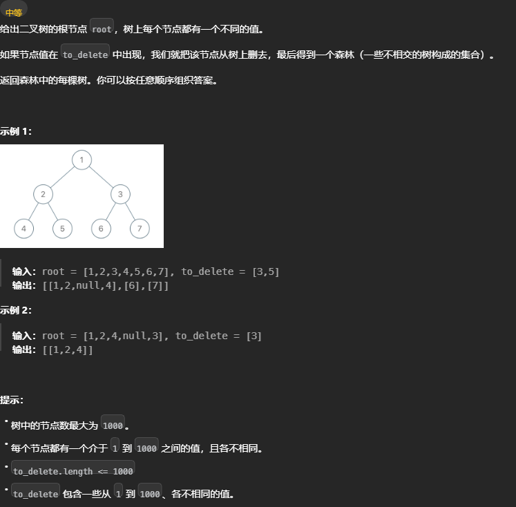

删除自身，需要父节点来删除，所以需要利用返回值通知父节点删除。

按照思考步骤来
通知父节点删除需要递归函数返回，如果第一思路判断需要借助函数返回值，直接用「分解问题」思维解题。

尝试 「分解问题」思维
是否能通过子问题推导得到答案，可以的话写出函数的定义，拆解子问题，利用返回值。
>
> 1. 思考函数的定义是什么？
> 2. 结合定义，在当前函数执行递归函数，意味着子树怎么了？
> 3. 在后序位置，利用返回值执行操作，并结合操作需要去定义返回值，完成定义闭环。

函数定义为删除节点，子树函数调用后，意味着子树中也删除完成

1. 自身需要被删除，如果子节点存在且没被删除，借助外部变量数组，将子节点维护到数组中。
2. 子函数调用后返回 `null`，意味着该子节点需要被删除。子节点被删除时, 父节点赋值对应子节点 `null`。
3. 自身需要被删除，在最后返回 `null`，否则返回自身。(结合第 2 点可以优化，直接赋值函数调用返回值)。完成定义闭环。

```ts
function delNodes(root: TreeNode | null, to_delete: number[]): Array<TreeNode | null> {
    const trees = []
    const traverse = (root: TreeNode | null) => {
        if (!root) return null

        // 2. 子函数调用后返回 `null`，意味着该子节点需要被删除。
        // 子节点被删除时, 父节点赋值对应子节点 `null`。
        root.left = traverse(root.left)
        root.right = traverse(root.right)

        // 1. 自身需要被删除，如果子节点存在且没被删除，
        // 借助外部变量数组，将子节点维护到数组中。
        const needDelete: boolean = to_delete.includes(root.val)
        if (needDelete) {
            root.left && trees.push(root.left)
            root.right && trees.push(root.right)
        }

        // 3. 自身需要被删除，在最后返回 `null`，否则返回自身。
        // (结合第2点可以优化，直接赋值函数调用返回值)
        return needDelete ? null: root
    }

 // 由于维护 trees 是其父节点维护的，根节点没有父节点， 特殊处理
    if (root && !to_delete.includes(root.val)) { 
        trees.push(root)
    }

    traverse(root)

    return trees
};
```

或者为了避免特殊处理，可以将 `trees` 维护交给子节点，告知子节点它是不是根节点。

```ts
// 1. 自身被删，告知子节点。你是根节点
// 2. 自身如果没被删，且是根节点，推入
function delNodes(root: TreeNode | null, to_delete: number[]): Array<TreeNode | null> {
    const trees = []
    const traverse = (root: TreeNode | null, isRoot: boolean = false) => {
        if (!root) return null
     
  const needDelete: boolean = to_delete.includes(root.val)
  // 根节点，且不是删除数组内的， 推入
        if (isRoot && !needDelete) {
            trees.push(root)
        }
  
        // 2. 子函数调用后返回 `null`，意味着该子节点需要被删除。
        // 当前节点被删除，子节点作为根节点
        // 子节点被删除时, 父节点赋值对应子节点 `null`。
        root.left = traverse(root.left, needDelete)
        root.right = traverse(root.right, needDelete)

        // 3. 自身需要被删除，在最后返回 `null`，否则返回自身。
        // (结合第2点可以优化，直接赋值函数调用返回值)
        return needDelete ? null: root
    }

    traverse(root, true)

    return trees
};
```

尝试 「遍历」思维
是否能通过遍历一遍二叉树得到答案，可以的话则借用外部变量，用「遍历」思维解题
暂无思路

### 翻转二叉树

[226. 翻转二叉树 - 力扣（LeetCode）](https://leetcode.cn/problems/invert-binary-tree/description/)
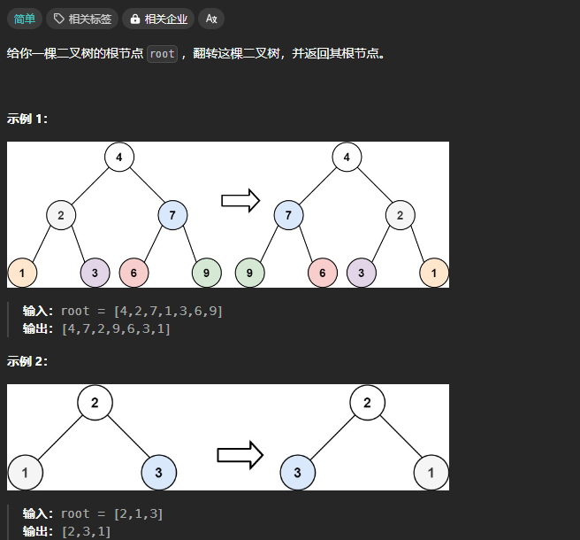

尝试 「遍历」思维
是否能通过遍历一遍二叉树得到答案，可以的话则借用外部变量，用「遍历」思维解题

通过遍历一遍二叉树得到答案，不需要依赖返回值，在前序位置操作。

```ts
// 「遍历」思维
function invertTree(root: TreeNode | null): TreeNode | null {
    if (!root) return root

    // 不需要依赖返回值
    // 前序位置, 交换
    const temp = root.left
    root.left = root.right
    root.right = temp

    invertTree(root.left)
    invertTree(root.right)

    return root
};
```

尝试 「分解问题」思维
是否能通过子问题推导得到答案，可以的话写出函数的定义，拆解子问题，利用返回值。
>
> 1. 思考函数的定义是什么？
> 2. 结合定义，在当前函数执行递归函数，意味着子树怎么了？
> 3. 在后序位置，利用返回值执行操作，并结合操作需要去定义返回值，完成定义闭环。

我们定义函数 `invertTree` 为翻转左右树， `invertTree(root.left)` 返回翻转后的左树，`invertTree(root.right)` 返回翻转后的右树，最后在后序位置进行翻转操作，并返回 `root`，代表以 root 为根的这棵二叉树已经被翻转，完成定义的闭环。

```ts
// 「分解问题」思维
// 我们定义函数 `invertTree` 为翻转左右树
function invertTree(root: TreeNode | null): TreeNode | null {
 if (!root) return root
 
 const left = invertTree(root.left) // 返回翻转后的左树
 const right = invertTree(root.right) // 返回翻转后的右树
 
 // 需要依赖返回值
 // 后序位置, 进行翻转操作
 root.right = left
 root.left = right
 
 // 代表以 root 为根的这棵二叉树已经被翻转, 完成定义的闭环。
 return root
};
```

### 填充节点的右侧指针

[116. 填充每个节点的下一个右侧节点指针 - 力扣（LeetCode）](https://leetcode.cn/problems/populating-next-right-pointers-in-each-node/description/)
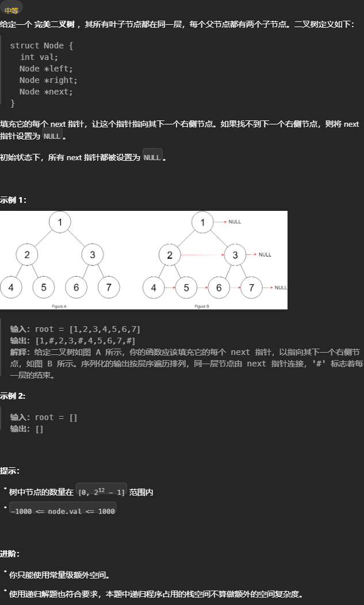
尝试 「遍历」思维
是否能通过遍历一遍二叉树得到答案，可以的话则借用外部变量，用「遍历」思维解题

通过遍历一遍二叉树得到答案，不需要依赖返回值，在前序位置操作。

由于需要连接左右两个节点，还需要连接**两个相邻节点之间的「空隙」**
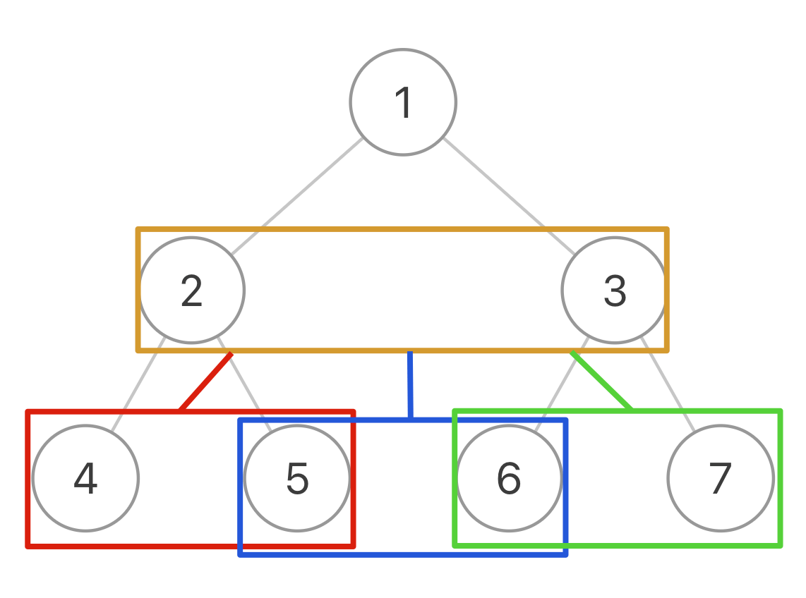

需要连接两个相邻节点的间隙，普通的遍历不满足我们，可以抛开第一个初始节点，将左右两节点作为入参，视为一个节点，这样我们就得到一颗三叉树。

在函数中执行操作，将两个节点链接起来。递归三叉树的三个节点，所有节点链接完成。

```ts
function connect(root: Node | null): Node | null {
  // 可以遍历一次二叉树完成操作
  // 抛开第一个初始节点，将两节点视为一个节点，这样便得到一颗三叉树
  // 在函数中执行操作，将两个节点链接起来。
  // 递归三叉树的三个节点，所有节点链接完成。
  // 不需要依赖函数返回值, 操作可以在前序位置执行

  if (!root) return null        
  traverse(root.left, root.right)
  return root
}

function traverse(node1: Node | null, node2: Node | null): void {
  if (!node1 || !node2) return
  node1.next = node2

  // 递归三叉树的三个节点，所有节点链接完成。
  traverse(node1.left, node1.right)
  traverse(node1.right, node2.left)
  traverse(node2.left, node2.right)
} 
```

尝试 「分解问题」思维
是否能通过子问题推导得到答案，可以的话写出函数的定义，拆解子问题，利用返回值。
>
> 1. 思考函数的定义是什么？
> 2. 结合定义，在当前函数执行递归函数，意味着子树怎么了？
> 3. 在后序位置，利用返回值执行操作，并结合操作需要去定义返回值，完成定义闭环。

暂无思路

本题也可以用层序遍历，不过注重的是**迭代**。

### 将二叉树展开为链表

[114. 二叉树展开为链表 - 力扣（LeetCode）](https://leetcode.cn/problems/flatten-binary-tree-to-linked-list/description/)
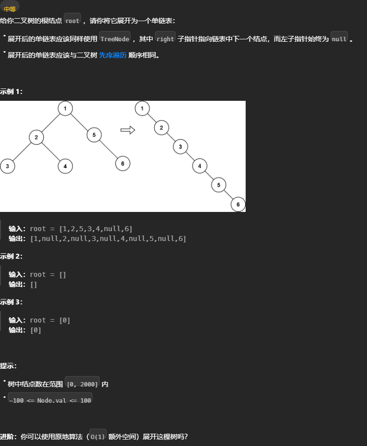
尝试 「遍历」思维
是否能通过遍历一遍二叉树得到答案，可以的话则借用外部变量，用「遍历」思维解题
不利用函数返回值，一次遍历完成，暂无思路。因为根据题目要求拉平需要左节点的最右节点，这个需要子函数返回。

尝试 「分解问题」思维
是否能通过子问题推导得到答案，可以的话写出函数的定义，拆解子问题，利用返回值。
>
> 1. 思考函数的定义是什么？
> 2. 结合定义，在当前函数执行递归函数，意味着子树怎么了？
> 3. 在后序位置，利用返回值执行操作，并结合操作需要去定义返回值，完成定义闭环。

函数定义为当前节点树拉平，在当前函数执行递归函数，意味着子树只要执行了函数便会被拉平
要实现题目要求，当处于一个节点时，需要实现以下步骤

1. 获取左节点的最右节点(需要返回值)
2. 该「最右节点的右节点」赋值为「当前节点的右节点」
3. 当前左节点存在, 「当前节点的右节点」赋值为「当前节点的左节点」
4. 当前节点的左节点赋值 null
5. 设置返回值: `root` 树的最右节点为最右节点，否则为左节点最右节点，否则为本身。完成定义闭环

```ts
function flatten(root: TreeNode | null): void {
  // 原函数没返回, 而我们实现功能的返回值被我们限定为「最右节点」
  // 所以需要借助额外的函数 traverse
  if (!root) return
  traverse(root)
};
function traverse(root: TreeNode | null): TreeNode | null {
  // 因为返回值被我们限定为「最右节点」
  // 如果允许传入root 为 null, 那么在返回时添加需要判断
  // 因为 root树 的最右节点为右节点, 否则为左节点最右节点, 否则为本身
  if (!root) return null

  // 1. 获取当前左节点的最右节点(需要返回值)
  const leftMostRightNode = traverse(root.left)
  const mostRightNode = traverse(root.right) // 取得当前最右节点

  // 2. 该最右节点的右节点赋值为当前节点的右节点
  if (leftMostRightNode) {
   leftMostRightNode.right = root.right
  }

  // 3. 当前左节点存在, 当前节点的右节点赋值为当前左节点
  if (root.left) {
   root.right = root.left    
  }
  
  // 4. 当前节点的左节点赋值null
  root.left = null

  // 因为 root树 的最右节点为右节点, 否则为左节点最右节点, 否则为本身
  return mostRightNode || leftMostRightNode || root
}
```


## 构造二叉树

二叉树的构造问题一般都是使用「分解问题」的思路：
**构造整棵树 = 根节点 + 构造左子树 + 构造右子树**。

### 构造最大二叉树

[654. 最大二叉树 - 力扣（LeetCode）](https://leetcode.cn/problems/maximum-binary-tree/description/)
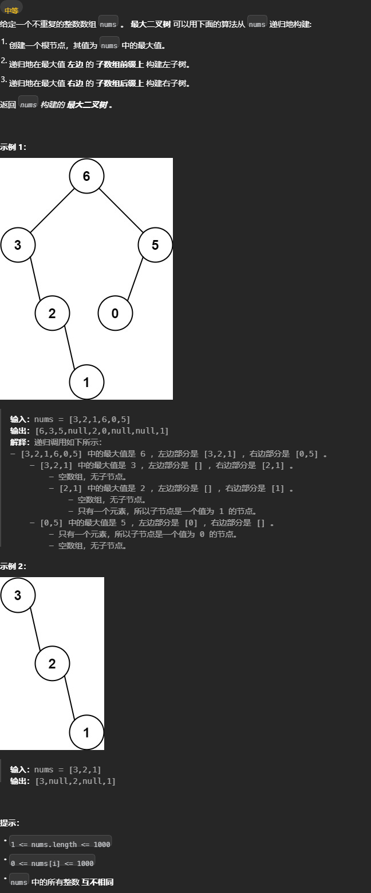

「分解问题」的思路
函数定义为数组最大构造树，子树递归函数意味着子树也构造完最大构造树。
根节点的左右节点需要子函数构造完的树节点，所以定义函数返回为树节点

```js
var constructMaximumBinaryTree = function(nums) {
  // 创建一个根节点，其值为 nums 中的最大值。
  // 递归地在最大值 左边 的 子数组前缀上 构建左子树。
  // 递归地在最大值 右边 的 子数组后缀上 构建右子树。

  if (!nums.length) return null

  let maxIndex = -1
  let max = -Infinity
  for (let i = 0; i < nums.length; i++) {
    if (max >= nums[i]) {
      continue; 
    }
    max = nums[i]
    maxIndex = i
  }
  
  const root = new TreeNode(max);
  // 当然，这里推荐用 traverse 函数，参数改为接收下标，可以避免新建数组浪费多余的空间复杂度
  // 用数组的地方都可以考虑下标
  root.left = constructMaximumBinaryTree(nums.slice(0, maxIndex));
  root.right = constructMaximumBinaryTree(nums.slice(maxIndex + 1));

  return root
};
```

### 通过前序和中序遍历结果构造二叉树

[105. 从前序与中序遍历序列构造二叉树 - 力扣（LeetCode）](https://leetcode.cn/problems/construct-binary-tree-from-preorder-and-inorder-traversal/description/)
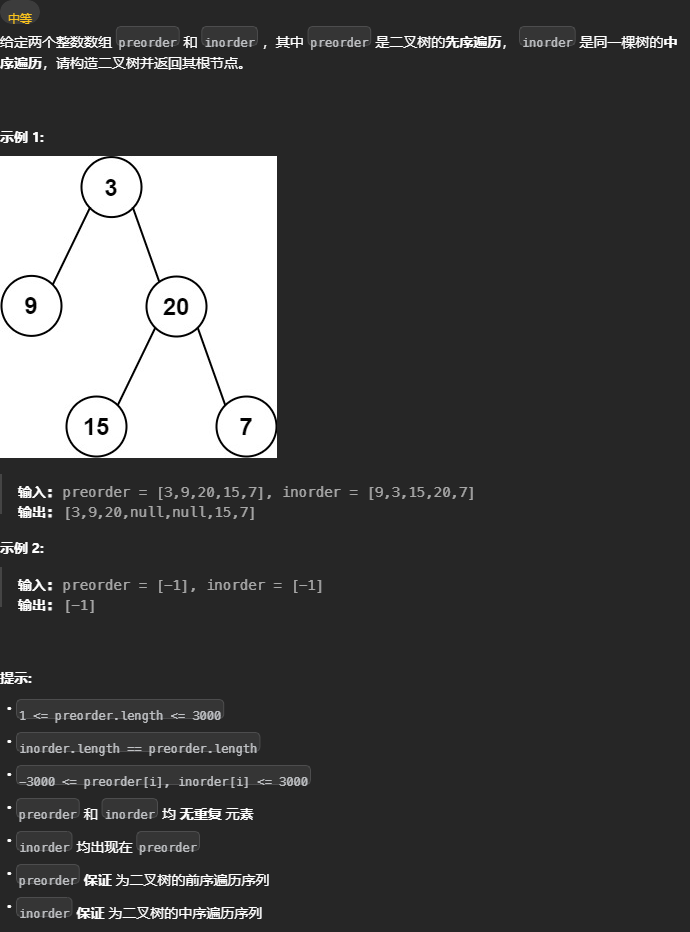

对于前序和中序打印出的数组，有以下特点
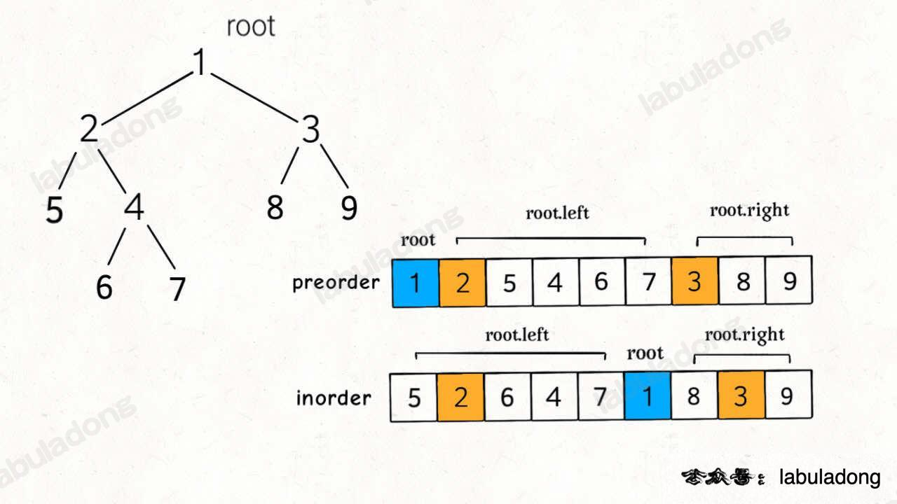

前序数组的首位是根节点，如果要分割左右子树，需要知道左节点树的数量。
中序数组根节点前面的元素都是左节点，可以获取到左节点树的数量。

尝试 「分解问题」思维
是否能通过子问题推导得到答案，可以的话写出函数的定义，拆解子问题，利用返回值。
> 1. 思考函数的定义是什么？
> 2. 结合定义，在当前函数执行递归函数，意味着子树怎么了？
> 3. 在后序位置，利用返回值执行操作，并结合操作需要去定义返回值，完成定义闭环。

函数的定义是构建树，在当前函数执行递归函数，意味着子树也构建完成
1. 用前序数组获取根节点-首位
2. 在范围内中序数组查找根节点下标，下标前为左数组，后为右数组。
3. 新建节点，值为根节点。左节点为左数组作为参数归函数，右节点同理。
4. 如果数组长度不为零，返回构造完的节点，否则返回 `null`。完成定义闭环。

```js
var buildTree = function(preorder, inorder) {
    if (preorder.length === 0) return null
    // 1. 用前序数组获取根节点-首位
    // 2. 在范围内中序数组查找根节点下标，下标前为左数组，后为右数组。
    // 3. 新建节点，值为根节点。左节点为左数组作为参数归函数，右节点同理。
    // 4. 如果数组长度不为零，返回构造完的节点，否则返回 `null`。完成定义闭环。
    const traverse = (pstart, pend, istart, iend) => {
        if (pstart > pend) return null
        const rootVal = preorder[pstart]
        const root = new TreeNode(rootVal)

        let mid = istart
        while (mid <= iend && inorder[mid] !== rootVal) {
	        mid++
        }

        // 左数组长度 mid - istart
        const leftLength = mid - istart

        root.left = traverse(pstart + 1, pstart + leftLength, istart, mid - 1)
        root.right = traverse(pstart + leftLength + 1, pend, mid + 1, iend)

        return root
    }

    return traverse(0, preorder.length - 1, 0, inorder.length - 1)
};
```


### 通过后序和中序遍历结果构造二叉树
[106. 从中序与后序遍历序列构造二叉树 - 力扣（LeetCode）](https://leetcode.cn/problems/construct-binary-tree-from-inorder-and-postorder-traversal/description/)
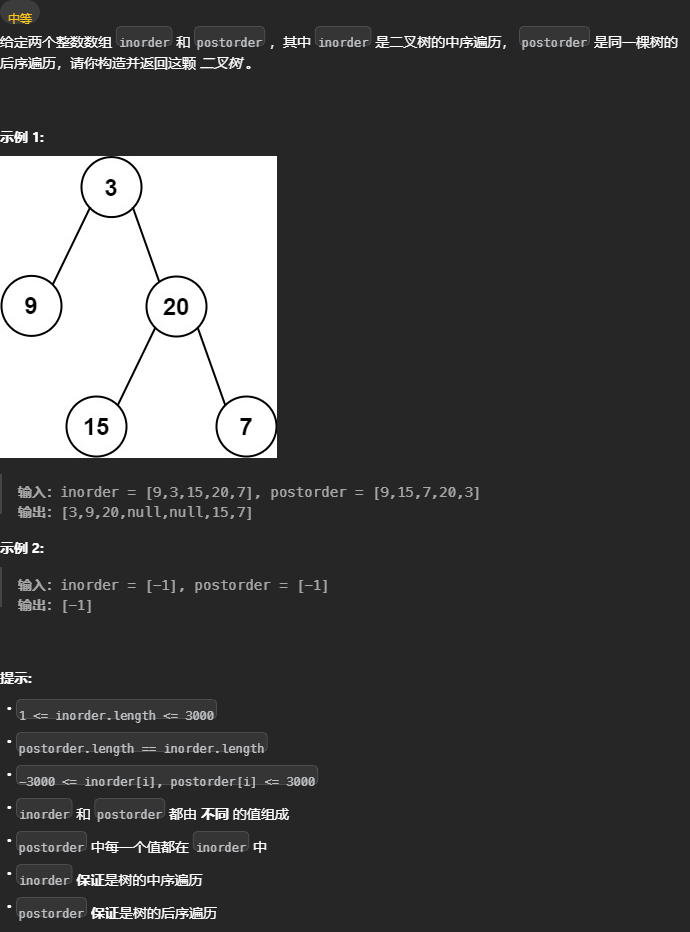
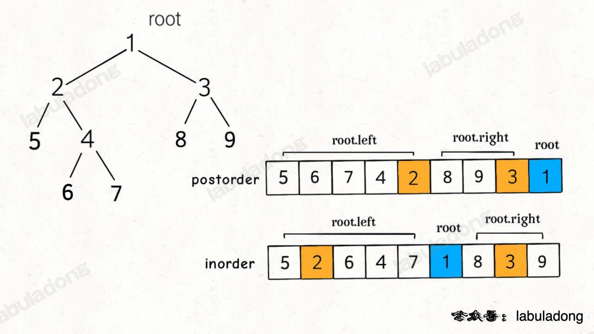

范围内
后序的根节点在最后一个
中序的根节点前都是左节点，后都是右节点

尝试 「分解问题」思维
是否能通过子问题推导得到答案，可以的话写出函数的定义，拆解子问题，利用返回值。
> 1. 思考函数的定义是什么？
> 2. 结合定义，在当前函数执行递归函数，意味着子树怎么了？
> 3. 在后序位置，利用返回值执行操作，并结合操作需要去定义返回值，完成定义闭环。

函数的定义是构建树，在当前函数执行递归函数，意味着子树也构建完成
1. 用后序数组获取根节点-末位
2. 在范围内中序数组查找根节点下标，下标前为左数组，后为右数组。
3. 新建节点，值为根节点。左节点为左数组作为参数归函数，右节点同理。
4. 如果数组长度不为零，返回构造完的节点，否则返回 `null`。完成定义闭环。

```js
var buildTree = function(inorder, postorder) {
    if (postorder.length === 0) return null
	// 1. 用后序数组获取根节点-末位
	// 2. 在范围内中序数组查找根节点下标，下标前为左数组，后为右数组。
	// 3. 新建节点，值为根节点。左节点为左数组作为参数归函数，右节点同理。
	// 4. 如果数组长度不为零，返回构造完的节点，否则返回 `null`。完成定义闭环。
    const traverse = (pstart, pend, istart, iend) => {
        if (pstart > pend) return null
        const rootVal = postorder[pend]
        const root = new TreeNode(rootVal)

        let mid = istart
        while (mid <= iend && inorder[mid] !== rootVal) {
	        mid++
        }

        // 左数组长度 mid - istart
        const leftLength = mid - istart

        root.left = traverse(pstart, pstart + leftLength - 1, istart, mid - 1)
        root.right = traverse(pstart + leftLength, pend - 1, mid + 1, iend)

        return root
    }

    return traverse(0, postorder.length - 1, 0, inorder.length - 1)
};
```

### 通过后序和前序遍历结果构造二叉树
[889. 根据前序和后序遍历构造二叉树 - 力扣（LeetCode）](https://leetcode.cn/problems/construct-binary-tree-from-preorder-and-postorder-traversal/description/)
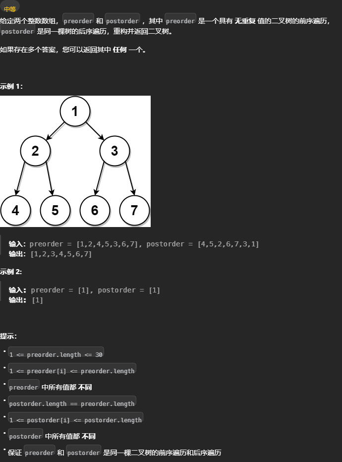
范围内
前序的根节点在第一位，紧接着是左值及其子树，右值及其子树
前序的根节点在第一位，第二位则是左值
和前两道题不同的是，用前序和后序构建的二叉树不唯一，但我们只要输出一种即可，如果用左值，默认左子树有

尝试 「分解问题」思维
是否能通过子问题推导得到答案，可以的话写出函数的定义，拆解子问题，利用返回值。
> 1. 思考函数的定义是什么？
> 2. 结合定义，在当前函数执行递归函数，意味着子树怎么了？
> 3. 在后序位置，利用返回值执行操作，并结合操作需要去定义返回值，完成定义闭环。

函数的定义是构建树，在当前函数执行递归函数，意味着子树也构建完成
1. 用前序数组获取根节点-首位，左值-第二位
2. 在范围内后序数组查找左值下标，下标及其前为左数组，其后为右数组。
3. 新建节点，值为根节点。左节点为左数组作为参数归函数，右节点同理。
4. 如果数组长度不为零，返回构造完的节点，否则返回 `null`。完成定义闭环。

```js
var constructFromPrePost = function(preorder, postorder) {
  if (preorder.length === 0) return null
  // 1. 用前序数组获取根节点-首位，左值-第二位
  // 2. 在范围内后序数组查找左值下标，下标及其前为左数组，其后为右数组。
  // 3. 新建节点，值为根节点。左节点为左数组作为参数归函数，右节点同理。
  // 4. 如果数组长度不为零，返回构造完的节点，否则返回 `null`。完成定义闭环。
  const traverse = (prstart, prend, postart, poend) => {
    if (prstart > prend) return null
    const rootVal = preorder[prstart]
    const root = new TreeNode(rootVal)
    if (prstart === prend) { // 只有一长度，不需要递归子节点
      return root
    }

    const leftVal = preorder[prstart + 1]

    let left = postart
    while (left <= poend && postorder[left] !== leftVal) {
      left++
    }

    // 左数组始终间隔 left - postart
    const leftLength = left - postart

      
    root.left = traverse(prstart + 1, prstart + 1 + leftLength, postart, left)
    root.right = traverse(prstart + 1 + leftLength + 1, prend, left + 1, poend - 1)

    return root
  }

  return traverse(0, preorder.length - 1, 0, preorder.length - 1)
};
```


## 序列化

### 总结
序列化后结果**包含空节点**，且只有**前序**和**后序**，才能还原出唯一的树。

因为只有前序/后序遍历的结果中，可以确定根节点的位置，而中序遍历的结果中，根节点的位置是无法确定的。

总结，**当二叉树中节点的值不存在重复时**：
1. 如果序列化中**不包含空指针的信息**，且只有**一种**遍历顺序，那么无法还原出唯一的一棵二叉树。
2. 如果序列化中**不包含空指针的信息**，且有**两种**遍历顺序，分两种情况：
	1. 前序和中序，或者后序和中序，可以还原出唯一的一棵二叉树。
	2. 前序和后序，无法还原出唯一的一棵二叉树。(因为无法确定是左节点存在还是右节点存在)
3. 如果序列化中**包含空指针的信息**，且只有**一种**遍历顺序，分两种情况：
    1. 前序或者后序，可以还原出唯一的一棵二叉树。 
    2. 中序，无法还原出唯一的一棵二叉树。(因为无法确定根节点位置，而反序列**`deserialize` 方法首先寻找 `root` 节点的值，然后递归计算左右子节点**)

无空值表示两种遍历前后序无法唯一，有空值表示一种遍历中序无法唯一。


### 二叉树的序列化与反序列化
[297. 二叉树的序列化与反序列化 - 力扣（LeetCode）](https://leetcode.cn/problems/serialize-and-deserialize-binary-tree/description/)
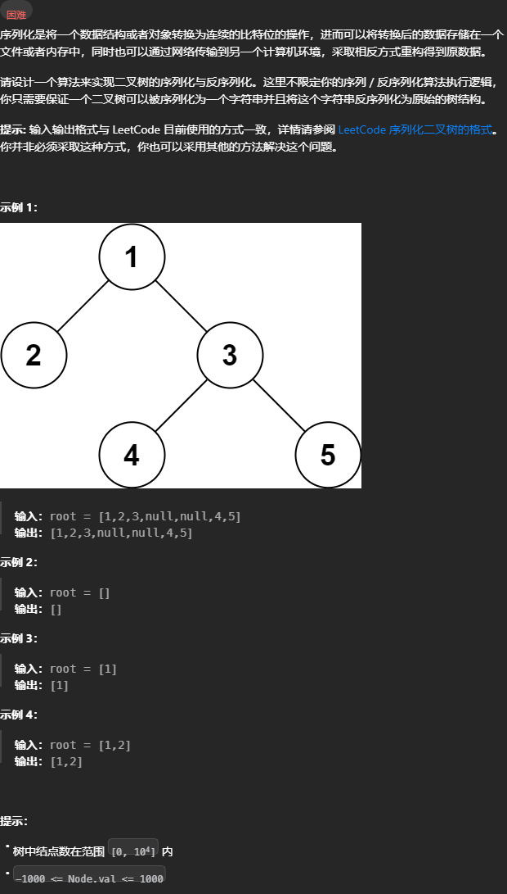
有空值表示一种遍历中序无法唯一，选前后序任意一个都行。
**`deserialize` 方法首先寻找 `root` 节点的值，然后递归计算左右子节点**

#### 前序
前序数组，首位先找根节点，随后左节点，再右节点
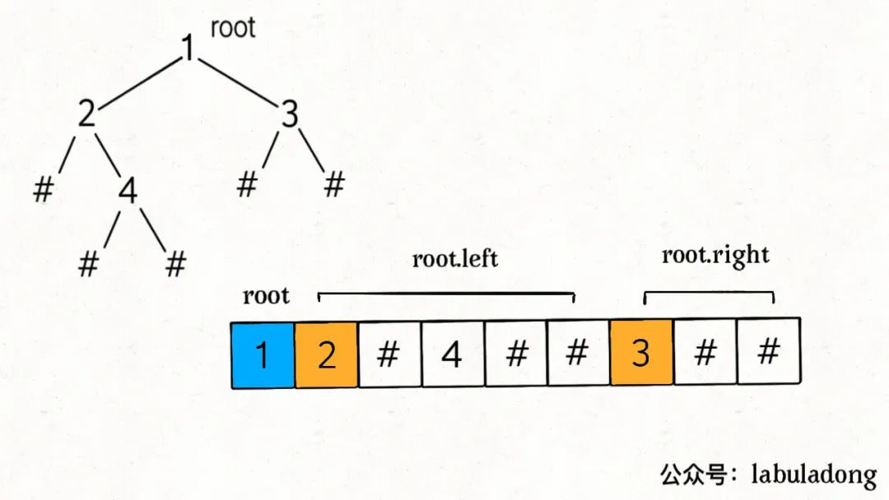
由于前序没什么难度，此处不写解法。

#### 后序
后序数组，先找根节点**从后往前在 `nodes` 列表中取元素，一定要先构造 `root.right` 子树，后构造 `root.left` 子树**。
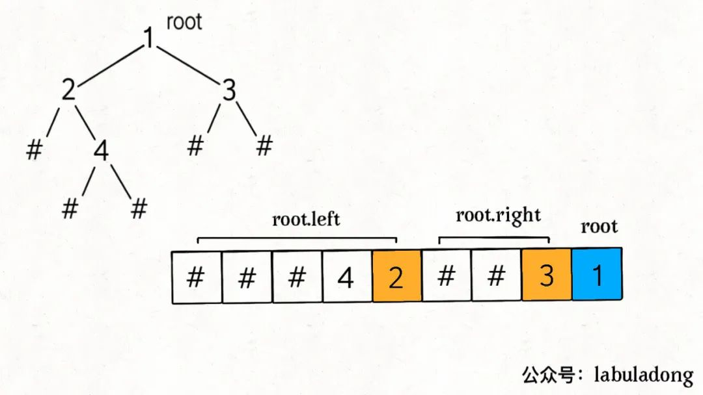

```js
var serialize = function(root) {
    const traverse = (root) => {
        if (!root) return '#'
        
        const left = traverse(root.left)
        const right = traverse(root.right)

        return left + ',' + right + ',' + root.val
    }

    return traverse(root)
};

var deserialize = function (data) {
  const arr = data.split(',')
  const traverse = data => {
    const str = data.pop() // 先找根节点**从后往前在 `nodes` 列表中取元素
    if (str === '#') {
      return null
    }

    const root = new TreeNode(str)
    
    // 一定要先构造 `root.right` 子树，后构造 `root.left` 子树**。
    root.right = traverse(data)
    root.left = traverse(data)

    return root
  }

  return traverse(arr)
};
```


#### 层序遍历
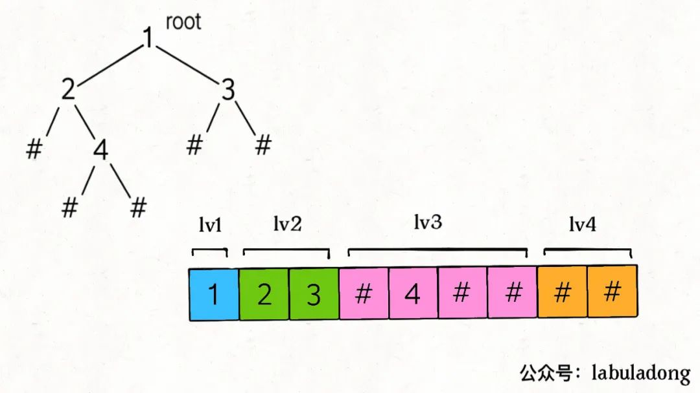
```js
var levelTraverse = function(root) {
    if (!root) return;
    const q = [];
    q.push(root);

    // 从上到下遍历二叉树的每一层
    while (q.length) {
        const sz = q.length;
        
        // 从左到右遍历每一层的每个节点
        for (let i = 0; i < sz; i++) {
            const cur = q.shift();
            // 将下一层节点放入队列
            cur.left && q.push(cur.left);
            cur.right && q.push(cur.right);
        }
        // 当前这一层遍历结束
    }
}
```
上面是层序遍历模版，由于我们需要记录空节点，所以需要改造下空节点部分，空节点也推入，然后在读取的时候再判断空节点。
```js
var serialize = function(root) {
    if (!root) return '';
    const ret = []
    const q = [];
    q.push(root);

    // 从上到下遍历二叉树的每一层
    while (q.length) {
        const sz = q.length;
        
        // 从左到右遍历每一层的每个节点
        for (let i = 0; i < sz; i++) {
            const cur = q.shift();
            
            if (!cur) {
	           ret.push('#')
               continue // 读取的时候再判断空节点。
            }
            
            ret.push(cur.val)
            
            // 将下一层节点放入队列，空节点也推入
            q.push(cur.left);
            q.push(cur.right);
        }
        // 当前这一层遍历结束
    }
    return ret.join(',')
}

var deserialize = function(data) {
    if (data === '#' || !data) return null
    const q = data.split(',')
    const root = new TreeNode(q.shift())
    const level = [root]
    // 从上到下遍历二叉树的每一层
    while (q.length) {
        const sz = level.length
        // 从左到右遍历每一层的每个节点
        for (let i = 0; i < sz; i++) {
            const cur = level.shift()
            const leftVal = q.shift()
            const rightVal = q.shift()

            cur.left = leftVal === '#'? null: new TreeNode(leftVal)
            cur.right = rightVal === '#'? null: new TreeNode(rightVal)

            cur.left && level.push(cur.left)
            cur.right && level.push(cur.right)
        }
        // 当前这一层遍历结束
    }
    return root
};

```
由于此处不需要计步，不需要知道当前层有多少个点，所以可以省去 `for` 或 `while`
```js
var deserialize = function(data) {
    if (data === '#' || !data) return null
    const q = data.split(',')
    const root = new TreeNode(q[0])
    const level = [root]
    
	const sz = q.length
	
	for (let i = 1; i < sz; ) { // 不用自动迭代
		const cur = level.shift()
		const leftVal = q[i++]
		const rightVal = q[i++]

		cur.left = leftVal === '#'? null: new TreeNode(leftVal)
		cur.right = rightVal === '#'? null: new TreeNode(rightVal)

		cur.left && level.push(cur.left)
		cur.right && level.push(cur.right)
	}
    
    return root
};
```


### 寻找重复的子树
[652. 寻找重复的子树 - 力扣（LeetCode）](https://leetcode.cn/problems/find-duplicate-subtrees/description/)
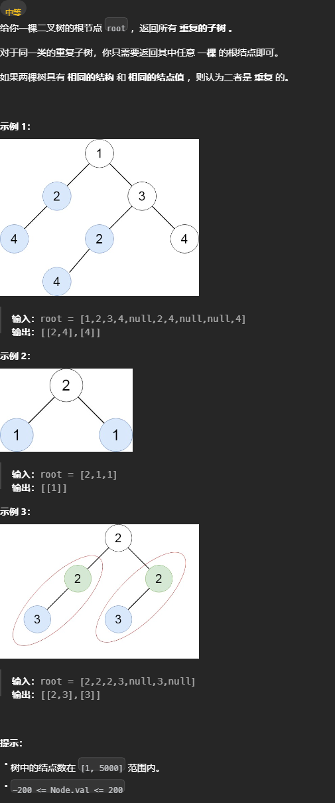
  判断节点是否重复
- 需要知道以自己为根的树是怎样的。
- 需要知道其他树是怎样的（需要额外变量维护）。
- 需要两树进行对比。

操作：
1. 在后序位置，以自己为根的树递归完成，本树已知。
2. 其他树可以在递归前序位置推入。
3. 两树对比，用递归。

上面思路没问题，但是两树对比时用递归，时间和空间复杂度都太高了。
树节点可以用它的值代表自身，空节点用 `#` 替代，这样便可以用文本替代整个树节点。
文本相等对比，时间和空间复杂度大大降低。
由于树用文本序列化表示，要表示一棵树得在后续位置才能知道本树长得怎样。函数返回值为本树序列化。

优化后操作：
1. 在后序位置，以自己为根的树递归完成，本树已知
2. 其他树可以在递归后序位置维护在 `map` 中
3. 两树对比，在 `map` 中找到即重复。
4. 因为重复只需要返回一次，所以 `map` 中值用计数器替代布尔值，计数器为 `2` 时推入返回数组。

```js
var findDuplicateSubtrees = function(root) {
    const map = new Map()
    const ret = []
    const traverse = root => {
        if (!root) return '#'

        let left = traverse(root.left)
        let right = traverse(root.right)

        const treeStr = left + ',' + right + ',' + root.val
        const count = (map.get(treeStr) || 0) + 1
        map.set(treeStr, count)
        if (count === 2) {
            ret.push(root)
        }
        return treeStr
    }
    traverse(root)
    return ret
};

```


## 归并排序
### 框架
对 `nums[low..high]` 进行排序，归并排序思路：
1. 去中点 `mid`，对 `nums[low..mid]` 进行排序，再对 `nums[mid+1..high]` 排序
2. 最后把这两个有序的子数组合并，整个数组就排好序了
归并排序是一个**后序遍历**。

```js
// 定义：排序 nums[low..high]
// 重点关注后序遍历位置
function mergeSort(nums, low, high) {
 if (low >= high) return
    const mid = (low + high) / 2;
     
    // 排序 nums[low..mid]
    mergeSort(nums, low, mid);
    // 排序 nums[mid+1..hi]
    mergeSort(nums, mid + 1, high);

    /****** 后序位置 ******/
    // 此时两部分子数组已经被排好序
    // 合并 nums[low..mid] 和 nums[mid+1..high]
    merge(nums, low, mid, high);
    /*********************/
}
```
课本上的总结：归并排序就是先把左半边数组排好序，再把右半边数组排好序，然后把两半数组合并。

上述代码和二叉树的后序遍历很像：
```js
/* 二叉树遍历框架 */
function traverse(root) {  
    if (root == null) {  
        return;  
    }  
    traverse(root.left);  
    traverse(root.right);  
    /****** 后序位置 ******/  
    console.log(root.val);  
    /*********************/  
}
```

### 学会抽象成树

二叉树问题分为两类思路：
- 遍历一遍二叉树
- 分解问题

归并排序利用的是分解问题的思路（分治算法）：
**归并排序的过程可以在逻辑上抽象成一棵二叉树，树上的每个节点的值可以认为是 `nums[lo..hi]`，叶子节点的值就是数组中的单个元素。**
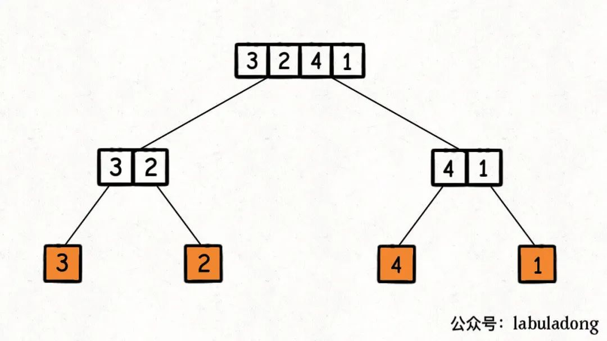

归并操作最后会用 `merge` 合并，这个 `merge` 操作会在二叉树的每个节点上都执行一遍，执行顺序是二叉树后序遍历的顺序。即 `左 -> 右 -> 根` 从左节点树的最底层排序合并，再右节点树，直至根节点，排序完成。顺序如下图
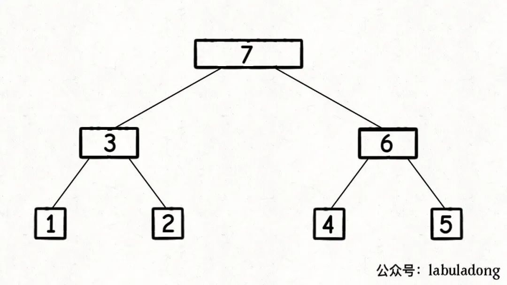

### 具体代码实现
```js
class Merge {
    constructor(nums) {
        this.nums = nums
        this.temp = []
        this.sort(0, this.nums.length - 1)
    }
    sort(low, high) {
        // 单个元素不用排序
        if (low >= high) return 
        
        // 效果等同于 (hi + lo) / 2
        const mid = low + Math.floor((high - low) / 2)

        // 左半部分数组 nums[lo..mid] 排序
        this.sort(low, mid)
        // 再对右半部分数组 nums[mid+1..hi] 排序
        this.sort(mid + 1, high)

        // 将两部分有序数组合并成一个有序数组
        this.merge(low, mid, high)
    }
    
    // 将 nums[lo..mid] 和 nums[mid+1..hi] 这两个有序数组合并成一个有序数组
    merge(low, mid, high) {
        // 先把 nums[lo..hi] 复制到辅助数组中  
        // 以便合并后的结果能够直接存入 nums  
        for (let i = low; i <= high; i++) {  
            this.temp[i] = this.nums[i];  
        }  
  
        // 数组双指针技巧，合并两个有序数组  
        let i = low, j = mid + 1;  
        for (let p = low; p <= high; p++) {  
            if (i === mid + 1) {  
                // 左半边数组已全部被合并  
                this.nums[p] = this.temp[j++];  
            } else if (j == high + 1) {  
                // 右半边数组已全部被合并  
                this.nums[p] = this.temp[i++];  
            } else if (this.temp[i] > this.temp[j]) {  
                this.nums[p] = this.temp[j++];  
            } else {  
                this.nums[p] = this.temp[i++];  
            }  
        }
    }
}
```

主要看 `merge` 函数，思路跟拼接两个有序链表类似。分解步骤来看
1. 使用两个指针 `i` 和 `j` 分别指向左半边数组和右半边数组的起始位置
  ```js
	let i = low, j = mid + 1;  
  ```
2. 使用一个循环，比较 `this.temp[i]` 和 `this.temp[j]` 的大小，小的维护到 `this.nums` 中，继续移动指针。
	```js
	for (let p = low; p <= high; p++) {  
		if (this.temp[i] > this.temp[j]) {  
			this.nums[p] = this.temp[j++];  
		} else {  
			this.nums[p] = this.temp[i++];  
		}  
	}
	```
3. 如果某一边的数组已经全部被合并，而另一边还有剩余元素，则直接将剩余元素放入原数组 `this.nums` 中
	```js
	for (let p = low; p <= high; p++) {  
		if (i === mid + 1) {  
			// 左半边数组已全部被合并  
			this.nums[p] = this.temp[j++];  
		} else if (j == high + 1) {  
			// 右半边数组已全部被合并  
			this.nums[p] = this.temp[i++];  
		}
	}
	```
4. 汇总
	```js
	// 将 nums[lo..mid] 和 nums[mid+1..hi] 这两个有序数组合并成一个有序数组
    merge(low, mid, high) {
        // 先把 nums[lo..hi] 复制到辅助数组中  
        // 以便合并后的结果能够直接存入 nums  
        for (let i = low; i <= high; i++) {  
            this.temp[i] = this.nums[i];  
        }  
  
        // 数组双指针技巧，合并两个有序数组  
        let i = low, j = mid + 1;  
        for (let p = low; p <= high; p++) {  
            if (i === mid + 1) {  
                // 左半边数组已全部被合并  
                this.nums[p] = this.temp[j++];  
            } else if (j === high + 1) {  
                // 右半边数组已全部被合并  
                this.nums[p] = this.temp[i++];  
            } else if (this.temp[i] > this.temp[j]) {  
                this.nums[p] = this.temp[j++];  
            } else {  
                this.nums[p] = this.temp[i++];  
            }  
        }
    }
	```

归并复杂度为 `O(NlogN)`，如何计算的？
计算公式为：子问题个数 x 解决一个子问题的复杂度
- `merge` 函数到底执行了多少次？
- `merge` 函数复杂度是多少？
但是这种方式很难计算出复杂度，因为每次 `merge` 里循环的次数不一致。

换一个思维，在每一层中，循环的次数都是固定的 `n`，此时有多少层，便是循环了多少次 `n`，层数为 `log₂(n)`，所以归并复杂度 `O(NlogN)`。
- 在每一层，将数组分为两半，每个子数组都需要排序。
- 树的深度是 log₂(n)，因为每次都将数组对半分。
- 在每一层，都需要 O (n)的操作（比较和合并）。
- 因此，总的时间复杂度是 O (n log n)。


`merge` 方法需要对 `nums[lo..mid]` 和 `nums[mid+1..hi]` 两数组合并，由于没法原地合并，需要借助 `temp` 辅助数组。
> `temp` 数组不要在 `merge` 函数中声明，因为会在递归中频繁 `new` 和释放，有性能问题。


### 计算右侧小于当前元素的个数
[315. 计算右侧小于当前元素的个数 - 力扣（LeetCode）](https://leetcode.cn/problems/count-of-smaller-numbers-after-self/)
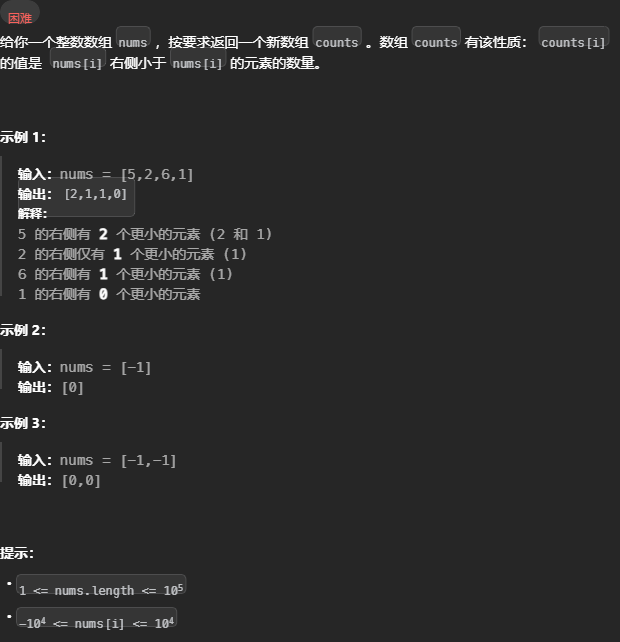

这道题有些技巧性，利用了归并排序相同的解题框架。
归并排序过程中，会对比 `temp[i]` 和 `temp[j]` 的大小，取小的作为 `nums[p]` 值。
```js
// 数组双指针技巧，合并两个有序数组  
let i = low, j = mid + 1;  
for (let p = low; p <= high; p++) {  
	if (this.temp[i] > this.temp[j]) {  
		this.nums[p] = this.temp[j++];  
	} else {  
		this.nums[p] = this.temp[i++];  
	}  
}
```

举个例子，原数组为 `[5, 3, 2, 1]`，我们把视角落在 `5` 上，计数右侧比 `5` 小的数量。
在递归时，是左半边数组先排序，进入左半边数组后再进行分组，此时是 `5` 和 `3` 进行对比，由于 `3` 比 `5` 小，排序时选用了 `3`，这就是我们想计数的量，排序时我们进行计数。【比 5 小的计数】

可能会有疑问：`temp` 数组一直在变，怎么反应原数组右侧小于自身的元素数量？
`temp` 数组确实一直在变，但只有在两个分组中，右分组比左分组元素小才会被交换过去，对于左分组元素而言（重点，对于左分组元素而言），排序后右分组元素就在前面了，不会被重复计算。例如 `[5, 3, 2, 1]` 的 `3` 排序后 `[3, 5, 2, 1]`，对于 `5` 而言，`3` 只会计算一次，`3` 便一直在 `5` 前面。
> 注意：主体是左分组元素 `5`，因为计数都是对于左分组元素而言的。

对于原数组 `[5, 3, 2, 1]`，我们视角来到  `3`。归并序至最后一次数组 `[3, 5, 1, 2]`，此时我们 `i = 0, j = 4` 时，这个时候才轮到左分组 `3` 需要赋值到已排序数组中。次数应该如何计算？`[3, 5, 1, 2]` 对于 `3` 而言，应该计数比它小的值为 2 因为有 `1`、`2` 两个数字。

原理如下。
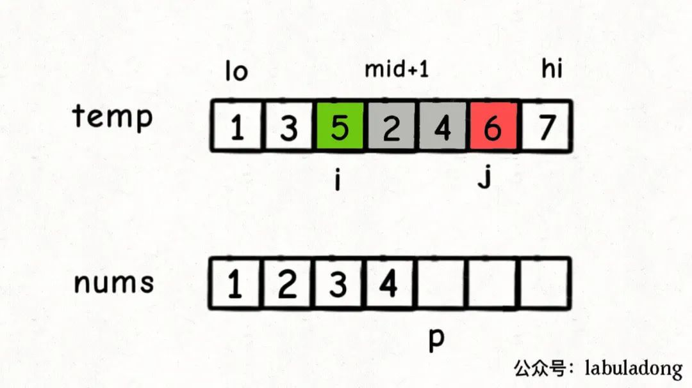

每一次递归，`temp` 数组左、右半边数组都是有序递增的，`i` 和 `j` 下标对应值小的，对应下标递增。
当 `i` 被排序时，`nums[i] < nums[j]`，比 `i` 小的是 `[mid + 1, j - 1]`，长度为 `j - mid - 1`.


所以我们拿归并排序代码框架改一改，可以解答本题。
由于数组的数据不唯一，所以不能用一个对象映射计数。

```js
class Pair {
    constructor(num, i) {
        this.val = num
        this.index = i
    }
}

/**
 * @param {number[]} nums
 * @return {number[]}
 */
var countSmaller = function(nums) {
	const temp = []
	const arr = []
    for (let i = 0; i < nums.length; i++) {
        arr.push(new Pair(nums[i], i))
    }

	const count = new Array(nums.length).fill(0)
	const sort = (low, high) => {
        // 单个元素不用排序
        if (low >= high) return 
        
        // 效果等同于 (hi + lo) / 2
        const mid = low + Math.floor((high - low) / 2)

        // 左半部分数组 nums[lo..mid] 排序
        sort(low, mid)
        // 再对右半部分数组 nums[mid+1..hi] 排序
        sort(mid + 1, high)

        // 将两部分有序数组合并成一个有序数组
        merge(low, mid, high)
    }
    
    const merge = (low, mid, high) => {
		// 先把 nums[lo..hi] 复制到辅助数组中  
		// 以便合并后的结果能够直接存入 nums  
        for (let i = low; i <= high; i++) {  
            temp[i] = arr[i];  
        }  
  
        // 数组双指针技巧，合并两个有序数组  
        let i = low, j = mid + 1;  
        for (let p = low; p <= high; p++) {  
            if (i === mid + 1) {  
                // 左半边数组已全部被合并  
                arr[p] = temp[j++];  
            } else if (j === high + 1) {  
                // 右半边数组已全部被合并  
                arr[p] = temp[i++];  

                // 重点这一句 
                count[arr[p].index] += j - mid - 1
            } else if (temp[i].val > temp[j].val) {  
                arr[p] = temp[j++];  
            } else {  
                arr[p] = temp[i++]; 

                // 重点这一句
                count[arr[p].index] += j - mid - 1
            }  
        }
    }
    
	sort(0, arr.length - 1)
	return count
};
```


## 二叉搜索树 BST

### 特性
1. 对于 BST 的每一个节点 `node`，左子树节点的值都比 `node` 的值要小，右子树节点的值都比 `node` 的值大。
2. 对于 BST 的每一个节点 `node`，它的左侧子树和右侧子树都是 BST。
3. **BST 的中序遍历结果是升序的**

拥有了自平衡性质，可以提供 `logN` 级别的增删查改效率。


### BST 的中序遍历结果是升序的
[230. 二叉搜索树中第K小的元素 - 力扣（LeetCode）](https://leetcode.cn/problems/kth-smallest-element-in-a-bst/description/)
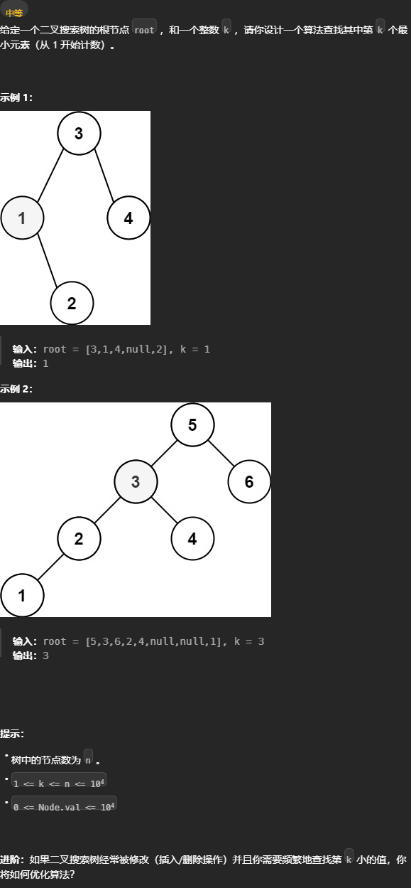
二叉搜索树中序是升序的，所以只要在中序位置取计数，就可以在计数器匹配时返回对应值。
一次遍历可以解决问题，不需要依赖函数返回值。

```js
var kthSmallest = function(root, k) {
    let ret
    const traverse = (root) => {
        root.left && traverse(root.left)
        /* 中序位置 */
        k--
        if (!k) {
            ret = root.val
            return 
        }
        root.right && traverse(root.right)
    }

    traverse(root)
    return ret
};
```

这道题的时间复杂度为 `O(n)`，前面不是说 `BST` 有自平衡性质，可以提供 `logN` 级别的增删查改效率吗？
其实 `logN` 级别是优化过后的 `BST`，`BST` 我们都知道左节点数必定比当前节点小，所以只要知道左节点数量，就知道当前节点排名了，优化后的 `BST` 需要维护子节点数量。
你可能会疑惑：当前节点的排名，不用关心父节点及祖父有多少节点吗？
不需要，**因为排序只跟数值比当前小的有关， `BST` 左子树节点的值都比当前节点的值要小。**


