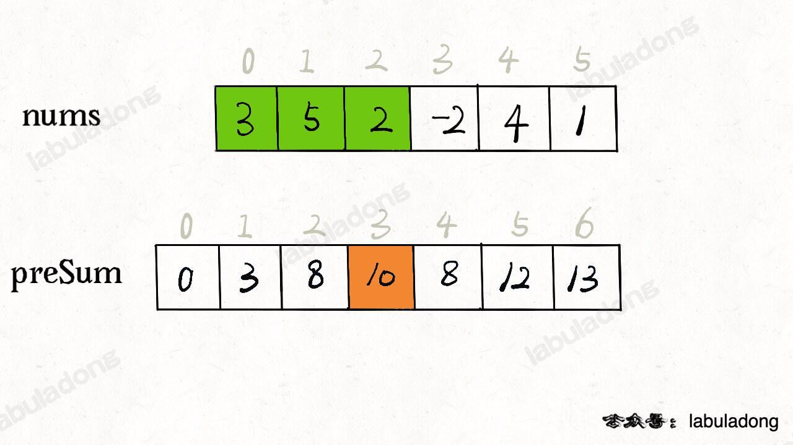
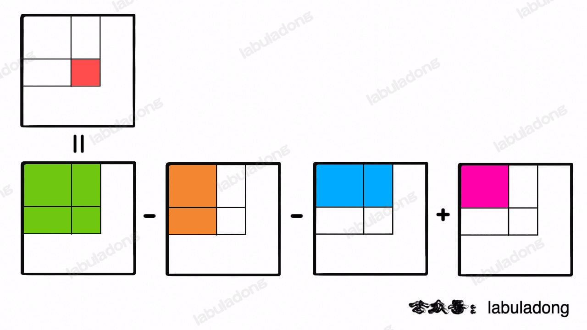
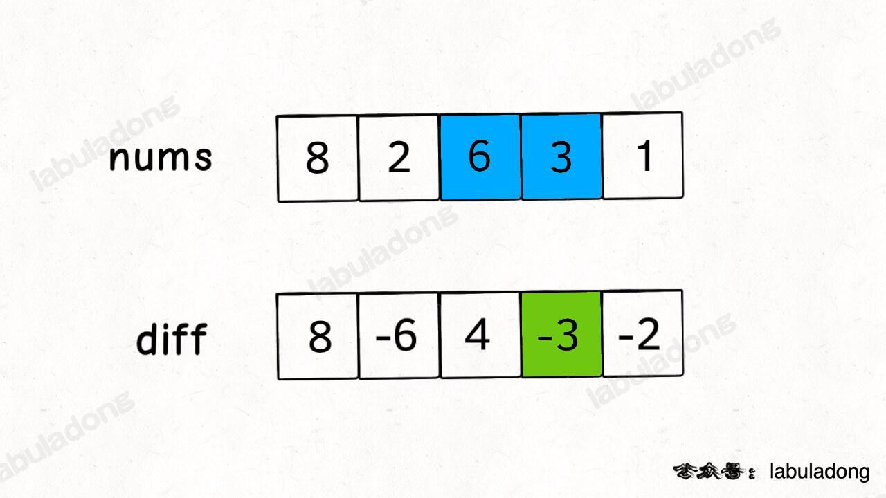
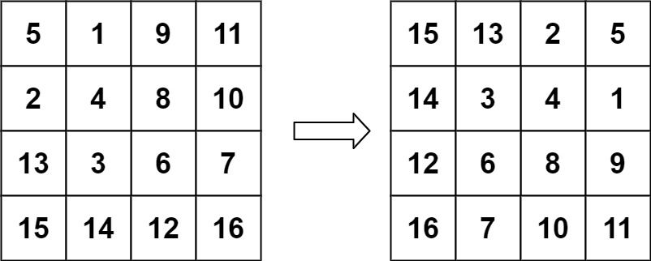
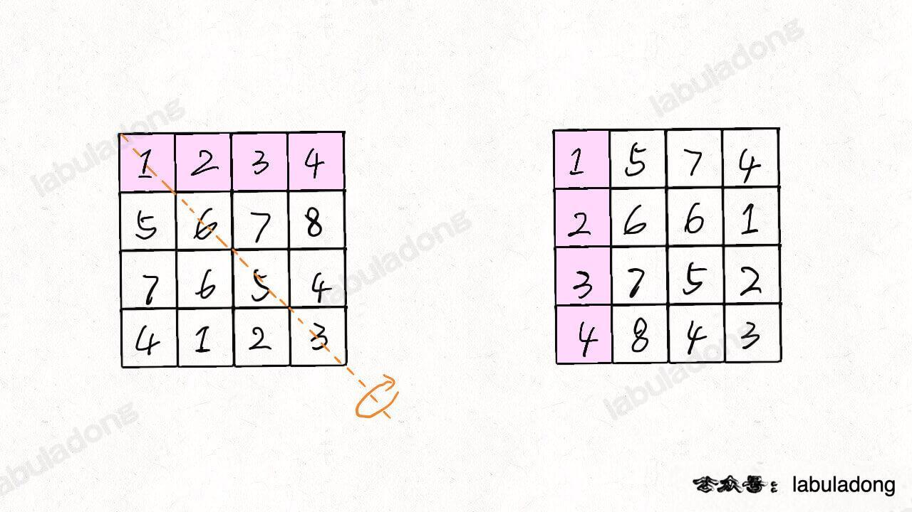
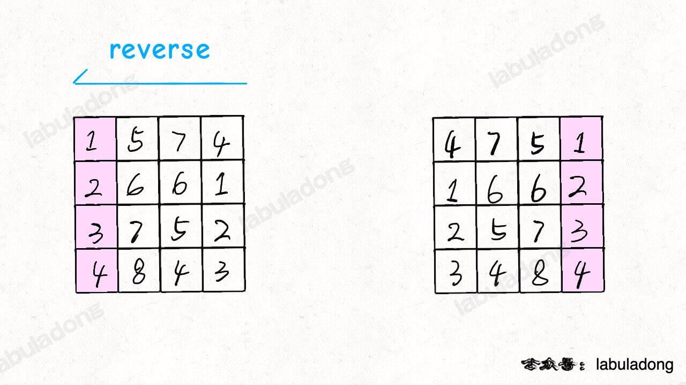

## 双指针
- 大部分双指针解法，都是快慢指针。
- 原地修改数组，基本都是快慢指针。
- 数组有序，大概率是双指针技巧。

### 快慢指针

[26. 删除有序数组中的重复项 - 力扣（LeetCode）](https://leetcode.cn/problems/remove-duplicates-from-sorted-array/description/)
[83. 删除排序链表中的重复元素 - 力扣（LeetCode）](https://leetcode.cn/problems/remove-duplicates-from-sorted-list/description/)
[27. 移除元素 - 力扣（LeetCode）](https://leetcode.cn/problems/remove-element/description/)
[283. 移动零 - 力扣（LeetCode）](https://leetcode.cn/problems/move-zeroes/description/)


### 左右指针
#### 二分查找
```js
var binarySearch = function(nums, target) {
    // 一左一右两个指针相向而行
    var left = 0, right = nums.length - 1;
    while (left <= right) { // 闭区间
        var mid = Math.floor((right + left) / 2);
        if (nums[mid] === target) {
            return mid;
        } else if (nums[mid] < target) {
            left = mid + 1;
        } else if (nums[mid] > target) {
            right = mid - 1;
        }
    }
    return -1;
};
```

#### 两数之和
[167. 两数之和 II - 输入有序数组 - 力扣（LeetCode）](https://leetcode.cn/problems/two-sum-ii-input-array-is-sorted/description/)
```js
var twoSum = function(numbers, target) {
	let left = 0
	let right = numbers.length - 1
	while(left < right) {
		const total = numbers[left] + numbers[right]
		if (total === target) {
			return [left + 1, right + 1]
		} else if (total < target) {
			left++
		} else if (total > target) {
			right--
		}
	}
	return []
};
```

#### 反转数组
[344. 反转字符串 - 力扣（LeetCode）](https://leetcode.cn/problems/reverse-string/)
```js
var reverseString = function(s) {
	let left = 0
	let right = s.length - 1
	while(left < right) {
		swap(s, left, right)
		left++
		right--
	}
	return s
};
```
 [151. 反转字符串中的单词 - 力扣（LeetCode）](https://leetcode.cn/problems/reverse-words-in-a-string/description/) 
 全部翻转，再区间翻转
#### 回文串判断
```js
var isPalindrome = function(s) {
    // 一左一右两个指针相向而行
    let left = 0
    let right = s.length-1;
    while (left < right) {
        if (s.charAt(left) !== s.charAt(right)) {
            return false;
        }
        left++;
        right--;
    }
    return true;
};
```


#### 最长的回文串
判断回文串是从两端向中心，求最长回文串是从中心向两端。
- 如果回文串的长度为偶数，则可以认为它有两个中心字符。
- 如果回文串的长度为奇数，则它有一个中心字符；
```js
function palindrome(s, l, r) {
	while (0 <= l && r < s.length && s[l] === s[r]) {
		l--
		r++
	}
	return s.substring(l + 1, r)
}
var longestPalindrome = function(s) {
	let ret = ''
	for (let i = 0; i < s.length; i++) {
		// 假设回文串长度为偶数，两个中心点分别传入 `l`、`r`。
		const even = palindrome(s, i, i + 1)
		// 假设回文串长度为奇数，一个中心点传入 `l`、`r`。
		const odd = palindrome(s, i, i)
		const max = even.length > odd.length? even: odd
		ret = ret.length > max.length? ret: max
	}
	return ret
};

```


## 前缀和
前缀和：原始数组不会被修改的情况下，适用于快速、频繁地计算一个索引区间内的元素之和
动态规划的一种，当前值与前值有关系，或者可以拆分成若干个前值。只不过题目类型都是与和有关，比动态规划的范畴小。

注意点：
- 新建数组，数组默认为 0，等同初始化 `baseCase`
- 定义： `preSum[i]` 记录了 `[0, i - 1]` 区间的元素和，下标 ` i ` 前缀和不包含本身 ` nums[i]`，熟记这一点思路会清晰很多。

### 一维数组
[303. 区域和检索 - 数组不可变 - 力扣（LeetCode）](https://leetcode.cn/problems/range-sum-query-immutable/description/)


1. 新建数组 preSum `，长度为目标数组长度 + 1。
2. `preSum` 定义为当前下标前的所有值之和，数组第一个值为 0 （`BaseCase`）。每个下标都不包含自身值，值包含下标前所有值之和。

所以有以下定义
```js
this.preSum = [0]
// 添加了 BaseCase ，是为了动态规划表达式边界成立。
// 留意 i <= nums.length  
for (let i = 1; i <= nums.length; i++) {
	this.preSum[i] = this.preSum[i - 1] + nums[i - 1]
}
```

`[left, right]` 区域内的和定义为
```js
// 前缀和的定义是当前下标前所有值之和，不包含本身下标值
// 所以要取到 right 坐标本身的值，便需要 this.preSum[right + 1]
sumRange = function(left, right) {
	return this.preSum[right + 1] - this.preSum[left]
}
```


### 二位数组

[304. 二维区域和检索 - 矩阵不可变 - 力扣（LeetCode）](https://leetcode.cn/problems/range-sum-query-2d-immutable/description/)

如果需要求两个坐标内区间的值之和，可以通过分解矩阵，转换成都跟原点相关的矩阵。


这样就把问题降级了，接下来只需要求从原点到坐标区间和。

`preSum[i][j]` 的定义： 从原点 `[0, 0]` 到 `[i - 1, j - 1]` 所有值之和
所以我们要求区间原点至 `(x,y)` 之和，需要的是 `preSum[x+1][y+1]`

```js
var NumMatrix = function(matrix) {
    const m = matrix.length
    const n = matrix[0].length
    // `preSum[i][j]` 的定义： 从原点 `[0, 0]` 到 `[i - 1, j - 1]` 所有值之和
    this.preSum = new Array(m + 1).fill(null).map(() => new Array(n + 1).fill(0)) // base case

	// 计算每个矩阵 [0, 0, i, j] 的元素和
    for (let i = 1; i <= m; i++) { // 从 1 开始
        for (let j = 1; j <= n; j++) { // 从 1 开始
            this.preSum[i][j] = this.preSum[i - 1][j] + this.preSum[i][j - 1] + matrix[i - 1][j - 1] - this.preSum[i - 1][j - 1]
        }
    }
};

NumMatrix.prototype.sumRegion = function(row1, col1, row2, col2) {
	// 所以我们要求区间原点至 `(x,y)` 之和，需要的是 `preSum[x+1][y+1]`
	// 区间内矩阵和通过分解矩阵，转换成都跟原点相关的矩阵。
    return this.preSum[row2 + 1][col2 + 1] - this.preSum[row1][col2 + 1] - this.preSum[row2 + 1][col1] + this.preSum[row1][col1] 
};
```


## 差分数组
**差分数组的主要适用场景是频繁对原始数组的某个区间的元素进行增减**。O (1) 复杂度修改。

定义：**`diff[i]` ： `nums[i]` 和 `nums[i-1]` 之差**


```js
var diff = new Array(nums.length);
// 构造差分数组
diff[0] = nums[0];
for (var i = 1; i < nums.length; i++) {
    diff[i] = nums[i] - nums[i - 1];
}
```

通过这个 `diff` 差分数组是可以反推出原始数组 `nums`。
当前值等于上一个值加上当前值与上值差值。
`res[i]`：`res[i - 1]` + `diff[i]`
```js
var nums = new Array(diff.length);
// 根据差分数组构造结果数组
nums[0] = diff[0];
for (var i = 1; i < diff.length; i++) {
    nums[i] = nums[i - 1] + diff[i];
}
```

**差分数组可以快速进行区间增减的操作**，如果想对区间 `nums[i..j]` 的元素全部加 3，那么只需要让 `diff[i] += 3`，然后再让 `diff[j+1] -= 3` 即可

**原理很简单，回想 `diff` 数组反推 `nums` 数组的过程，`diff[i] += 3` 意味着给 `nums[i..]` 所有的元素都加了 3，然后 `diff[j+1] -= 3` 又意味着对于 `nums[j+1..]` 所有元素再减 3，那综合起来对 `nums[i..j]` 中的所有元素都加 3**

[1109. 航班预订统计 - 力扣（LeetCode）](https://leetcode.cn/problems/corporate-flight-bookings/description/)
[1094. 拼车 - 力扣（LeetCode）](https://leetcode.cn/problems/car-pooling/description/)

``` js
class Difference {
    constructor (nums) {
        this.diff = []
        const { length } = nums
        if(!length) return
        this.diff[0] = nums[0]
        for(let i = 1; i < length; i++) {
            this.diff[i] = nums[i] - nums[i - 1]
        }
    }
    increment(i, j, val) { /* 给闭区间 [i, j] 增加 val（可以是负数）*/
        this.diff[l] += val
        if (j + 1  > this.diff.length - 1) return // 如果超过范围，说明是对 nums[i] 及以后的整个数组都进行修改，不需要减了
        this.diff[j + 1] -= val
    }
    result() { /* 返回结果数组 */
        const nums = []
        const { length } = this.diff
        if (!length) return nums
        nums[0] = this.diff[0]

        for (let i = 1; i < length; i++) {
            nums[i] = nums[i - 1] + this.diff[i]
        }
        return nums
    }
}
```


## 二维数组遍历-技巧
记技巧，会者不难，不会者难的类型

### 顺/逆时针旋转矩阵

[48. 旋转图像 - 力扣（LeetCode）](https://leetcode.cn/problems/rotate-image/description/)


解法：
1. 按照左上到右下的对角线进行镜像对称
	
2. 再对矩阵的每一行进行反转
	
这样**顺时针旋转 90 度**完成。
旋转二维矩阵的难点在于将「行」变成「列」，将「列」变成「行」，而只有按照对角线的对称操作是可以轻松完成这一点的，对称操作之后就很容易发现规律了。
同样也可以实现逆时针选择 90 度，从右上到左下对角线镜像对称，再行翻转。