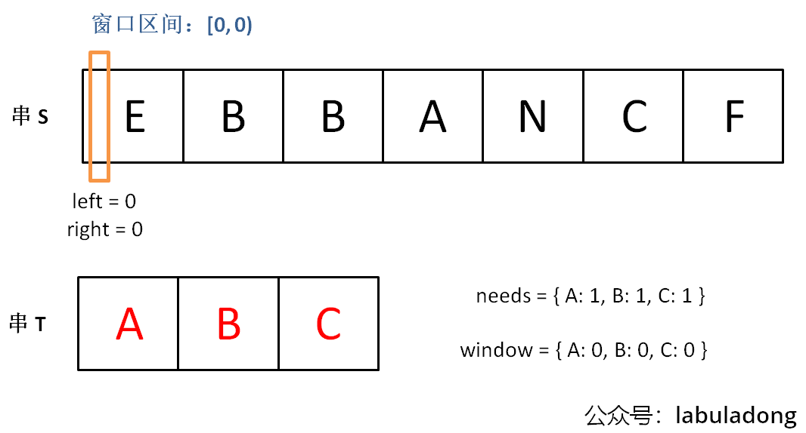
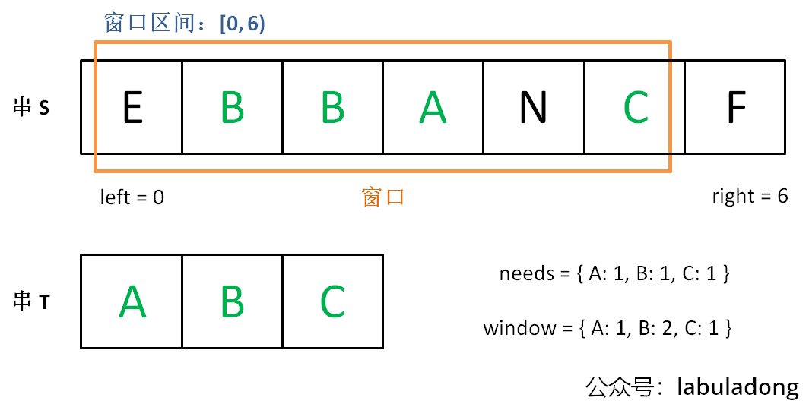
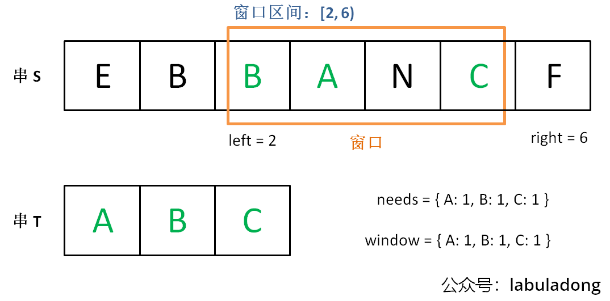

## 双指针
- 大部分双指针解法，都是快慢指针。
- 原地修改数组，基本都是快慢指针。
- 数组有序，大概率是双指针技巧。

### 快慢指针

[26. 删除有序数组中的重复项 - 力扣（LeetCode）](https://leetcode.cn/problems/remove-duplicates-from-sorted-array/description/)
[83. 删除排序链表中的重复元素 - 力扣（LeetCode）](https://leetcode.cn/problems/remove-duplicates-from-sorted-list/description/)
[27. 移除元素 - 力扣（LeetCode）](https://leetcode.cn/problems/remove-element/description/)
[283. 移动零 - 力扣（LeetCode）](https://leetcode.cn/problems/move-zeroes/description/)


### 左右指针
#### 二分查找
```js
var binarySearch = function(nums, target) {
    // 一左一右两个指针相向而行
    var left = 0, right = nums.length - 1;
    while (left <= right) { // 闭区间
        var mid = Math.floor((right + left) / 2);
        if (nums[mid] === target) {
            return mid;
        } else if (nums[mid] < target) {
            left = mid + 1;
        } else if (nums[mid] > target) {
            right = mid - 1;
        }
    }
    return -1;
};
```

#### 两数之和
[167. 两数之和 II - 输入有序数组 - 力扣（LeetCode）](https://leetcode.cn/problems/two-sum-ii-input-array-is-sorted/description/)
```js
var twoSum = function(numbers, target) {
	let left = 0
	let right = numbers.length - 1
	while(left < right) {
		const total = numbers[left] + numbers[right]
		if (total === target) {
			return [left + 1, right + 1]
		} else if (total < target) {
			left++
		} else if (total > target) {
			right--
		}
	}
	return []
};
```

#### 反转数组
[344. 反转字符串 - 力扣（LeetCode）](https://leetcode.cn/problems/reverse-string/)
```js
var reverseString = function(s) {
	let left = 0
	let right = s.length - 1
	while(left < right) {
		swap(s, left, right)
		left++
		right--
	}
	return s
};
```
 [151. 反转字符串中的单词 - 力扣（LeetCode）](https://leetcode.cn/problems/reverse-words-in-a-string/description/) 
 全部翻转，再区间翻转
#### 回文串判断
```js
var isPalindrome = function(s) {
    // 一左一右两个指针相向而行
    let left = 0
    let right = s.length-1;
    while (left < right) {
        if (s.charAt(left) !== s.charAt(right)) {
            return false;
        }
        left++;
        right--;
    }
    return true;
};
```


#### 最长的回文串
判断回文串是从两端向中心，求最长回文串是从中心向两端。
- 如果回文串的长度为偶数，则可以认为它有两个中心字符。
- 如果回文串的长度为奇数，则它有一个中心字符；
```js
function palindrome(s, l, r) {
	while (0 <= l && r < s.length && s[l] === s[r]) {
		l--
		r++
	}
	return s.substring(l + 1, r)
}
var longestPalindrome = function(s) {
	let ret = ''
	for (let i = 0; i < s.length; i++) {
		// 假设回文串长度为偶数，两个中心点分别传入 `l`、`r`。
		const even = palindrome(s, i, i + 1)
		// 假设回文串长度为奇数，一个中心点传入 `l`、`r`。
		const odd = palindrome(s, i, i)
		const max = even.length > odd.length? even: odd
		ret = ret.length > max.length? ret: max
	}
	return ret
};

```


## 前缀和
前缀和：原始数组不会被修改的情况下，适用于快速、频繁地计算一个索引区间内的元素之和
动态规划的一种，当前值与前值有关系，或者可以拆分成若干个前值。只不过题目类型都是与和有关，比动态规划的范畴小。

注意点：
- 新建数组，数组默认为 0，等同初始化 `baseCase`
- 定义： `preSum[i]` 记录了 `[0, i - 1]` 区间的元素和，下标 ` i ` 前缀和不包含本身 ` nums[i]`，熟记这一点思路会清晰很多。

### 一维数组
[303. 区域和检索 - 数组不可变 - 力扣（LeetCode）](https://leetcode.cn/problems/range-sum-query-immutable/description/)


1. 新建数组 preSum `，长度为目标数组长度 + 1。
2. `preSum` 定义为当前下标前的所有值之和，数组第一个值为 0 （`BaseCase`）。每个下标都不包含自身值，值包含下标前所有值之和。

所以有以下定义
```js
this.preSum = [0]
// 添加了 BaseCase ，是为了动态规划表达式边界成立。
// 留意 i <= nums.length  
for (let i = 1; i <= nums.length; i++) {
	this.preSum[i] = this.preSum[i - 1] + nums[i - 1]
}
```

`[left, right]` 区域内的和定义为
```js
// 前缀和的定义是当前下标前所有值之和，不包含本身下标值
// 所以要取到 right 坐标本身的值，便需要 this.preSum[right + 1]
sumRange = function(left, right) {
	return this.preSum[right + 1] - this.preSum[left]
}
```


### 二位数组

[304. 二维区域和检索 - 矩阵不可变 - 力扣（LeetCode）](https://leetcode.cn/problems/range-sum-query-2d-immutable/description/)

如果需要求两个坐标内区间的值之和，可以通过分解矩阵，转换成都跟原点相关的矩阵。


这样就把问题降级了，接下来只需要求从原点到坐标区间和。

`preSum[i][j]` 的定义： 从原点 `[0, 0]` 到 `[i - 1, j - 1]` 所有值之和
所以我们要求区间原点至 `(x,y)` 之和，需要的是 `preSum[x+1][y+1]`

```js
var NumMatrix = function(matrix) {
    const m = matrix.length
    const n = matrix[0].length
    // `preSum[i][j]` 的定义： 从原点 `[0, 0]` 到 `[i - 1, j - 1]` 所有值之和
    this.preSum = new Array(m + 1).fill(null).map(() => new Array(n + 1).fill(0)) // base case

	// 计算每个矩阵 [0, 0, i, j] 的元素和
    for (let i = 1; i <= m; i++) { // 从 1 开始
        for (let j = 1; j <= n; j++) { // 从 1 开始
            this.preSum[i][j] = this.preSum[i - 1][j] + this.preSum[i][j - 1] + matrix[i - 1][j - 1] - this.preSum[i - 1][j - 1]
        }
    }
};

NumMatrix.prototype.sumRegion = function(row1, col1, row2, col2) {
	// 所以我们要求区间原点至 `(x,y)` 之和，需要的是 `preSum[x+1][y+1]`
	// 区间内矩阵和通过分解矩阵，转换成都跟原点相关的矩阵。
    return this.preSum[row2 + 1][col2 + 1] - this.preSum[row1][col2 + 1] - this.preSum[row2 + 1][col1] + this.preSum[row1][col1] 
};
```


## 差分数组
**差分数组的主要适用场景是频繁对原始数组的某个区间的元素进行增减**。O (1) 复杂度修改。

定义：**`diff[i]` ： `nums[i]` 和 `nums[i-1]` 之差**


```js
var diff = new Array(nums.length);
// 构造差分数组
diff[0] = nums[0];
for (var i = 1; i < nums.length; i++) {
    diff[i] = nums[i] - nums[i - 1];
}
```

通过这个 `diff` 差分数组是可以反推出原始数组 `nums`。
当前值等于上一个值加上当前值与上值差值。
`res[i]`：`res[i - 1]` + `diff[i]`
```js
var nums = new Array(diff.length);
// 根据差分数组构造结果数组
nums[0] = diff[0];
for (var i = 1; i < diff.length; i++) {
    nums[i] = nums[i - 1] + diff[i];
}
```

**差分数组可以快速进行区间增减的操作**，如果想对区间 `nums[i..j]` 的元素全部加 3，那么只需要让 `diff[i] += 3`，然后再让 `diff[j+1] -= 3` 即可

**原理很简单，回想 `diff` 数组反推 `nums` 数组的过程，`diff[i] += 3` 意味着给 `nums[i..]` 所有的元素都加了 3，然后 `diff[j+1] -= 3` 又意味着对于 `nums[j+1..]` 所有元素再减 3，那综合起来对 `nums[i..j]` 中的所有元素都加 3**

[1109. 航班预订统计 - 力扣（LeetCode）](https://leetcode.cn/problems/corporate-flight-bookings/description/)
[1094. 拼车 - 力扣（LeetCode）](https://leetcode.cn/problems/car-pooling/description/)

``` js
class Difference {
    constructor (nums) {
        this.diff = []
        const { length } = nums
        if(!length) return
        this.diff[0] = nums[0]
        for(let i = 1; i < length; i++) {
            this.diff[i] = nums[i] - nums[i - 1]
        }
    }
    increment(i, j, val) { /* 给闭区间 [i, j] 增加 val（可以是负数）*/
        this.diff[l] += val
        if (j + 1  > this.diff.length - 1) return // 如果超过范围，说明是对 nums[i] 及以后的整个数组都进行修改，不需要减了
        this.diff[j + 1] -= val
    }
    result() { /* 返回结果数组 */
        const nums = []
        const { length } = this.diff
        if (!length) return nums
        nums[0] = this.diff[0]

        for (let i = 1; i < length; i++) {
            nums[i] = nums[i - 1] + this.diff[i]
        }
        return nums
    }
}
```


## 二维数组遍历-技巧
记技巧，会者不难，不会者难的类型

### 顺/逆时针旋转矩阵

[48. 旋转图像 - 力扣（LeetCode）](https://leetcode.cn/problems/rotate-image/description/)


解法：
1. 按照左上到右下的对角线进行镜像对称
	
2. 再对矩阵的每一行进行反转
	
这样**顺时针旋转 90 度**完成。
旋转二维矩阵的难点在于将「行」变成「列」，将「列」变成「行」，而只有按照对角线的对称操作是可以轻松完成这一点的，对称操作之后就很容易发现规律了。
```js
const n = matrix.length
// 左上到右下对角线镜像对称
for (let i = 0; i < n; i++) {
	for (let j = i; j < n; j++) {
		swap(matrix, i, j, j, i)
	}
}
```

同样也可以实现逆时针选择 90 度，从右上到左下对角线镜像对称，再行翻转。
```js
const n = matrix.length
// 右上到左下对角线镜像对称
for (let i = n; i >= 0; i--) {
	for (let j = n - 1 - i; j >= 0; j--) {
		swap(matrix, i, j, n - 1 - j, n - 1 - i)
	}
}
```

### 矩阵的螺旋遍历
[54. 螺旋矩阵 - 力扣（LeetCode）](https://leetcode.cn/problems/spiral-matrix/description/)

```js
var spiralOrder = function(matrix) {
	    let left = 0, top = 0, right = matrix[0].length - 1, bottom = matrix.length - 1
	    let dire = 0
	    const ret = []
	    while (left <= right && top <= bottom) {
	        if (dire === 0) { // 向右
	            let j = left
	            while( j <= right) { // 不超过右边缘
	                ret.push(matrix[top][j])
	                j++
	            }
	            top++ // 上边界都处理过了，上边界往中间缩
	        } else if (dire === 1) {
	            let i = top
	            while ( i <= bottom) {
	                ret.push(matrix[i][right])
	                i++
	            }
	            right--
	        } else if (dire === 2) {
	            let j = right
	            while ( j >= left) {
	                ret.push(matrix[bottom][j])
	                j--
	            }
	            bottom--
	        } else if (dire === 3) {
	            let i = bottom
	            while ( i >= top) {
	                ret.push(matrix[i][left])
	                i--
	            }
	            left++
	        }
	        
	        dire = ++dire % 4
	    }
	    return ret
};
```


## 滑动窗口
### 基础
解决子串问题。左右指针轮流前进，窗口大小增增减减，窗口不断向右滑动，这就是「滑动窗口」

左右指针维护一个窗口，不断滑动，同时更新答案。
时间复杂度: `O(N)`

需要留意
- 移动 `right` 前，应该更新进入窗口 (right) 的数据，后移动 ` right ` 扩大窗口。
- 满足条件时窗口应该暂停扩大，缩小窗口前应该更新离开窗口（left）的数据，后移动 `left` 缩小窗口。
- 结果应该在扩大窗口时更新，并在缩小窗口时进行反向更新。

思路：
1. 在字符串 `S` 中使用双指针中的左右指针技巧，初始化 `left = right = 0`，把索引**左闭右开**区间 `[left, right)` 称为一个「窗口」。
2. 不断地增加 `right` 指针扩大窗口 `[left, right)`，直到窗口中的字符串符合要求（包含了 `T` 中的所有字符）。
3. 此时，我们停止增加 `right`，转而不断增加 `left` 指针缩小窗口 `[left, right)`，直到窗口中的字符串不再符合要求（不包含 `T` 中的所有字符了）。同时，每次增加 `left`，我们都要更新一轮结果。
4. 重复第 2 和第 3 步，直到 `right` 到达字符串 `S` 的尽头。

> 理论上你可以设计两端都开或者两端都闭的区间，但设计为左闭右开区间是最方便处理的。因为这样初始化 `left = right = 0` 时区间 `[0, 0)` 中没有元素，但只要让 `right` 向右移动（扩大）一位，区间 `[0, 1)` 就包含一个元素 `0` 了。
> 如果你设置为两端都开的区间，那么让 `right` 向右移动一位后开区间 `(0, 1)` 仍然没有元素；
> 如果你设置为两端都闭的区间，那么初始区间 `[0, 0]` 就包含了一个元素。这两种情况都会给边界处理带来不必要的麻烦。

**第 2 步相当于在寻找一个「可行解」，然后第 3 步在优化这个「可行解」，欲找到一个「最优解」。**

```js
var slidingWindow = function(s) {
    // 用合适的数据结构记录窗口中的数据
    const map = new Map();
    
    let left = 0, right = 0;
    while (right < s.length) {
        // c 是将移入窗口的字符
        let c = s[right];
        map.set(c, (map.get(c) || 0) + 1);
         // 进行窗口内数据的一系列更新
        ...
        
        // 增大窗口，且是左闭右开
        right++; 
       

        console.log("window: [" + left + ", " + right + ")");
        /********************/
        
        // 判断左侧窗口是否要收缩
        while (left < right && window needs shrink) { // 如果是固定长窗口（固定长窗口例如判断 right - left === xx.size ），由于只移除1个字符,可以将 while 改成 if
            // d 是将移出窗口的字符
            let d = s[left];
            map.set(d, map.get(d) - 1);
            // 进行窗口内数据的一系列更新
            ...
            
            // 缩小窗口
            left++;
            
        }
    }
}
```
这两个 `...` 处的操作分别是扩大和缩小窗口的更新操作，它们操作是完全对称的。**为了避免弯弯绕绕，请记得反操作代码顺序也要对称。**

虽然滑动窗口代码框架中有一个嵌套的 while 循环，但算法的时间复杂度依然是 `O(N)`。
> 指针 `left, right` 不会回退（它们的值只增不减），所以字符串/数组中的每个元素都只会进入窗口一次，然后被移出窗口一次，不会有某些元素多次进入和离开窗口，所以算法的时间复杂度就和字符串/数组的长度成正比。


[76. 最小覆盖子串 - 力扣（LeetCode）](https://leetcode.cn/problems/minimum-window-substring/description/)

该题思路图
-  `needs` 计数器：记录 `T` 中字符出现次数。
-  `window` 计数器：「窗口」中的相应字符的出现次数。


增加 `right`，直到窗口 `[left, right)` 包含了 `T` 中所有字符


此时，开始增加 `left`，缩小窗口 `[left, right)`


直到窗口中的字符串不再符合要求，`left` 不再继续移动。重复上述过程，先移动 `right`，再移动 `left` …… 直到 `right` 指针到达字符串 `S` 的末端，算法结束。

```js
var minWindow = function(s, t) {
    let left = 0, right = 0, start = 0, length = Infinity
    const tMap = new Map()
    for (let i = 0; i < t.length; i++) {
        const str = t[i]
        tMap.set(str, (tMap.get(str) || 0) + 1)
    }

    const map = new Map()
    while(right < s.length) {
        const r = s[right]
        map.set(r, (map.get(r) || 0) + 1)
        right++

        while (left < right && isInWindow({map, tMap})) {
            const l = s[left]
            map.set(l, (map.get(l) || 0) - 1)
            
            const len = right - left
            left++

            if (length < len) {
                continue
            }

            length = len
            start = left - 1
        }
    }
    if (length === Infinity) return ''

    return s.substr(start, length)
};

// 当然可以优化掉该方法， 用一个计数器变量记录已满足字符串的数量
const isInWindow = ({map, tMap}) => {
    if (map.size < tMap.size) return false
    const entires = tMap.entries()
    for (let entry of entires) {
        const [s, tNum] = entry
        const num = map.get(s) || 0
        if (num < tNum) {
            return false
        }
    }
    return true
}
```


[567. 字符串的排列 - 力扣（LeetCode）](https://leetcode.cn/problems/permutation-in-string/description/)
这道题与上一道的区别是，连续的字符。
留意反操作，是先判断计数器，再修改 needs。
> 因为当前元素离开前，如果 needs 中为 0，意味着该字符原本是满足数量的，但即将被打破，所以计数器减一。
> 如果顺序颠倒先更新 needs 再更新计数器，那么需要修改判断条件为 `if (needs.get(d) === 1)`  因为 left 移开窗口后，当前字符缺少了 1，移开之前该字符是处于满足状态，满足状态被打破了，计数器也要同步减一。为了避免弯弯绕绕，请记得反操作代码顺序也要对称。
```js
/**
 * @param {string} s1
 * @param {string} s2
 * @return {boolean}
 */
var checkInclusion = function(s1, s2) {
    const needs = new Map()
    for (let s of s1) {
        needs.set(s, (needs.get(s) || 0) + 1)
    }
    let left = 0, right = 0, validate = 0
    const {length} = s2
    while (right < length) {
        const s = s2[right] // 因为左闭右开，此时的right是进入window的元素
        if (needs.has(s)) {
            needs.set(s, needs.get(s) - 1)
            if (needs.get(s) === 0) {
                validate++
            }
        }
        right++ // 左必右开

        while (validate === needs.size) { // 固定长，也可以用 if
            // 满足条件的子串，长度肯定跟s1一致
            const d = s2[left] // 即将离开window的元素
            /* 留意这里 */
            if (needs.has(d)) { // 反操作，留意是先判断计数器，再修改 needs
                if (needs.get(d) === 0) {
                    validate--
                }
                needs.set(d, needs.get(d) + 1)
            }
            if (right - left === s1.length) return true

            left++

        }
    }

    return false
};
```
如果维护的是一个**固定长**的窗口，窗口大小为 `needs.size()`。因为固定长的窗口每次向前滑动时只会移出一个字符，所以可以把内层的 while 改成 if，效果是一样的。

[438. 找到字符串中所有字母异位词 - 力扣（LeetCode）](https://leetcode.cn/problems/find-all-anagrams-in-a-string/description/)


[3. 无重复字符的最长子串 - 力扣（LeetCode）](https://leetcode.cn/problems/longest-substring-without-repeating-characters/description/)

这里有个特殊点，维护数据在哪个阶段？或者说哪一个阶段可以保证窗口中的字符串是没有重复？
```js
/**
 * @param {string} s
 * @return {number}
 */
var lengthOfLongestSubstring = function(s) {
    const map = new Map()
    let left = 0, right = 0, len = 0 
    const {length} = s
    while (right < length){
        const r = s[right]
        map.set(r, (map.get(r) || 0) + 1)
        right++

        while(map.get(r) > 1) { // 重复了，长度不在里面计算
            const l = s[left]
            map.set(l, map.get(l) - 1)
            
            left++
        }
        // 只有在跳出重复这个循环后，才能确保是不重复的,
        // 范围是[left, right)，计算长度: right - left 
        // 不用 + 1.  [left, right] 才需要 + 1. 可以参考 [0, 0) 和 [0, 0]
        len = Math.max(len, right - left)
    }
    if (!left) return length

    return len
};

```


### 扩展-Rabin-Karp
**在滑动窗口中快速计算窗口中元素的哈希值，叫做滑动哈希技巧**。

#### 原理
提供给你源数字 number ，请你在最低位添加一个数字 appendVal。例如 number= 8264，appendVal = 3，返回 82643。
```js
let number = 8264
const appendVal = 3
const R = 10 // 进制
number = number * R + appendVal // 82643
```

提供给你源数字 number ，请你在最高位删除一个数字。例如 number= 8264，返回 264。
```js
let number = 8264
const removeVal = 3
const R = 10 // 进制
const L = 4 // number 位数
number = number - removeVal * R^(L - 1) // 264
```
`Rabin-Karp` 便是基于以上两个原理

#### 例子
[187. 重复的DNA序列 - 力扣（LeetCode）](https://leetcode.cn/problems/repeated-dna-sequences/description/)
子串问题，长度为 10，即代入滑动窗口模版
```js
var slidingWindow = function(s) {
    // 用合适的数据结构记录窗口中的数据
    const map = new Map();
    
    let left = 0, right = 0;
    while (right < s.length) {
        // c 是将移入窗口的字符
        let c = s[right];
         // 进行窗口内数据的一系列更新
        ...
        
        // 增大窗口，且是左闭右开
        right++; 
       

        console.log("window: [" + left + ", " + right + ")");
        /********************/
        
        // 判断左侧窗口是否要收缩
        if (right - left === 10) { // 如果是固定长窗口（固定长窗口例如判断 right - left === xx.size ），由于只移除1个字符,可以将 while 改成 if
            // d 是将移出窗口的字符
            let d = s[left];
            // 进行窗口内数据的一系列更新
            ...
            
            // 缩小窗口
            left++;
        }
    }
}
```
如果是暴力解，字符串记录读取后 10 个需要额外时间。用滑动窗口使得窗口长度为 10，通过移动窗口，窗口进一个字节出一个字节，**可以避免截取子串**，节省每次读 10 个字符的时间。
为了校验重复，还需要记录占用大量额外空间，如果可以将这 10 个字符串通过一个类似一个哈希函数的方法转换成一个数字，那么将节省大量空间。

基于上面两个原理，在最低位增加数字，在最高位删除数字，这便是对应滑动窗口的挪动。
至于进制，便需要将题目抽象成对应数字状态值（例如题目中的 `'A'`, `'C'`, `'G'` `'T'` 对应 `0 - 3 `）。

```js
const getNum = (s) => {
    switch(s) {
        case 'A':
            return 0
        case 'C':
            return 1
        case 'G':
            return 2
        case 'T':
            return 3
    }
}
/**
 * @param {string} s
 * @return {string[]}
 */
var findRepeatedDnaSequences = function(s) {
    let left = 0, right = 0, nums = 0
    const map = new Map() // 计数器
    const set = new Set() // 重复的返回值
    const {length} = s
    const R = 4 // 进制
    const L = 10 // 长度
    const RL = Math.pow(R, L - 1) // 减去最高位所需倍数值 R^(L - 1)
    while (right < length) {
        const r = s[right]
        nums = nums * R + getNum(r)
        right++
        
        if (right - left === L) {
            const l = s[left]
            // 离开之前记录
            if (map.has(nums)) {
                set.add(s.slice(left, right))
            } else {
                map.set(nums, 1)
            }
            nums = nums - getNum(l) * RL
            left++
        }
    }
    
    return [...set.values()]
};
```


#### 模版
```js
/*
	@params txt 文本串（原文本）
	@params pat 模式串（待匹配文本）
*/
function (txt, pat) {
	// 需要寻找的子串长度为模式串 pat 的长度  
	const L = pat.length();  
	// 仅处理 ASCII 码字符串，可以理解为 256 进制的数字  
	const R = 256;  
	// 存储 R^(L - 1) 的结果  
	const RL = Math.pow(R, L - 1);  
	// 维护滑动窗口中字符串的哈希值  
	let windowHash = 0;  
	// 计算模式串的哈希值  
	let patHash = 0;  
	for (let i = 0; i < pat.length(); i++) {  
	    patHash = R * patHash + pat.charCodeAt(i);  
	}  
	  
	// 滑动窗口代码框架  
	let left = 0, right = 0;  
	while (right < txt.length) {  
	    // 扩大窗口，移入字符（在最低位添加数字）  
	    windowHash = R * windowHash + txt.charCodeAt(right);  
	    right++;  
	  
	    // 当子串的长度达到要求  
	    if (right - left === L) {  
	        // 根据哈希值判断窗口中的子串是否匹配模式串 pat  
	        if (patHash === windowHash) {  
	            // 找到模式串  
	            console.log("找到模式串，起始索引为", left);  
	            return left;  
	        }  
	          
	        // 缩小窗口，移出字符（删除最高位数字）  
	        windowHash = windowHash - txt.charCodeAt(left) * RL;  
	        left++;  
	    }  
	}  
	// 没有找到模式串  
	return -1;
}
```

ASCII 码其实就是 0~255 这 256 个数字，分别对应所有英文字符和英文符号。一个长度为 `L` 的 ASCII 字符串可以等价理解成一个 `L` 位的 256 进制的数字，作为哈希值。

**不过这段代码有严重的问题，整型溢出**。相同位数下，256 进制包含的数字数量远大于十进制包含的数字数量。**求模（余数）** 可以解决该问题。

无论一个数字多大，你让它除以 `Q`，余数一定会落在 `[0, Q-1]` 的范围内。所以设置一个 `Q`，用求模的方式让 `windowHash` 和 `patHash` 保持在 `[0, Q-1]` 之间，把这个余数作为该字符串的哈希值，可以避免整型溢出。
但求模之后的哈希值不能和原始字符串一一对应了，可能出现一对多的情况，即**哈希冲突**。（10 % 7 等于 3，而 17 % 7 也等于 3）。
> 拉链法和线性探查法解决了哈希表的哈希冲突，但此处不扩展。

只要 `Q` 设置合理且尽可能大且尽可能是素数，哈希冲突出现的概率比较小，偶尔用一下暴力匹配算法不影响总体的时间复杂度。

模运算法则：
```js
(X + Y) % Q === (X % Q + Y % Q) % Q
X % Q === (X + Q) % Q  
```
在代码中但凡涉及到**乘法**和**加法**都可能产生很大的结果，都要运用上述法则对结果进行求模，以避免造成溢出。

```js
/*
	@params txt 文本串（原文本）
	@params pat 模式串（待匹配文本）
*/
function (txt, pat) {
	// 需要寻找的子串长度为模式串 pat 的长度  
	const L = pat.length();  
	// 仅处理 ASCII 码字符串，可以理解为 256 进制的数字  
	const R = 256;  
	// 取一个比较大的素数作为求模的除数  
    const Q = 1658598167;
    // 存储 R^(L - 1) 的结果  
	let RL = 1;  
    for (let i = 1; i <= L - 1; i++) {  
        // 计算过程中不断求模，避免溢出  
        RL = (RL * R) % Q;  
    }
	// 维护滑动窗口中字符串的哈希值  
	let windowHash = 0;  
	// 计算模式串的哈希值  
	let patHash = 0;  
	for (let i = 0; i < pat.length(); i++) {  
		// 计算过程中不断求模，避免溢出
	    patHash = (R * patHash + pat.charCodeAt(i)) % Q;  
	}  
	  
	// 滑动窗口代码框架  
	let left = 0, right = 0;  
	while (right < txt.length) {  
	    // 扩大窗口，移入字符（在最低位添加数字）  
	    windowHash = ((R * windowHash  % Q) + txt.charCodeAt(right)) % Q;  
	    right++;  
	  
	    // 当子串的长度达到要求  
	    if (right - left === L) {  
	        // 根据哈希值判断窗口中的子串是否匹配模式串 pat  
	        if (patHash === windowHash) {  
	            // 当前窗口中的子串哈希值等于模式串的哈希值  
                // 还需进一步确认窗口子串是否真的和模式串相同，避免哈希冲突  
                if (pat === txt.slice(left, right)) {  
	                // 找到模式串  
		            console.log("找到模式串，起始索引为", left);  
                    return left;  
                }
	        }  
	          
	        // 缩小窗口，移出字符（删除最高位数字）  
	        windowHash = windowHash - txt.charCodeAt(left) * RL;
	        windowHash = ((windowHash - (txt.charCodeAt(left) * RL) % Q)   +   Q) % Q
	        // X % Q === (X + Q) % Q 
            // 因为 windowHash - (txt[left] * RL) % Q 可能是负数  
            // 所以额外再加一个 Q，保证 windowHash 不会是负数
	        left++;  
	    }  
	}  
	// 没有找到模式串  
	return -1;
}
```


## 二分搜索
有序数组查找，用二分搜索。
### 总
**从搜索区间的思维去写代码，会顺畅许多**
- 区间两端闭 (推荐)
	- `right` 初始化下标边界 `length - 1`
	- `while` 带等号
	- `if` 相等返回
	- `mid` 需要加减一
	- `while` 结束则不满足。

- 区间左闭右开
	- `right` 初始化下标边界 `length`
	- `while` 用小于
	- `if` 相等别返回，利用 `mid` 锁边界
	- `mid` 加减一，看区间开或闭
	- `while` 结束，还需要 `if` 判断边界

>  `left + (right - left) / 2` 等同 `(left + right) / 2` ，避免出现直接相加导致溢出的情况。

```js
function binarySearch(nums, target) {
    let left = 0, right = ...;

    while(...) {
        let mid = left + (right - left) / 2;
        if (nums[mid] === target) { // 编写这一块时，要理清楚下一个要搜索的区间。
            ...
        } else if (nums[mid] < target) {
            left = ...
        } else if (nums[mid] > target) {
            right = ...
        }
    }
    return ...;
}
```
 
 `...` 标记的部分，就是可能出现细节问题的地方
 - `right` 初始化为何值？
 - `while` 条件要用等号吗？
 - `if` 相等时，要做什么？
 - `left` 、`right` 赋值要加减一吗？
 - `while` 结束后，要打补丁判断边界吗？

### 问题

#### `right` 初始化为何值？
取决你要使用闭区间还是左闭右开区间
- 闭区间：`right = length - 1`  (推荐)
- 左闭右开区间： `right = length`

####  `while` 条件要用等号吗？
答案是：取决于 `right` 初始化，决定了闭区间、左闭右开区间。
`right` 初始为 `length - 1`，非越界用闭区间 `[left, right]`，体现 ：`while(left <= right)`。
`right` 初始化为 `length` ，`right` 越界了将其视为开区间 `[left, right)`，体现 ：`while(left < right)`。

为了理解上面结论，我们先搞清楚一个概念：我们的遍历范围，用闭区间 `[left, right]`，还是左闭右开区间 `[left, right)` 有什么区别？

如果是闭区间 `[left, right]`，意味着 `left` 和 `right` 都不能越界，例如不能出现 `nums[-1]` 或 `nums[length]`，否则代码会报错。所以闭区间 `[left, right]` 需要 `left = 0 `，`right = length - 1`。
> 闭区间如果存在越界值 `[-1, length]` ，当在其中搜索不到目标时，会将区间缩减到 `[-1, -1]` 或 `[length, length]`，那时便报错了。所以闭区间一定要初始化限制，不要出现越界下标。

`while(left <= right)` 带等号，意味着 `left === right` 是满足条件的，例如  `left = 1, right = 1` 会进入循环，这等效于闭区间 `[1, 1]` 区间不为空，有 1 这个下标进入循环。所以结论：带等号等效于闭区间，闭区间范围内的下标都会进入循环。 

理解了闭区间，再来讲左闭右开区间 `[left, right)` 就容易了
`while(left < right)`，意味着 `left === right` 不会进入循环，例如  `left = 1, right = 1` 不会进入循环，这等效于闭区间 `[1, 1)` 区间为空，没有下标进入循环。所以结论：不带等号等效于左闭右开区间，`left === right` 时不会进入循环。
此时 `right = length` 才能确保进入循环的范围是完整的范围 `[0, length)`，且需要在后续打补丁判断例如 `[1, 1)` 此时 1 遗漏了没进入循环。

#### `if` 相等时，要做什么？
视题目类型而定
- 搜索值，相等即是找到，直接返回
- 搜边界，相等根据题目要求缩小边界，不能返回


####  `left` 、`right` 赋值要加减一吗？
闭区间 `[left, right]`：`mid` 已经判断过了，后续要搜索的区间是 `[left, mid - 1]` 和 `[mid + 1, right]`，所以不能包含 `mid` 本身，需要加减一。
左闭右开区间 `[left, right)`：`mid` 已经判断过了，后续要搜索的区间是 `[left, mid)` 和 `[mid + 1, right)`，所以 `right = mid` ，而 `left = mid + 1` 。

所以，还是闭区间比较容易统一。但只要理解区间的特性，也能很快写出，。

#### `while` 结束后，要打补丁判断边界吗？
搜索元素
- 闭区间 `[left, right]`：`left === right` 时也会进入循环，没有遗漏，不需要在 `while` 结束后打补丁。（推荐）
- 左闭右开区间 `[left, right)`：`left === right` 时不会进入循环，需要在 `while` 结束后打补丁判断。
搜索区间
- 都需要打补丁，判断是否越界，判断是否找到。

#### `while` 结束后，要返回什么？
本次只将闭区间，因为统一闭区间会大大降低负担。

搜索元素：因为没找到，直接返回 `-1`

搜索边界：通过 `if` 相等时推断
搜索左侧边界：
```js
	if (nums[mid] === target) {
		right = mid - 1 // [left, mid - 1] !! 重点，向左靠拢
		// 等同于 mid === right + 1 === left
	} 
```
`mid = right + 1`，而闭区间 `while (left <= right)` 的结束条件是 `left === right + 1 === mid` 
此时用来判断边界和返回都是 `left`

搜索右侧边界：
```js
	if (nums[mid] === target) {
		left = mid + 1 // [mid + 1, right]  !! 重点，向右靠拢
		// 等同于 mid === left - 1 === right
	} 
```
`mid = left - 1`，而闭区间 `while (left <= right)` 的结束条件是 `left === right + 1`  或者 `right === left - 1 === mid`
此时用来判断边界和返回都是 `left - 1` 或者用 `right`
### 搜索元素
- 区间两端闭
	- `right` 初始化下标边界 `length - 1`
	- `while` 带等号
	- `if` 相等返回
	- `mid` 需要加减一
	- `while` 结束则不满足。
```js
var search = function(nums, target) {
    let left = 0, right = nums.length - 1
    // 搜索区间 [left, right] 闭区间
    while (left <= right) { // [0, 0] 也算有值，不会遗漏不用打补丁
        const mid = left + Math.floor((right - left) / 2)
        if (nums[mid] === target) { // if 相等意味着找到
            return mid
        } else if (nums[mid] < target) { // 目标比中值大，在右区间，左边界缩小
            left = mid + 1 // [mid + 1, right] 由于是闭区间，mid 已经比较过了，需要 + 1
        } else if (nums[mid] > target) { // 目标比中值小，在左区间，右边界缩小
            right = mid - 1 // [left, mid - 1] 由于是闭区间，mid 已经比较过了，需要 - 1
        }
    }
    // while 结束代表整个区间都没找到，不满足返回 -1
    return -1
};
```

```
因为我们初始化 right = nums.length - 1
所以决定了我们的「搜索区间」是 [left, right]
所以决定了 while (left <= right)
同时也决定了 left = mid + 1 和 right = mid - 1

因为我们只需找到一个 target 的索引即可
所以当 nums[mid] == target 时可以立即返回
```
### 寻找左侧边界
```js
var searchRange = function(nums, target) {
    let left = 0, right = nums.length - 1
    // 搜索区间 [left, right] 闭区间
    while (left <= right) {
        const mid = left + Math.floor((right - left) / 2)
        if (nums[mid] === target) {
            right = mid - 1 // [left, mid - 1] !! 重点，向左靠拢
            // 等同于 mid === right + 1 === left
        } else if (nums[mid] < target) { // 目标比中值大，在右区间，左边界缩小
            left = mid + 1 // [mid + 1, right]
        } else if (nums[mid] > target) { // 目标比中值小，在左区间，右边界缩小
            right = mid - 1 // [left, mid - 1]
        } 
    }

    // 判断 target 是否存在于 nums 中
    // 如果越界，target 肯定不存在，返回 -1
    if (left < 0 || left >= nums.length) {
        return -1;
    }
    // 判断一下 nums[left] 是不是 target
    return nums[left] === target ? left : -1;
};
```
通过 `if` 相等时推断，例如搜索左侧边界
```js
	if (nums[mid] === target) {
		right = mid - 1 // [left, mid - 1] !! 重点，向左靠拢
		// 等同于 mid === right + 1 === left
	} 
```
`mid = right + 1`，而闭区间 `while (left <= right)` 的结束条件是 `left === right + 1 === mid` 
此时用来判断边界和返回都是 `left`


```
因为我们初始化 right = nums.length - 1
所以决定了我们的「搜索区间」是 [left, right]
所以决定了 while (left <= right)
同时也决定了 left = mid + 1 和 right = mid - 1

因为我们需找到 target 的最左侧索引
所以当 nums[mid] === target 时不要立即返回
而要收紧右侧边界以锁定左侧边界

因为 mid === right + 1 === left， 判断边界和返回 left
```

### 寻找右侧边界
```js
var searchRange = function(nums, target) {
    let left = 0, right = nums.length - 1
    // 搜索区间 [left, right] 闭区间
    while (left <= right) {
        const mid = left + Math.floor((right - left) / 2)
        if (nums[mid] === target) {
            left = mid + 1 // [mid + 1, right]  !! 重点，向右靠拢
            // 等同于 mid === left - 1 === right
        } else if (nums[mid] < target) { // 目标比中值大，在右区间，左边界缩小
            left = mid + 1 // [mid + 1, right]
        } else if (nums[mid] > target) { // 目标比中值小，在左区间，右边界缩小
            right = mid - 1 // [left, mid - 1]
        } 
    }
    // 判断 target 是否存在于 nums 中
    // 如果越界，target 肯定不存在，返回 -1
    if (left - 1 < 0 || left - 1 >= nums.length) {
        return -1;
    }
    // 判断一下 nums[left - 1] 是不是 target
    return nums[left - 1] === target ? left - 1 : -1;
};
```

通过 `if` 相等时推断
例如搜索右侧边界：
```js
	if (nums[mid] === target) {
		left = mid + 1 // [mid + 1, right]  !! 重点，向右靠拢
		// 等同于 mid === left - 1 === right
	} 
```
`mid = left - 1`，而闭区间 `while (left <= right)` 的结束条件是 `left === right + 1`  或者 `right === left - 1 === mid`
此时用来判断边界和返回都是 `left - 1` 或者用 `right`

```
因为我们初始化 right = nums.length - 1
所以决定了我们的「搜索区间」是 [left, right]
所以决定了 while (left <= right)
同时也决定了 left = mid + 1 和 right = mid - 1

因为我们需找到 target 的最右侧索引
所以当 nums[mid] === target 时不要立即返回
而要收紧左侧边界以锁定右侧边界

因为 mid === left - 1 === right， 判断边界和返回 left - 1 或 right
```


### 寻找左右边界范围
[34. 在排序数组中查找元素的第一个和最后一个位置 - 力扣（LeetCode）](https://leetcode.cn/problems/find-first-and-last-position-of-element-in-sorted-array/)
```js
/**
 * @param {number[]} nums
 * @param {number} target
 * @return {number[]}
 */
var searchRange = function(nums, target) {
    let left = 0, right = nums.length - 1
    while (left <= right) {
        const mid = left + Math.floor((right - left) / 2)

        if (nums[mid] === target) {
            right = mid - 1 // [left, mid - 1]
        } else if (nums[mid] > target) {
            right = mid - 1 // [left, mid - 1]
        } else if (nums[mid] < target) {
            left = mid + 1 // [mid + 1, right]
        }
    }

    if (left < 0 || left >= nums.length || nums[left] !== target) return [-1, -1]

    const retLeft = left

    right = nums.length - 1
    while (left <= right) {
        const mid = left + Math.floor((right - left) / 2)
        if (nums[mid] === target) {
            left = mid + 1 // [mid + 1, right]
        } else if (nums[mid] > target) {
            right = mid - 1 // [left, mid - 1]
        } else if (nums[mid] < target) {
            left = mid + 1 // [mid + 1, right]
        }
    }
    return [retLeft, right]

};
```


## 带权重随机选择
【前缀和技巧】和【二分搜索技巧】。
[528. 按权重随机选择 - 力扣（LeetCode）](https://leetcode.cn/problems/random-pick-with-weight/description/)


