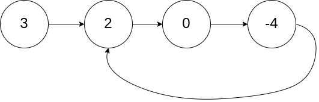
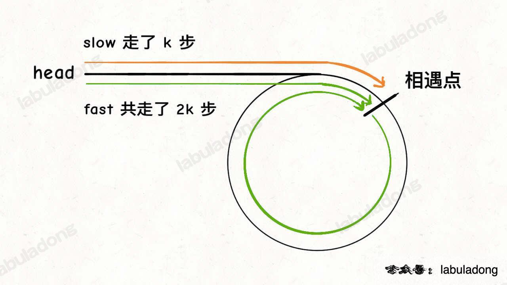
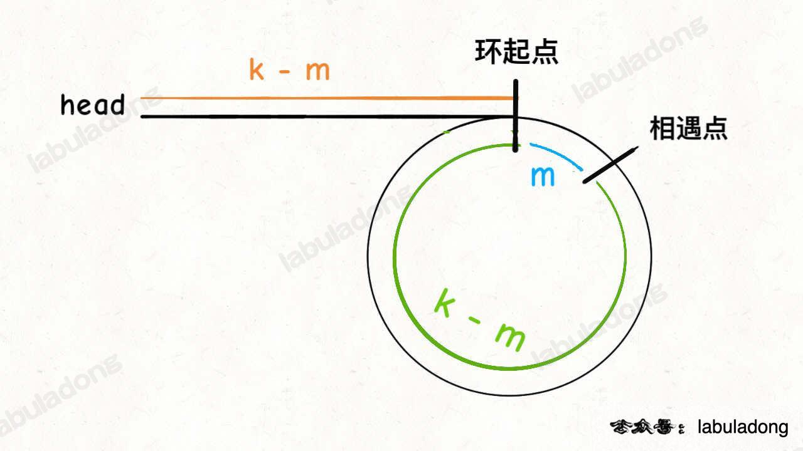
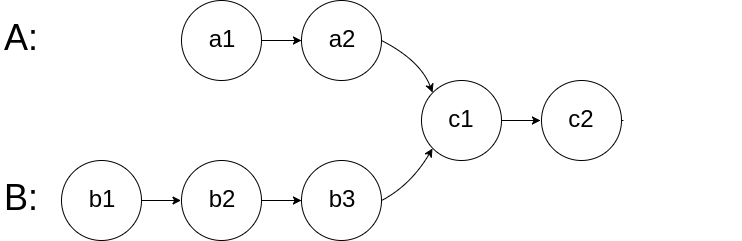
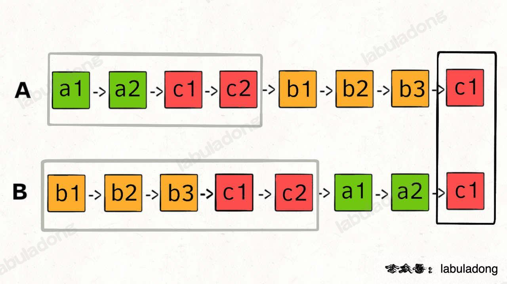
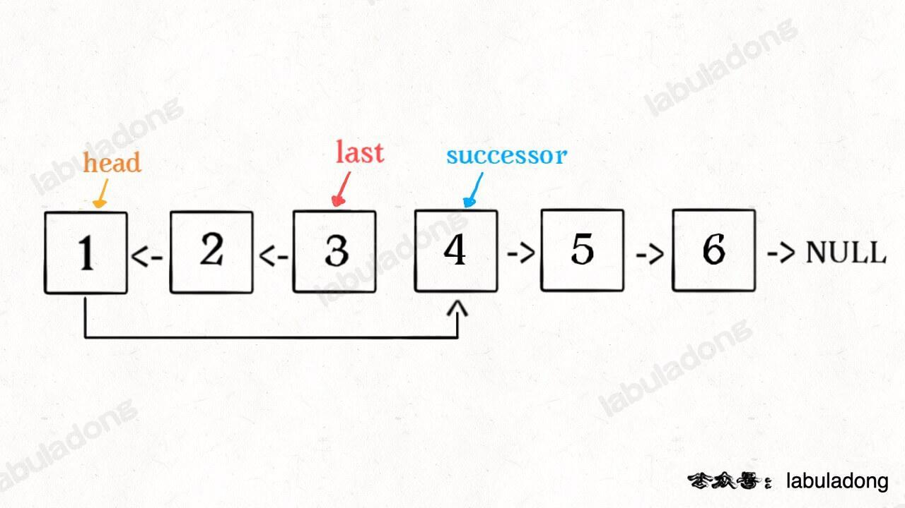
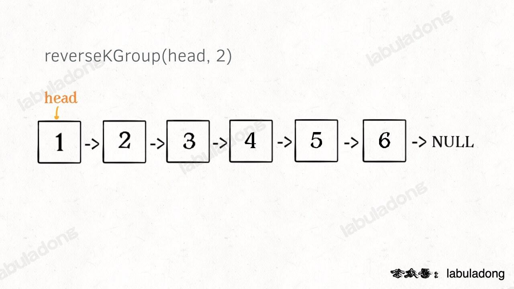
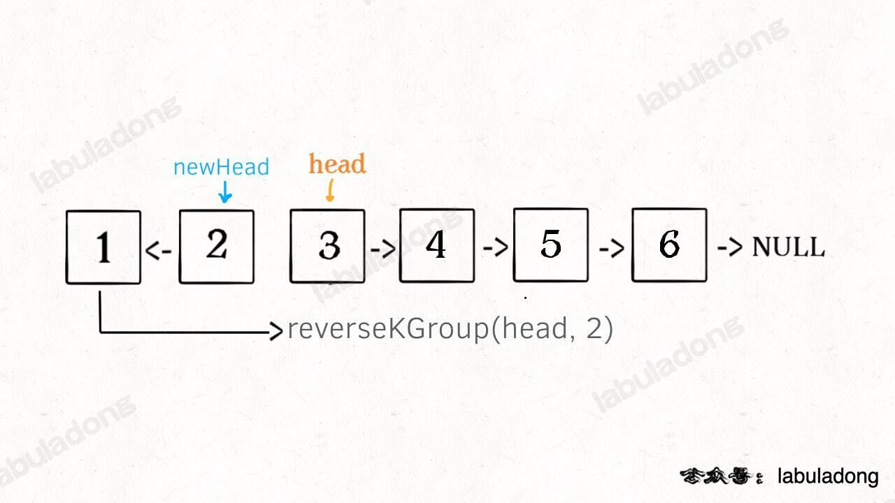

链表是一种兼具递归和迭代性质的数据结构

### 技巧 1. 需要创造一条新链表的时候，可以使用虚拟头结点简化边界情况的处理。
```js
var mergeTwoLists = function(l1, l2) {
    // 虚拟头结点
    var dummy = new ListNode(-1), 
    var p = dummy;
    /* some codes */
    p = p.next
    /* some codes */
    
    return dummy.next;
};
```
[19. 删除链表的倒数第 N 个结点 - 力扣（LeetCode）](https://leetcode.cn/problems/remove-nth-node-from-end-of-list/) 
这道题用虚拟节点可以避免处理头节点(例如总共 2 节点，让删除倒数第 2 节点，本质是删除第一个节点，按照算法逻辑应该找到倒数第 3 个节点，但第一个节点前面已经没有节点了。)

### 技巧 2. 如果需要把原链表的节点接到新链表上，而不是 new 新节点来组成新链表的话，养成好习惯，把原链表的 next 连接断开。
- 一定要留意，是断开原链的 next，而不是新链的 next。
- 合一后只要能确保最后节点的 next 为 null，则不需要每次都赋值断开，因为断开的目的就是确保字不形成环，而形成环往往是最后节点形成。（中间不会形成环是因为中间节点的 next 都被重新赋值了）。
- 每条链最大值不在尾端的多合一，每次原链 p 往后走最好都断开 next，否则其中的一条链的最后节点 next 非 null，将会产生环。如果不每次节点 next 连接断开，可以选择在最后合并后的链，设置最后节点 next 为 null。

为了便于理解第一点，可以看以下两个例子，断开的是原链的 next。
[21. 合并两个有序链表 - 力扣（LeetCode）](https://leetcode.cn/problems/merge-two-sorted-lists/description/)
```js
var mergeTwoLists = function(list1, list2) {
    let dummy = new ListNode(-1)
    let p = dummy
    let p1 = list1
    let p2 = list2
    // 原链为 p1 p2
    while(p1 && p2) {
	    // 由于两个链表是有序增大，可以保证合并后的最后节点next为 null.
	    // 所以可以不用断开原链的 next，当然要断开也可以
	    // 断开原链 p1 p2 的 next，而不是断开新链 p
        if (p1.val < p2.val) {
            p.next = p1
            const temp = p1.next
            p1.next = null
            p1 = temp
            // 此处断不断开无所谓，可以直接 p1 = p1.next
        } else {
            p.next = p2
            const temp = p2.next
            p2.next = null
            p2 = temp
            // 此处断不断开无所谓，可以直接 p2 = p2.next
        }
        p = p.next
    }
    if(p1){
        p.next = p1
    }
    if (p2) {
        p.next = p2
    }
    return dummy.next
};
```
[86. 分隔链表 - 力扣（LeetCode）](https://leetcode.cn/problems/partition-list/description/)
```js
var partition = function (head, x) {
    let p = head
    // 原链为 p
    
    let dummy1 = new ListNode(-1)
    let dummy2 = new ListNode(-1)
    let p1 = dummy1
    let p2 = dummy2
	
    while (p) {
	    // 由于原链表不是有序，无法保证合并后的最后节点next为 null.
	    // 所以需要断开原链的 next，或者设置最后节点 next 为 null
	    // 断开原链 p 的 next，而不是断开新链 p1 p2
        if (p.val < x) {
            p1.next = p
            p1 = p1.next
        } else {
            p2.next = p
            p2 = p2.next
        }
        const next = p.next
        p.next = null
        p = next
        // 或者 p = p.next 但必须在最后设置 p2.next = null
    }
    p1.next = dummy2.next
    return dummy1.next
};
```

## 双指针

### 判断环起点
[142. 环形链表 II - 力扣（LeetCode）](https://leetcode.cn/problems/linked-list-cycle-ii/description/)




思路
- 快慢指针，相遇时必有环。
- 相遇时，fast（2 k） 比 slow (k) 多走了 k 步，前面的 k 步是相遇点前共同走过的，后面的这 k 步是 fast 在相遇点为起点，单独在环里打圈圈，直至最后停在相遇点，所以 k 为环长度的整数倍。
- 相遇时使得任一指针指向 head。
- 都采用 1 步进，相遇时为环起点。（图上的 `k - m = k - m`）。


### 判断两链表相交
[160. 相交链表 - 力扣（LeetCode）](https://leetcode.cn/problems/intersection-of-two-linked-lists/description/)
#### 思路 1
将链 A 末端接到链 B, 题目变成判断环起点，最后断开我们手动链接方便过测试。

#### 思路 2
如果两个链有相交，则相交后都是共同部分


如果在 A 链完后接着链 B，链 B 完后接着链 A，这样进行拼接，他们便拥有了彼此不同的部分
- 只要他们有相交点，保持同步进就可以同时进入公共部分，同时到达相交节点。
- 如果没有相交点，将会同时抵达  null。


## 反转链表（可以双指针，此处用递归）
### 简单反转
[206. 反转链表 - 力扣（LeetCode）](https://leetcode.cn/problems/reverse-linked-list/description/) 
1. 反转之后，尾结点变成头节点，需要返回尾节点，写出最基础框架
```js
const reverseList = function(head) {
	if (!head) { // 边界处理，避免 head.next 报错
		return head
	}
	const last = reverseList(head.next)
	return last // 将尾节点返回
}
```
2. 下个节点的 next 指向自身，自身的 next 指向 null（断开链接，避免最后还要边界处理）
```js
const reverseList = function(head) {
	if (!head) { // 边界处理，避免 head.next 报错
		return head
	}
	const last = reverseList(head.next)
	head.next.next = head // 下个节点的 next 指向自身
	head.next = null // 自身的 next 指向 null
	return last // 将尾节点返回
}
```
3. 使用到了下个节点的 next 即 `head.next.next`  需要避免下个节点不存在。同时也意味着“如果链表为空或者只有一个节点的时候，反转结果就是它自己，直接返回即可”。
```js
const reverseList = function(head) {
	if (!head || !head.next) { // 边界处理，避免 head.next、head.next.next报错
		return head // 如果链表为空或者只有一个节点的时候，反转结果就是它自己，直接返回即可
	}
	const last = reverseList(head.next)
	head.next.next = head // 下个节点的 next 指向自身
	head.next = null // 自身的 next 指向 null
	return last // 将尾节点返回
}
```
这个框架是这么一步步写出来的。

### 反转链表前 N 个节点
还需要获取第 N+1 个节点，并将原本的头结点的 next 指向第 N+1 个节点。

```js
let successor = null
const reverseN = function(head, n) {
	// 题目n小于链表长度，所以这里可以省略
	// if (!head || !head.next) { // 边界处理，避免 head.next、head.next.next报错
	//	return head // 如果链表为空或者只有一个节点的时候，反转结果就是它自己，直接返回即可
	// }
	if (n === 1) {
		successor = head.next
		return head // 
	}
	const last = reverseN(head.next, n - 1)
	head.next.next = head // 下个节点的 next 指向自身
	head.next = successor // 自身的 next 指向 最后一个节点的next
	return last // 将尾节点返回
}
```

### 反转链表的一部分
>索引区间 `[m, n]`（索引从 1 开始），仅仅反转区间中的链表元素。

不要跳进递归，要利用明确的定义来实现算法逻辑。
	
- 如果 `m === 1` 从头结点开始反转，则同《反转链表前 N 个节点》一致；
- 如果 `m !== 1`，
	- 把 `head` 的索引视为 1，那么我们是想从第 `m` 个元素开始反转；
	- 把 `head.next` 的索引视为 1 ，那么相对于 `head.next` 反转的区间应该是从第 `m - 1` 个元素开始的。
```js
const reverseBetween = function(head, m, n) {
    // base case
    if(m === 1) { // 反转以head开头的n个节点
        return reverseN(head, n);
    }
    // 将head.next作为起点，反转前m-1个节点
    head.next = reverseBetween(head.next, m - 1, n - 1);
    return head;
}
```

### K 个一组翻转链表
[25. K 个一组翻转链表 - 力扣（LeetCode）](https://leetcode.cn/problems/reverse-nodes-in-k-group/description/)
链表是一种兼具递归和迭代性质的数据结构

比如对这个链表调用 `reverseKGroup(head, 2)`，即以 2 个节点为一组反转链表，设法把前 2 个节点反转。后面的这些节点也是一条链表，而且规模（长度）比原来这条链表小，这就叫**子问题**。

可以把原先的 `head` 指针移动到后面这一段链表的开头，因为子问题（后面这部分链表）和原问题（整条链表）的结构完全相同，这就是所谓的递归性质。


## 优先级队列
插入或者删除元素的时候，元素会自动排序，二叉堆的操作。

上浮 `swim` 和下沉 `sink` 的操作
delMax 和 insert 基于 `swim` `sink` 实现
- `insert` 方法先把要插入的元素添加到堆底的最后，然后让其上浮到正确位置。
- `delMax` 方法先把堆顶元素 `A` 和堆底最后的元素 `B` 对调，然后删除 `A`，最后让 `B` 下沉到正确位置。

插入和删除元素的时间复杂度为 `O(logK)`，`K` 为当前二叉堆（优先级队列）中的元素总数。时间复杂度主要花费在 `sink` 或者 `swim` 上，而不管上浮还是下沉，最多也就树（堆）的高度， log 级别。

```js
class PriorityQueue {
    constructor() {
        this.queue = [null]
        this.size = 0
    }
    isEmpty() {
        return !this.size
    }
    parent(x) {
        return Math.floor(x/2)
    }
    left(x) {
        return x * 2
    }
    right(x) {
        return x * 2 + 1
    }
    add(val) {
        this.size++
        this.queue[this.size] = val
        this.swim(this.size)
    }
    remove() {
        const temp = this.queue[1]
        this.swap(1, this.size)
        this.queue[this.size] = null
        this.size--
        this.sink(1)
        return temp
    }
    less(a, b) {
        return this.queue[a].val < this.queue[b].val
    }
    swap(a,b) {
        const temp = this.queue[a]
        this.queue[a] = this.queue[b]
        this.queue[b] = temp
    }
    swim(x) {
        const parent = this.parent(x)
        if (!parent || this.less(parent, x)) return
        this.swap(x, parent)
        this.swim(parent)
    }
    sink(x) {
        let min = this.left(x)
        if (min > this.size) return
        let right = this.right(x)
        if (right <= this.size && this.less(right,min))  {
            min = right
        }
        if (min > this.size || this.less(x, min)) return
        this.swap(x, min)
        this.sink(min)
    }
}
```

