## 整理目的
分类整理，备注好每个项目的特点，预留一些使用上的可能性。

## AI 类
### tabby: 私人编程助理
[TabbyML/tabby: Self-hosted AI coding assistant (github.com)](https://github.com/TabbyML/tabby)
- 无需其他云服务
- 使用消费者级别的 GPU 即可
- 注重代码隐私的小型企业使用成为可能，支持主流 IDE
- 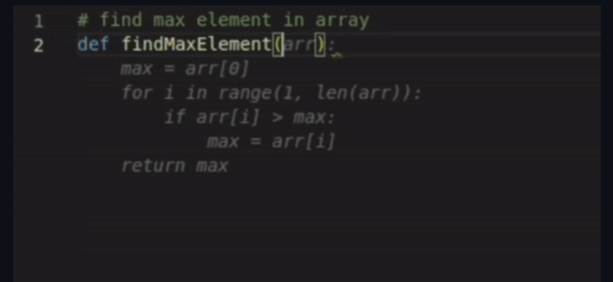

### DocsGPT: 文档助手
[arc53/DocsGPT: GPT-powered chat for documentation, chat with your documents (github.com)](https://github.com/arc53/DocsGPT)
-  投喂文档训练回答问题，可以私有化部署，比较契合企业内部使用。缺点就是需要的 GPU 还不是家庭级的设备（2023年10月09日），中小型企业落实使用有难度
-  [MIT license](https://github.com/arc53/DocsGPT/blob/main/LICENSE)
- 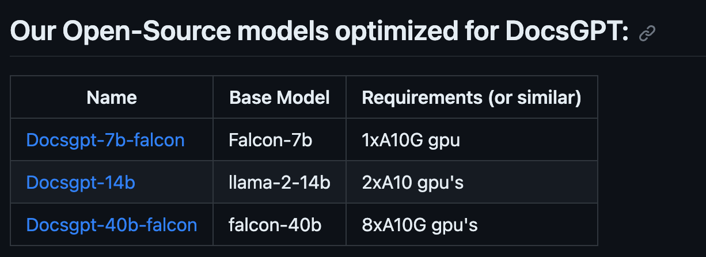
- 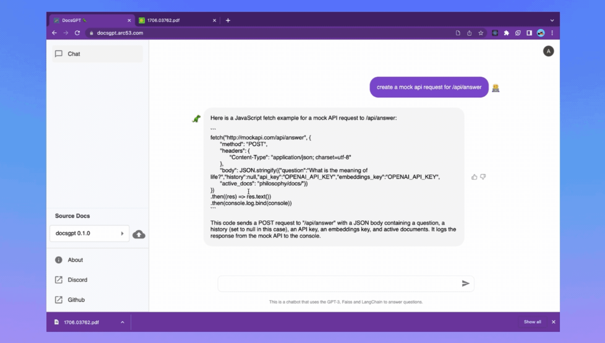

### ChatDev: 自然语言创建软件
[OpenBMB/ChatDev: Create Customized Software using Natural Language Idea (through Multi-Agent Collaboration) --- OpenBMB/ChatDev：使用自然语言理念创建自定义软件（通过多代理协作） (github.com)](https://github.com/OpenBMB/ChatDev)
- 未来发展的其中一个趋势，目前只能做简单的软件。使用自然语言开发软件，提供软件构建过程的综合日志，可用于重放。
- 非商业

### AIdea: 集合聊天和图像生成的 AI App
[mylxsw/aidea: AIdea 是一款支持 GPT 以及国产大语言模型通义千问、文心一言等，支持 Stable Diffusion 文生图、图生图、 SDXL1.0、超分辨率、图片上色的全能型 APP。 (github.com)](https://github.com/mylxsw/aidea)
- 移动端便捷，无电脑场景十分好用
- [MIT License](https://github.com/mylxsw/aidea/blob/main/LICENSE)
- 

### instagraph: 文本/URL 转知识图谱
[yoheinakajima/instagraph: Converts text input or URL into knowledge graph and displays --- yoheinakajima/instagraph：将文本输入或URL转换为知识图谱并显示 (github.com)](https://github.com/yoheinakajima/instagraph)
- 将问题或 URL 转换为知识图谱，可以摸清复杂主题中各个对象之间的关系。对于学习新的知识框架、不同行业可以有个系统性的认知。
- [MIT License]
- (https://github.com/yoheinakajima/instagraph/blob/main/LICENSE)
- 

### Real-Time-Voice-Cloning:  克隆声音特征生成演讲
[CorentinJ/Real-Time-Voice-Cloning: Clone a voice in 5 seconds to generate arbitrary speech in real-time (github.com)](https://github.com/CorentinJ/Real-Time-Voice-Cloning)
- 多次录入 5s 的声音，采集声音特性后，提供文本，可以生成任意演讲（训练的数据集都是演讲类的， 所以不是自然的说话）。
- [MIT License](https://github.com/CorentinJ/Real-Time-Voice-Cloning/blob/master/LICENSE.md)
- [演示视频：Real-Time Voice Cloning Toolbox - YouTube](https://www.youtube.com/watch?v=-O_hYhToKoA)

### hcaptcha-challenger: 自动过验证码
- [QIN2DIM/hcaptcha-challenger: 🥂 Gracefully face hCaptcha challenge with MoE(ONNX) embedded solution. (github.com)](https://github.com/QIN2DIM/hcaptcha-challenger)
- 过如 12306 的识图验证码，不依靠油猴，不依靠第三方验证码服务，而是使用 AI 识别
-  [GPL-3.0 license](https://github.com/QIN2DIM/hcaptcha-challenger/blob/main/LICENSE)
- 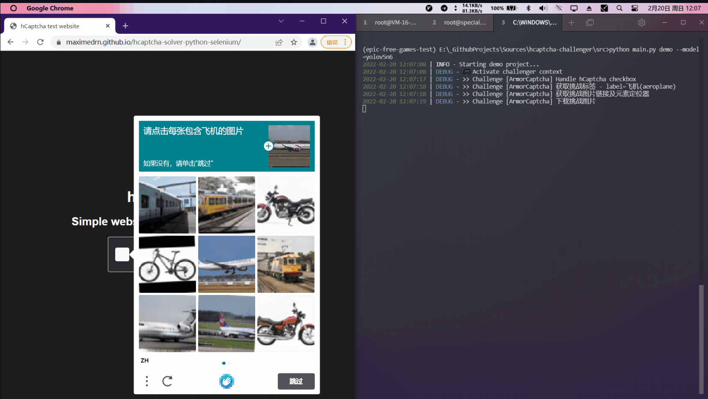

### AI 人物抠图: 上传后秒抠
[AI抠图 - 只需上传图片，无需其他作即可自动去除图片背景 (aiwave.cc)](https://cutout.aiwave.cc/)
- 抠图目前无需登录，不收费。（2023年10月09日）
- 同时该网站还收录了很多 AI [AIGC工具导航 | 海量AI工具，总有一款是你需要的 (aiwave.cc)](https://nav.aiwave.cc/) 不过部分需要登录收费。

## 中后台系统
### soybean-admin: 中后台模板
[honghuangdc/soybean-admin: A fresh and elegant admin template, based on Vue3,Vite3,TypeScript,NaiveUI and UnoCSS [一个基于Vue3、Vite3、TypeScript、NaiveUI 和 UnoCSS的清新优雅的中后台模版] (github.com)](https://github.com/honghuangdc/soybean-admin)
- 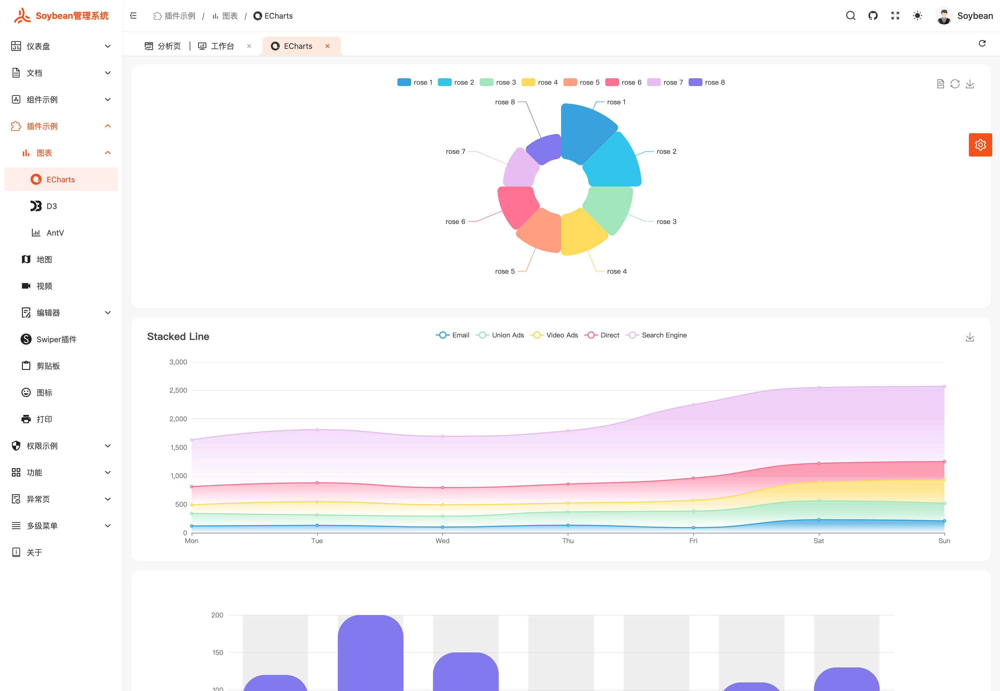
- 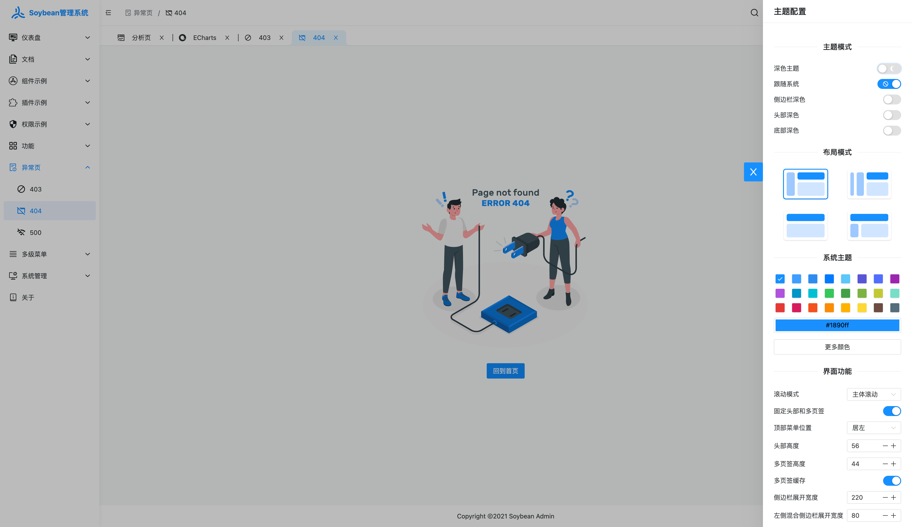

## 前端
### Astro: 专为速度而设计的一体化 Web 框架
[withastro/astro: The all-in-one web framework designed for speed. ⭐️ Star to support our work! --- withastro/astro：专为速度而设计的多合一Web框架。⭐️ 星星支持我们的工作！ (github.com)](https://github.com/withastro/astro)
- `Astro` 关注内容，十分注重速度，**尽可能利用服务器渲染**，默认生成**不含**客户端 `JS` 的网站。同时可以配合前端框架 [React](https://react.dev/)、[Preact](https://preactjs.com/)、[Svelte](https://svelte.dev/)、[Vue](https://vuejs.org/)等一起使用，会自动提前将它们渲染为 `HTML`，然后再除去所有 `JS`，使得网站十分迅速。部分 `html` 需要 `JS` 做交互，这种为客户端组件，也称为：**可响应岛屿**。
- 所以整个页面是个群岛，由多个岛屿组成。整个应用为**多页应用程序（MPA）**，也可以对接多个前端框架。
- [MIT License](https://github.com/withastro/astro/blob/main/LICENSE)
- [官方中文文档-为什么是 Astro? 🚀 Astro 文档](https://docs.astro.build/zh-cn/concepts/why-astro/)

### Bun: 快速 JavaScript 运行时、捆绑器、测试运行器和包管理器一体化工具
[oven-sh/bun: Incredibly fast JavaScript runtime, bundler, test runner, and package manager – all in one --- oven-sh/bun：令人难以置信的快速 JavaScript 运行时、捆绑器、测试运行器和包管理器 - 合二为一 (github.com)](https://github.com/oven-sh/bun)

- 多合一工具包，旨在替代 `Node.js`，大大减少了启动时间和内存使用量，可以在现有的 Node.js 项目中使用，几乎不需要更改。
	- 转换器：可以运行 `.js/.ts/.cjs/.mjs/.jsx/.tsx`等（不需要 `tsc/babel/ts-node/tsx`)
	- 捆绑器：比 `esbuild` 快 1.75 倍，将 `js/ts` 捆绑压缩，生成用于浏览器和 node 等平台代码
	- 包管理器：安装比 `pnpm` 快 17 倍，执行脚本也是瞬间，替代 `npm/yarn/pnpm/lerna`。
	- 测试库：与 `Jest` 兼容的测试运行器，比 `Vitest` 快 13 倍，比 `Jest` 快 8 倍。支持快照测试、模拟和代码覆盖率。替代 `jest/ts-ject/vitest`
- [MIT License](https://bun.sh/docs/project/licensing)
> 可惜 2023-09-11时，Bun 还未提供原生 Windows 版本，在公司没法用。

### tldraw: 白板编辑器组件
[tldraw/tldraw: a very good whiteboard --- TLdraw/TLDRAW：一个非常好用的白板 (github.com)](https://github.com/tldraw/tldraw)
- 白板编辑器组件，功能挺好的。用于 React 项目
- [Apache License 2.0](https://github.com/tldraw/tldraw/blob/main/LICENSE)
- [官方文档 | tldraw docs](https://tldraw.dev/)
- 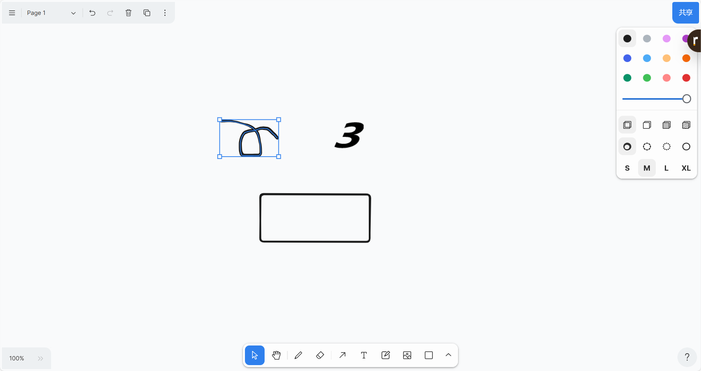

### jsoncrack.com: 数据转可交互式图形
[AykutSarac/jsoncrack.com: ✨ Innovative and open-source visualization application that transforms various data formats, such as JSON, YAML, XML, CSV and more, into interactive graphs. --- AykutSarac/jsoncrack.com：创新的开源可视化应用程序，可将各种数据格式（如JSON，YAML，XML，CSV ✨等）转换为交互式图形。 (github.com)](https://github.com/AykutSarac/jsoncrack.com)
- 直观且用户友好的交互界面，复杂的数据结构也可以轻松探索、分析和理解。
- [VsCode 插件](https://marketplace.visualstudio.com/items?itemName=AykutSarac.jsoncrack-vscode)
- [GNU General Public License v3.0](https://github.com/AykutSarac/jsoncrack.com/blob/main/LICENSE)
- 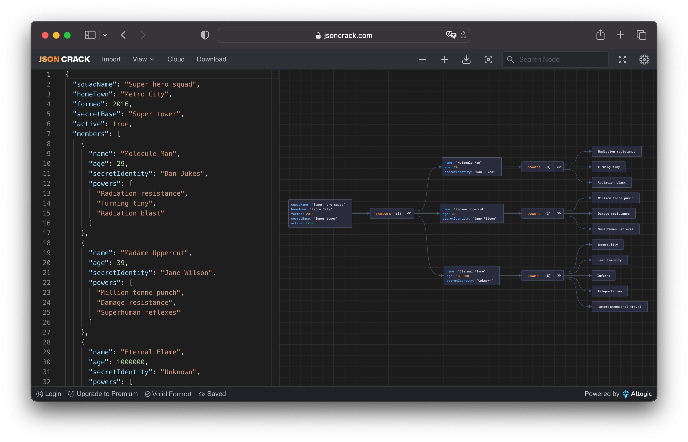

### elementor: 低代码-页面构建器
[elementor/elementor: The most advanced frontend drag & drop page builder. Create high-end, pixel perfect websites at record speeds. Any theme, any page, any design. --- elementor/elementor：最先进的前端拖放页面构建器。以创纪录的速度创建高端、像素完美的网站。任何主题，任何页面，任何设计。 (github.com)](https://github.com/elementor/elementor)
- 引入WordPress网站构建器，没有设计限制。非常适合希望快速上线的营销人员。`react` 技术栈
- [GNU General Public License v3.0](https://github.com/elementor/elementor/blob/main/license.txt)
- [官方演示视频: https://elementor.com/wp-content/uploads/2023/09/02_MainVideo_1066_600_1.mp4](https://elementor.com/wp-content/uploads/2023/09/02_MainVideo_1066_600_1.mp4)
- 

### illa-builder: 低代码平台
[illacloud/illa-builder: 🚀 Retool open-source alternative, with low-code UI components and support for multiple data resources. (github.com)](https://github.com/illacloud/illa-builder)
- 可以自主搭建，或者使用云服务。`react` 技术栈
- [官方文档 | CLI doc | ILLA Cloud - ILLA](https://www.illacloud.com/zh-CN/docs/illa-cli)
- [Apache License 2.0](https://github.com/illacloud/illa-builder/blob/beta/LICENSE)
- 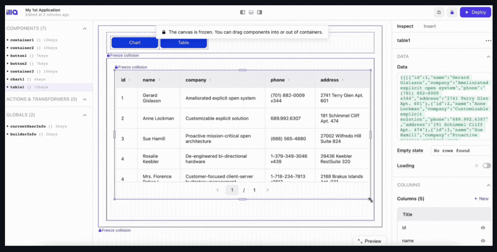

### poster-design: 图片设计器
[palxiao/poster-design: 一款漂亮且功能强大的在线图片设计器，仿稿定设计，适用于多种场景：海报生成、电商产品图、文章长图、视频/公众号封面等，让设计更简单！A beautiful online image designer, suitable for various scenarios like generate posters, making design easier. (github.com)](https://github.com/palxiao/poster-design)
- [MIT License](https://github.com/palxiao/poster-design/blob/main/LICENSE)
- [在线体验 (palxp.cn)](https://design.palxp.cn/home)
- 

### Swiper: 移动端滑块
[nolimits4web/swiper: Most modern mobile touch slider with hardware accelerated transitions (github.com)](https://github.com/nolimits4web/swiper)
- 以超棒的体验和兼容性，在现代移动设备上实现滑动。
- [官方网站/体验 Swiper - The Most Modern Mobile Touch Slider (swiperjs.com)](https://swiperjs.com/)
- [MIT License](https://github.com/nolimits4web/swiper/blob/master/LICENSE)

### Kamal: 零停机部署应用
[basecamp/kamal: Deploy web apps anywhere. (github.com)](https://github.com/basecamp/kamal)
- 实现零停机。在新的应用程序容器启动、旧的应用程序容器停止的过程中，Kamal 具有动态反向代理 Traefik 保留请求。可与任何类型的可使用 Docker 容器化的 Web 应用程序配合使用。
- [官方介绍视频：Kamal — Deploy web apps anywhere (kamal-deploy.org)](https://kamal-deploy.org/)
- [MIT License](https://github.com/basecamp/kamal/blob/main/MIT-LICENSE)

### Nezha: 服务器监控、运维工具
[naiba/nezha: :trollface: Self-hosted, lightweight server and website monitoring and O&M tool (github.com)](https://github.com/naiba/nezha)
- 一键安装部署，安装简单、开箱即用，支持监控多个服务器的系统状态、SSL 证书状态、报警通知（支持多种通知方式 Telegram、邮件、微信等）、流量监控、设置定时任务等功能，适用于 Linux、Windows、macOS、OpenWRT 等主流系统。
- 官方文档:  [哪吒监控 | 使用文档 (nezha.wiki)](https://nezha.wiki/)
- 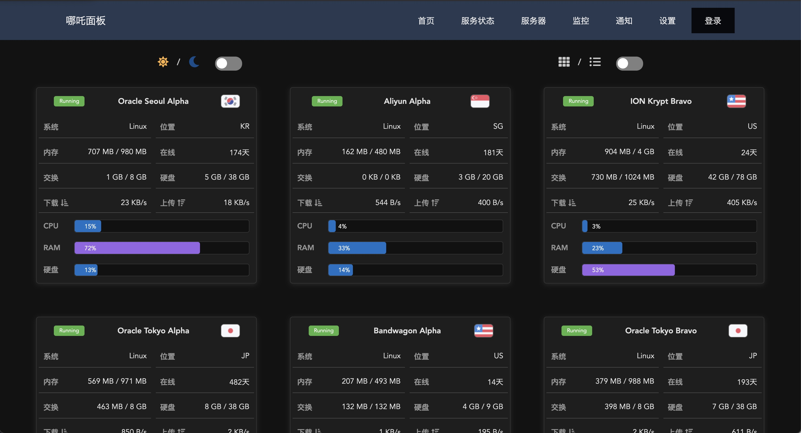
- 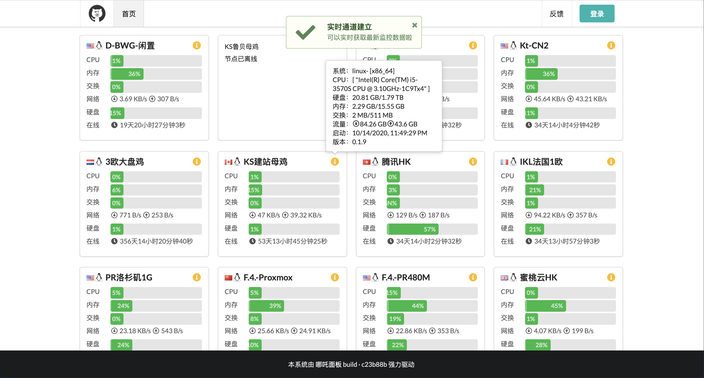

## 书籍

### 《动手学深度学习》
[d2l-ai/d2l-zh: 《动手学深度学习》：面向中文读者、能运行、可讨论。中英文版被70多个国家的500多所大学用于教学。 (github.com)](https://github.com/d2l-ai/d2l-zh)
- [在线书籍 |《动手学深度学习》](http://zh.d2l.ai/)

### Hello: 书籍-算法
[krahets/hello-algo: 《Hello 算法》：动画图解、一键运行的数据结构与算法教程，支持 Java, C++, Python, Go, JS, TS, C#, Swift, Rust, Dart, Zig 等语言。 (github.com)](https://github.com/krahets/hello-algo)
- leetCode 上 C 神的书，提供在线文档和源码，在线文档有动画图解，覆盖多种语言，且源码中有详细打印辅助理解。
- [在线文档-Hello 算法 (hello-algo.com)](https://www.hello-algo.com/)
- 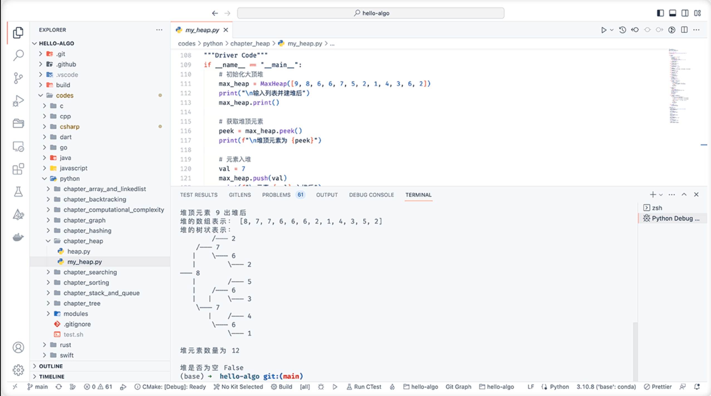

### TypeScript: 书籍-阮一峰 TS 

[wangdoc/typescript-tutorial: TypeScript 教程 (github.com)](https://github.com/wangdoc/typescript-tutorial)
- TypeScript 开源教程，介绍基本概念和用法，面向初学者。
- [在线文档 - TypeScript 教程 - 网道 (wangdoc.com)](https://wangdoc.com/typescript/)

### 精益副业：程序员如何优雅地做副业
[easychen/lean-side-bussiness: 精益副业：程序员如何优雅地做副业 (github.com)](https://github.com/easychen/lean-side-bussiness)
引入「精益创业」流程，并优化「精益副业」流程，以实际案例为主，添加了「独立开发变现」和「网课变现实践」的内容。
- [在线文档 - 精益副业](http://r.ftqq.com/lean-side-bussiness/index.html)

### clean-code-javascript: 干净代码概念
[ryanmcdermott/clean-code-javascript: :bathtub: Clean Code concepts adapted for JavaScript --- ryanmcdermott/clean-code-javascript： 适用于JavaScript的Clean Code概念 (github.com)](https://github.com/ryanmcdermott/clean-code-javascript)
- 《Clean Code》一书，改编为JavaScript，作者从多年的集体经验中编纂出来。

## 其它
### CasaOS: 个人云
[IceWhaleTech/CasaOS: CasaOS - A simple, easy-to-use, elegant open-source Personal Cloud system. --- IceWhaleTech/CasaOS：CasaOS - 一个简单，易于使用，优雅的开源个人云系统。 (github.com)](https://github.com/IceWhaleTech/CasaOS)
	- 个人云，使用时纯 UI 交互，且数据所有权归个人。代码开源自由度高。可以把它当国内的腾讯云阿里云的个人版。随着硬件设备价格下降，应该会越来越香。不申请公网 `ip` 的话，配合 `natapp` 也挺舒服的。
	- [Apache-2.0 license](https://github.com/IceWhaleTech/CasaOS/blob/main/LICENSE)
	- 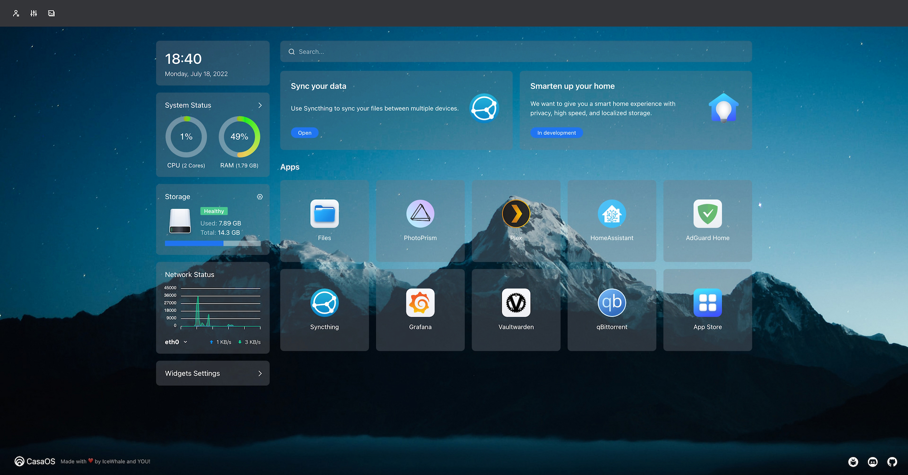

### Resume-Matcher: 求职者跟踪系统
[srbhr/Resume-Matcher: Open Source Free ATS Tool to compare Resumes with Job Descriptions and create a score to rank them.  (github.com)](https://github.com/srbhr/Resume-Matcher)
- Applicant Tracking System（求职者跟踪系统）
- 将 `pdf` 简历与 `pdf` 职位描述进行比较，并创建一个分数进行排名，为您提供见解和建议。
- 找工作的可以反向操作，核对自己简历的问题加以修改。该系对英文描述和简历比较友好，也适合远程工作机会。

### Home Assistant: 家庭助理
[home-assistant/core: :house_with_garden: Open source home automation that puts local control and privacy first. (github.com)](https://github.com/home-assistant/core)
- 一个开源家庭自动化项目，可用于 DIY，且注重保护本地控制和隐私。非常适合在树莓派或本地服务器上运行。家里有自动化需求可以接入，用的语言是 `Python`
- [Apache License 2.0]([core/LICENSE.md at dev · home-assistant/core (github.com)](https://github.com/home-assistant/core/blob/dev/LICENSE.md))
- [官方 DEMO (home-assistant.io)](https://demo.home-assistant.io/#/lovelace/0) | [官方 示例 (home-assistant.io)](https://www.home-assistant.io/examples/)
- 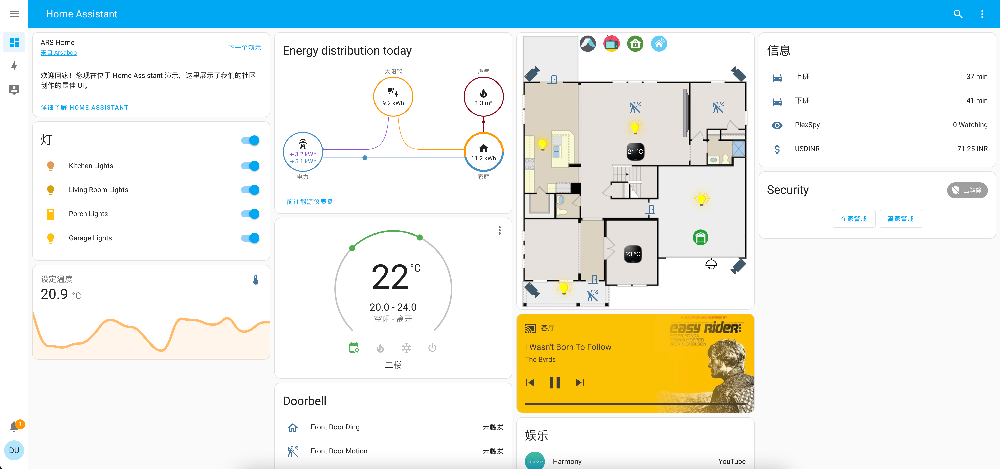

### 12306智能刷票
[testerSunshine/12306: 12306智能刷票，订票 (github.com)](https://github.com/testerSunshine/12306)
- 于2023年9月15日收集时已有功能：自动打码、自动登录、准点预售和捡漏、智能候补、邮件通知、server酱通知
- [MIT License](https://github.com/testerSunshine/12306/blob/master/LICENSE)

### Public Apis: 公共接口
[public-apis/public-apis: A collective list of free APIs (github.com)](https://github.com/public-apis/public-apis)
各式各样的公共接口，例如随机获取狗照片，获取各国的节假日，多个交易所的实时和历史数据等等。

### changedetection.io: 监控网页变更
[dgtlmoon/changedetection.io: The best and simplest free open source website change detection, restock monitor and notification service. Restock Monitor, change detection. Designed for simplicity - Simply monitor which websites had a text change for free. Free Open source web page change detection, Website defacement monitoring, Price change and Price Drop notification (github.com)](https://github.com/dgtlmoon/changedetection.io)
- 网页监控、价格降价通知、补货监控、房地产价格、房租、招聘JD、接受 cookie 登录、输入日期和细化搜索。可以电子邮件、API 调用等。
- - [Apache License 2.0](https://github.com/dgtlmoon/changedetection.io/blob/master/LICENSE)
- 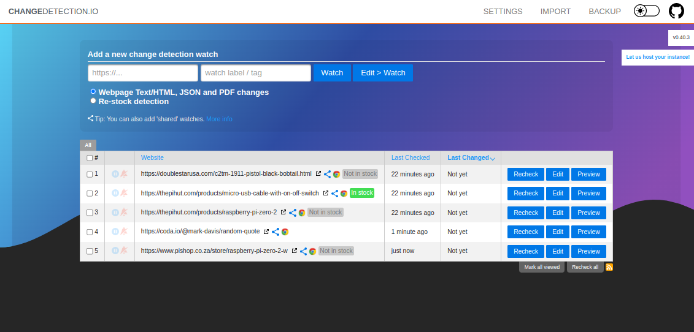

### mwmbl: 无广告无追踪的搜索引擎
[mwmbl/mwmbl: An open source, non-profit search engine implemented in python (github.com)](https://github.com/mwmbl/mwmbl)
- 在线地址：[mwmbl.org]( https://mwmbl.org/ " https://mwmbl.org" )
- 适合 IT 人员查技术文档和库，无广、无追踪、无盈利的搜索引擎。注重搜索内容，没有广告影响排序，不会有其他内容占据主要视野，且速度更快。
- [AGPL-3.0 license](https://github.com/mwmbl/mwmbl/blob/main/LICENSE)
- 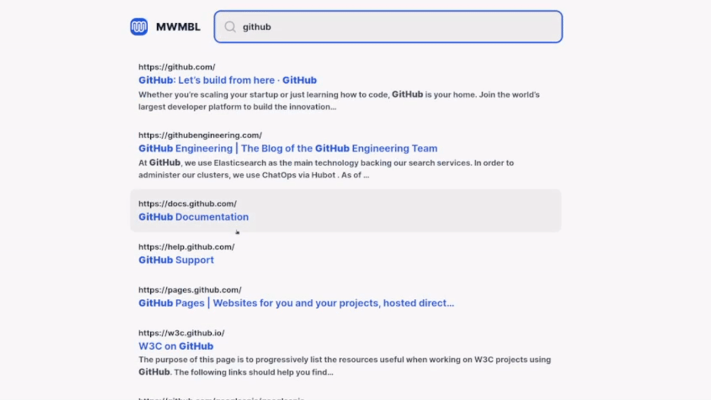

### TechStack: Github 显示技术栈
[Get-Tech-Stack/TechStack: The extension will display the tech stack of the Repo when the user visit a GitHub Public Repo. The user can more easy get more info about the repo . 当用户访问 GitHub 公共存储库时，该扩展将显示存储库的技术栈。 用户可以更轻松地获取有关存储库的更多信息。](https://github.com/Get-Tech-Stack/TechStack)
- 浏览器插件，逛 Github 时会在仓库旁边显示技术栈
- [MIT license](https://github.com/Get-Tech-Stack/TechStack/blob/main/LICENSE)
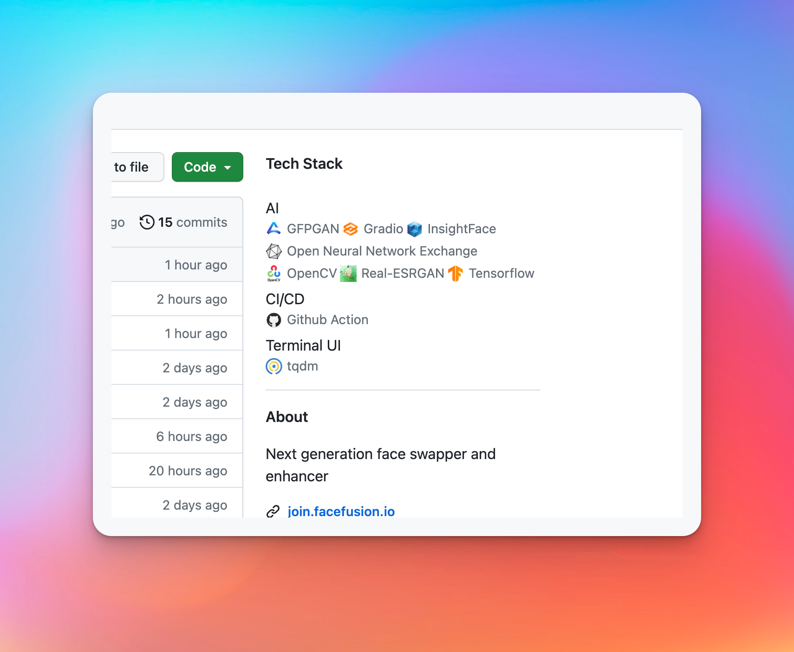