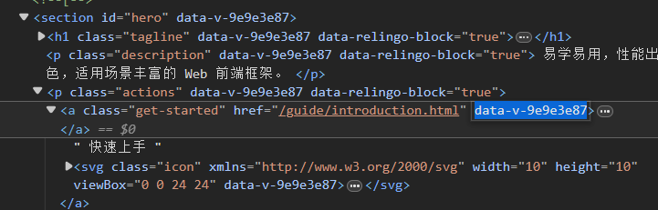
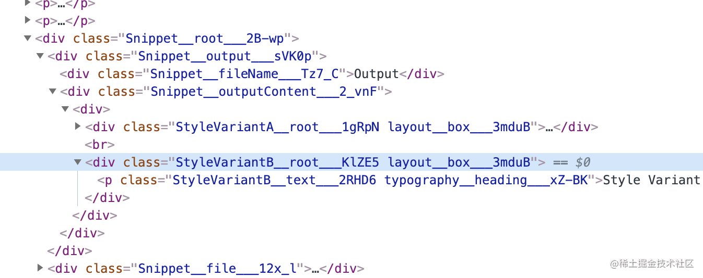
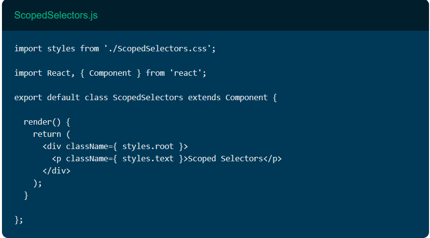

## BEM

1. **块（Block）**：代表独立的组件或功能单元。例如，一个导航菜单或一个按钮。
2. **元素（Element）**：块内部的部分，表示块的一部分。例如，导航菜单中的一个菜单项。
3. **修饰符（Modifier）**：用来描述块或元素的不同状态或变体。例如，一个按钮的不同状态（激活、禁用）。

`.block__element--modifier `

```css
.menu { 
	.menu__btn--active {
	}
}
```

缺点:  有些太长，可适当简化，只包裹该页面组件的根类名，但有可能增加样式冲突的风险
```css
.menu { 
	.btn--active {
	}
}
```


## CSS Scoped

对当前组件(scope)下所有元素生成唯一的属性或者类名，自动添加该唯一值实现作用域的命名保护。

```css
.get-started {}

// 生成
.get-started[data-v-9e9e3e87] {}
```


## CSS Module
`css module`  会对类名进行 hash 化

[css-modules/css-modules: Documentation about css-modules (github.com)](https://github.com/css-modules/css-modules)
通过转换类名和生成哈希值，CSS Modules 有效地解决了全局作用域的问题。
[CSS Modules Webpack Demo (css-modules.github.io)](https://css-modules.github.io/webpack-demo/)


相比 scoped 复用能力更强些，但没有 scoped 简便。
