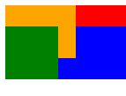
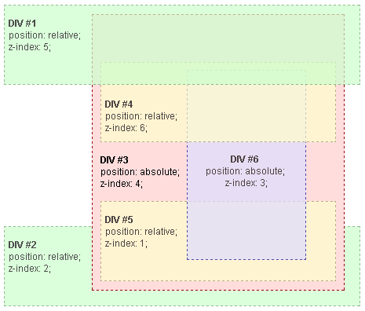

## 生效规则

1. 元素自身有定位：必须有一个非 static（默认值）的 position 属性值才能应用 z-index  
  
2. 或者使用了 transform、filter、perspective、clip-path、mask、mask-image、mask-border 等属性  
  
默认行为：没有指定 z-index 值，那么在 HTML 代码中后面的元素将显示在前面的元素之上。  
  
负值：z-index 可以接受负值，如 -1。这意味着元素可以被其他没有设置 z-index 值的元素覆盖


## 堆叠上下文

使用非 static 定位或 transform 等属性，且设置了 z-index，才会形成堆叠上下文。
```html
<div class="first">  
<div class="item"></div>  
</div>  
<div class="second">  
<div class="item"></div>  
</div>  
```

```js
.first {  
	background-color: red;  
	height: 3rem;  
  
	.item {  
		z-index: 4;  
		height: 100%;  
		width: 4rem;  
		background-color: orange;  
		position: relative;  
	}  
}  
  
.second {  
	background-color: blue;  
	height: 3rem;  
	margin-top: -1.8rem;  
	position: relative;  
	// z-index: 1; 
	// 即使有relative ,不设置 z-index 绿色999可以挡住橙色 4。
	// 设置了z-index，便形成堆叠上下文，就变成1 和 4 对比了。  
	  
	.item {  
		z-index: 999;  
		height: 100%;  
		width: 3rem;  
		background-color: green;  
		position: relative;  
	}  
}
```




## 堆叠上下文的根元素
如果一个两个元素不在同一个父元素下，z-index 是如何对比的？  
  
它们的父或祖父元素（堆叠上下文的根元素）的 z-index 值才是决定它们相对堆叠顺序的关键。跟是不是同个父元素无关。  
  
当两个元素不在同一个堆叠上下文的根元素，它们自身的 z-index 值对于它们之间的直接比较是没有意义的。这是因为 z-index 的堆叠顺序是相对于它们所在的堆叠上下文（stacking context）来确定的。  
  
如果两个元素的堆叠上下文的根元素具有相同的 z-index 值，那么它们在 HTML 文档流中的顺序将决定它们的堆叠顺序。



注意 DIV #4 ，DIV #5 和 DIV #6 是 DIV #3 的子元素，所以它们的层叠完全在 DIV #3 中被处理。  

一旦 DIV #3 中的层叠和渲染处理完成，DIV #3 元素就被作为一个整体传递与兄弟元素的 DIV 在 root（根）元素进行层叠。