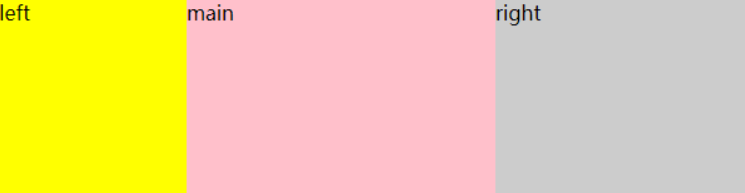
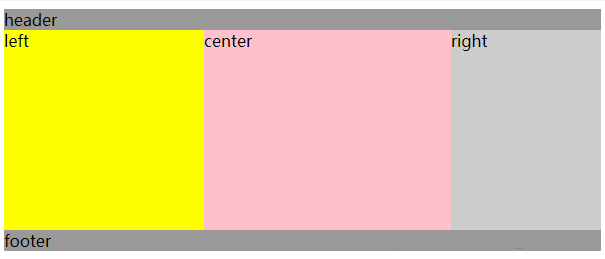

## 总结

|          | 双飞翼                                                 | 圣杯                                                          |
| -------- | --------------------------------------------------- | ----------------------------------------------------------- |
| 主内容两边的边距 | margin-left 和 margin-right                          | 用 padding-left 和 padding-right                              |
| 左右元素的偏移  | 均使用 margin-left  <br>左：向左偏移main的宽度；  <br>右：向左偏移自身宽度 | 左：使用 margin-left（向左偏移 main 的宽度）  <br>右：margin-right（取消自身宽度） |
## 双飞翼
- `left` 和 `right` 固定宽度
- 中间 `main` 会随着整体布局宽度的变化而伸缩


```html
<!DOCTYPE html>
<html>
<head>
    <meta charset="UTF-8">
    <meta name="viewport" content="width=device-width, initial-scale=1.0">
    <meta http-equiv="X-UA-Compatible" content="ie=edge">
    <title>双飞翼布局</title>
    <style type="text/css">
        body {
            min-width: 550px;
        }
        .col {
			/* 1.设置浮动 */
			float: left;
        }

        #main {
            width: 100%;
            height: 200px;
            background-color: #FFC0CB;
        }
        #main-wrap {
			/* 2.将 main 左右内边距留出 left 和 right 的宽度 */
			margin: 0 200px 0 150px;
        }

        #left {
            width: 150px;
            height: 200px;
            background-color: #FFFF00;
			/* 3.left 向左偏移 main 的宽度 */
			margin-left: -100%;
        }
        #right {
            width: 200px;
            height: 200px;
            background-color: #cccccc;
			/* 4.right 向左偏移自身宽度 */
			margin-left: -200px;
        }
    </style>
</head>
<body>
    <div id="main" class="col">
        <div id="main-wrap">
            main
        </div>
    </div>
    <div id="left" class="col">
        left
    </div>
    <div id="right" class="col">
        right
    </div>
</body>
</html>

```

## 圣杯
- 拥有 `header` 和 `footer`，中间是主内容行
- `left` 和 `right` 分别固定了宽度，`center` 会随着整体布局宽度的变化而进行伸缩
 

```html
<!DOCTYPE html>
<html>
	<head>
		<meta charset="UTF-8">
		<meta name="viewport" content="width=device-width, initial-scale=1.0">
		<meta http-equiv="X-UA-Compatible" content="ie=edge">
		<title>圣杯布局</title>
		<style type="text/css">
			body {
				min-width: 550px;
			}

			#header {
				background-color: #999999;
			}
			
			#middle{
				/* 2.把中间部分留出左右元素的宽度 */
				padding-left: 200px;
				padding-right: 150px;
			}
			
			#middle .column{
				float: left;
				height: 200px;
			}
			
			#left{
				width: 200px;
				background-color: #FFFF00;
				/* 4. 向左移动center的宽度 */
				margin-left: -100%;
				/* 5. 再向左移动自身宽度，露出被覆盖的center块 */
				position: relative;
				right: 200px;
			}
			
			#center{
				width: 100%;
				background-color: pink;
			}
			
			#right{
				/* 3.margin-right让右方元素覆盖自身，达到消除自身宽度的目的，浮动到center上面去 */
				margin-right: -150px;
				width: 150px;
				background-color: #CCCCCC;
			}
			
			#footer {
				background-color: #999999;
			}
			
			.clearfix:after{
				display: table;
				content: '';
				clear: both;
			}
		</style>
	</head>
	<body>
		<div id="header">header</div>
		<div id="middle" class="clearfix">
			<div id="center" class="column">
				center
			</div>
			<div id="left" class="column">
				left
			</div>
			<div id="right" class="column">
				right
			</div>
		</div>
		<div id="footer">footer</div>
	</body>
</html>


```