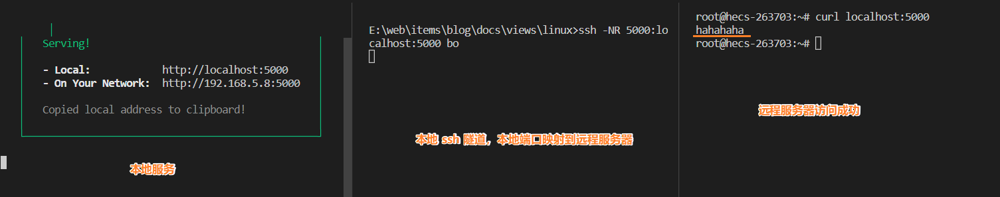

## 总结
- 远程映射到本地：将远程服务器的服务拿到本地来用。
  - `ssh -NL port:host:hostport user@[bind_address]`
  - 场景：远程服务器的数据库，映射到本地。
- 本地映射到远程：将本地的服务拿到远程服务器用。需要映射到远程。
  - `ssh -NR port:host:hostport user@[bind_address]`
  - 场景：
    - `webhook` 顶替服务器端口，供应商被触发后，直接推送给本地后台
    - 远程服务器科学上网，需要经过本地的端口。


## 提问
- [x] 在服务器中安装了 `mysql` 数据库，我们如何更安全地链接数据库
  > 服务器安全组禁止数据库服务端口，通过 `ssh` 隧道将远程端口映射到本地。              
  更好的方式：开启白名单，使用跳板机（堡垒机）。需要访问数据库都经过跳板机。
- [x] 如何在本地浏览器访问云服务器的 `8080` 端，安全组未开放 `8080`
  > `ssh -NL 8080:host:8080 user@[bind_address]`
- [x] 如何通过 `ssh` 隧道配置远程服务器的 `HTTP_PROXY`
  > 本地：`ssh -NR 8080:host:8080 user@[bind_address]`       
  服务器：`export http_proxy=http://127.0.0.1:8080`


## 1. 前提提要、场景
1. 数据库敏感的服务，安全组不对外暴露数据库服务的端口，但我们自己需要访问。
2. 宿主机已经可以科学上网，但服务器无法，服务器想科学上网。
3. `webhook` 的回调，第三方被触发后会推送给远程服务器指定端口的服务。后台开发时，需要将本地端口映射到服务器，在本地接受第三方的推送。

> 最大的需求应该还是 `webhook` 的回调问题，常见于后端和第三方对接，比如，微信，飞书，`toB` 的合作开发者。    
  `webhook`: 供应商被触发后，直接推送给后台，无需前端参与。
  `API`: 前端请求，后台响应。    

## 2. ssh -NL 远程映射到本地
远程服务器的端口，可在本地进行访问。      
场景：远程服务器的安全组禁止指定端口，如数据库服务的端口。    
基础用法：
```sh
# 左侧为本地 IP:PORT，右侧为远程服务器 IP:PORT
$ ssh -L port:host:hostport user@[bind_address]
```
在远程服务器中：
```sh
# 在远程服务器开启一个 5000 端口号的服务，此时需要 node 环境
server$ npx serve . -p 5000
```

在本地：
```sh
# 将远程服务器的 5000 端口供本地使用，此时窗口会被占用
# -N: 仅用于转发端口，取消执行远程命令。如果不加这个，单纯 -L 会进入服务器。
# -L: 将服务器中 localhost:5000 映射到本地 5000 端口
local$ ssh -NL 5000:localhost:5000 user@[bind_address]

# 如果需要后台启动，使用以下
local$ nohup ssh -NL 5000:localhost:5000 user@[bind_address]

local$ curl localhost:5000
```

此时在本地访问 `localhost:5000`，便可以访问到服务器的服务了。


## 3. ssh -NR 本地映射到远程
本地的端口号可在远程服务器进行访问。    
场景：
- `webhook` 顶替服务器端口，供应商被触发后，直接推送给本地后台。
- 远程服务器科学上网，需要经过本地的端口。
```sh
# 左侧为远程服务器 IP:PORT，右侧为本地 IP:PORT
$ ssh -R port:host:hostport user@[bind_address]
```

## 3.1 顶替服务器端口，webhook 推送到本地后台
如果远程服务器对应端口服务已开启的话，需要停止服务。      
在本地：
```sh
# 在远程服务器开启一个 5000 端口号的服务，此时需要 node 环境
local$ npx serve . -p 5000

# 将本地的 5000 端口供远程服务器使用，此时窗口会被占用
# -N: 仅用于转发端口，取消执行远程命令。如果不加这个，单纯 -R 会进入服务器。
# -R: 将本地中 localhost:5000 映射到远程服务器 5000 端口
local$ ssh -NR 5000:localhost:5000 user@[bind_address]

# 如果需要后台启动，使用以下
local$ nohup ssh -NR 5000:localhost:5000 user@[bind_address]
```

在远程服务器中：
```sh
# 模拟 webhook 请求后台服务
server$ curl localhost:5000
```




### 3.2 远程服务器科学上网
假设本地已经开启了小飞机，浏览器可以正常访问异世界，但命令行不行，可以使用 `http_proxy` 环境变量设置代理，后续请求都会转发到该代理上。
```sh
local$ export http_proxy=xxxx
```
至此，本地命令行也可以科学上网了。      
如果远程服务器也要科学上网，可以将本地小飞机的端口号映射到远程服务器。

在本地：
```sh
local$ ssh -NR 5000:localhost:5000 user@[bind_address]
```

在远程服务器：
```sh
# 将所有请求代理到本地映射到服务器的端口上
server$ export HTTP_PROXY=http://127.0.0.1:5000/
```


## 4. 远程映射到本地、本地映射到远程的区分

1. 远程映射到本地：将远程服务器的服务拿到本地来用。例如：远程服务器的数据库，映射到本地。
2. 本地映射到远程：将本地的服务拿到远程服务器用。需要映射到远程。例如：`webhook` 顶替服务器端口，供应商被触发后，直接推送给本地后台；远程服务器科学上网，需要经过本地的端口。