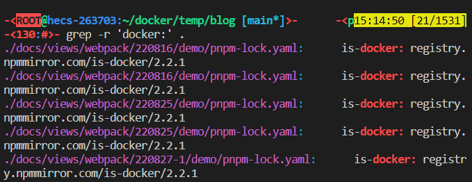

## 总结
- `grep <expression> <filename>`  
  - `-E`: 使用扩展正则表达式 `EREs` 
  - `-P`: 使用 `Perl` 正则表达式 `PCREs` 推荐使用 
  - `-r`: 递归搜索
  - `-v`: 反向匹配
- 在实际项目中，经常和 `|` 管道结合使用 `<command> | grep <expression>`

## 提问
- [x] 1. 如何匹配以 `HELLO` 开头并以 `WORLD` 结尾的行
    > `grep -P '^HELLO.*WORLD$' [FILE...]`
- [x] 2. 如何匹配以 `HELLO` 开头或以 `WORLD` 结尾的行
    > `grep -P '^HELLO|WORLD$' [FILE...]`


## 1. 前提提要、场景
之前的章节学习了通配符、扩展通配符。通配符和正则不是一个东西     
- 通配符：多用在文件名上，例如 `find`、`ls`、`cp`
- 正则：多用在文本内容匹配/过滤上，例如 `grep`、`less`、`vim` 中的搜索

而正则分为以下三种
1. 基本的正则表达式（`Basic RegEx` 简称 `BREs`）
2. 扩展的正则表达式（`Extended RegEx` 简称 `EREs`）
3. `Perl` 的正则表达式（`Perl Compatible Regular Expressions` 简称 `PCREs`），`JS` 的正则便是 `PCREs`，推荐使用这个，更符合我们平常的使用习惯。

> 至于这三种的区别，可以网上了解。     
> 总结：`PCREs` 更符合我们的日常使用，推荐使用 `PCREs`，前两者大部分是符号，例如数字在 `PCREs` 中为 `\d`，在其他两种中为 `[[:digit:]]` 或 `[0-9]`

`Linux` 三剑客（`grep`、`sed`、`awk`）之一。      
本次要介绍的 `grep` 命令，`Global Regular Expression (Processor | Parser | Printer)` 的简写，可以在命令行中使用正则表达式，对文本内容进行匹配筛选。

`grep` 默认为使用基本正则表达式 `BREs`
- `-E`: 使用扩展正则表达式 `EREs` 
- `-P`: 使用 `Perl` 正则表达式 `PCREs` 

`grep` 仅仅只是一个正则工具，功能实现的可能性取决于对正则的熟练度


## 2. 正则 匹配文本内容

命令：`grep <expression> <filename>`
```sh
$ grep vue package.json
```


在实际项目中，经常和 `|` 管道结合使用
```sh
# 过滤出带有 vue 的文件
$ ls -lah | grep vue
```


## 3. PCREs 更丰富的正则语法

命令：`grep -P PATTERN [FILE...]`

 `PCREs` ( `Perl Compatible Regular Expressions` ) 拥有更丰富的正则语法。    
 在 `Javascript/Python/Java` 中，正则表达式便是基于 `PCREs`，推荐这种正则，更符合我们平常的使用习惯。

使用以下命令使用 `PCREs`
```sh
# -P: 使用 PCRE 正则 
$ grep -P '\s"vue' package.json
```


## 4. grep -r 递归搜索

命令：`grep -r PATTERN [FILE...]`

```sh
# 在当前目录递归文件寻找 react
# -r / --recursive: 递归搜索
$ grep -r 'react' .
```





## 4. grep -v 反向匹配

命令：`grep -v PATTERN [FILE...]`

```sh
# 打印不包含 vue 字符的行
# -v / --invert-match: 反选匹配
$ grep -v vue package.json
```


