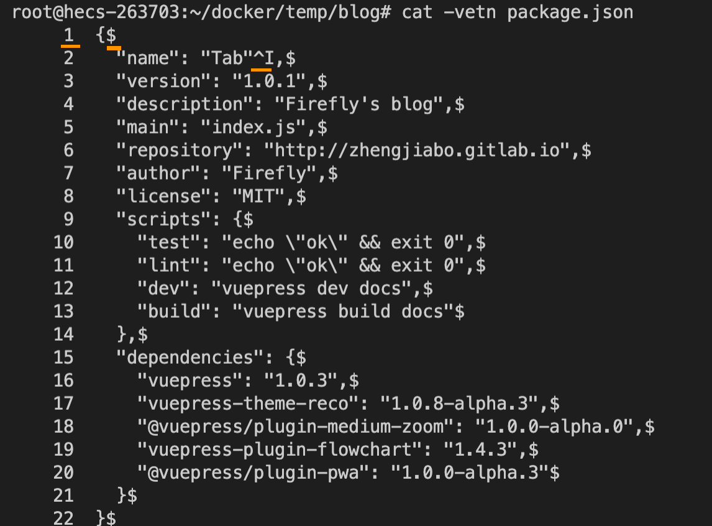

## 总结
- cat:
  - `-v`: 显示非打印字符，使其可见，例如 `<Ctrl-X>` 
  - `-e`: 打印 换行  LF `$`   CRLF `^M$` 表示
  - `-t`: 打印 TAB  `^I`表示
  - `-n`: 打印 行号
- 使用 `bat` 替代 `cat`，也可以查看非打印字符。
  - `-A / --show-all`: 显示非打印字符，包含换行符等
- 如果需要搜索内容：`less -N <filePath>`。
  - `-N`: 打印行号
- 查看文件前 N 行：`head -n <num> <filePath>`
- 查看文件后 N 行：`tail -n <num> <filePath>`
- 实时查看文件后 N 行：`tail -f -n <num> <filePath>`


## 提问
- [x] 1. 如何查看换行符是 \n 还是 \r\n，可参考 [ASCII](https://devtool.tech/ascii/13)
  > 它们都是换行，用于不同系统。   
  `\n`：即 `LF`，`0x0a` 用于 in Unix/Mac OS X     
  `\n\r`：即 `CRLF`，`0x0d 0x0a` 用于 Windows，`http` 请求      
  使用 `cat -e` 或 `bat -A` 都可以显示 

- [x] 2. cat 这个命令行的本义是什么
  > 打开文件，读取文件内容
- [x] 3. 如何输出文件的前十行/后十行内容
  > `head -10 <filePath>`    
  `tail -10 <filePath>`
- [x] 4. 如何实时输出日志的追加内容
  > `tail -f <filePath>`


<!-- ## 疑问
- [ ] 1. -->


## 1. 前提提要、场景
查看文件内容是很常见的操作，例如查看报错文档，校验配置是否正确。


## 2. cat 打印输出文件
`concatenate` 缩写，`concatenate and print files` 连接文件并打印至标准输出（stdout）。

```sh
# 也可以打印控制字符，比如 Tab、换行等不可见字符
# -v: 显示非打印字符，使其可见，例如 <Ctrl-X> 
# -e: 打印 换行  LF $   CRLF ^M$ 表示
# -t: 打印 TAB  ^I表示
# -n: 打印 行号
$ cat -vetn README.md

# 可连接多文件进行打印
$ cat package.json yarn.lock
```

实际图如下：



## 3. library：open/read 打开/读取文件
在读取文件内容时，在操作系统底层实际上做了两步操作：打开、读取。
- open：`open(<filePath>)`，并返回文件描述符(`file descriptor` 简写 `fd`)，一个非负整数，通过文件描述符可用来读写文件。[文档](https://www.man7.org/linux/man-pages/man2/open.2.html)
- read：`read(<fd>)`，通过 `fd` 读取文件内容。[文档](https://www.man7.org/linux/man-pages/man2/read.2.html)

这两个方法存在于库文件（Library）中，不是独立程序，是向其他程序提供服务的代码。       

`cat` 便是 `open` 和 `read` 的结合实现


> `Node.js` 中 `fs.readFile`，实际是 `fs.open` 与 `fs.read` 的结合。


## 4. bat（cat 命令的升级版）
`Rust` 编写的 `cat` 命令的升级版，需要手动安装，默认支持语法高亮，以及显示行号。


`--show-all/-A ` 显示不可打印字符。


而且配置了环境变量 `export MANPAGER="sh -c 'col -bx | bat -l man -p'"` 可以使得 `man` 文档更好看。

> `sh -c command_string`: 将命令文本视为命令执行


## 5. less（cat 更高级命令，可用 vim 操作上下移动和搜索）
```sh
# -N: 打印 行号
$ less -N README.md
```


## 6. head 前 N 行或前 N 个字节

```sh
# 输出文件前 10 行内容
$ head -10 README.md

# 与以上命令同义
# -n / --lines: 行数
$ head --lines 10 READEME.md

# 输出文件前 10 个字节
$ head -c 10 READEME.md
```


## 7. tail 后 N 行或后 N 个字节
与 `head` 对应
```sh
# 输出文件后 10 行内容
$ tail -10 README.md

# 与以上命令同义
# -n / --lines: 行数
$ tail --lines 10 READEME.md

# 输出文件前 10 个字节
$ tail -c 10 READEME.md
```
特殊：使用 `-f` / `--follow` 可以实时打印文件中最新内容，在调试日志时非常有用。
```sh
$ tail -f --lines 20 error.log
```

