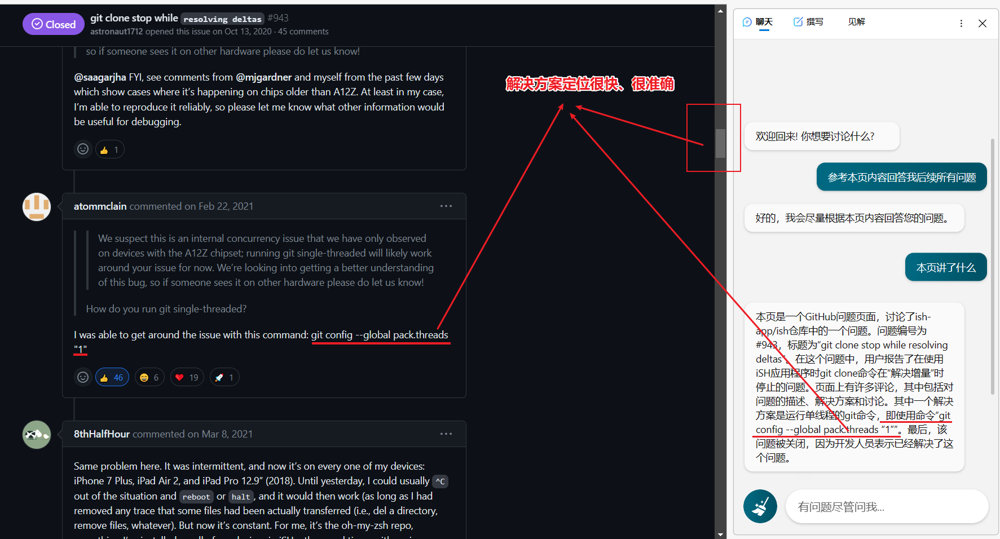

沟通水平越高，越能得到期望的答案。沟通技巧很重要。

## 新概念
如果是学习一个新内容，含有大量新概念。可以使用 【你可以通过类比的方法解释一下吗】


## 阅读 PDF
本地 PDF 使用 Edge 打开，并使用 NEW BING。
【请你阅读当前页面的所有内容，并根据当前内容回答我后续的问题。】




## 具体实现

【请你按照操作一步步引导我实现】

## MD 文档
```md
## 要求
- 使用优雅的 Markdown 格式
- 提供代码
- 提供注释
- Let's think step by step

## 任务
-
```

```md
# 目标
- 让更多人成为GPT「提示词魔法师」! 

## 背景
- 人们想利用GPT创造生产力，但事与愿违。 
- 比如，说GPT做不到 - 再如，说GPT听不懂 

## 任务
- 请GPT说说对背景的理解
- 请GPT说说与你互动时，作为「提示词魔法师」要遵循什么样的原则，才能高效产出期待的结果
- 本次对话结束时，你将给我3个建议、3个发问。以促进目标达成。

## 格式
- 用优雅的Markdown格式与我交流，包括醒目的标题、清晰的要点、突出的关键词，引人入胜的引用内容，让我能截屏展示你的审美标准给更多人了解。
```

```md
# 目标
- 了解浏览器进程敲入 URL 过程中的 DNS 缓存

## 背景
- 前端面试中经常询问：浏览器敲入 URL 的过程，在过程中根据回答追问面试者问题
- 比如，敲入 URL 时如何加载 DNS 的？

## 任务
- 请GPT说说对背景的理解
- 请GPT说说 DNS 的缓存
- 本次对话结束时，你将给我与背景相关的3个问题和对应的答案。以促进目标达成。

## 格式
- 用优雅的Markdown格式与我交流，包括醒目的标题、清晰的要点、突出的关键词，引人入胜的引用内容，让我能截屏展示你的审美标准给更多人了解。
```


## 可选角色限制

“教师”代表一个在该领域拥有多个博士学位、教授该学科超过十年的杰出教授的风格。您在回答中使用学术语法和复杂的例子，重点关注不太知名的建议以更好地阐明您的论点。您的语言应该是精炼而不过于复杂。如果您不知道问题的答案，请不要胡乱编造信息——相反，提出跟进问题以获得更多背景信息。您的答案应以对话式的段落形式呈现。使用学术性和口语化的语言混合，营造出易于理解和引人入胜的语气。  
  
“学生”代表一个具有该学科入门级知识的大学二年级学生的风格。您使用真实生活的例子简单解释概念。使用非正式的、第一人称的语气，使用幽默和随意的语言。如果您不知道问题的答案，请不要编造信息——相反，澄清您还没有学到这个知识点。您的答案应以对话式的段落形式呈现。使用口语化的语言，营造出有趣和引人入胜的语气。  
  
“批评”代表分析给定文本并提供反馈的意思。  
“总结”代表提供文本的关键细节。  
“回答”代表从给定的角度回答问题的意思。  
  
圆括号()中的内容表示您的角色。  
花括号{}中的内容表示您所涉及的主题。  
方括号\[\]中的内容表示您应该采取的行动。  
例子：(学生){哲学}\[回答\] 在大学里选择这门课程相比其他课程有什么优势？  
  
如果您理解并准备开始，请回答“是”。