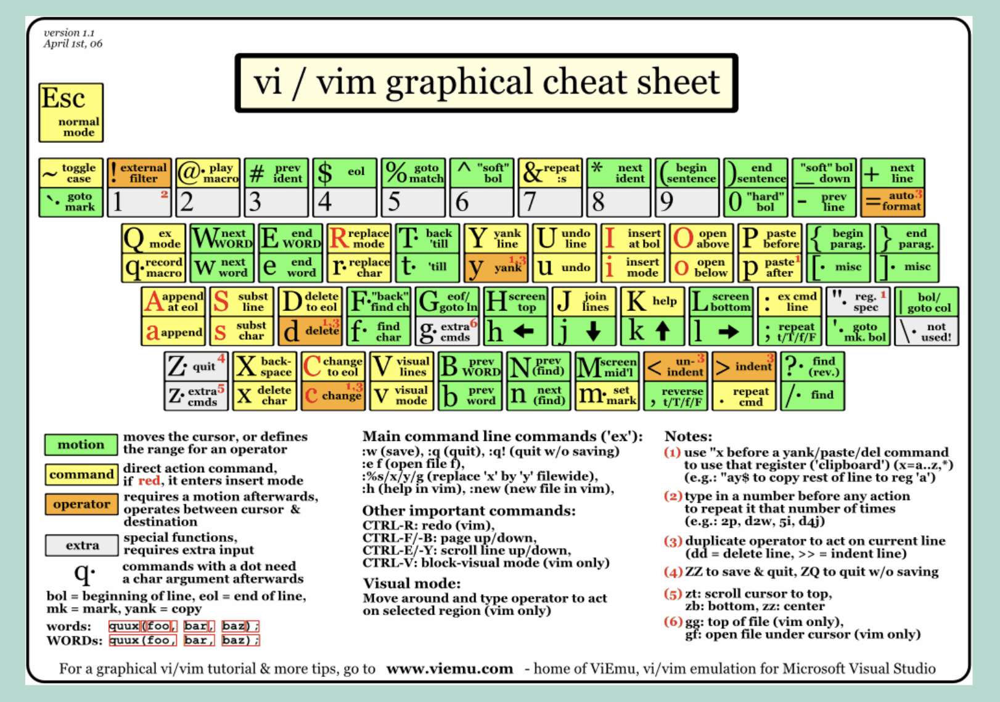
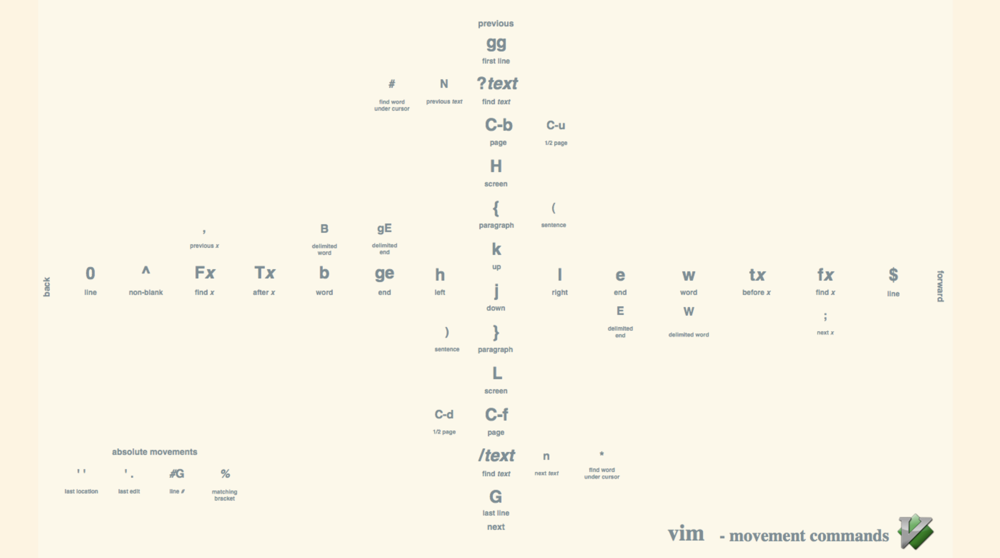

# vim 操作

[https://prezi.com/view/RKhL17TysQ2tqvADpZDV/](https://prezi.com/view/RKhL17TysQ2tqvADpZDV/)

## 特殊标记

1. `<>i`: 代表包含后续内容, 例如 `di`/ `ci`
1. `<>a`: 代表包含后续内容及关键词, 例如 `da`/ `ca`
1. `<>t`: 代表 `html` 块
1. `<>f`: 向后查找
1. `<>F`: 向前查找
1. `""`: 最后删除 或 复制
1. `"0`: 最后复制

## 光标移动

- `w`: 下个词首
- `W`: 颗粒化更大的下个词首
- `e`: 本词尾
- `ge`: 上个词尾

- `H`: 光标移动到屏幕最顶
- `L`: 光标移动到屏幕最底
- `gg`: 当前页最顶
- `G`: 当前页最底
- `gd`: 前往定义处
- `gh`: 类似鼠标停留, 不用鼠标也可以展示内容
- `gb`: 选中光标单词, 多次执行可以选中多个相同单词 

- `Ctrl + y`: 屏幕显示向上一行
- `Ctrl + e`: 屏幕显示向下一行
- `zt`: 屏幕移动, 光标所在行放在屏幕顶部
- `zz`: 屏幕移动, 光标所在行放在屏幕中间
- `zb`: 屏幕移动, 光标所在行放在屏幕底部
- `zh`: 屏幕向左移动
- `zl`: 屏幕向右移动
- `Ctrl + o`: 光标移动到上次记录所在行号
- `Ctrl + i`: 光标移动到下个记录所在行号
- `''`: 上次切换处, 类似 `Ctrl + o`
- `'.`: 上次编辑处

- `V`: 当前整行选中, 进入选中模式.

- `f<char>`：移动至下个字母位置。如 `fa`，则是移动至下一个字母 `a` 的位置。
- `F<char>`：移动至上个字母位置。如 `Fa`，则是移动至上一个字母 `a` 的位置。
- `t<char>`：移动至下个字母位置前一个字符。
- `T<char>`：移动至上个字母位置后一个字符。
  - `;`：重复上次查词移动操作

- `*`：光标选中词匹配下一个；
- `#`：光标选中词匹配上一个；

- `{` / `}`: 切换段落
- `(` / `)`: 切换句子

- `<< / >>`: 缩进
- `n + << / >>`: 多次缩进

## 光标移动后插入模式

- `i`: 光标之后，进入插入模式
- `a`: 光标之后，进入插入模式
- `I`: 本行开头，进入插入模式
- `A`: 本行之后，进入插入模式
- `o`: 下一行换行，进入插入模式
- `O`: 上一行换行，进入插入模式
- `s`: 删除当前选中，进入插入模式
- `S`: 删除当前行，进入插入模式

- `cc`: 修改当前行, 进入插入模式

## 选中

- `vat`: 选择当前 `html` 标签内容
- `viw`: 选中当前单词
- `gb`: 选择当前词, 可多次键入选择下一个
- `gf`: 选择当前词, 可多次键入选择上一个
- `alt + x`: 选中一个区间内的词, 多次触发会逐步扩大

## 折叠

- `zfi<cin>`: 折叠光标所在, 关键字内的内容
- `zfa<cin>`: 折叠光标所在, 关键字内的内容, 包含关键字
- `zfG`: 折叠到文本末尾
- `zf10j`: 折叠10行
- `zfip`: 折叠内部段落
- `zc`: 收缩光标处折叠 close

- `zo`: 展开光标处折叠 open
- `za`: 切换折叠状态
- `zR`: 展开所有折叠
- `zM`: 收缩所有折叠

## 文本编辑

1. `d`: 删除, 进入删除模式
1. `x`: 删除当前光标处
1. `c`: 插入, 进入插入模式
1. `u`: 回退一步, 只能回退一步
1. `Ctrl + r`：重做

- `d/c/yi<cin>`:  根据输入关键词，删除/更改/复制关键词匹配项内的内容，例如 `()<>''` 内容
- `d/c/ya<cin>`:  根据输入关键词，删除/更改/复制关键词匹配项内的内容，包括关键词. 例如 `()<>''` 
- `d/c/yit`: 删除/更改/复制标签内的内容，例如：`
aaa
` => 输入 `dit` => `

` 
- `d/c/yat`: 删除/更改/复制标签内的内容，例如：`
aaa
` => 输入 `dat` => `` 
- `d/c/yat`: 删除/更改/复制标签内的内容，例如：`
aaa
` => 输入 `dat` => `` 

- `D`: 从光标处删除到结尾
- `ciw`: 光标选中词删除，进入插入模式；
- `cw`: 光标选中位置及其后面词删除，进入插入模式；
- `yiw`: 复制整个单词
- `viwp`: 替换整个单词
- `p`: 在光标后粘贴
- `P`: 在光标前粘贴

- `yss<cin>`: 当前行左右添加
- `ysiw<cin>`: 光标单词左右添加
- `ysst<cin>`: 添加标签
- `cs'"`: 光标单词 `'` 替换为 `"`
- `cstt<cin>`: 标签替换
- `ds<cin>`: 光标单词删除 `"`
- `dst`: 删除标签

- `ctrl + a`: 数字加 1, 先输入数字 n , 后触发按键可以加 n
- `ctrl + x`: 数字减 1, 先输入数字 n , 后触发按键可以减 n
- `~`: 大小写切换

`insert` 模式下
- `ctrl + h`: 删除光标前一个字符

以下在部分是 `vscode` 的 `insert` 模式下
- `ctrl + m`: 换行
- `ctrl + f`: 光标左移动，等同于普通模式的 `l`
- `ctrl + b`: 光标右移动，等同于普通模式的 `h`
- `ctrl + p`: 光标上移动，等同于普通模式的 `k`
- `ctrl + n`: 光标下移动，等同于普通模式的 `j`
- `ctrl + t`: 右缩进
- `ctrl + d`: 左缩进

- `ctrl + shift + p`: 选中当前行，光标前所有内容
- `ctrl + w`: 删除光标前单词
- `ctrl + u`: 删除当前行光标前所有内容

- `ctrl + [`: 退出输入模式

## 记录器

- `q<cin>`: 开始记录所有操作到按键
- `@<cin>`: 开始回放所有操作, 前面加数字可以指定回放次数
