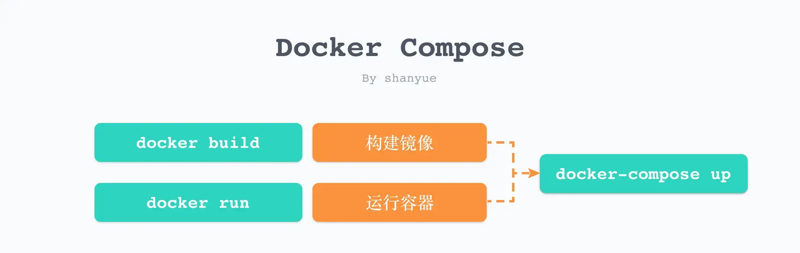

## 总结
1. 可以使用 `docker build` 对 Dockerfile 文件构造镜像， `docker run` 对镜像启动容器。
2. 上述方式在命令行中执行，不利于管理和存储，使用 `Docker Compose` 对 docker-compose.yaml 配置文件进行构建镜像和启动容器，更易于维护。也可以实现多个容器相互配合。     
3. 使用 `docker compose up` 学习时，偶尔会报错导致产生 None 镜像（虚无镜像），可以通过 ` docker image prune` 清理虚无镜像。
4. Dockerfile 的 EXPOSE，不是只有注释作用，在 docker run -P 自动映射时，会取 EXPOSE 暴露出来的端口，随机映射到宿主机的端口上。
5. docker 如果更换源，尽量不要用科大源。在 Tag `latest` 表现上不一致，拉取的版本可能会和 Hub Docker 不同。Hub Docker 目前 node 镜像的 latest 在 `18.7.0`，而更换了科大源：`https://docker.mirrors.ustc.edu.cn/`，latest 在 `17.3.0`。     
        
  可以使用 Docker 中国区官方镜像: `https://registry.docker-cn.com` 替代
6. Dockerfile 
   - ENV：    
    设置容器内的环境变量 `ENV <key>=<value>`     
    可以通过 `docker run --env <key>=<value>` 进行修改 
   - CMD：     
    `CMD command param1 param2` 在运行容器 `docker run` 时调用。传参将会替换 CMD 指令，即重写了 CMD 指令。
   - ENTRYPOINT：    
    `ENTRYPOINT command param1 param2` 在运行容器 `docker run` 时调用。传参将会拼接在 ENTRYPOINT 指令后面。
   - COPY：    
     将从构建上下文目录中 <源路径> 的文件/目录复制到新的一层的镜像内的 <目标路径> 位置。  

     <源路径> 可以是容器内的绝对路径，也可以是相对于工作目录的相对路径。源路径为文件夹，复制的时候不是直接复制该文件夹，而是将文件夹中的内容复制到目标路径。    

     <目标路径> 不需要事先创建，如果目录不存在会在复制文件前先行创建缺失目录。     

   - docker-entrypoint.sh：预处理脚本。
   - ENTRYPOINT + CMD 实现命令默认参数 或 接收 `docker run` 参数是一种非常流行并且有用的 dockerfile 编写方式。
  

7. linux中：
   - /usr/local/bin：手工安装的软件保存的路径，一般建议源码包软件安装在这个路径。输入 `echo $PATH` 可查询环境变量，本质是一个路径列表，其中就包括了该路径，执行指令时，会在路径列表中查找可执行程序。

   - 软连接：ln -s 原文件名 链接文件名    
   额外占用极小空间，理解为 window 的快捷方式。          
   如果文件被删除，由于指向的内容实际上是保存了一个绝对路径，原文件消失了，软链接也受到影响，无法找到文件。

   - 硬链接：ln 原文件名 链接文件名     
   不额外占用空间，理解为代码里的指针，指向文件区块。    
   如果文件被删除，由于硬链接文件直接指向内容区块，区块仍然有效，并且可以访问到，因此不受影响

## 1. 本地运行项目
上一章我们通过 `node:http` 启动了本地服务器，这次我们借助一个开源工具 `serve`，启动一个静态资源服务器。
```bash
# 下载 sever 依赖
npm i serve

# 通过 serve 启动服务
# 后续可以设置于 package.json 中，作为快速指令
npm serve .
```

```json
//  package.
{
  "scripts": {
    "start": "serve ."
  }
}
```
我们只要运行 `npm start` 即可启动服务。    
接下来，将脚本命令翻译成 Dockerfile，就可以在 Docker 中启动服务了。

## 2. Dockerfile
```dockerfile
# alpine 版本的体积小
FROM node:14-alpine

# 设置工作目录，后续RUN/CMD 都是在该工作目录中执行
WORKDIR /code

# 宿主机的代码添加到镜像中
ADD . /code

# 安装依赖 node镜像中，下载了 yarn 包
RUN yarn

# 暴露端口号
# EXPOSE，不是只有注释作用
# 在 docker run -P 自动映射时，会取 EXPOSE 暴露出来的端口，随机映射到宿主机的端口上。
EXPOSE 3000

# 启动 serve
CMD npm start
```


## 3. 构建镜像、运行容器
接下来构建镜像，并运行容器。     
```bash
# -t 镜像名称 name:tag
# . 获取当前目录下的 Dockerfile
# --progress plain: 查看其输出结果。

# git rev-parse --short HEAD: 列出当前仓库的 CommitId
# 也可将当前 Commit 作为镜像的 Tag
# 如果该前端项目使用 git tag 以及 package.json 中的 version 进行版本维护，也可将 version 作为生产环境镜像的 Tag
docker build -t node-demo:$(git rev-parse --short HEAD) --progress plain .
# 这里我就不添加 tag 了

# 构建成功后，可用该命令列出所有的镜像
# 发现该镜像占用体积 134MB
docker images
# REPOSITORY   TAG       IMAGE ID      CREATED          SIZE
# node-demo     latest    87ed5fa9f17f   35 seconds ago   134MB
# traefik      latest    ce745ce796fc   10 days ago      107MB
# nginx        alpine    e46bcc697531   10 days ago      23.5MB
# ubuntu       latest    27941809078c   7 weeks ago      77.8MB


# 运行容器
# 根据该镜像运行容器
# 如果需要在后台运行则添加 -d 选项
# --rm: 当容器停止运行时，自动删除容器
# -p: 3000:3000，将容器中的 3000 端口映射到宿主机的 3000 端口，左侧端口为宿主机端口，右侧为容器端口
# -it: 可进行交互
# --name: 指定容器名称
docker run --rm -p 3000:3000 -it --name node node-demo
```


## 4. Docker Compose
使用繁杂的命令构造镜像和运行容器，在管理端口，存储有天然劣势，将命令行的选项（例如-p）也翻译成配置文件，更易于维护。也可以实现多个容器相互配合。     
    
```yml
# docker-compose.yaml
version: "3"
services:
  node-demo:
    image: node-image # 有 build 的时候，image是镜像重命名
    # build: 从当前路径构建镜像，默认取Dockerfile
    build: .
    ports:
      - 3000:3000
      # - 3000 # 类似于 docker run -P 自动映射，这个 3000 指定的是 EXPOSE 暴露出来的端口，随机映射到宿主机的端口上。
    container_name: "node-demo" # 指定容器名称
    restart: always # 容器出错了 无限重启
```

```bash
# up: 创建并启动容器
# --build: 每次启动容器前构建镜像
docker compose up --build 
```

可惜的是 `docker compose up` 目前不支持 `--progress plain`，`docker compose build` 支持。


## 5. 扩展
### 5.1 如何找到官方 node 镜像的 Dockerfile
1. [Hub Docker 上找到 node 镜像](https://hub.docker.com/_/node?tab=description)，点击对应 tag 即可跳转到github 上的 Dockerfile文件

2. 使用 `docker history --no-trunc` 查询镜像创建历史的完整信息。
### 5.2 为什么可以直接在 node 镜像中使用 yarn 命令行工具
官方 node 镜像的 [Dockerfile](https://github.com/nodejs/docker-node/blob/6249a0b2a460b010c9ee216c8ab81ea8c698ab07/18/bullseye/Dockerfile) 文件中安装了 yarn

```dockerfile
FROM buildpack-deps:bullseye
# codes
ENV NODE_VERSION 18.7.0
# codes
ENV YARN_VERSION 1.22.19
RUN curl -fsSLO --compressed "https://yarnpkg.com/downloads/$YARN_VERSION/yarn-v$YARN_VERSION.tar.gz" \
  && curl -fsSLO --compressed "https://yarnpkg.com/downloads/$YARN_VERSION/yarn-v$YARN_VERSION.tar.gz.asc" \
  && tar -xzf yarn-v$YARN_VERSION.tar.gz -C /opt/ \
  && ln -s /opt/yarn-v$YARN_VERSION/bin/yarn /usr/local/bin/yarn \
  && ln -s /opt/yarn-v$YARN_VERSION/bin/yarnpkg /usr/local/bin/yarnpkg \curl -fsSLO --compressed "https://yarnpkg.com/downloads/$YARN_VERSION/yarn-v$YARN_VERSION.tar.gz.asc" \
# codes

COPY docker-entrypoint.sh /usr/local/bin/
ENTRYPOINT ["docker-entrypoint.sh"]

CMD [ "node" ]
```
原理：下载 yarn 包并解压，建立软连接在 `/usr/local/bin` 中，执行 `yarn` 指令时，会在该文件夹中查找可执行程序。后续还会把压缩包删除，并打印出 yarn 的版本。      

- Dockerfile 
  - ENV：    
    设置容器内的环境变量 `ENV <key>=<value>`     
    可以通过 `docker run --env <key>=<value>` 进行修改 
  - CMD：     
    `CMD command param1 param2` 在运行容器 `docker run` 时调用。传参将会替换 CMD 指令，即重写了 CMD 指令。
  - ENTRYPOINT：    
    `ENTRYPOINT command param1 param2` 在运行容器 `docker run` 时调用。传参将会拼接在 ENTRYPOINT 指令后面。
  - COPY：    
    将从构建上下文目录中 <源路径> 的文件/目录复制到新的一层的镜像内的 <目标路径> 位置。  

    <源路径> 可以是容器内的绝对路径，也可以是相对于工作目录的相对路径。源路径为文件夹，复制的时候不是直接复制该文件夹，而是将文件夹中的内容复制到目标路径。    

    <目标路径> 不需要事先创建，如果目录不存在会在复制文件前先行创建缺失目录。     

  - docker-entrypoint.sh：预处理脚本。
  - ENTRYPOINT + CMD 实现命令默认参数 或 接收 `docker run` 参数是一种非常流行并且有用的 dockerfile 编写方式
  


- /usr/local/bin：手工安装的软件保存的路径，一般建议源码包软件安装在这个路径。输入 `echo $PATH` 可查询环境变量，本质是一个路径列表，其中就包括了该路径，执行指令时，会在路径列表中查找可执行程序。      

- 软连接：
ln -s 原文件名 链接文件名    
额外占用极小空间，理解为 window 的快捷方式。          
如果文件被删除，由于指向的内容实际上是保存了一个绝对路径，原文件消失了，软链接也受到影响，无法找到文件。

- 硬链接：    
ln 原文件名 链接文件名     
不额外占用空间，理解为代码里的指针，指向文件区块。    
如果文件被删除，由于硬链接文件直接指向内容区块，区块仍然有效，并且可以访问到，因此不受影响


## 疑问
1. EXPOSE 作用，不暴露不可以吗。默认暴露80？
EXPOSE，可以不暴露，没有默认。通过 `docker inspect` 可查看容器内部映射信息。主要用于随机映射。    
不是只有注释作用，在 docker run -P 自动映射时，会取 EXPOSE 暴露出来的端口，随机映射到宿主机的端口上。      
在docker-compose.yaml中，只要配置
    ```yml
    ports:
        - 3000 # 类似于 docker run -P 自动映射，这个 3000 指定的是 EXPOSE 暴露出来的端口，随机映射到宿主机的端口上。
    ```

2. node 镜像 Dockerfile 中 [64行](https://github.com/nodejs/docker-node/blob/6249a0b2a460b010c9ee216c8ab81ea8c698ab07/18/bullseye/Dockerfile#L64)，为什么使用软连接 `ln -s /opt/yarn-v$YARN_VERSION/bin/yarn /usr/local/bin/yarn \ `     
不使用硬链接 或 COPY，硬连接不是不使用额外空间，更好吗。

3. node 镜像 Dockerfile 中[70行](https://github.com/nodejs/docker-node/blob/6249a0b2a460b010c9ee216c8ab81ea8c698ab07/18/bullseye/Dockerfile#L64)， `COPY docker-entrypoint.sh /usr/local/bin/ `     
我本机没有 `docker-entrypoint.sh`，是创建了个空的 sh 文件，存放到 /usr/local/bin/ 吗？ 如果是这样，就相当于有需求的时候，可以在工作目录配置 `docker-entrypoint.sh`，实现自定义。


4. 假如上面的问题结论成立，那在我自己构造个人镜像时，假如要使用预处理脚本。如以下代码。      
    ```dockerfile
    FROM node:alpine

    # codes
    ENTRYPOINT ["docker-entrypoint.sh"]

    ```
    问题：是不是 不能使用 `docker-entrypoint.sh` 作为预处理脚本的命名？     
    因为 `FROM` 的基础镜像中会第 1 次执行该脚本。             
    而我个人镜像中 `ENTRYPOINT ["docker-entrypoint.sh"]` 会第 2 次执行该脚本。即执行了两次。 

个人github：[**https://github.com/zhengjiabo**](https://github.com/zhengjiabo) 