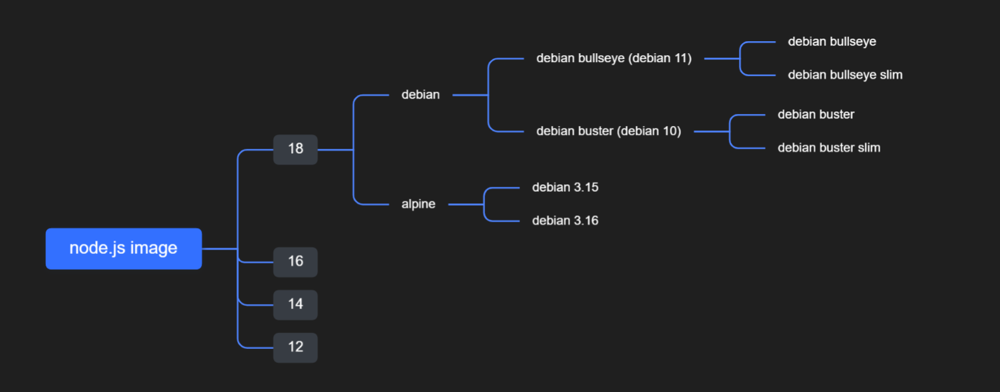

## 总结
1. 可以使用 `docker build` 对 Dockerfile 文件构造镜像， `docker run` 对镜像启动容器。
2. 上述方式在命令行中执行，不利于管理和存储，使用 `Docker Compose` 对 docker-compose.yaml 配置文件进行构建镜像和启动容器，更易于维护。也可以实现多个容器相互配合。     
3. 使用 `docker compose up` 学习时，偶尔会报错导致产生 None 镜像（虚无镜像），可以通过 ` docker image prune` 清理虚无镜像。
4. Dockerfile 的 EXPOSE，不是只有注释作用，在 docker run -P 自动映射时，会取 EXPOSE 暴露出来的端口，随机映射到宿主机的端口上。
5. docker 如果更换源，尽量不要用科大源。在 Tag `latest` 表现上不一致，拉取的版本可能会和 Hub Docker 不同。Hub Docker 目前 node 镜像的 latest 在 `18.7.0`，而更换了科大源：`https://docker.mirrors.ustc.edu.cn/`，latest 在 `17.3.0`。     
        
  可以使用 Docker 中国区官方镜像: `https://registry.docker-cn.com` 替代
6. Dockerfile 
   - ENV：    
    设置容器内的环境变量 `ENV <key>=<value>`     
    可以通过 `docker run --env <key>=<value>` 进行修改 
   - CMD：     
    `CMD command param1 param2` 在运行容器 `docker run` 时调用。传参将会覆盖 CMD 指令，即重写了 CMD 指令。
   - ENTRYPOINT：    
    `ENTRYPOINT command param1 param2` 在运行容器 `docker run` 时调用。
      - 优先级比 CMD 更高，如果 dockerfile 同时出现 ENTRYPOINT 和 CMD ，CMD 整个指令会作为参数附加在 ENTRYPOINT 指令后面，如果 docker run 命令带了参数，参数会覆盖掉 CMD 指令，最终也将附加在 ENTRYPOINT 指令后面。
      - FROM 基础镜像，ENTRYPOINT 和 CMD 会覆盖基础镜像内部对应的指令，后面会详细验证。
   - COPY：    
     将从构建上下文目录中 <源路径> 的文件/目录复制到新的一层的镜像内的 <目标路径> 位置。  

     <源路径> 可以是容器内的绝对路径，也可以是相对于工作目录的相对路径。源路径为文件夹，复制的时候不是直接复制该文件夹，而是将文件夹中的内容复制到目标路径。    

     <目标路径> 不需要事先创建，如果目录不存在会在复制文件前先行创建缺失目录。     

   - docker-entrypoint.sh：预处理脚本。
   - ENTRYPOINT + CMD 实现命令默认参数 或 接收 `docker run` 参数是一种非常流行并且有用的 dockerfile 编写方式。

   - EXPOSE 和 EVN 都是可以被覆盖，所以在启动容器时都可以传参例如 `-p` 、`--env <key>=<value>` 进行覆盖。 
  

7. linux中：
   - /usr/local/bin：手工安装的软件保存的路径，一般建议源码包软件安装在这个路径。输入 `echo $PATH` 可查询环境变量，本质是一个路径列表，其中就包括了该路径，执行指令时，会在路径列表中查找可执行程序。

  
   - 软连接：ln -s 原文件名 链接文件名   
   可指向文件、文件夹          
   额外占用极小空间，理解为 window 的快捷方式。inode 不一致，还可能有其扩展属性和额外的存储数据的空间等。                
   如果文件被删除，由于指向的内容实际上是保存了一个绝对路径，原文件消失了，软链接也受到影响，无法找到文件。

   - 硬链接：ln 原文件名 链接文件名     
   只能指向文件      
   也占用空间，但不需要额外的 inode，理解为代码里的指针，指向文件区块。inode 一致，且都指向同一个文件在硬盘中的区块。（[硬链接不需要额外存储数据和inode结构，但是需要额外存储目录项，这是硬链接需要的存储空间，甚至可以说硬链接就是额外的目录项不是一个额外的文件。而且在分配目录项时可能造成多种目录结构甚至全局结构的变化，也是需要使用更多空间的。](https://www.zhihu.com/question/66578656)）        
   如果文件被删除，由于硬链接文件直接指向内容区块，区块仍然有效，并且可以访问到，因此不受影响

## 1. 本地运行项目
上一章我们通过 `node:http` 启动了本地服务器，这次我们借助一个开源工具 `serve`，启动一个静态资源服务器。
```bash
# 下载 sever 依赖
npm i serve

# 通过 serve 启动服务
# 后续可以设置于 package.json 中，作为快速指令
npm serve .
```

```json
//  package.
{
  "scripts": {
    "start": "serve ."
  }
}
```
我们只要运行 `npm start` 即可启动服务。    
接下来，将脚本命令翻译成 Dockerfile，就可以在 Docker 中启动服务了。

## 2. Dockerfile
```dockerfile
# alpine 版本的体积小
FROM node:14-alpine

# 设置工作目录，后续RUN/CMD 都是在该工作目录中执行
WORKDIR /code

# 宿主机的代码添加到镜像中
ADD . /code

# 安装依赖 node镜像中，下载了 yarn 包
RUN yarn

# 暴露端口号
# EXPOSE，不是只有注释作用
# 在 docker run -P 自动映射时，会取 EXPOSE 暴露出来的端口，随机映射到宿主机的端口上。
EXPOSE 3000

# 启动 serve
CMD npm start
```


## 3. 构建镜像、运行容器
接下来构建镜像，并运行容器。     
```bash
# -t 镜像名称 name:tag
# . 获取当前目录下的 Dockerfile
# --progress plain: 查看其输出结果。

# git rev-parse --short HEAD: 列出当前仓库的 CommitId
# 也可将当前 Commit 作为镜像的 Tag
# 如果该前端项目使用 git tag 以及 package.json 中的 version 进行版本维护，也可将 version 作为生产环境镜像的 Tag
docker build -t node-demo:$(git rev-parse --short HEAD) --progress plain .
# 这里我就不添加 tag 了

# 构建成功后，可用该命令列出所有的镜像
# 发现该镜像占用体积 134MB
docker images
# REPOSITORY   TAG       IMAGE ID      CREATED          SIZE
# node-demo     latest    87ed5fa9f17f   35 seconds ago   134MB
# traefik      latest    ce745ce796fc   10 days ago      107MB
# nginx        alpine    e46bcc697531   10 days ago      23.5MB
# ubuntu       latest    27941809078c   7 weeks ago      77.8MB


# 运行容器
# 根据该镜像运行容器
# 如果需要在后台运行则添加 -d 选项
# --rm: 当容器停止运行时，自动删除容器
# -p: 3000:3000，将容器中的 3000 端口映射到宿主机的 3000 端口，左侧端口为宿主机端口，右侧为容器端口
# -it: 可进行交互
# --name: 指定容器名称
docker run --rm -p 3000:3000 -it --name node node-demo
```


## 4. Docker Compose
使用繁杂的命令构造镜像和运行容器，在管理端口，存储有天然劣势，将命令行的选项（例如-p）也翻译成配置文件，更易于维护。也可以实现多个容器相互配合。     
    
```yml
# docker-compose.yaml
version: "3" # 这代表我们定义的docker-compose.yml 文件内容所采用的版本，目前Docker Compose的配置文件已经迭代至了第三版，其所支持的功能也越来越丰富，所以我们建议使用最新的版本来定义。
services: # Docker Compose 里不直接体现容器这个概念，这是把 service 作为配置的最小单元。虽然我们看上去每个 service 里的配置内容就像是在配置容器，但其实 service 代表的是一个应用集群的配置
  node-demo:
    image: node-image # 有 build 的时候，image是镜像重命名
    # build: 从当前路径构建镜像，默认取Dockerfile
    build: .
    ports:
      - 3000:3000
      # - 3000 # 类似于 docker run -P 自动映射，这个 3000 指定的是 EXPOSE 暴露出来的端口，随机映射到宿主机的端口上。
    container_name: "node-demo" # 指定容器名称
    restart: always # 容器出错了 无限重启
```

```bash
# up: 创建并启动容器
# --build: 每次启动容器前构建镜像
docker compose up --build 
```

可惜的是 `docker compose up` 目前不支持 `--progress plain`，`docker compose build` 支持。


## 5. 扩展
### 5.1 如何找到官方 node 镜像的 Dockerfile
1. [Hub Docker 上找到 node 镜像](https://hub.docker.com/_/node?tab=description)，点击对应 tag 即可跳转到github 上的 Dockerfile文件。     
作者的预处理脚本 `docker-entrypoint.sh` 也可以在同目录下找到。      

2. 使用 `docker history --no-trunc` 查询镜像创建历史的完整信息。
### 5.2 为什么可以直接在 node 镜像中使用 yarn 命令行工具
官方 node 镜像的 [Dockerfile](https://github.com/nodejs/docker-node/blob/6249a0b2a460b010c9ee216c8ab81ea8c698ab07/18/bullseye/Dockerfile) 文件中安装了 yarn

```dockerfile
FROM buildpack-deps:bullseye
# codes
ENV NODE_VERSION 18.7.0
# codes
ENV YARN_VERSION 1.22.19
RUN curl -fsSLO --compressed "https://yarnpkg.com/downloads/$YARN_VERSION/yarn-v$YARN_VERSION.tar.gz" \
  && curl -fsSLO --compressed "https://yarnpkg.com/downloads/$YARN_VERSION/yarn-v$YARN_VERSION.tar.gz.asc" \
  && tar -xzf yarn-v$YARN_VERSION.tar.gz -C /opt/ \
  && ln -s /opt/yarn-v$YARN_VERSION/bin/yarn /usr/local/bin/yarn \
  && ln -s /opt/yarn-v$YARN_VERSION/bin/yarnpkg /usr/local/bin/yarnpkg \curl -fsSLO --compressed "https://yarnpkg.com/downloads/$YARN_VERSION/yarn-v$YARN_VERSION.tar.gz.asc" \
# codes

COPY docker-entrypoint.sh /usr/local/bin/
ENTRYPOINT ["docker-entrypoint.sh"]

CMD [ "node" ]
```
原理：下载 yarn 包并解压，建立软连接在 `/usr/local/bin` 中，执行 `yarn` 指令时，会在该文件夹中查找可执行程序。后续还会把压缩包删除，并打印出 yarn 的版本。      

- Dockerfile 
  - ENV：    
    设置容器内的环境变量 `ENV <key>=<value>`     
    可以通过 `docker run --env <key>=<value>` 进行修改 
  - CMD：     
    `CMD command param1 param2` 在运行容器 `docker run` 时调用。传参将会覆盖 CMD 指令，即重写了 CMD 指令。
  - ENTRYPOINT：    
    `ENTRYPOINT command param1 param2` 在运行容器 `docker run` 时调用。
    - 优先级比 CMD 更高，如果 dockerfile 同时出现 ENTRYPOINT 和 CMD ，CMD 整个指令会作为参数附加在 ENTRYPOINT 指令后面，如果 docker run 命令带了参数，参数会覆盖掉 CMD 指令，最终也将附加在 ENTRYPOINT 指令后面。
    - FROM 基础镜像，ENTRYPOINT 和 CMD 会覆盖基础镜像内部对应的指令，后面会详细验证。
  - COPY：    
    将从构建上下文目录中 <源路径> 的文件/目录复制到新的一层的镜像内的 <目标路径> 位置。  

    <源路径> 可以是容器内的绝对路径，也可以是相对于工作目录的相对路径。源路径为文件夹，复制的时候不是直接复制该文件夹，而是将文件夹中的内容复制到目标路径。    

    <目标路径> 不需要事先创建，如果目录不存在会在复制文件前先行创建缺失目录。     

  - docker-entrypoint.sh：预处理脚本。
  - ENTRYPOINT + CMD 实现命令默认参数 或 接收 `docker run` 参数是一种非常流行并且有用的 dockerfile 编写方式
  


- /usr/local/bin：手工安装的软件保存的路径，一般建议源码包软件安装在这个路径。输入 `echo $PATH` 可查询环境变量，本质是一个路径列表，其中就包括了该路径，执行指令时，会在路径列表中查找可执行程序。      

- 软连接：
ln -s 原文件名 链接文件名    
额外占用极小空间，理解为 window 的快捷方式。          
如果文件被删除，由于指向的内容实际上是保存了一个绝对路径，原文件消失了，软链接也受到影响，无法找到文件。

- 硬链接：    
ln 原文件名 链接文件名     
不额外占用空间，理解为代码里的指针，指向文件区块。    
如果文件被删除，由于硬链接文件直接指向内容区块，区块仍然有效，并且可以访问到，因此不受影响


### 5.3 CMD/ENTRYPOINT 与 镜像内部对应指令的关系
结论：FROM 基础镜像，ENTRYPOINT 和 CMD 会覆盖基础镜像内部对应的指令。  

1. 构建基础镜像      
    基础镜像代码：       
    base-docker-entrypoint.sh：基础镜像-预处理脚本
    ```powershell
    #!/bin/sh
    echo "*****************"
    echo "**************"
    echo "***********"
    echo "run in base"

    $@
    # exec "$@"

    echo "run in base"
    echo "***********"
    echo "**************"
    echo "*****************"
    ```

    base-Dockerfile：基础镜像-dockerfile
    ```dockerfile
    FROM alpine:3.16

    COPY base-docker-entrypoint.sh /usr/local/bin/
    ENTRYPOINT ["base-docker-entrypoint.sh"]

    CMD ["ls"]
    ```

    执行 `docker image prune -f && docker build -t demo:base --progress plain -f base-Dockerfile . && docker run --rm -it demo:base`      
    构建基础镜像并运行容器，镜像名为 `demo:base`。运行容器时，输出如下       
           
    dockerfile 同时出现 ENTRYPOINT 和 CMD ，CMD 整个指令会作为参数附加在 ENTRYPOINT 指令后面，在基础镜像的预处理脚本通过 `$@` 接受参数。所以在两个打印组中间执行了 `ls`，出现了以上结果。基础镜像构建完毕（运行容器只是为了验证基础镜像配置是否正常，docker run 可以不要）

    个人镜像-预处理脚本        
    docker-entrypoint.sh：个人镜像-预处理脚本
    ```powershell
    #!/bin/sh
    echo "*****************"
    echo "**************"
    echo "***********"
    echo "run in custom"

    $@
    # exec "$@"

    echo "run in custom"
    echo "***********"
    echo "**************"
    echo "*****************"
    ```
    
2. 验证
- 验证一：如果个人镜像没有 CMD 和 ENTRYPOINT，是否使用基础镜像的。      
    Dockerfile：个人镜像-dockerfile
    ```dockerfile
    FROM demo:base
    ```
    执行 `docker image prune -f && docker build -t demo:custom --progress plain . && docker run --rm -it demo:custom`      
    结果如下：     
           
    结论：使用了基础镜像的 CMD 和 ENTRYPOINT

- 验证二：如果个人镜像有 CMD 和 ENTRYPOINT，能否和基础镜像内部的指令一起生效。      
    Dockerfile：个人镜像-dockerfile
    ```dockerfile
    FROM demo:base

    COPY docker-entrypoint.sh /usr/local/bin/
    ENTRYPOINT ["docker-entrypoint.sh"]

    CMD ["ls", "-1"]
    ```
    执行 `docker image prune -f && docker build -t demo:custom --progress plain . && docker run --rm -it demo:custom`      
    结果如下：     
           
    结论：ENTRYPOINT 和 CMD 会覆盖基础镜像内部对应的指令。  

- 验证三：如果个人镜像只有 CMD，CMD 整个指令会作为参数附加在基础镜像的 ENTRYPOINT 指令后面吗？      
    Dockerfile：个人镜像-dockerfile
    ```dockerfile
    FROM demo:base

    CMD ["ls", "-1"]
    ```
    执行 `docker image prune -f && docker build -t demo:custom --progress plain . && docker run --rm -it demo:custom`      
    结果如下：     
           
    结论：如果个人镜像只有 CMD，CMD 整个指令会作为参数附加在基础镜像的 ENTRYPOINT 指令后面       

- 总结：FROM 基础镜像，ENTRYPOINT 和 CMD 会覆盖基础镜像内部对应的指令。覆盖后，如果同时出现 ENTRYPOINT 和 CMD ，CMD 整个指令会作为参数附加在 ENTRYPOINT 指令后面，如果 docker run 命令带了参数，参数会覆盖掉 CMD 指令，最终也将附加在 ENTRYPOINT 指令后面。     


### 5.4 docker-entrypoint.sh
[以 node 18 bullseye 的 docker-entrypoint.sh 为例](https://github.com/nodejs/docker-node/blob/main/18/bullseye/docker-entrypoint.sh)        
```bash
#!/bin/sh
set -e

# Run command with node if the first argument contains a "-" or is not a system command. The last
# part inside the "{}" is a workaround for the following bug in ash/dash:
# https://bugs.debian.org/cgi-bin/bugreport.cgi?bug=874264
if [ "${1#-}" != "${1}" ] || [ -z "$(command -v "${1}")" ] || { [ -f "${1}" ] && ! [ -x "${1}" ]; }; then
  set -- node "$@"
fi

exec "$@"
```

- shebang：指定脚本执行的解释器的绝对路径             
  ```bash
  # 使用 sh 执行脚本
  #!/bin/sh

  # 使用 python 执行脚本
  #!/usr/bin/python
  ```
  

- set -e：当命令发生异常时立即退出     
  可以将以下文件存为 demo.sh，使用 `bash demo.sh` 测试          
  ```bash
  # 当有该行时，直接报错退出
  # 当无该行时，最终会输出 done
  set -e

  cat notexistfile

  echo done
  ```


- if 判断语句，以 fi 结尾
  ```bash
  if [[ -z $USER ]]; then echo ok; fi
  ```
  
  ```bash
  if [ "${1#-}" != "${1}" ] || [ -z "$(command -v "${1}")" ] || { [ -f "${1}" ] && ! [ -x "${1}" ]; }; then
  set -- node "$@"
  fi
  ```
  - [ ]：布尔判断      
  - $1、$2、$3…: 接收参数，而 $0 在 zsh 中指函数名，在 bash 中指脚本名称。     
    - $#: 参数数量
    - $*: 所有参数
    - $@: 所有参数 
    - 如果 $0、$1、$@ 出现在全局，则表明他们是命令行的参数。
  - ${1#-}： $1展开后前面以--开始，把它换成-。
  不较常见的 Parameter Expansion，常见的也就 ${NODE_ENV:=development} [文档：Shell Parameter Expansion](https://www.gnu.org/software/bash/manual/bash.html#Shell-Parameter-Expansion)
  - ${var#word}：可以理解为：如果变量 $var 以 word 开头，则 ${var#word} 的值为 $var 删掉 word，否则为 $var。简单点来说，就是 Remove prefix。      
      ```bash
      $ var=helloworld

      $ echo ${var#hello}
      world

      $ echo ${var#world}
      helloworld

      $ echo ${var#ok}
      helloworld
      ```
  - 所以 `"${1#-}" != "${1}"` 的意思是：判断 $1 是否以 - 开头。
     ```bash
      # 等同以下二选一
      $ var=--version

      $ [[ ${var:0:1} == "-" ]] && echo ok
      ok

      $ [[ $var =~ ^- ]] && echo ok
      ok
      ```
  - `command -v <command>`：用以执行命令，及列出全局命令路径，`which` 也可以。
    二者最重要的一个不同点是，当某个命令不存在时，command -v 不会输出任何字符，用此常来判断某个命令是否存在。
    ```bash
      # 当我们执行 ps 时，实际上执行的是 /usr/bin/ps
      $ which ps
      /usr/bin/ps

      # 当我们执行 node 时，实际上执行的是 /usr/local/bin/node
      $ which node
      /usr/local/bin/node

      # 直接执行 node
      $ command node

      # 打印出 node 的真实执行路径
      $ command -v node
      /usr/local/bin/node

      # 区别
      $ which hello
      /usr/bin/which: no hello in (/home/train/.autojump/bin:/usr/local/bin:/usr/bin:/usr/local/sbin:/usr/sbin:/home/train/bin)

      # 无任何输出
      $ command -v hello
    ``` 

  - `[[ -z STRING]]`：判断 STRING 是否为空字符串。

  - `{[ -f "${1}" ] && ! [ -x "${1}"];}`：前边是判断 $1 是否是一个文件，而后边是判断 $1 是否是一个可执行的文件。因此该条件就是说判断 $1 是否是当前目录一个文件但不可执行。     
  其目的是在 Dockerfile 中可直接写 CMD ["index.js"]，如以下示例
    ```yaml
      FROM node:14-alpine

      ADD server.js /

      CMD ["server.js"]
    ```
    该命令使用 {} 包裹，且最后有一个分号 [how to nest conditional script operators -a -o in an if statement in bash](https://unix.stackexchange.com/questions/670519/how-to-nest-conditional-script-operators-a-o-in-an-if-statement-in-bash)     
    {} 使得指令是以分组的形式执行内部 && 左右的指令，但不会使变量产生类似作用域块的区域。
  - set --：用以重置命令行 $1 $2 $3 等参数     
    ```bash
      $ set -- a b c d

      $ echo $1 $2 $3 $4
      a b c d

      $ echo "$@"
      a b c d

      $ set -- node "$@" # 最前边添加一个 node 参数

      $ echo "$@"
      node a b c d
    ```
  - exec：执行某条命令，但会退出当前 shell。


在文本时有区别  [$* 与 $@ 具体区别](https://wiki.bash-hackers.org/scripting/posparams#handling_positional_parameters)      
- `"$*" => "$1c$2c$3c…c${N}"`
- `"$@" =>	"$1" "$2" "$3" … "${N}"`     


总结：`docker-entrypoint.sh`
```bash
# shebang：使用 sh 执行脚本
#!/bin/sh

# 当命令发生异常时立即退出 
set -e

# 如果 $1 以 - 开头(无论 -- 还是 -)
if [ "${1#-}" != "${1}" ] ||
  # 或者不是一个可执行命令
  [ -z "$(command -v "${1}")" ] ||
  # 或者是当前目录的一个文件，但不可执行
  { [ -f "${1}" ] && ! [ -x "${1}" ]; };
then
  # 则在前边附一个 node 
  set -- node "$@"
fi

# 执行执行代码
exec "$@"
```
1. 如果 - 开头，则作为 node 的参数执行
2. 如果判断 $1 是文件且不可执行，则使用 node 运行该文件
3. 如果判断 $1 是系统命令，则直接执行该命令

## 疑问
- [x] EXPOSE 作用，不暴露不可以吗。默认暴露80？        
EXPOSE，可以不暴露，没有默认。         
通过 `docker inspect` 可查看容器内部映射信息。主要用于随机映射。    
EXPOSE 不是只有注释作用，在 docker run -P 自动映射时，会取 EXPOSE 暴露出来的端口，随机映射到宿主机的端口上。      
在docker-compose.yaml中，只要配置
    ```yml
    ports:
        - 3000 # 类似于 docker run -P 自动映射，这个 3000 指定的是 EXPOSE 暴露出来的端口，随机映射到宿主机的端口上。
    ```
但 EXPOSE 和 EVN 都是可以被覆盖，所以在启动容器时都可以传参例如 `-p` 、`--env <key>=<value>` 进行覆盖。    

- [x] node 镜像 Dockerfile 中 [64行](https://github.com/nodejs/docker-node/blob/6249a0b2a460b010c9ee216c8ab81ea8c698ab07/18/bullseye/Dockerfile#L64)，为什么使用软连接 `ln -s /opt/yarn-v$YARN_VERSION/bin/yarn /usr/local/bin/yarn \ `  不使用硬链接 或 COPY，硬连接不是不使用额外空间，更好吗？         
COPY 相当于副本，占用太大空间。         
硬连接也使用额外的命名空间，也是占空间的。        
软连接可以指定文件夹，而硬连接只能指定文件。一般都是使用软连接。`ls -lah /usr/local/bin` 都是使用软连接。

- [x] node 镜像 Dockerfile 中[70行](https://github.com/nodejs/docker-node/blob/6249a0b2a460b010c9ee216c8ab81ea8c698ab07/18/bullseye/Dockerfile#L64)， `COPY docker-entrypoint.sh /usr/local/bin/ `     
我本机没有 `docker-entrypoint.sh`，是创建了个空的 sh 文件，存放到 /usr/local/bin/ 吗？ 如果是这样，就相当于有需求的时候，可以在工作目录配置 `docker-entrypoint.sh`，实现自定义。   

  如果是个人镜像里写 COPY，本地路径没有 `docker-entrypoint.sh`，构建时执行到 COPY 会报错。    
  有这个疑问，还是对 FROM 理解有问题，解答如下题。

- [x] 假如上面的问题结论成立，那在我自己构造个人镜像时，假如要使用预处理脚本。如以下代码。      
    ```dockerfile
    FROM node:alpine

    # codes
    ENTRYPOINT ["docker-entrypoint.sh"]

    ```
    问题：是不是 不能使用 `docker-entrypoint.sh` 作为预处理脚本的命名？     
    因为 `FROM` 的基础镜像中会第 1 次执行该脚本。             
    而我个人镜像中 `ENTRYPOINT ["docker-entrypoint.sh"]` 会第 2 次执行该脚本。即执行了两次？ 

    结论：可以用 docker-entrypoint.sh 命名，不会执行两遍。      
    个人镜像的 ENTRYPOINT 和 CMD，会把基础镜像对应指令覆盖，验证过程在文章中已补充。。      
    FROM： 指定基础镜像（已有镜像），一般使用 hub docker 的镜像，由 docker pull 拉取，在作者那边已经构建好了，作者在构建时 COPY 的是作者的 docker-entrypoint.sh 预处理脚本，自然执行的也是作者的预处理脚本。      
    我们个人镜像，只是基于基础镜像再进行封装，在个人镜像中      
    `COPY docker-entrypoint.sh /usr/local/bin/  `     
    `ENTRYPOINT ["docker-entrypoint.sh"]`        
    添加的才是我们工作目录的 docker-entrypoint.sh 预处理脚本

## 提问
- [x] 除了 ENTRYPOINT 和 CMD，还有哪些指令是容器启动时执行的？      
  EXPOSE、ENV

- [x] nodejs 官方镜像的 docker-entrypoint.sh 入口文件 做了什么？        
  在文中补充了

- [x] Node镜像有多少版本，每个版本分别是做什么的？
  - alpine3.16：Alpine Linux 最新版本
  - alpine3.15：Alpine Linux 上一版本
  - bullseye：Debian 最新版
  - bullseye-slim：Debian 瘦身版
  - buster：Debian 上一版本
  - buster-slim：Debian 上一版本瘦身版
      
  继续深入，可以看看 `node:bullseye` 镜像的依赖。根据他们的 [`FROM`](https://github.com/nodejs/docker-node/blob/main/18/bullseye/Dockerfile) 一层一层找。        
    1. node:bullseye(18, latest)
    2. buildpack-deps:bullseye
    3. buildpack-deps:bullseye-scm
    4. buildpack-deps:bullseye-curl
    5. debian:bullseye
    6. scratch
    就像Object.prototype.__proto__是JS中一切对象的根对象，scratch就是一切镜像的根镜像，也是空白镜像。

- [x] 官方推荐的基础镜像       
- [Alpine 镜像介绍](https://yeasy.gitbook.io/docker_practice/os/alpine)
- [Debian 镜像介绍](https://yeasy.gitbook.io/docker_practice/os/debian)


个人github：[**https://github.com/zhengjiabo**](https://github.com/zhengjiabo) 