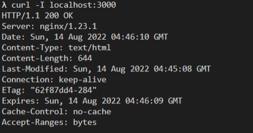
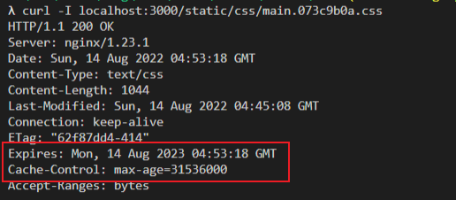

 

在 Docker 中使用构建缓存与多阶段构建进行优化，解决完服务端的部署速度和占用空间问题后，还需要解决客户端的缓存问题。

## 总结
1. 单页应用路由有两种模式，hash 和 histroy。      
   hash：hash 后面的内容不会发送给服务器       
   history（HTML5 模式）：点击路由跳转时，使用 `pushState` 改变历史记录和地址栏，不会向后台发送请求。如果是刷新，会向服务器发送请求。      

2. 为了能正确返回资源，单页应用的将所有页面路由均设置为访问根目录 `/index.html`。          
   配置 `try_files  $uri $uri/ /index.html;` Rewrite 的应用

3. 带有 hash 的资源可设置长期缓存，非 hash 则设置协商缓存。     
   如果资源内容发生变更，通过 `webpack` 打包设置生成全新的 hash 值，即全新路径，老的路径即使被长期缓存也不会再去访问，不影响客户端加载新资源。         


## 1. 单页面应用路由
假设现在有两个路由 `/` 和 `/about`，但由于是单页面应用，并没有对应的 `/about.html` 资源，请求该资源时会得到响应 404 Not Found。在单页应用中，主入口一般为 `index.html`，`/about` 是由前端通过 `history API` 进行控制。      

解决方法：在服务端将所有页面路由均指向 `index.html`，而单页应用再通过 `history API` 控制当前路由显示哪个页面。 这也是静态资源服务器的重写(Rewrite)功能。


## 2. 单页面应用路由

```nginx
location / {
    # 如果资源不存在，则最终回退到 index.html
    try_files  $uri $uri/ /index.html;  
}
```


## 3. 长期缓存 (Long Term Cache)
一般项目的静态资源都会单独抽离，由 `webpack` 构建产生，存在类似于 `./build/static` 目录，资源路径将会带有 `hash` 值。     
```bash
$ tree ./build/static
./build/static
├── css
│   ├── main.073c9b0a.css
│   └── main.073c9b0a.css.map
├── js
│   ├── 787.cf6a8955.chunk.js
│   ├── 787.cf6a8955.chunk.js.map
│   ├── main.a3facdf8.js
│   ├── main.a3facdf8.js.LICENSE.txt
│   └── main.a3facdf8.js.map
└── media
    └── logo.6ce24c58023cc2f8fd88fe9d219db6c6.svg

3 directories, 8 files
```

带有 hash 的资源可设置长期缓存: 如果资源的内容发生变更，将会生成全新的 hash 值，即全新的资源路径。旧有资源将不会被访问到。      

配置 `expires` 可以设置一年的长期缓存，它实际上是配置了 `Cache-Control: max-age=31536000` 的响应头
```nginx
location /static {
    expires 1y;
}
```


## 4. nginx 配置文件
缓存策略如下:
1. 带有 hash 的资源一年长期缓存
2. 非带 hash 的资源，需要配置 Cache-Control: no-cache，避免浏览器默认为强缓存 或 启发式缓存。

     

```nginx
server {
    listen       80;
    server_name  localhost;

    root   /usr/share/nginx/html;
    index  index.html index.htm;

    location / {
        # 解决单页应用服务端路由的问题
        try_files  $uri $uri/ /index.html;  

        # 非带 hash 的资源，需要配置 Cache-Control: no-cache，避免浏览器默认为强缓存 或 启发式缓存。
        expires -1;
    }

    location /static {
        # 带 hash 的资源，需要配置长期缓存
        expires 1y;
    }
}

```


### 4.1 设置 gzip
```nginx
server {
    listen       80;
    server_name  localhost;

    root   /usr/share/nginx/html;
    index  index.html index.htm;

    # 开启 gzip 
    gzip on;

    # 以下可选
    # gzip http 版本
    gzip_http_version 1.0;
    
    # gzip 压缩等级 压缩等级1-9
    gzip_comp_level 5;

    # 最小压缩临界值(默认的是20字节) 
    gzip_min_length 20;

    # 设置用于处理请求压缩的缓冲区 数量 和 大小  16 * 8 k
    gzip_buffers 16 8k;
    
    # 压缩文件类型 
    gzip_types
      application/javascript 
      application/json
      image/svg+xml
      image/x-icon 
      text/css 
      text/plain
      text/javascript; #（无论是否指定）"text/html"类型总是会被压缩的

    location / {
      # ...
    }

    # ...
}
   
```


### 4.2 设置 brotli
[详见之前笔记]（./blog/views/docker/220802.html#_5-6-开启-brotli)      
可以将 brotli 配置好后单独封装成一个镜像，后续项目需要开启 brotli，只要 `FROM` 该镜像即可。


## 5. Docker 配置文件
配置 Dockerfile 需要将 nginx.conf 置于镜像中

```dockerfile
# router.Dockerfile
FROM node:14-alpine as builder

WORKDIR /code

# 单独分离 package.json，是为了 yarn 可最大限度利用缓存
ADD package.json yarn.lock /code/
RUN yarn

# 单独分离 public/src，是为了避免 ADD . /code 时，因为 README.md/nginx.conf 的更改避免缓存生效
# 也是为了 npm run build 可最大限度利用缓存
ADD public /code/public
ADD src /code/src
RUN npm run build

# 选择更小体积的基础镜像
FROM nginx:alpine
ADD nginx.conf /etc/nginx/conf.d/default.conf
COPY --from=builder code/build /usr/share/nginx/html

```


配置 docker-compose.yaml
```yml
version: "3"
services:
  route:
    build:
      context: .
      dockerfile: router.Dockerfile
    ports:
      - 3000:80
```
使用 `docker-compose up --build route` 构造镜像且启动容器


## 6. 检验
### 6.1 单页面应用正常访问
- 访问 <http://localhost:3000> 页面成功。
  
- 访问 <http://localhost:3000/about> 页面成功。
  

### 6.2 缓存策略成功设置
- 带有 hash 资源，Cache-Control: max-age=31536000 响应头已配置。
  
- 非带 hash 资源，Cache-Control: no-cache 响应头已配置。


## 疑问


## 遗留
以下都是 webpack 相关
- [ ] 使用 terser 压缩 Javascript 资源
- [ ] 使用 cssnano 压缩 CSS 资源
- [ ] 使用 sharp/CDN 压缩 Image 资源或转化为 Webp
- [ ] 使用 webpack 将小图片转化为 DataURI
- [ ] 使用 webpack 进行更精细的分包，避免一行代码的改动使大量文件的缓存失效

## 提问
- [x] 为什么带有 hash 值的资源可设置为长期缓存       
   答：如果资源内容发生变更，通过 `webpack` 打包设置生成全新的 hash 值，即全新路径，老的路径即使被长期缓存也不会再去访问，不影响客户端加载新资源。
- [x] 挂载 nginx 配置，解决其路由及缓存问题      
   答：    
   1. 路由问题：在路由 `location /` 通过 `try_files` 将所有页面路由均设置为访问根目录 `/index.html`。     
   2. 缓存问题：对于带有 hash 值资源，设置强缓存 1 年 `expires 1y;`，对于非带 hash 值资源，设置策略缓存 `expires -1;`
- [x] 配置 gzip/brotli      
   答：文中补充


个人github：[**https://github.com/zhengjiabo**](https://github.com/zhengjiabo) 