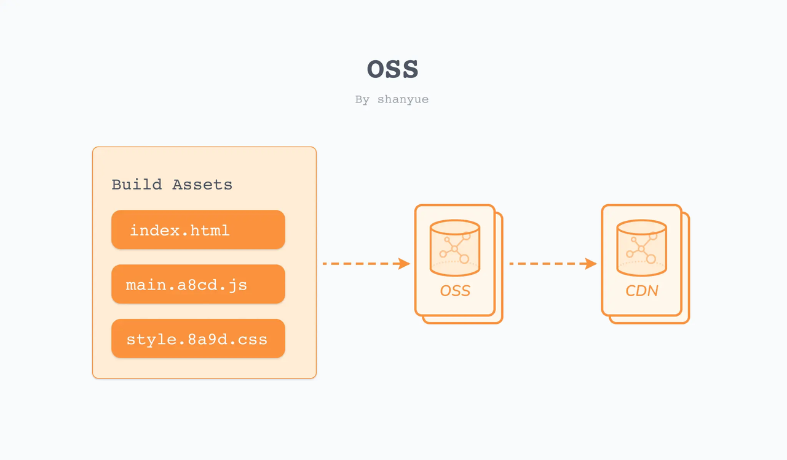

 

## 总结
1.  


## 1. OSS 云存储服务是什么
OSS(Object Storage) 云存储服务，提供海量、安全、低成本、高可靠的云存储服务。       
- 海量：单个数据的大小从 1 字节到 48.8 PB 可以存储的数据个数无限容量和处理能力弹性扩展。 
- 安全：OSS 时支持 SSL 加密，数据存储时支持 OSS 托管加密盒 KMS 托管加密，可有效防止数据被非法截获。还支持 ACL 防盗链等鉴权和授权机制，实现用户级别资源隔离。 
- 低成本：标准存储、低频访问、归档存储、冷归档存储。价格以访问频率依次降低。支持生命周期管理，对符合条件的特定数据自动删除或转换成更低成本的低铁访问归档或冷归档存储类型   
- 高可靠：通过同城冗余存储将每个对象冗余存储在同一个地域的三个可用区中，或跨区域复制功能将数据复制到其他地域，确保硬件失效时的数据可靠性和可用性      


目的：将静态资源上传至 OSS，并对 OSS 提供 CDN 服务。 
  

由于我个人使用的是华为云，华为云对应的是 `OBS` 效果相同。后续使用 `OBS` 演示。            
价格很便宜，按量包月，40GB标准存储包，1年价格仅9块钱。按需计费40GB只要4块钱。    


## 2. OBS 云存储服务的准备
需要准备以下内容：
- Bucket（桶）：存储空间。对于生产环境，可对每一个项目创建单独的 Bucket，而在测试环境，多个项目可共用 Bucket。
- AccessKey：权限用以上传


### 2.1 Bucket
在创建 Bucket（桶） 时，需要注意以下事项。
1. 权限设置为公共读 (Public Read)
2. 记住终端节点 `Endpoint`，将会在配置 `PUBLIC_URL` 中使用
3. 跨域配置 CORS (manifest.json 需要配置 cors)
   
`webpack` 配置中 [output.publicPath](https://www.webpackjs.com/configuration/output/#output-publicpath)          
可以对于按需加载或加载外部资源指定在浏览器中所引用的此输出目录对应的公开 URL，即 `PUBLIC_URL`
```javascript
{   
    /* codes */
    output: {
        publicPath: "/assets/"
        /* codes */
    }
}

// 将会输出类似于
<link href="/assets/spinner.gif" />
```

所以创建完 Bucket 后，更改 `webpack.output.publicPath` 为 `Endpoint`。      
不同的脚手架可能不同，对于 `cra` 是使用 `PUBLIC_URL`，可以在 `node_modules\react-scripts\config\paths.js:29` 看到相关代码。    

在 `linux` 中
```bash
# 设定环境变量
# = 左右不要由空格
export PUBLIC_URL=https://$Bucket.$Endpoint
```

在 `window` 中
```bash
# && 前面不要空格
set PUBLIC_URL=https://$Bucket.$Endpoint&& npm run build
```


### 2.2 AccessKey
在华为云，只要在右上角头像聚焦，点击 “我的凭证” - “访问密钥” - 新建         
便可以得到一个 `csv` 文件，里面存了编程访问的凭证 `Access Key Id` 和 `Secret Access Key` ，要保留好，只能下载一次。


## 疑问


## 遗留
- [ ] 


## 提问
- [x] 

个人github：[**https://github.com/zhengjiabo**](https://github.com/zhengjiabo) 