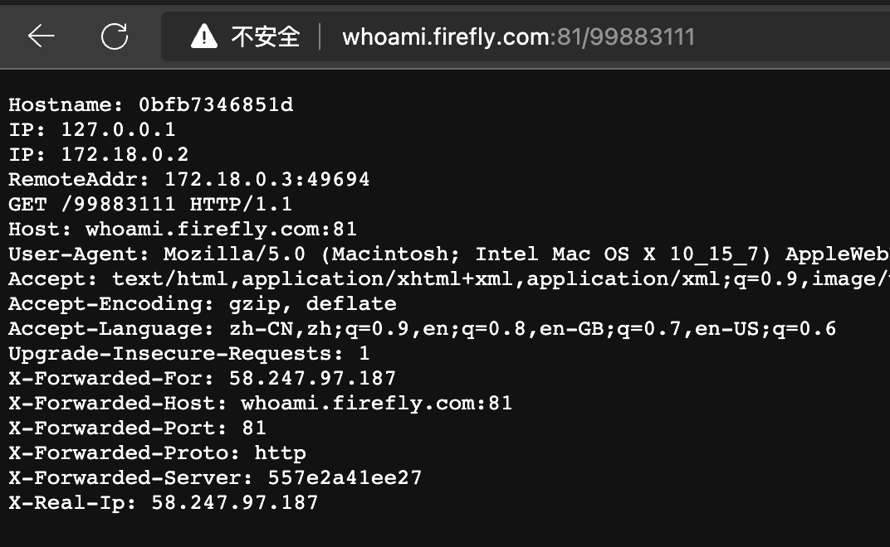

 


## 总结
1. `traefik` 可以感知服务器内的服务并监控其的健康状态。还可以为服务分配路由，即管理路由。
2. `trakfik` 服务启动可以设置在默认的 80 端口，访问域名映射到服务器 ip 后，会经过 `traefik` 服务，`traefik` 通过请求头的 `Host` 做为判断依据，反向代理到不同服务上。
3. `traefik` 更多的配置可以通过 `CLI` 传参 或者 读取 `/etc/traefik/traefik.toml` 配置文件。在 `docker` 中使用 `traefik`，则可以将 `traefik.toml` 上传到容器内或直接使用 volumes 挂载 `- ./traefik.toml:/etc/traefik/traefik.toml` 
4. `traefik.toml`
   1. `accessLog`：访问日志，记录了访问信息
   2. `log`：日志文件，记录了错误信息
   3. `api`：api 配置，包含了仪表板显隐，非安全模式开启
   

## 疑问
- [ ] acme.json 为什么要赋 600 权限，防止容器内更改吗？ 
- [ ] api.insecure 非安全模式，该模式官方不推荐开启，但默认是开启状态。开启和不开启有什么区别
- [ ] api.dashboard 设置为 false，仪表板还是正常显示


## 提问
- [x] 在服务器成功搭建 traefik         
如果只有服务器但没有域名，可以通过修改本地的 `hosts` 文件，以达到域名解析效果。我的服务器 80 端口被占用，但可以将 `traefik` 启动在 81 端口，效果也一样。               

- [x] 我们如何配置并查看 traefik 的 AccessLog        
AccessLog：访问日志，配置 `traefik.toml` 文件的 `accessLog` 字段，后续查看 `log/traefik-access.json` 即可看到访问日志，也可以将 `log` 文件夹挂载到容器内，这样可以在宿主机直接查看日志。
```toml
[accessLog]

  # Sets the file path for the access log. If not specified, stdout will be used.
  # Intermediate directories are created if necessary.
  #
  # Optional
  # Default: os.Stdout
  #
  filePath = "log/traefik-access.json"

  # Format is either "json" or "common".
  #
  # Optional
  # Default: "common"
  #
  format = "json"

  [accessLog.fields]
    defaultMode = "keep"

    [accessLog.fields.headers]
      defaultMode = "keep"

```
- [x] 我们如何定位 traefik 启动失败的问题     
配置 `traefik.toml` 文件的 `log` 字段，后续查看 `log/traefik.log` 即可看到日志，记录了启动失败的原因。   
```toml
[log]

  filePath = "log/traefik.log"

  format = "json"
```


  
## 1. 前提提要、场景
至此，已经可以使用 Docker 进行前端应用的部署，并且提供对外服务。但好像，除了使用容器启动服务外，和传统方式并无二致，以前管理进程，现在管理容器。      

依然有以下两个痛点：
1. 我使用 docker 新跑了一个服务，如何让它被其它服务所感知或直接被互联网所访问呢？
2. 我使用 docker 跑了 N 个服务，我怎么了解所有的服务的健康状态及路由呢？

需要一个基于服务发现的网关建设: [Traefik](https://github.com/traefik/traefik)。


## 2. traefik 搭建
traefik 是一个现代化的反向代理与负载均衡器。它可以很容易地同 Docker 集成在一起使用。每当 Docker 容器部署成功，便可以自动在网络上进行访问。     

乍一看跟 nignx 有点相似，但两者维度不同，有较大差别，      
- nginx 维度是资源，注重静态资源。
- traefik 维度是服务，注重的是服务，例如 nginx 提供的静态服务器。结合 docker 来看，docker 容器中提供不同服务都可以被 traefik 感知和监控。    

traefik 可以做到以下
- TLS。部署域名将可直接使用 HTTPS 进行访问
- 自动收集报错日志
- AccessLog。会自动收集每个服务的请求日志
- 自动收集每个服务的健康状态


### 2.1 使用 docker compose 启动 traefik 服务
```yaml
version: '3'

services:
  traefik:
    image: traefik:v2.5
    command: --api.insecure=true --providers.docker # 启用 web UI 并告诉 Traefik 监听 docker
    ports:
      - "80:80" # http 服务端口
      - "8080:8080" # Web UI (由 --api.dashboard=true 开启，默认开启)
    volumes:
      - /var/run/docker.sock:/var/run/docker.sock # 使得 traefik 可以监听 docker 事件
```
`docker compose up` 启动服务后，会显示 `traefik_network` 的网络名称，如果未显示，可以使用 `docker network ls` 查看。       


### 2.2 启动一个任意服务，让 traefik 监控
例如 [whoami](https://hub.docker.com/r/containous/whoami) 的简易版 Web 服务，它将会在页面上打印出一些头部信息。
```yaml
version: '3'

services:
  # 该镜像提供的服务，会返回显示自身的 `header` 信息
  whoami:
    image: containous/whoami
    labels:
      # 设置Host 为 whoami.docker.localhost 进行域名访问
      # 后续请求，只要请求头为 whoami.docker.localhost，便会被 traefik 代理到该服务上。
      # traefik.http.routers.x，   x 只是一个路由名称，一般是与最后一级域名一致。
      # 标签是一种将元数据应用于 Docker 对象的机制，Traefik 自动读取容器的标签生成动态配置来更新路由规则。
      - "traefik.http.routers.whoami.rule=Host(`whoami.docker.local`)"

# 使用已存在的 traefik 的 network
networks:
  default:
    external:
      name: traefik_default # 使用上方 traefik 服务的网络名称
```
whoami:
1. 暴露了一个 http 服务，会返回显示自身的 `header` 信息
2. 配置了容器的 labels，是一种将元数据应用于 Docker 对象的机制，Traefik 自动读取容器的标签生成动态配置来更新路由规则。

此时通过 `curl -H Host:whoami.docker.local http://127.0.0.1` 便可以访问 whoami 服务。也可以修改 Host `whoami.docker.local 127.0.0.1`，访问 `whoami.docker.local` 也可以访问 whoami 服务。


## 3. traefik.toml 
`traefik` 会读取 `/etc/traefik/traefik.toml` 配置文件进行配置。更多的配置信息可以[参考文档](https://doc.traefik.io/traefik/reference/static-configuration/file/)，文档中只有 demo，具体的配置项不知道意义可以参考 [CLI](https://doc.traefik.io/traefik/reference/static-configuration/cli/)
> 也可以使用 traefik --configFile=foo/bar/myconfigfile.yml 指定配置
    
在 docker 中使用 traefik，可以添加到容器中或使用 volumes 挂载 `- ./traefik.toml:/etc/traefik/traefik.toml` 


> traefik 配置文件采用了 toml 格式，可访问官方文档查看其语法 [toml](https://toml.io/cn/v1.0.0)。

### 3.1 Dashboard
`traefik.toml` 配置文件可通过 `api.dashboard` 选项配置 Web Ui 控制台。  
```toml
# Enable API and dashboard
[api]

  # Enable the API in insecure mode
  #
  # Optional
  # Default: true
  #
  insecure = true

  # Enabled Dashboard
  #
  # Optional
  # Default: true
  #
  dashboard = true
```
可通过 `http://localhost:8080`，在本地将 traefik 的 Web Ui 控制台直接打开       
如果是在远程服务器上，可通过 ssh 隧道映射到本地进行打开。ssh 隧道命令。
```sh
# 左侧为本地 IP:PORT，右侧为远程服务器 IP:PORT
# -N: 用以端口转发
# -L: 将服务器中 localhost:5000 映射到本地 5000 端口
$ ssh -NL [bind_address:]port:host:hostport

$ ssh -NL 8080:localhost:8080 服务器ip
```


### 3.2 日志与问题定位
日志极为重要，当某个路由配置不成功，或者 https 配置失败时，可以通过日志文件来定位问题。      
通过 log 选项可以配置日志路径与格式。      
```toml
[log]

  filePath = "log/traefik.log"

  format = "json"
```

使用以下语句查看日志
```sh
# 取日志前十行，查看其问题
$ cat log/traefik.log | head -10 | jq
```


### 3.3 完整版配置文件
`traefik.toml`

```toml
[global]
  checkNewVersion = true
  sendAnonymousUsage = true

################################################################
# Entrypoints configuration
################################################################

# Entrypoints definition
#
# Optional
# Default:
[entryPoints]
  [entryPoints.web]
    address = ":80"

  [entryPoints.websecure]
    address = ":443"

################################################################
# Traefik logs configuration
################################################################

# Traefik logs
# Enabled by default and log to stdout
#
# Optional
#
[log]

  filePath = "log/traefik.log"

  format = "json"

################################################################
# Access logs configuration
################################################################

# Enable access logs
# By default it will write to stdout and produce logs in the textual
# Common Log Format (CLF), extended with additional fields.
#
# Optional
#
[accessLog]

  # Sets the file path for the access log. If not specified, stdout will be used.
  # Intermediate directories are created if necessary.
  #
  # Optional
  # Default: os.Stdout
  #
  filePath = "log/traefik-access.json"

  # Format is either "json" or "common".
  #
  # Optional
  # Default: "common"
  #
  format = "json"

  [accessLog.fields]
    defaultMode = "keep"

    [accessLog.fields.headers]
      defaultMode = "keep"


################################################################
# API and dashboard configuration
################################################################

# Enable API and dashboard
[api]

  # Enable the API in insecure mode
  #
  # Optional
  # Default: true
  #
  insecure = true

  # Enabled Dashboard
  #
  # Optional
  # Default: true
  #
  dashboard = true

################################################################
# Ping configuration
################################################################

# Enable ping
[ping]

  # Name of the related entry point
  #
  # Optional
  # Default: "traefik"
  #
  # entryPoint = "traefik"

################################################################
# Docker configuration backend
################################################################

# Enable Docker configuration backend
[providers.docker]

  # Docker server endpoint. Can be a tcp or a unix socket endpoint.
  #
  # Required
  # Default: "unix:///var/run/docker.sock"
  #
  # endpoint = "tcp://10.10.10.10:2375"

  # Default host rule.
  #
  # Optional
  # Default: "Host(`{{ normalize .Name }}`)"
  #

  # Expose containers by default in traefik
  #
  # Optional
  # Default: true
  #
  # exposedByDefault = false

[metrics.prometheus]
  buckets = [0.1,0.3,1.2,5.0]
  entryPoint = "metrics"

[certificatesResolvers.le.acme]
  email = "xianger94@qq.com"
  storage = "acme.json"

  [certificatesResolvers.le.acme.tlsChallenge]

  [certificatesResolvers.le.acme.httpChallenge]
    entryPoint = "web"
```


### 3.4 挂载在 traefik 容器中
将 `traefik.toml ` 配置挂载在 traefik 容器中
```yaml
version: '3'

services:
  reverse-proxy:
    image: traefik:v2.5
    ports:
      - "80:80"
      - "443:443"
      - "8080:8080"
    volumes:
      - ./traefik.toml:/etc/traefik/traefik.toml # traefik 配置
      - ./acme.json:/acme.json # 维护证书信息--证书解析配置
      - ./log:/log # 日志文件夹挂载，这样可以在宿主机中直接查看日志
      - /var/run/docker.sock:/var/run/docker.sock # 使得 traefik 可以监听 docker 事件
    container_name: traefik
    env_file: .env # 环境变量以文件形式进行存储配置 https://docs.docker.com/compose/env-file/
    labels:
      - "traefik.http.routers.api.rule=Host(`traefik.docker.local`)" # 也可以自身设置label 用于 traefik 发现并监控
      - "traefik.http.routers.api.service=api@internal" # 指定 api@internal 服务，开启 api 控制。
```

最后以下指令启动容器 
```sh
# 新建 acme.json，用以挂载至 traefik 容器中维护证书信息
$ touch acme.json

# 给 acme.json 赋 600 权限非常重要
# 给 acme.json 赋 600 权限非常重要
# 给 acme.json 赋 600 权限非常重要
$ chmod 600 acme.json

$ touch .env

$ docker compose up
```


## 遗留


个人github：[**https://github.com/zhengjiabo**](https://github.com/zhengjiabo) 