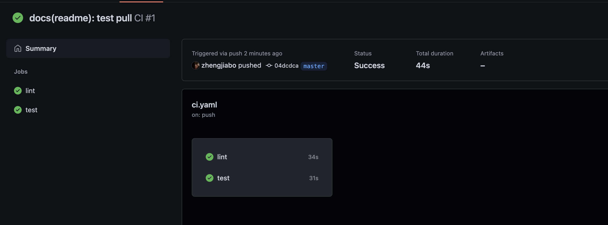
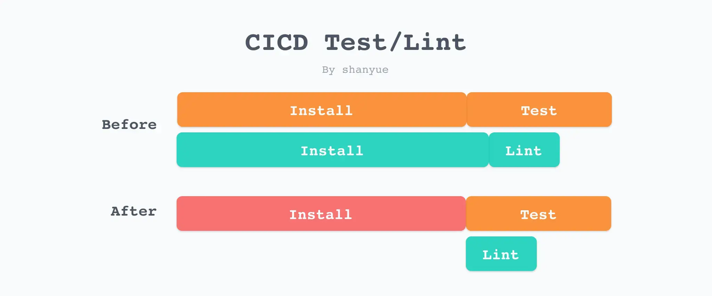

 


## 总结
- CI 设计
  - 什么分支（监听范围）
  - 什么事件（时间钩子）
  - 什么命令（操作）
- CI 流程
  - Install：依赖安装
  - Lint：统一代码风格
  - Test：单元测试
  - Preview：生成供测试人员进行检查的网址。
  - Audit: 使用 npm audit 或者 [snyk](https://snyk.io/) 检查依赖的安全风险。可详查文章[如何检测有风险依赖](https://q.shanyue.tech/engineering/742.html#audit)
  - Quality: 使用 [SonarQube](https://www.sonarqube.org/) 检查代码质量。
  - Container Image: 使用 [trivy](https://github.com/aquasecurity/trivy) 扫描容器镜像安全风险。
  - End to End: 使用 [Playwright](https://github.com/microsoft/playwright) 进行 UI 自动化测试。
  - Bundle Chunk Size Limit: 使用 [size-limit](https://github.com/ai/size-limit) 限制打包体积，打包体积过大则无法通过合并。
  - Performance (Lighthouse CI): 使用 [lighthouse CI](https://github.com/GoogleChrome/lighthouse-ci) 为每次 PR 通过 Lighthouse 打分，如打分过低则无法通过合并。
  - Matrix：要测试不同 `node.js` 环境下的表现，可使用 [matrix](https://docs.github.com/cn/actions/using-jobs/using-a-matrix-for-your-jobs)


## 疑问


## 提问
- [x] 
- [ ] 你们在 CI 中做了那些检测


- [ ] 使用 github actions 配置 lint
- [ ] 使用 github actions 配置 audit


  
## 1. 前提提要、场景
介绍完 CI/CD 后，本章开始通过 `Github Actions` 实现 CI。      
实现以下流程： 
- Install：依赖安装
- Lint：统一代码风格
- Test：单元测试
- Preview：生成供测试人员进行检查的网址。（比较复杂，后续实现）

### 1.1 更高级的 CI 
Lint 和 Test 仅是 CI 中最常见的阶段。为了保障我们的前端代码质量，还可以添加以下阶段。
- Audit: 使用 npm audit 或者 [snyk](https://snyk.io/) 检查依赖的安全风险。可详查文章[如何检测有风险依赖](https://q.shanyue.tech/engineering/742.html#audit)
- Quality: 使用 [SonarQube](https://www.sonarqube.org/) 检查代码质量。
- Container Image: 使用 [trivy](https://github.com/aquasecurity/trivy) 扫描容器镜像安全风险。
- End to End: 使用 [Playwright](https://github.com/microsoft/playwright) 进行 UI 自动化测试。
- Bundle Chunk Size Limit: 使用 [size-limit](https://github.com/ai/size-limit) 限制打包体积，打包体积过大则无法通过合并。
- Performance (Lighthouse CI): 使用 [lighthouse CI](https://github.com/GoogleChrome/lighthouse-ci) 为每次 PR 通过 Lighthouse 打分，如打分过低则无法通过合并。
- Matrix：要测试不同 `node.js` 环境下的表现，可使用 [matrix](https://docs.github.com/cn/actions/using-jobs/using-a-matrix-for-your-jobs)
    ```yaml
    jobs:
  example_matrix:
    strategy:
      matrix:
        version: [10, 12, 14]
    steps:
      - uses: actions/setup-node@v3
        with:
          node-version: ${{ matrix.version }}
    ```

## 2. Git Workflow 场景
假设一个极其简单的 Git Workflow 场景
1. 每个人在功能分支进行新功能开发，分支名 `feature-*`。每一个功能分支将会有一个功能分支的测试环境地址，如 `<branch>.dev.demo.com`。
2. 当功能分支测试完毕没有问题后，合并至主分支 master。将会随着主分支部署到生产环境。
3. 当生产环境出现 Bug 时，切换一条新分支 hotfix-*，解决紧急 Bug。


为了保障代码质量，线上的代码必须通过 CI 检测，但是需要考虑以下
- 什么分支（监听范围）
- 什么事件（时间钩子）
- 什么命令（操作）

根据开发流程，可以得到以下结论，在功能分支以下事件
1. 提交后（CI 阶段）：进行 Build、Lint、Test、Preview 等，如未通过，则无法 Preview，更无法合并到生产环境分支进行上线
2. 通过后（CI 阶段）：合并到主分支，进行自动化部署。

企业里，主分支都是禁止直接推送，只能通过合并请求 `PR` 合并。所以只需要监听该事件，保障合并到主分支的代码纯净即可，也可以节省构建服务器的性能。             
翻译成代码。      
```yaml
# 当功能分支代码提交 Pull Request 后，进行 CI
on:
  pull_request:
    types:
      # 当新建了一个 PR 时
      - opened
      # 当提交 PR 的分支，未合并前并拥有新的 Commit 时
      - synchronize
    branches:    
      - 'feature/**' # 只监听功能分支
```


## 3. 任务的串行和并行
互不干扰的任务可以并行执行，虽然消耗构建服务器性能更多，但可以节省大量时间，很值当。         
Lint 和 Test 互不干扰可以并行执行。但他们前置都需要 Install，这便是串行。


> 一般只要有任务失败，本次 CI 便意味着失败。但可以通过配置允许某些任务失败。[jobs.<job_id>.continue-on-error](https://docs.github.com/cn/actions/using-workflows/workflow-syntax-for-github-actions#jobsjob_idstepscontinue-on-error)       


## 4 使用 Github Actions 进行 CI
由于 `create-react-app` 项目在打包过程中，会使用 `ESLint Plugin` 进行代码检查（[源码](https://github.com/facebook/create-react-app/blob/v5.0.0/packages/react-scripts/config/webpack.config.js#L765)），且根据 CI 环境决定报错还是警告。            
所以此处可以使用 `npm run build` 模拟 Lint 检查。 

编写 CI 配置 `.github/workflows/ci.yaml` 
```yaml
# 关于本次 workflow 的名字
name: CI

# 执行 CI 的时机: 当 git push 代码到 github 时
on: [push]

# 执行所有的 jobs
jobs:
  lint:
    runs-on: ubuntu-latest
    steps:
      # 切出代码，使用该 Action 将可以拉取最新代码
      - uses: actions/checkout@v2

      # 配置 node.js 环境，此时使用的是 node14
      # 注意此处 node.js 版本，与 Docker 中版本一致，与 package.json 中 engines.node 版本一致
      # 如果需要测试不同 node.js 环境下的表现，可使用 matrix
      - name: Setup Node
        uses: actions/setup-node@v1
        with:
          node-version: 14.x

      # 安装依赖
      - name: Install Dependencies
        run: yarn

      # 在 cra 中，使用 npm run build 来模拟 ESLint
      - name: ESLint
        run: npm run build
  test:
    runs-on: ubuntu-latest
    steps:
      - uses: actions/checkout@v2
      - name: Setup Node
        uses: actions/setup-node@v1
        with:
          node-version: 14.x
      - name: Install Dependencies
        run: yarn
      - name: Test
        run: npm run test
```


二者已经是并行执行，还可以继续优化，将 Install 的过程抽离来减少服务器的并行压力。


## 5. 将 Install 过程前置
Install 前置会节省服务器资源，但并不会加快 CI 时间。甚至因为多了一个 Job，Job 间切换也需要花费时间，总时间还会略有增加。 


前置任务可以通过 [needs](https://docs.github.com/en/actions/using-workflows/workflow-syntax-for-github-actions#jobsjob_idneeds) 指定

```yaml
install:
  # codes
lint:
  needs: install
test:
  needs: install
```

完整配置文件
```yaml
name: CI Parallel
on: [push] # 监听推送事件
jobs:
  install: # 安装依赖
    runs-on: ubuntu-latest # ubuntu 环境
    steps:
      - uses: actions/checkout@v2 # 拉取代码
      - name: Setup Node
        uses: actions/setup-node@v1 # 安装 node
        with:
          node-version: 14.x
      - name: Cache Node Modules
        id: cache-node-modules # 标志，用于 if
        uses: actions/cache@v2 # 缓存，可以跟其他 Job 共享数据
        with:
          path: node_modules
          key: node-modules-${{ hashFiles('yarn.lock') }} # 缓存标志，取 yarn.lock 文件 hash
          restore-keys: node-modules-
      - name: Install Dependencies
        if: steps.cache-node-modules.outputs.cache-hit != 'true' # 无缓存，进行安装
        run: yarn
  lint:
    runs-on: ubuntu-latest
    # 通过 needs 字段可设置前置依赖的 Job，比如 install
    needs: install 
    steps:
      - uses: actions/checkout@v2
      - name: Setup Node
        uses: actions/setup-node@v1
        with:
          node-version: 14.x
      - name: Cache Node Modules
        id: cache-node-modules
        uses: actions/cache@v2
        with:
          path: node_modules
          key: node-modules-${{ hashFiles('yarn.lock') }}
          restore-keys: node-modules-
      - name: ESLint
        run: npm run build
  test:
    runs-on: ubuntu-latest
    needs: install
    steps:
      - uses: actions/checkout@v2
      - name: Setup Node
        uses: actions/setup-node@v1
        with:
          node-version: 14.x
      - name: Cache Node Modules
        id: cache-node-modules
        uses: actions/cache@v2
        with:
          path: node_modules
          key: node-modules-${{ hashFiles('yarn.lock') }}
          restore-keys: node-modules-
      - name: Test
        run: npm run test
  preview:
    runs-on: ubuntu-latest
    needs: [lint, test]
    steps:
      - run: echo 'Preview OK'
```


## 遗留


个人github：[**https://github.com/zhengjiabo**](https://github.com/zhengjiabo) 