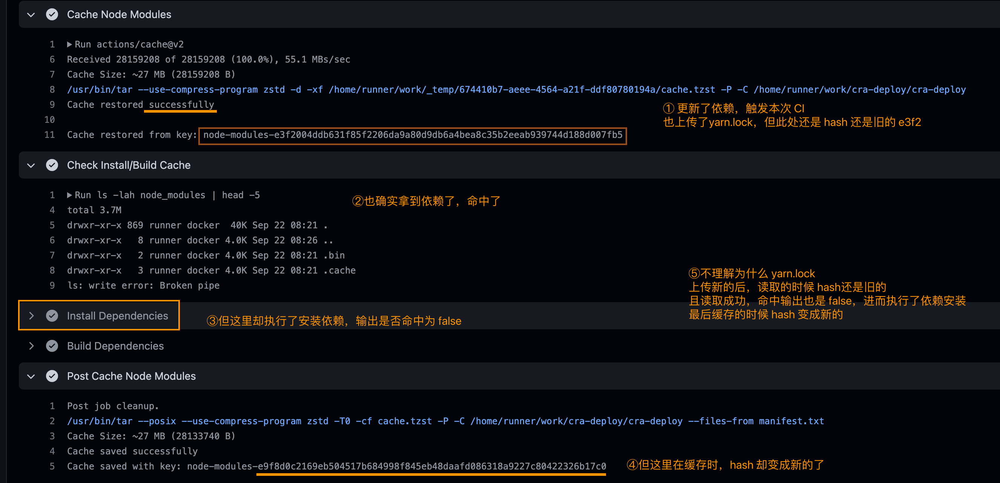
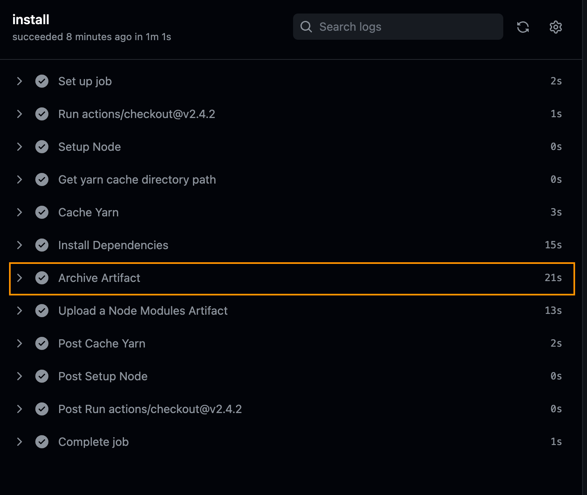
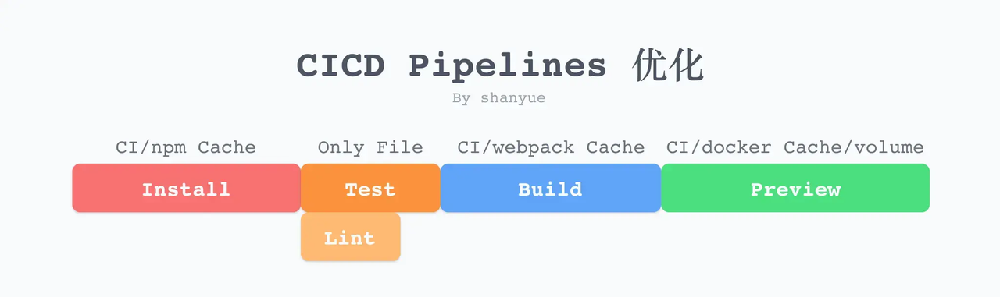

 


## 总结
- 缓存 `node_modules` 不稳定，推荐缓存全局依赖。后续换 pnpm，安装也会更快
  ```yaml
    - name: Get yarn cache directory path
      id: yarn-cache-dir-path
      run: echo "::set-output name=dir::$(yarn cache dir)"

    - uses: actions/cache@v3
      id: yarn-cache # use this to check for `cache-hit` (`steps.yarn-cache.outputs.cache-hit != 'true'`)
      with:
        path: ${{ steps.yarn-cache-dir-path.outputs.dir }}
        key: ${{ runner.os }}-yarn-${{ hashFiles('**/yarn.lock') }} # runner.os 环境 例如 Linux
        restore-keys: |
          ${{ runner.os }}-yarn-
  ```


## 疑问
- [ ] 什么情况下，缓存 node_modules 会发生问题。
- [ ] `restore-keys` 不清楚其作用，[DEMO 地址](https://github.com/zhengjiabo/cra-deploy/actions/workflows/build.yaml)
  第一次执行读取缓存， `node-modules-e3f2xxxxx`， `node-modules-` 都没有命中缓存。      
  开始安装依赖，最后将缓存提交到 `node-modules-e3f2xxxxx`。
  
  问题一：什么时候提交缓存到 `node-modules-`，不然里面一直是空的，也没什么作用。 

  随后我更新了依赖，且在本地 yarn 完，将 `package.json` 和 `yarn.lock` 提交触发了第二次 CI
  
  问题二：不理解以上过程
  不理解为什么 `yarn.lock` 上传新的后，读取的时候 hash 还是旧的         
  且读取成功，命中输出也是 `false`，进而执行了依赖安装       
  最后缓存的时候 hash 变成新的


- [ ] 压缩时间过长，有办法优化吗？       
  由于担心缓存 node_modules 会出问题，所以跟着官方例子只缓存了全局，每次都读取全局缓存后执行 `yarn` 安装依赖。安装完需要将 `node_modules` 压缩上传供其他 job 调用，但压缩时间也挺长的，比安装依赖还长感觉有点得不偿失，还不如每个 job 都单独去安装依赖
  ```yaml
  # 安装依赖 不推荐直接缓存 node_modules，自己的项目可以，但企业内依赖变动可能多，缓存 node_modules 有时候会出现问题，但可以缓存 yarn 全局依赖。后续使用 pnpm 安装可能速度更快   
  - name: Install Dependencies
    # if: steps.cache-node-modules.outputs.cache-hit != 'true'
    run: yarn
    
  # 压缩（归档）依赖 https://www.gnu.org/software/tar/
  - name: Archive Artifact
    shell: bash
    run: | # $RUNNER_TEMP 临时运行路径，本次任务执行完消除  # --dereference 提取符号链接属性，如上次修改的时间和链接权限 –-hard-dereference 取消对硬链接的引用并存储它们所引用的文件，而不是创建通常的硬链接  # -j bzip2 格式 压缩率高
      tar \
        -jcvf "node_modules.bz2" \
        node_modules
    
    
  # 上传依赖，由于 node_modules 不用缓存，此处上传资源供其他 job 读取
  - name: Upload a Node Modules Artifact
    uses: actions/upload-artifact@v3.1.0
    with:
      name: node-modules
      path: node_modules.bz2
  ```
  


<!-- ## 提问 -->


  
## 1. 前提提要、场景
在本地环境中，安装依赖时都会利用缓存，例如
1. 当使用 `npm i` 进行依赖安装时，由于 node_modules 目录已存在，将只会安装最新添加的依赖。
2. 当使用 webpack 5 进行构建时，如果使用了 `filesystem cache`，因为在磁盘中含有缓存 `node_modules/.cache`，二次构建往往比一次构建快速十几倍。

而在 CICD 中，这些都失去了意义，因为 CICD 每次 Job 都相当于新建了一个目录，每次构建都相当于是首次构建。但是，CI 提供了一些缓存机制，可以将一些资源进行缓存。如果每次可以将缓存取出来，则大大加速了前端部署的速度。     


- 安装依赖-使用缓存
- 打包缓存
- 容器资源挂载
  
利用缓存的目的：减少 CICD 时间。      

## 2. 无缓存安装依赖/打包
如果不进行任何缓存上的优化，对应 `Github Actions` 
```yaml
name: Build
on: [push]
jobs:
  build:
    runs-on: ubuntu-latest
    steps:
      - uses: actions/checkout@v2
      - name: Setup Node
        uses: actions/setup-node@v1
        with:
          node-version: 14.x
      - name: Install Dependencies
        run: yarn
      - name: Build Dependencies
        run: npm run build
```

可以看到无缓存安装依赖/打包的时间，要比有缓存长很多。

> 第一次执行可能有缓存的会比无缓存耗时长，因为第一次都是无缓存资源，而有缓存的 job 还要去尝试获取缓存，获取也需要时间。


## 3. 缓存配置
对 `node_modules` 进行缓存有以下两个好处
1. 没有新的 package 需要安装，无需再次 `npm i/yarn`
2. 有新的 package 需要安装，仅仅安装变动的 package

在 `Github Actions` 中，通过 [Cache Action](https://github.com/actions/cache)
- path：指需要缓存的目录
- key：根据 key 进行缓存，如果存在相同的 key，则为命中 (hit)。在 `Github Actions` 中可利用函数 `hashFiles` 针对文件计算其 hash 值。
- restore-keys：如果 ke 未命中，则尝试使用 restore-keys 命中缓存。

输出
- cache-hit：是否命中缓存，布尔值

[Cache Examples](https://github.com/actions/cache/blob/main/examples.md#node---npm)


### 3.1 缓存依赖
```yaml
- name: Cache Node Modules
  id: cache-node-modules
  # 使用 cache action 进行目录资源缓存
  uses: actions/cache@v2
  with:
    # 对 node_modules 目录进行缓存
    path: node_modules
    # 根据字段 node-modules- 与 yarn.lock 的 hash 值作为 key
    # 当 yarn.lock 内容未发生更改时，key 将不会更改，则命中缓存
    # 如果使用 npm 作为包管理工具，则是 package-lock.json
    key: node-modules-${{ hashFiles('yarn.lock') }}
    restore-keys: node-modules- # 备用字段
```

缓存 `node_modules` 有时会存在问题，比如使用 `npm ci` 命令，在安装依赖之前特意将 `node_modules` 删除以保障安全性。          
如果不想缓存 `node_modules`，可以缓存 npm/yarn 全局缓存目录。通过以下命令可知他们的全局缓存目录
- npm: `npm config get cache`，如 ~/.npm
- yarn: `yarn cache dir`


### 3.2 缓存验证
可以通过 `ls -lah node_modules` 查看是否有缓存目录
```yaml
# 查看缓存是否设置成功，输出 node_modules 目录
- name: Check Install/Build Cache
  run: ls -lah node_modules | head -5
```

`Cache Action` 提供了更有效的返回 `cache-hit` 表示是否命中缓存。
```yaml
- name: Cache Node Modules
  id: cache-node-modules
  # 使用 cache action 进行目录资源缓存
  uses: actions/cache@v2
  with:
    # 对 node_modules 目录进行缓存
    path: node_modules
    # 根据字段 node-modules- 与 yarn.lock 的 hash 值作为 key
    # 当 yarn.lock 内容未发生更改时，key 将不会更改，则命中缓存
    # 如果使用 npm 作为包管理工具，则是 package-lock.json
    key: node-modules-${{ hashFiles('yarn.lock') }}
    restore-keys: node-modules- # 备用字段

- name: Install Dependencies
  # 如果命中 key，则直接跳过依赖安装
  if: steps.cache-node-modules.outputs.cache-hit != 'true'
  run: yarn
```

`steps.cache-node-modules.outputs.cache-hit` 可获得 ID 为 `cache-node-modules` 的命中缓存结果。条件语句，若命中，则无需再次安装依赖。即使缓存未命中，我们也可以同样利用备用字段 `node-modules-` 中内容（第一次执行没有），依赖安装时间也大幅降低。


### 3.3 完整配置文件

```yaml
name: deploy
on:
  workflow_dispatch: # 允许手动触发
  push:
    branches: [main]
  pull_request:
    branches: [main]
    

# Sets permissions of the GITHUB_TOKEN to allow deployment to GitHub Pages
permissions:
  contents: read
  pages: write
  id-token: write

# Allow one concurrent deployment
concurrency:
  group: "pages"
  cancel-in-progress: true

jobs:
  # 检查依赖的安全风险
  audit:
    runs-on: ubuntu-latest
    steps: #执行步骤
      - uses: actions/checkout@v2.4.2
      - name: Setup Node
        uses: actions/setup-node@v3.4.1
        with:
          node-version: 16.x
    
      # 执行检查-只针对打包
      - name: Run a Security Audit 
        continue-on-error: true # 因为现在还没精力去调配依赖，报错先跳过
        run: npm audit --only=prod
        
  # 安装依赖
  install:
    runs-on: ubuntu-latest # 指定环境
    steps: #执行步骤
      # 拉取当前分支代码
      - uses: actions/checkout@v2.4.2
      
      # 安装 Node
      - name: Setup Node
        uses: actions/setup-node@v3.4.1
        with:
          node-version: 16.x
      
      # 获得 yarn 缓存路径
      - name: Get yarn cache directory path
        id: yarn-cache-dir-path
        run: echo "::set-output name=dir::$(yarn cache dir)"
      
      # 读取缓存
      - name: Cache Yarn
        uses: actions/cache@v3
        id: yarn-cache # use this to check for `cache-hit` (`steps.yarn-cache.outputs.cache-hit != 'true'`)
        with:
          path: ${{ steps.yarn-cache-dir-path.outputs.dir }}
          key: ${{ runner.os }}-yarn-${{ hashFiles('**/yarn.lock') }}
          restore-keys: |
            ${{ runner.os }}-yarn-
      
          
      # 安装依赖 不推荐直接缓存 node_modules，自己的项目可以，但企业内依赖变动可能多，缓存 node_modules 有时候会出现问题，但可以缓存 yarn 全局依赖。后续使用 pnpm 安装可能速度更快   
      - name: Install Dependencies
        # if: steps.cache-node-modules.outputs.cache-hit != 'true'
        run: yarn
        
      # 压缩（归档）依赖 https://www.gnu.org/software/tar/
      - name: Archive Artifact
        shell: bash
        run: | # $RUNNER_TEMP 临时运行路径，本次任务执行完消除  # --dereference 提取符号链接属性，如上次修改的时间和链接权限 –-hard-dereference 取消对硬链接的引用并存储它们所引用的文件，而不是创建通常的硬链接  # -j bzip2 格式 压缩率高
          tar \
            -jcvf "node_modules.bz2" \
            node_modules
        
        
      # 上传依赖，由于 node_modules 不用缓存，此处上传资源供其他 job 读取
      - name: Upload a Node Modules Artifact
        uses: actions/upload-artifact@v3.1.0
        with:
          name: node-modules
          path: node_modules.bz2
     
        
  # 校验  
  lint:
    runs-on: ubuntu-latest # 指定环境
    needs: [install] # 前置任务
    steps: #执行步骤
      - uses: actions/checkout@v2.4.2
      - name: Setup Node
        uses: actions/setup-node@v3.4.1
        with:
          node-version: 16.x
          
      # 下载 node_modules 文件
      - name: Download a Node Modules Artifact
        uses: actions/download-artifact@v3.0.0
        with:
          # 唯一标志
          name: node-modules
          # 下载至文件夹
          path: '' 
          
      # 解压依赖
      - name: Extract Artifact
        shell: bash
        run: | # --dereference 提取符号链接属性，如上次修改的时间和链接权限 –-hard-dereference 取消对硬链接的引用并存储它们所引用的文件，而不是创建通常的硬链接  # -j bzip2 格式 压缩率高
          tar \
            -jxvf "node_modules.bz2"
      
      # 校验
      - name: Eslint
        run: yarn lint
        
  # 测试用例  
  test:
    runs-on: ubuntu-latest # 指定环境
    needs: [install] # 前置任务
    steps: #执行步骤
      - uses: actions/checkout@v2.4.2
      - name: Setup Node
        uses: actions/setup-node@v3.4.1
        with:
          node-version: 16.x
          
      # 下载 node_modules 文件
      - name: Download a Node Modules Artifact
        uses: actions/download-artifact@v3.0.0
        with:
          # 唯一标志
          name: node-modules
          # 下载至文件夹
          path: '' 
          
      # 解压依赖
      - name: Extract Artifact
        shell: bash
        run: | # --dereference 提取符号链接属性，如上次修改的时间和链接权限 –-hard-dereference 取消对硬链接的引用并存储它们所引用的文件，而不是创建通常的硬链接  # -j bzip2 格式 压缩率高
          tar \
            -jxvf "node_modules.bz2"
      
      # 校验
      - name: Test
        run: yarn test
          
        
  # 打包
  build:
    runs-on: ubuntu-latest # 指定环境
    needs: [install] # 前置任务
    steps: #执行步骤
      - uses: actions/checkout@v2.4.2
      - name: Setup Node
        uses: actions/setup-node@v3.4.1
        with:
          node-version: 16.x
          
      # 下载 node_modules 文件
      - name: Download a Node Modules Artifact
        uses: actions/download-artifact@v3.0.0
        with:
          # 唯一标志
          name: node-modules
          # 下载至文件夹
          path: ''
         
         
      # 解压依赖
      - name: Extract Artifact
        shell: bash
        run: | # --dereference 提取符号链接属性，如上次修改的时间和链接权限 –-hard-dereference 取消对硬链接的引用并存储它们所引用的文件，而不是创建通常的硬链接  # -j bzip2 格式 压缩率高
          tar \
            -jxvf "node_modules.bz2"

      
      # 打包
      - name: Build Dependencies
        run: yarn build
       
      # 上传用于 Github Page 发布
      - name: Upload Artifact
        uses: actions/upload-pages-artifact@v1
        with:
          path: public/blog/
          
  
  # 发布到github page
  github-deploy:
    needs: [build]
    environment:
      name: github-pages
      url: ${{ steps.deployment.outputs.page_url }}
    runs-on: ubuntu-latest
    steps:
      - name: Deploy to GitHub Pages
        id: deployment
        uses: actions/deploy-pages@v1

      
      
      
  # 发布到华为云服务器
  huawei-cloud-deploy:
    # 前提打包完成
    needs: [build]
    runs-on: ubuntu-latest
    
    steps:
    # 下载打包后文件
    - name: Download a Build Artifact
      uses: actions/download-artifact@v3.0.0
      with:
        # 唯一标志
        name: github-pages # actions/upload-pages-artifact 是利用 upload-artifact 上传到 github-pages 标志，文件名为 artifact.tar
        # 下载至文件夹
        path: '' 
    
    # 此时还是压缩包，可以上传后解压
    - name: Check Build
      run: ls -lah
        
    # 可以使用 rsync，但还是不推荐直连，后续改掉
    - name: send files to a remote server with scp
      uses: appleboy/scp-action@master
      continue-on-error: true
      with:
        host: ${{ secrets.HUAWEI_IP }}
        username: ${{ secrets.HUAWEI_USER_NAME }}
        password: ${{ secrets.HUAWEI_ACCESS_KEY_SECRET }}
        source: './*'
        target: ../var/www/blog
        # 失败重试 3 次
        retry-attempts: 3
 
```


<!-- ## 遗留 -->


个人github：[**https://github.com/zhengjiabo**](https://github.com/zhengjiabo) 