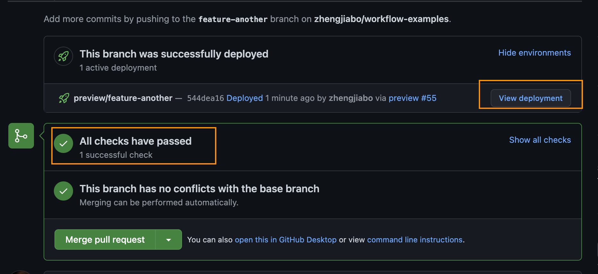
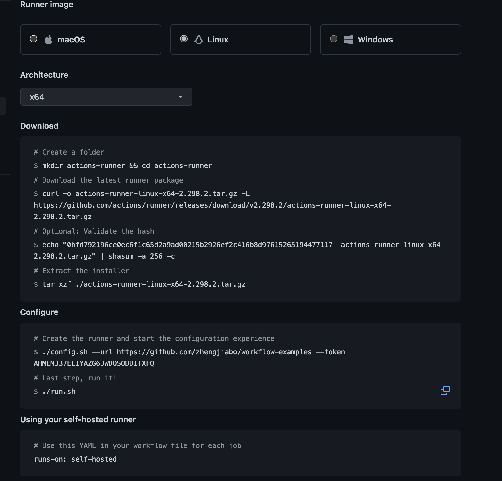
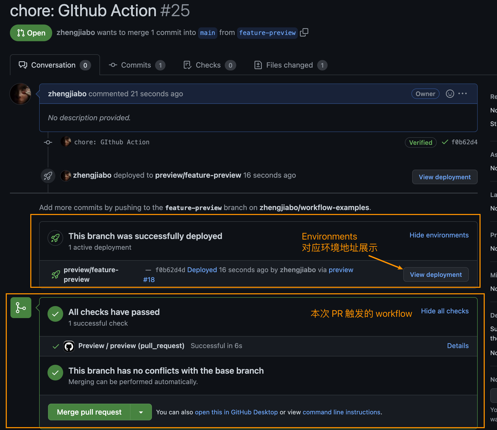

 


## 总结
1. 利用 CI/CD 服务，如 `Github Actions` 或者 `Gitlab CI` 获取当前分支信息
2. 利用 `envsubst` （专职于文件内容的环境变量替换），维护好镜像配置文件 `docker-compose.yaml`
3. 借用 `Docker` 快速构建前端或者后端镜像，构建时设置 `Tag`(分支名)，根据分支信息启动不同的服务。
4. 根据容器的 `Tag` 与当前 `Git` 分支，对前端后端设置不同的域名。


<!-- ## 疑问
- [ ]  -->


## 提问
- [ ] 你们公司中有没有对功能分支进行单独的测试环境，是如何实现的
  公司给的服务器是red hat 老版本，docker都装不了。等我去申请服务器重装系统，实现后再来补充。

- [x] 实现 Preview
  自己实现的 demo，由于没有域名，改了 `nginx` 不同分支使用了路径。也实现了 `Stop Preview` [workflow-examples](https://github.com/zhengjiabo/workflow-examples)
  
  


## 1. 前提提要、场景
以前老旧的开发流程，所有人的代码都合并到统一分支，进行打包测试环境，共用一个测试环境地址。一旦有错误代码提交，例如登录页无法登录，将会影响所有测试。            

对快速迭代以及代码质量提出了更高的要求，基于分支的分支测试环境则成为了刚需           
CI Preview，每一个功能分支都配有对应的测试环境，相互独立，便于测试人员进行验证。

项目研发的从开发到上线，一般可以可以划分为三个环境
1. local：本地环境，面向开发者。把项目 git clone 到自己的工作笔记本或者开发机中，在 `localhost:8080` 类似的地址进行调试与开发。
2. dev：测试环境，面向测试人员。开发者本地业务迭代开发结束并交付给测试进行功能测试的环境，在 `dev.demo.com` 类似的二级域名进行测试。
3. prod：生产环境，面向用户。线上供用户使用的环境，在 `demo.com` 类似的地址。

本次将会实现每个 feature 分支都会有一个与之对应的测试环境。如对功能 feature-A 的开发在 `feature-A.dev.demo.com` 进行测试，在提交合并时创建。       


## 2. 自建 CI 服务器
github 可以参考文档 [Adding self-hosted runners](https://docs.github.com/cn/actions/hosting-your-own-runners/adding-self-hosted-runners)，跟着操作建立自己 CI 服务器。大概流程如下        

操作简单，但涉及 linux 命令，需要留意以下方面：     
- 建立服务器时使用的用户不能为 `root` 用户，需要自建用户。     
- 新建用户，分配用户组时需要添加 `docker` 用户组，否则后续无法调用 docker。
- `./run.sh` 需要后台执行，可以使用 `nohup ./run.sh &` 后台执行。关闭时使用 `ps -ef |grep ./run.sh` 查询后 `kill -9 <pid>` 关闭
    

自建 CI 服务器后，继续准备多分支部署

## 3. 基于 docker/compose 进行部署
使用 docker 和 traefik 进行部署，部署在域名 `dev.demo.com`        
`docker-compose.yaml` 如下
```yml
version: "3"

networks:
  traefik-proxy-network:
    external: true # 使用已存在、组合（compose 文件）之外的 network，如果不存在则提示 network proxy-net declared as external, but could not be found
    name: proxy-net # 指定名称

services:
  domain:
    build:
      context: .
      dockerfile: router.Dockerfile
    networks: # 指定 network 使这个容器成为该网络的一部分
      - traefik-proxy-network
    labels:
      # 为 demo 配置我们的自定义域名
      - traefik.http.routers.dev.rule=Host(`dev.demo.com`)
      - traefik.http.routers.dev.tls=true
      - traefik.http.routers.dev.tls.certresolver=le
```
要实现每个分支都有自己的测试环境，docker-compose 的解决方案:
1. 每个分支都要有自己的 service，根据分支名配置
2. 每个 service 都要有自己的 labels，用于 traefik 动态创建路由，根据分支名配置

开发流程中，基本都是通过 PR 合并功能分支。在 CI 构建服务器中，可通过环境变量获取到触发工作流的分支名称（GitHub Action 的 `GITHUB_HEAD_REF / github.head_ref`），我们可以基于分支名称进行功能分支环境部署。

假设 `COMMIT_REF_NAME` 为功能分支名称的环境变量
```yml
version: "3"

networks:
  traefik-proxy-network:
    external: true # 使用已存在、组合（compose 文件）之外的 network，如果不存在则提示 network proxy-net declared as external, but could not be found
    name: proxy-net # 指定名称

services:
  dev-preview-${COMMIT_REF_NAME}:
    build:
      context: .
      dockerfile: router.Dockerfile
    networks: # 指定 network 使这个容器成为该网络的一部分
      - traefik-proxy-network
    labels:
      - traefik.http.routers.dev-preview-${COMMIT_REF_NAME}.rule=Host(`${COMMIT_REF_NAME}.dev.demo.com`)
      - traefik.http.routers.dev-preview-${COMMIT_REF_NAME}.tls=true
      - traefik.http.routers.dev-preview-${COMMIT_REF_NAME}.tls.certresolver=le
```

大功告成，但还有一点问题: 在 `Service Name` 上无法使用环境变量。       


## 4. docker/compose 在 Service Name 使用环境变量
为了解决在 `Service Name` 上无法使用环境变量的问题。       
我们可以写一段脚本将文件中的环境变量进行替换，但更好的方式是通过内置于操作系统的命令 `envsubst` （专职于文件内容的环境变量替换）

> PS: 如果系统中无自带 `envsubst` 命令，可使用[第三方 envsubst](https://github.com/a8m/envsubst) 进行替代。

以下命令中的 `COMMIT_REF_NAME` 环境变量为当前分支名称，在此处可通过 `git` 命令获取。       
而在 CI 当中，可直接通过 CI 相关环境变量获得，无需通过 `git` 命令。

```bash
# envsubst 可以直接指定输入文件，默认使用环境变量，但也可以指定临时全局变量
$ COMMIT_REF_NAME=$(git rev-parse --abbrev-ref HEAD) envsubst '${COMMIT_REF_NAME}' < docker-compose.yaml

version: "3"

networks:
  traefik-proxy-network:
    external: true # 使用已存在、组合（compose 文件）之外的 network，如果不存在则提示 network proxy-net declared as external, but could not be found
    name: proxy-net # 指定名称

services:
  dev-preview-main:
    build:
      context: .
      dockerfile: router.Dockerfile
    networks: # 指定 network 使这个容器成为该网络的一部分
      - traefik-proxy-network
    labels:
      - traefik.http.routers.dev-preview-main.rule=Host(`main.dev.demo.com`)
      - traefik.http.routers.dev-preview-main.tls=true
      - traefik.http.routers.dev-preview-main.tls.certresolver=le


# envsubst 可以直接指定输入输出文件
# 将代理文件进行环境变量替换后输出为 temp.docker-compose.yaml 配置文件
$ COMMIT_REF_NAME=$(git rev-parse --abbrev-ref HEAD) envsubst '${COMMIT_REF_NAME}' < docker-compose.yaml > temp.docker-compose.yaml

# 根据配置文件启动容器服务
$ docker-compose -f temp.docker-compose.yaml up --build
```


## 5. Environtment
Environtment，可以理解为环境地址。我们希望可以看到在 PR 的评论或者其它地方可以看到我们的部署地址。
- [Github Actions: environment](https://docs.github.com/en/actions/using-workflows/workflow-syntax-for-github-actions#jobsjob_idenvironment)
- [Using environments for deployment](https://docs.github.com/en/actions/deployment/targeting-different-environments/using-environments-for-deployment)

在 CI 中配置 `environment` 为期望的部署地址，则可以在每次部署成功后，便可以看到其地址。

```yaml
environment:
  name: preview/$COMMIT_REF_NAME
  url: http://$COMMIT_REF_NAME.dev.demo.com
```





## 6. 基于 CI/CD 的多分支部署
多分支部署需要用到分支名，可以通过一下方式获取
- Github Actions：环境变量 `GITHUB_REF_NAME / GITHUB_HEAD_REF`、`github.ref_name / github.head_ref` 
- Gitlab CI：环境变量 `CI_COMMIT_REF_SLUG`，会自动进行转换 `feature/A` => `feature-a`。
> `$CI_COMMIT_REF_NAME` lowercased, shortened to 63 bytes, and with everything except 0-9 and a-z replaced with -. No leading / trailing -. Use in URLs, host names and domain names.


> [Github Actions Default Environment Variables](https://docs.github.com/en/actions/learn-github-actions/environment-variables#default-environment-variables)

### 6.1 基于域名部署

在 `Github Action` 中的 demo
```yaml
# 为了试验，此处作为单独的 Workflow，在实际工作中可 Install -> Lint、Test -> Preview 串行检验
name: Preview

# 执行 CI 的时机: 当 git push 到 feature-* 分支时
on:
  push:
    branches:    
      - feature-*

# 执行所有的 jobs
jobs:
  preview:
    # 该 Job 在自建的 Runner 中执行
    runs-on: self-hosted
    environment:
      # 获取 CICD 中的变量: Context
      # https://docs.github.com/en/actions/learn-github-actions/expressions
      name: preview/${{ github.ref_name }}
      url: https://${{ github.ref_name }}.dev.demo.com
    steps:
      # 切出代码，使用该 Action 将可以拉取最新代码
      - uses: actions/checkout@v3.1.0
        with:
          ssh-key: ${{ secrets.SSH_KEY }} # 服务器 https 有时候获取不到，重试速度太慢，改用 ssh
          ssh-known-hosts: 'github.com'
      - name: Preview
        run: |
          cat preview.docker-compose.yaml | envsubst '${COMMIT_REF_NAME}' > docker-compose.yaml
          docker-compose up --build -d cra-preview-${COMMIT_REF_NAME}
        env:
          COMMIT_REF_NAME: ${{ github.ref_name }}
```

当然，也可以在提交了 PR 后再创建环境，减少点服务器压力
```yaml
name: Preview

# 执行 CI 的时机: 当 提交 PR 到 main 分支时
on:
   pull_request:
    types:
      # 当新建了一个 PR 时
      - opened
      # 当提交 PR 的分支，未合并前并拥有新的 Commit 时
      - synchronize
    branches:    
      - main # 只监听主分支 或者 dev relase 分支

jobs:
  preview:
    # 该 Job 在自建的 Runner 中执行
    runs-on: self-hosted
    environment:
      # 获取 CICD 中的变量: Context
      # https://docs.github.com/en/actions/learn-github-actions/expressions
      name: preview/${{ github.head_ref }}
      url: https://${{ github.head_ref }}.dev.demo.com
    steps:
      # 切出代码，使用该 Action 将可以拉取最新代码
      - uses: actions/checkout@v3.1.0
        with:
          ssh-key: ${{ secrets.SSH_KEY }} # 服务器 https 有时候获取不到，重试速度太慢，改用 ssh
          ssh-known-hosts: 'github.com'
      - name: Preview
        run: |
          cat preview.docker-compose.yaml | envsubst '${COMMIT_REF_NAME}' > docker-compose.yaml
          docker-compose up --build -d cra-preview-${COMMIT_REF_NAME}
        env:
          COMMIT_REF_NAME: ${{ github.head_ref }}
```

### 6.2 基于路径部署
::: v-pre
如果和我一样没有域名，想在路径上尝试，可以参考我的 demo [workflow-examples](https://github.com/zhengjiabo/workflow-examples)。
但此处我只能在 `environment` 明文写自己服务器 IP，此处想用加密 `${{ secrets.xx }}` 却无法识别 `secrets`。暂时没有好办法
对应代码如下
::: 
```yaml
name: Preview

# 执行 CI 的时机: 当提交 PR 到 main 分支时
on:
  pull_request:
    types:
      # 当新建了一个 PR 时
      - opened
      # 当提交 PR 的分支，未合并前并拥有新的 Commit 时
      - synchronize
    branches:    
      - main # 只监听主分支
  workflow_dispatch:

# 执行所有的 jobs
jobs:
  preview:
    # 该 Job 在自建的 Runner 中执行
    runs-on: self-hosted
    environment:
      # 获取 CICD 中的变量: Context
      # https://docs.github.com/en/actions/learn-github-actions/expressions
      name: preview/${{ github.head_ref }}
      url: http://这里写自己服务器ip/${{ github.head_ref }}
    steps:
      # 切出代码，使用该 Action 将可以拉取最新代码
      - uses: actions/checkout@v3.1.0
        with:
          ssh-key: ${{ secrets.SSH_KEY }} # 服务器 https 有时候获取不到，重试速度太慢，改用 ssh
          ssh-known-hosts: 'github.com'
      - name: Preview
        run: |
          cat preview.docker-compose.yaml | envsubst '${COMMIT_REF_NAME}' > docker-compose.yaml
          cat preview.nginx.conf | envsubst '${COMMIT_REF_NAME}' > nginx.conf
          docker compose up --build -d dev-preview-${COMMIT_REF_NAME}
        env:
          COMMIT_REF_NAME: ${{ github.head_ref }}

```


使用 `Gitlab CI` 为以下配置
```yaml
deploy-for-feature:
  stage: deploy
  only:
    refs:
      - /^feature-.*$/
  script:
    # 在 CI 中可直接修改为 docker-compose.yaml，因在 CI 中都是一次性操作, envsubst 后可以指定只修改指定环境变量
    - cat preview.docker-compose.yaml | envsubst '${COMMIT_REF_NAME}' > docker-compose.yaml
    - docker-compose up --build -d
  # 部署环境展示，可在 Pull Request 或者 Merge Request 中直接查看
  environment:
    name: review/$CI_COMMIT_REF_NAME
    url: http://$CI_COMMIT_REF_SLUG.dev.demo.com
```


## 7. 自动 Stop Preview
当新建了一个功能分支，提交 PR 后，CI 将在测试环境部署服务器将会自动启动一个容器，即使该分支已被合并，其对应的容器也仍然存在。这便造成了资源浪费       
**当 PR 被合并后，自动将分支所对应的 Docker 容器关停。**

```yaml
# 为了避免服务器资源浪费，每次当 PR 被合并或者关闭时，自动停止对应的 Preview 容器
name: Stop Preview

on:
  pull_request:
    types:
      # 当 feature 分支关闭/合并时，
      - closed
      - merged
  workflow_dispatch:

jobs:
  stop-preview:
    runs-on: self-hosted
    steps:
      # 方式一
      # - name: stop preview
      #   # 根据 Label 找到对应的容器，并停止服务，因为无需代码，所以用不到 checkout
      #   run: docker ps -f label="com.docker.compose.service=dev-preview-${COMMIT_REF_NAME}" -q | xargs docker stop


      # 方式二
      - uses: actions/checkout@v3.1.0
        with:
          ssh-key: ${{ secrets.SSH_KEY }} # 服务器 https 有时候获取不到，重试速度太慢，改用 ssh
          ssh-known-hosts: 'github.com'
          
      - name: stop preview
        run: |
          cat preview.docker-compose.yaml | envsubst '${COMMIT_REF_NAME}' > docker-compose.yaml
          docker compose stop
        env:
          COMMIT_REF_NAME: ${{ github.head_ref }}
```


## 遗留
- [ ] stop preview: 还需要关闭掉 environments，还没实现


个人github：[**https://github.com/zhengjiabo**](https://github.com/zhengjiabo) 