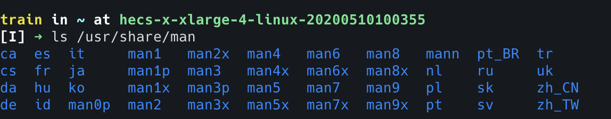

## 总结
1. `<command> --help`：命令自带操作手册
2. `man <command>`：linux man 的操作手册 
3. `tldr <command>`：更加简洁的使用操作手册，用于快速入手尝试，或关键点提醒。


<!-- ## 疑问
- [ ]  -->


## 提问
- [x] 在命令行文档中，`[]` 代表什么意思
  可选参数


## 1. 前提提要、场景
学习 linux 命令时，文档必不可少。      
可以使用以下查询文档
- `<command> --help`
- `man <command>`


## 2. 命令格式
```bash
$ git --help
usage: git [-v | --version] [-h | --help] [-C <path>] [-c <name>=<value>]
           [--exec-path[=<path>]] [--html-path] [--man-path] [--info-path]
           [-p | --paginate | -P | --no-pager] [--no-replace-objects] [--bare]
           [--git-dir=<path>] [--work-tree=<path>] [--namespace=<name>]
           [--super-prefix=<path>] [--config-env=<name>=<envvar>]
           <command> [<args>]
```
如果进行简化，只剩下      
 `git [option/flag option argument] <command> [<args>]`。
- `[option/flag]`：选项，以 `--` 前缀接多个字符，`-` 前缀接单个字符，如 `--help/-h`。 
- `option argument`：选项参数，如 `--git-dir=<path>` 中的 path 就是选项参数。
- `<command>`：子命令，如 `git clone` 中的 `clone` 为子命令。部分主命令中，子命令也是可选的。
- `[<args>]`：命令中的参数，一般而言，除了命令本身外，其它的都是参数。所以子命令也跟主命令一样，可以有自己的选项和选项参数

中间部分为可选参数
- `[ ]`：可选参数
- `[-v | --version]`：`-v` 或者 `--version`，是等效的。
- `[<files> ...]`：多可选参数，类似于 Javascript 中的 `...` 扩展运算符。
    ```bash
    $ cat [-belnstuv] [file ...]

    $ cat a.txt b.txt c.txt ...
    ```
- `-abc`：多个单字符选项拼接
    ```bash
    # 以下两个命令是等价的
    $ ls -lah

    $ ls -l -a -h
    ```

如果想进行命令行开发，可以参考 [CLI 开发指南](https://clig.dev/#output)


## 3. man
`man`：manual 操作手册，实际存储在 linux 的 `/usr/share/man` 目录

```bash
# man <command>
$ man ls

LS(1)                            User Commands                           LS(1)

NAME
       ls - list directory contents

SYNOPSIS
       ls [OPTION]... [FILE]...

DESCRIPTION
       List  information  about  the FILEs (the current directory by default).
       Sort entries alphabetically if none of -cftuvSUX nor --sort  is  speci-
       fied.

       Mandatory  arguments  to  long  options are mandatory for short options
       too.

       -a, --all
              do not ignore entries starting with .
...
```

使用 `vim` 的操作
- `j`: 向下移动
- `k`：向上移动
- `q`：退出


## 4. tldr
`Too Long; Didn't Read`      
一个简化的文档，如果是想知道怎么快速使用，而不是细看每一个配置，选他。          
前期可以使用 `man` 查看文档，后续想不起如何使用，使用 `tldr`。      
可以安装在全局 `npm i -g tldr`，使用方法 `tldr <command>`
```bash
$ tldr ls  

  ls

  List directory contents.
  More information: https://www.gnu.org/software/coreutils/ls.

  - List files one per line:
    ls -1

  - List all files, including hidden files:
    ls -a

  - List all files, with trailing / added to directory names:
    ls -F

  - Long format list (permissions, ownership, size, and modification date) of all files:
    ls -la

  - Long format list with size displayed using human-readable units (KiB, MiB, GiB):
    ls -lh
```


个人github：[**https://github.com/zhengjiabo**](https://github.com/zhengjiabo) 