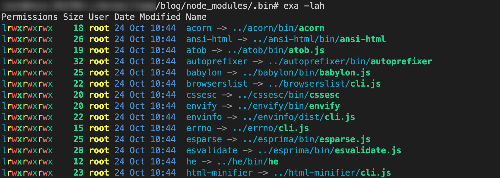
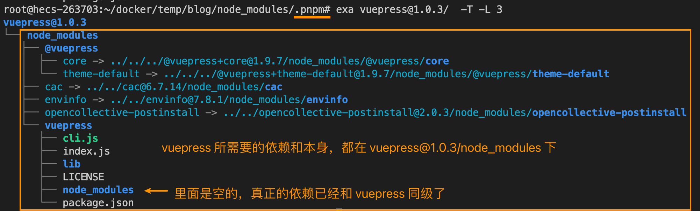

## 总结
- Linux 文件系统中可以理解为默认都是硬链接，所以没有源文件和硬链接的区分，本质都是指向文件 Inode 的指针。只有软件需要区分源文件和软链接。
- 硬链接特点：
  - 具有相同的 Inode，Size 等元属性
  - 删除硬链接文件或者删除源文件任意之一，文件实体并未被删除，这个特点可以防止重要文件被误删。
- 软链接特点：
  - 不同的 Inode，Size 等元属性，证明是两个独立的文件。
  - Size：是指向的源文件名称长度，例如这里 `test.yaml` 9 个字节。


## 提问
- [x] 1. 如何找到文件的所以要硬链接位置
    > `find -samefile <filename>`      
    `find -L -samefile <filename>` 包括软硬链接
- [x] 2. 软链接文件的文件大小是如何得到的
    > 指向的源文件名称长度-字节
- [x] 3. npm link 的工作原理是什么
    > package 源代码中执行 `npm link`，会在全局路径里创建以源代码 `package.json` 的 `name` 字段命名的软连接，链接到源代码目录。     
    后续在调试项目中执行 `npm link <packageName>`，将会替换 `nodemodules/<packageName>` 为软链接，链接到全局路径中 `<packageName>`。经过两个软链接，这样就可以到源代码项目中调试了。    
- [ ] 4. 在 pnpm 中，为什么不全部使用软链接
    > [为什么使用硬链接-为什么不直接创建到全局存储的符号链接](https://pnpm.io/zh/faq#%E4%B8%BA%E4%BB%80%E4%B9%88%E4%BD%BF%E7%94%A8%E7%A1%AC%E9%93%BE%E6%8E%A5-%E4%B8%BA%E4%BB%80%E4%B9%88%E4%B8%8D%E7%9B%B4%E6%8E%A5%E5%88%9B%E5%BB%BA%E5%88%B0%E5%85%A8%E5%B1%80%E5%AD%98%E5%82%A8%E7%9A%84%E7%AC%A6%E5%8F%B7%E9%93%BE%E6%8E%A5)     
    还未总结
- [x] 5. 在 Node.js 或其它语言中如何执行 ln
    > 软链接 [fs.symlinkSync(target, path[, type])](https://nodejs.org/api/fs.html#fssymlinksynctarget-path-type)    
    硬链接 [fs.link(existingPath, newPath, callback)](https://nodejs.org/api/fs.html#fslinkexistingpath-newpath-callback)


## 疑问
- [ ] 1. pnpm 解决了解决软链接循环引用[avoid circular symlinks](https://www.pnpm.cn/symlinked-node-modules-structure)，什么是循环引用。


## 1. 前提提要、场景
为解决文件的共享使用，Linux 系统引入了两种链接。      
- 硬链接（Hard Link）：一个指向文件 Inode 的指针。硬链接文件与原始文件其实是同一个文件，只是不同的名字。删除了原始文件，硬链接文件依然指向文件。
- 软链接（符号链接 Symbolic Link）：类似 window 的快捷方式。删除了原始文件，会使软链接失效。


## 2. ln \<sourceFile\> \<hardFile\> 创建硬链接
`ln <sourceFile> <hardFile>`默认使用即可创建硬链接
```bash
# 创建一个硬链接 test.hard.yaml
$ ln test.yaml test.hard.yaml

# 此时 stat 查看 test.yaml，其 Links 为 2
$ stat test.yaml
  File: test.yaml
  Size: 0               Blocks: 0          IO Block: 4096   regular empty file
Device: fd01h/64769d    Inode: 1109726     Links: 2
Access: (0664/-rw-rw-r--)  Uid: ( 1001/   train)   Gid: ( 1001/   train)
Access: 2022-10-20 20:32:46.776692432 +0800
Modify: 2022-10-20 20:32:46.776692432 +0800
Change: 2022-10-20 20:33:46.946778309 +0800
 Birth: 2022-10-20 20:32:46.775692414 +0800


# 此时 stat 查看 test.hard.yaml，其 Links 为 2，与源文件具有相同的 Inode
$ stat test.hard.yaml
  File: test.hard.yaml
  Size: 0               Blocks: 0          IO Block: 4096   regular empty file
Device: fd01h/64769d    Inode: 1109726     Links: 2
Access: (0664/-rw-rw-r--)  Uid: ( 1001/   train)   Gid: ( 1001/   train)
Access: 2022-10-20 20:32:46.776692432 +0800
Modify: 2022-10-20 20:32:46.776692432 +0800
Change: 2022-10-20 20:33:46.946778309 +0800
 Birth: 2022-10-20 20:32:46.775692414 +0800
```

硬链接特点：具有相同的 Inode，Size 等元属性


使用包管理工具 `pnpm`，可以看到许多硬链接。


## 3. ln -s \<sourceFile\> \<softFile\> 创建软链接
```bash
# 创建一个硬链接 test.soft.yaml
$ ln -s test.yaml test.soft.yaml

# 此时 stat 查看 test.yaml，其 Links 还是为 2，软链接不增加 Links
$ stat test.yaml
  File: test.yaml
  Size: 0               Blocks: 0          IO Block: 4096   regular empty file
Device: fd01h/64769d    Inode: 1109726     Links: 2
Access: (0664/-rw-rw-r--)  Uid: ( 1001/   train)   Gid: ( 1001/   train)
Access: 2022-10-20 20:32:46.776692432 +0800
Modify: 2022-10-20 20:32:46.776692432 +0800
Change: 2022-10-20 20:33:46.946778309 +0800
 Birth: 2022-10-20 20:32:46.775692414 +0800

# 此时 stat 查看 test.soft.yaml，其 Links 为 2，与源文件具有相同的 Inode
$ stat test.soft.yaml
  File: test.soft.yaml -> test.yaml
  Size: 9               Blocks: 0          IO Block: 4096   symbolic link
Device: fd01h/64769d    Inode: 1109727     Links: 1
Access: (0777/lrwxrwxrwx)  Uid: ( 1001/   train)   Gid: ( 1001/   train)
Access: 2022-10-20 21:08:18.392154587 +0800
Modify: 2022-10-20 21:08:13.353063649 +0800
Change: 2022-10-20 21:08:13.353063649 +0800
 Birth: 2022-10-20 21:08:13.353063649 +0800
```

软链接特点：
- 不同的 Inode，Size 等元属性，证明是两个独立的文件。
- Size：是指向的源文件名称长度-字节，例如这里 `test.yaml` 9 个字节。


使用包管理工具 `pnpm`，也可以看到许多软链接。


软链接场景：
1. 在前端中，可以使用 `npm link` 为 `node_modules` 中的某个 `package` 创建软链接至源码目录，方便调试。
2. 在前端中，使用 `npm` 安装依赖，`node_modules` 中某个 package `package.json` 中的 `bin` 字段所指向的文件，会软链接形式存放在 `node_modules/.bin` 目录。（`pnpm` 是生成脚本）     
3. 在前端中，`npm i -g` 全局安装，如果是有可执行文件的，会将 package 的 `bin` 字段所指向文件，在 `$PATH` 目录下以软链接形式存在，后续可直接调用。    


## 4. pnpm 中的软硬链接


- 工程直接依赖的包，在 `node_modules` 都是以 **软链接** 形式存在。真实地址在项目中的 `/node_modules/.pnpm`。解决了幽灵依赖（`node_modules` 文件夹没有非工程直接依赖的包）。
  
- 依赖的真实存放位置：`/node_modules/.pnpm/<name>@<version>/node_modules/<name>`。以平铺的形式存在，且所有包（深层级的依赖）都是这种短路径。解决了 `npm v2` 的嵌套 `node_modules` 引起长路径问题，也保留了包之间的相互隔离。
- `/node_modules/.pnpm` 文件夹下的依赖都是从全局的依赖 `.pnpm store`**硬链接** 出来。例如 `/node_modules/.pnpm/<name>@<version>/node_modules/<name>` 目录下的文件就是硬链接。这样解决了文件资源重复问题（节省磁盘空间，节省下载时间）。而且由于硬链接，即使全局的依赖被删除，项目的依赖也不会受影响。
  > 可以查项目依赖中任意硬链接所有引用的位置，例如以下示例，项目使用了 `vue`，其 `package.json` 的 `main` 字段为：`vue.runtime.common.js`
  ```bash
    # 查找所有硬链接路径
    # -samefile：查询所有硬链接路径
    $ find / -samefile /node_modules/.pnpm/vue@2.7.10/node_modules/vue/dist/vue.runtime.common.js
    /root/docker/temp/blog/node_modules/.pnpm/vue@2.7.10/node_modules/vue/dist/vue.runtime.common.js
    /opt/share/pnpm/.pnpm-store/v3/files/c3/462c0dfe7173c5e1a3685b337963087b5fb19f269dbb86298e31c3911413a1c48b6154b2c9e4dce4b6df4683328e252f5c85a5dafdee9b16d7596c38395cf7
    # 第二个地址 /opt/share/pnpm/... 就是我全局 pnpm 仓库的地址，全局缓存
  ```

- 依赖真实的路径为 `/node_modules/.pnpm/<name>@<version>/node_modules/<name>`，其所需要的依赖（包含了非工程直接依赖的包），也都是存放在与其同级的文件夹中 `/node_modules/.pnpm/<name>@<version>/node_modules/`，且软链接形式存在，软链接到 `.pnpm/<name>@<version>` 。 
  这是为了允许他们`require(<selfName>)` 引用自身（因为自身也在`node_modules` 中），且解决软链接循环引用。
  > `require()` 寻找依赖包，是一层一层目录往外找的。所以对于 `node` 而言，依赖关系是在包的 `node_module` 中还是在父/祖父目录中的任何 `node_module` 中都没有区别。具体可以参考文档：[Node.js Manual & Documentation - Modules](https://nodejs.org/docs/v0.4.2/api/modules.html)     
  If it is not found there, then it moves to the parent directory, and so on, until either the module is found, or the root of the tree is reached.

- `pnpm v5` 将创建一个“半严格”的 `node_modules`。项目将只能导入 `package.json` 中声明的直接依赖包，而依赖包能访问任何其他的包。[pnpm的node_modules配置选项](https://pnpm.io/zh/blog/2020/10/17/node-modules-configuration-options-with-pnpm)，`pnpm` 将所有包，软链接一份放在了 `/node_modules/.pnpm/node_modules` 下，这样就解决了依赖包找不到依赖包的问题。
  > 理论上依赖包的依赖是可以在其本身 `node_modules` 中匹配到，但不排除有些依赖使用幽灵依赖，或者利用原本 `npm` 的特性使用的也不是依赖的依赖，而是同级别的依赖，所以就出现了这种场景。
  `pnpm` 为了覆盖这种场景，就诞生了`/node_modules/.pnpm/node_modules/` 如果匹配不到，直至 `/node_modules/.pnpm` 这个层级，就会查找 `/node_modules/.pnpm/node_modules`，便能找到引用的依赖包。


