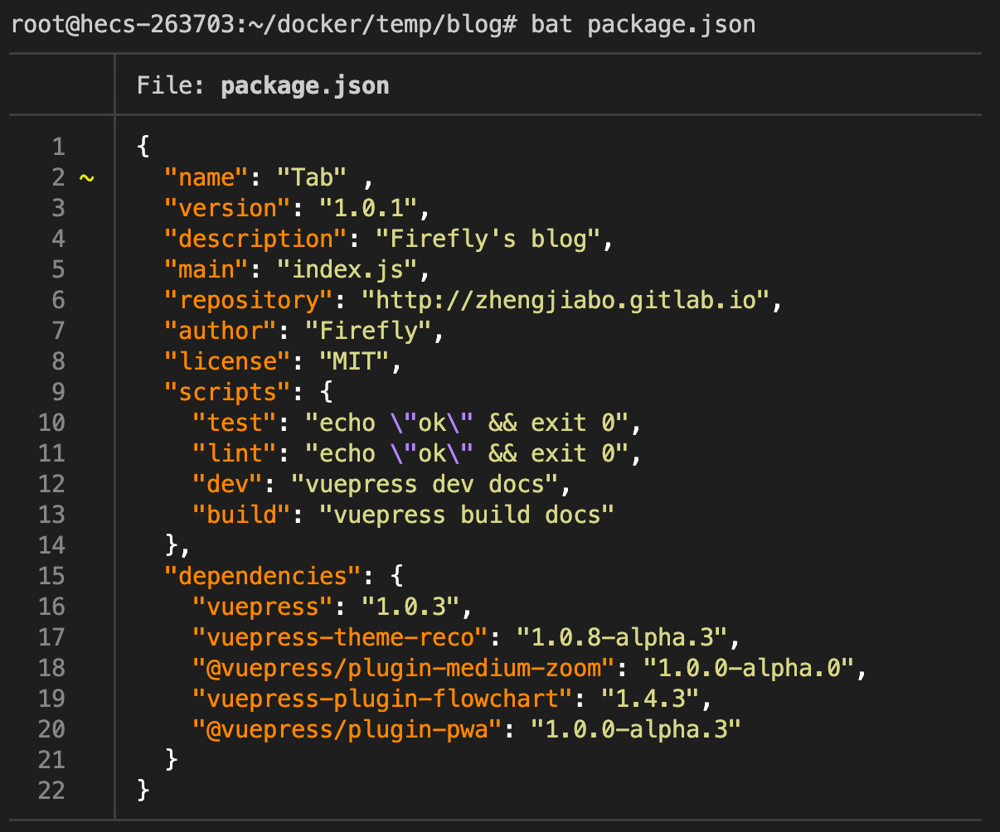
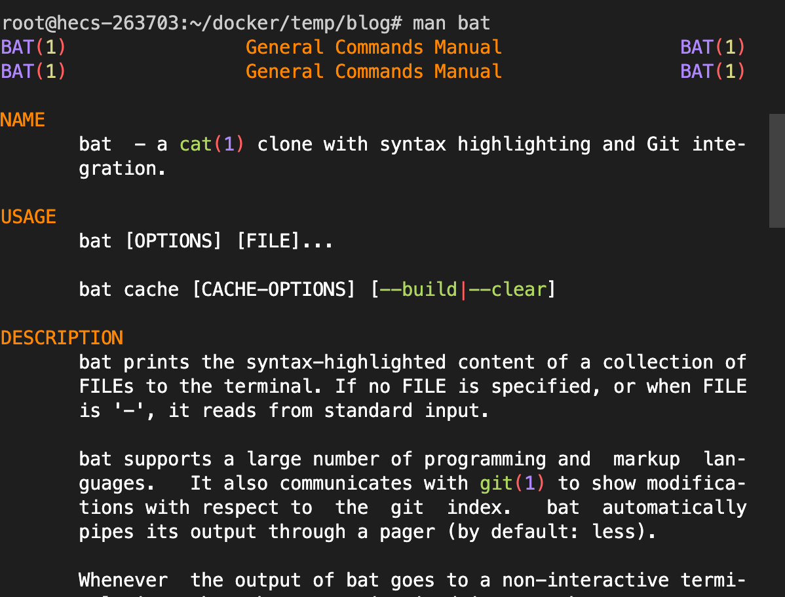

## 总结
- 


## 提问
- [x] 


## 疑问
- [ ] 1.


## 1. 前提提要、场景
查看文件内容是很常见的操作，例如查看报错文档，校验配置是否正确。


## 2. cat 打印输出文件
`concatenate` 缩写，`concatenate and print files` 连接文件并打印至标准输出（stdout）。

```bash
# 也可以打印控制字符，比如 Tab、换行等不可见字符
# -v: 显示非打印字符，使其可见，例如 <Ctrl-X> 
# -e: 打印 换行  $表示
# -t: 打印 TAB  ^I表示
# -n: 打印 行号
$ cat -vetn README.md

# 可连接多文件进行打印
$ cat package.json yarn.lock
```

实际图如下：


## 3. library：open/read 打开/读取文件
在读取文件内容时，在操作系统底层实际上做了两步操作：打开、读取。
- open：`open(<filePath>)`，并返回文件描述符(`file descriptor` 简写 `fd`)，一个非负整数，通过文件描述符可用来读写文件。[文档](https://www.man7.org/linux/man-pages/man2/open.2.html)
- read：`read(<fd>)`，通过 `fd` 读取文件内容。[文档](https://www.man7.org/linux/man-pages/man2/read.2.html)

这两个方法存在于库文件（Library）中，不是独立程序，是向其他程序提供服务的代码。       

`cat` 便是 `open` 和 `read` 的结合实现


> `Node.js` 中 `fs.readFile`，实际是 `fs.open` 与 `fs.read` 的结合。


## 4. bat（cat 命令的升级版）
`Rust` 编写的 `cat` 命令的升级版，需要手动安装，默认支持语法高亮，以及显示行号。


`--show-all/-A ` 显示不可打印字符。


而且配置了环境变量 `export MANPAGER="sh -c 'col -bx | bat -l man -p'"` 可以使得 `man` 文档更好看。

