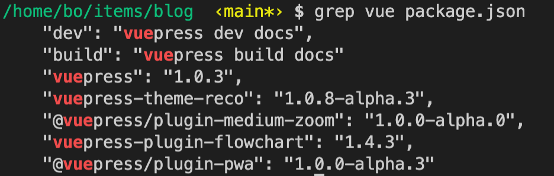

## 总结
- `grep <expression> <filename>`  


## 提问
- [x] 


## 1. 前提提要、场景
之前的章节学习了通配符、扩展通配符。通配符和正则不是一个东西     
- 通配符：多用在文件名上，例如 `find`、`ls`、`cp`
- 正则：多用在文本内容匹配/过滤上，例如 `grep`、`less`、`vim` 中的搜索

正则分为一下三种
1. 基本的正则表达式（Basic Regular Expression 又叫 Basic RegEx  简称 BREs）
2. 扩展的正则表达式（Extended Regular Expression 又叫 Extended RegEx 简称 EREs）
3. Perl 的正则表达式（Perl Regular Expression 又叫 Perl RegEx 简称 PREs）

`grep`，`Global Regular Expression (Processor | Parser | Printer)` 的简写，可以在命令行中使用正则表达式，对文件进行匹配筛选。

`grep` 只是一个正则工具


## 2. 正则匹配文件内容

命令：`grep <expression> <filename>`
```bash
$ grep vue package.json
```



## 3. PCRE 更丰富的正则语法

我自己用不习惯 `linux` 命令行中的正则，例如 `find -name ""` 里面的正则。而 `JS` 的正则用起来比较习惯，贼舒服。


