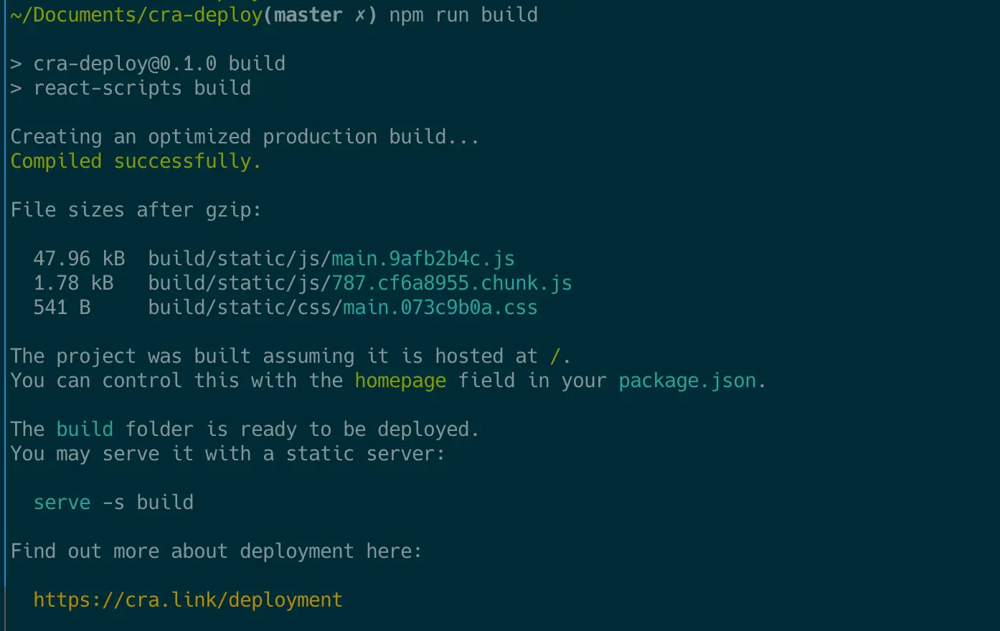
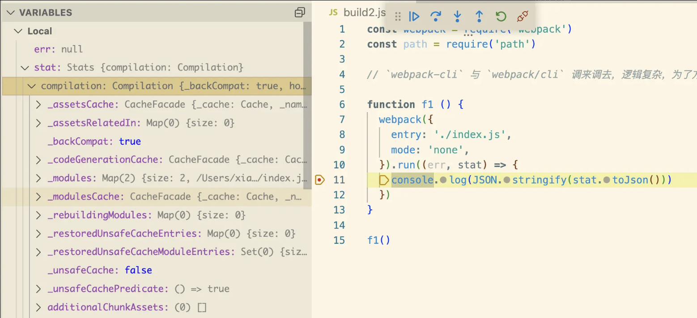

## 总结


## 1. 前提提要、场景
webpack 的大部分项目中，都需要使用 webpack.config.js 来配置 webpack，但不建议使用 webpack.config.js 配置文件的方式来学习 webpack，太难调试了。

webpack-cli 用来学习不够存粹，逻辑复杂，有太多影响因素。


## 2. 跳来跳去的 webpack-cli
```bash
npx webpack
```
1. 调用执行 `webpack` 包对应的 `bin/webpack.js` 文件，然后调用 `webpack-cli` 包
2. 调用执行 `webpack-cli` 包对应的 `bin/cli.js` 文件，然后继续调用 `webpack` 包
3. 调用执行 `webpack` 包的 API 进行打包

所以学习的时候，直接使用 `node` 调用 `webpack` 的 API 即可        


### 2.1 无安装 webpack-cli 时询问是否安装 webpack-cli
如果输入 `no` 则停止执行
```javascript
/* codes */
questionInterface.question(question, answer => {
		questionInterface.close();

		const normalizedAnswer = answer.toLowerCase().startsWith("y");

		if (!normalizedAnswer) {
			console.error(
				"You need to install 'webpack-cli' to use webpack via CLI.\n" +
					"You can also install the CLI manually."
			);

			return;
		}
    /* codes */
}
/* codes */
```


### 2.2 有 webpack-cli 或 同意安装后，执行 webpack-cli
调用 `runCli` 方法，使用 `webpack-cli/package.json` 的 `bin` 指令       
最终执行 webpack-cli 的 `./bin/cli.js` 文件。
```javascript
/* codes */
if (!cli.installed) {
  /* codes */
  runCommand(packageManager, installOptions.concat(cli.package))
			.then(() => {
				runCli(cli);
			})
			.catch(error => {
				console.error(error);
				process.exitCode = 1;
			});
} else {
  runCli(cli);
}

const runCli = cli => {
  // cli: {
  //   binName: 'webpack-cli'
  //   installed: false
  //   name: 'webpack-cli'
  //   package: 'webpack-cli'
  //   url: 'https://github.com/webpack/webpack-cli' 
  // }
	const path = require("path");
	const pkgPath = require.resolve(`${cli.package}/package.json`);
	const pkg = require(pkgPath);

  // require(
  //  "/node_modules/webpack-cli", 
  //  (webpack-cli的package.json).bin['webpack-cli'])  => ./bin/cli.js
  // )
	require(path.resolve(path.dirname(pkgPath), pkg.bin[cli.binName]));
};

```


### 2.3 webpack-cli 的 ./bin/cli.js 文件
以下代码，最终执行 `node node_modules/.bin/webpack`              
`node_modules/.bin/webpack`: 软连接，指向 `node_modules/webpack/bin/webpack.js`         

在一定条件下，最终还是回到了 `webpack` 包。
```javascript
// ./bin/cli.js

#!/usr/bin/env node // shebang 指定解释器

/* codes */

const runCLI = require("../lib/bootstrap");

/* codes */


// process.argv: [
//  'xx/node/v16.15.1/bin/node'
//  '/node_modules/.bin/webpack' 软连接，指向 `node_modules/webpack/
// ]
runCLI(process.argv);
```


## 3. 基于 webpack api 开发脚手架
如果你需要基于 webpack 做一个脚手架，那大概率是通过 webpack api 来完成。例如 Vue-cli、create-react-app 的 [react-scripts](https://github.com/facebook/create-react-app/tree/main/packages/react-scripts)，其[打包](https://github.com/facebook/create-react-app/blob/main/packages/react-scripts/scripts/build.js#L146)


可以通过编译结束后的 [`stat`](https://github.com/facebook/create-react-app/blob/f34d88e30c7d8be7181f728d1abc4fd8d5cd07d3/packages/react-scripts/scripts/build.js#L79) 对象拿到打包后所有资源体积，以及打包时间。当基于 webpack api 开发脚手架后，其脚手架的构建日志也可以进行自定义。



## 4. webpack api 简介
使用 `webpack api` 也特别容易，将以前 `webpack.config.js` 的配置，作为参数传递给 `webpack` 函数即可。详见文档 [webpack node api](https://webpack.js.org/api/node/#webpack)。

```javascript
const webpack = require('webpack')

const compiler = webpack({
  // webpack 的诸多配置置于此处
  entry: './index.js'
})

compiler.run((err, stat) => {
  // 在 stat 中可获取关于构建的时间及资源等信息
})
```

例如，使用它测试不同 `mode` 对打包资源的影响
```javascript
webpack([
  {
    entry: './index.js',
    mode: 'production',
    output: {
      filename: 'main.production.js'
    }
  },
  {
    entry: './index.js',
    mode: 'development',
    output: {
      filename: 'main.development.js'
    }
  },
  {
    entry: './index.js',
    output: {
      filename: 'main.unknown.js'
    }
  }
]).run((err, stat) => {

})
```


## 5. 练习示例
### 5.1 xxxx
```javascript
// 用其 node api 进行示例，方便调试
// 1. webpack 的运行时代码分析
// 2. output.filename template
// 3. [contenthash].js 中的 hash 是如何生成的
// 4. [id] 与 [name] 是如何生成的
// 5. 试试 mode 为 production/development/none 时运行时代码有何不同
// 6. output.path 如何指定打包目录为 build 目录
// 7. devtool 对运行时有何影响
// 8. sourcemap 的工作原理是什么样的

// webpack 的运行时代码分析
function f1 () {
  return webpack({
    entry: './index.js',
    mode: 'none',
    output: {
      iife: false,
      pathinfo: 'verbose'
    }
  })
}
```
1. webpack 的运行时代码分析        
   webpack 传入配置 options，最终是返回一个编译器 compiler。
   ```javascript
    /* codes */

    /* 主入口 */
    const webpack = (options, callback) => {
      // 通过 create 函数创建一个编译器 compiler，并返回
      if (callback) {
        try {
          const { compiler, watch, watchOptions } = create();
          /* codes */
          return compiler;
        } catch (err) {
          process.nextTick(() => callback(err));
          return null;
        }
      } else {
        const { compiler, watch } = create();
        /* codes */
        return compiler;
      }

      
      /* 1. 校验 options 配置是否正确
         2. 根据 options 构建编译器
      */
      const create = () => {
        // 校验 options 配置是否有错误。 options 转成数组，每个配置都进行预编译校验
        // webpackOptionsSchema：校验规则，一个 json 配置文件。
        if (!asArray(options).every(webpackOptionsSchemaCheck)) {
          getValidateSchema()(webpackOptionsSchema, options);

          // 有错抛错
          util.deprecate(
            () => {},
            "webpack bug: Pre-compiled schema reports error while real schema is happy. This has performance drawbacks.",
            "DEP_WEBPACK_PRE_COMPILED_SCHEMA_INVALID"
          )();
        }

        let compiler;
        let watch = false;
        let watchOptions;

        // 根据 options 新建 编译器
        if (Array.isArray(options)) {
          compiler = createMultiCompiler(
            options,
          );
          watch = options.some(options => options.watch);
          watchOptions = options.map(options => options.watchOptions || {});
        } else {
          const webpackOptions = (options);
          compiler = createCompiler(webpackOptions);
          watch = webpackOptions.watch;
          watchOptions = webpackOptions.watchOptions || {};
        }
        // 将编译器封装返回。
        return { compiler, watch, watchOptions };
      };


      /* 构建编译器 */
      const createCompiler = rawOptions => {
        // 为用户的 options 补全规范化声明。用户没声明到的都给补全了
        const options = getNormalizedWebpackOptions(rawOptions);

        // 为用户的配置做初始化，应用基础的默认值。主要负责日志方面的赋值。
        applyWebpackOptionsBaseDefaults(options);

        // 以上两步合并出基础配置


        const compiler = new Compiler(options.context, options);

        // NodeEnvironmentPlugin 主要负责文件I/O还有监听文件内容改变
        new NodeEnvironmentPlugin({
          infrastructureLogging: options.infrastructureLogging
        }).apply(compiler);


        // 插件的调用
        if (Array.isArray(options.plugins)) {
          for (const plugin of options.plugins) {
            if (typeof plugin === "function") {
              plugin.call(compiler, compiler);
            } else {
              plugin.apply(compiler);
            }
          }
        }
        
        // 为用户配置应用默认值，基本所有默认值都在这赋值。
        // 在这个函数内，可以看到会根据 mode，为不同配置赋值不同值。
        applyWebpackOptionsDefaults(options);

        compiler.hooks.environment.call(); // 调用钩子
        compiler.hooks.afterEnvironment.call(); // 调用钩子

        // WebpackOptionsApply 模块主要是根据options选项的配置，设置compile的相应的插件，属性。
        // 里面写了大量的 apply(compiler); 使得模块的this指向compiler，没有对options做任何处理
        new WebpackOptionsApply().process(options, compiler);

        compiler.hooks.initialize.call(); // 调用钩子
        
        return compiler;
      };
      
      /* codes */
    }
   ```


### 5.2 xxx
```javascript
// 学习配置一
function f1 () {
  return webpack({
    entry: './index.js',
    mode: 'none',
    output: {
      iife: false, // 添加 IIFE 外层包裹生成的代码 默认 true 此处关了是方便调试
      pathinfo: 'verbose'
      /* 
        pathinfo：是否在 bundle 中引入「所包含模块信息」的相关注释
        生产环境(production)下，不应该使用
        如果使用 mode = 'development'，默认值为 true
        如果使用 mode = 'production'，默认值为 false
        值为 'verbose' 时，会显示更多信息
      */
    }
  })
}

// 学习配置二
function f2 () {
  return webpack({
    entry: './index.js',
    mode: 'none',
    optimization: {
      runtimeChunk: true 
      
    }
  })
}

// 学习配置一时，切换到 f1，学习配置二时，切换到 f2
f1().run((err, stat) => {
  console.log(stat.toJson())
})
```
相关文档：
- [output.pathinfo](https://webpack.docschina.org/configuration/output/#outputpathinfo)
- [optimization.runtimeChunk](https://webpack.docschina.org/configuration/optimization/#optimizationruntimechunk)


### 5.2 了解 Stat/Compilation
webpack 编译结束后，可拿到 `Stat` 对象，其中包含诸多编译时期的信息。       
比如，可通过该对象获取到打包后所有资源体积以及编译时间。


也通过打断点或者以下方式查看
```bash
# jq 需要手动安装，是一个 JSON 处理器
$ node build2.js | jq -C "." | less
```


### 5.3 初步了解以下数据结构
- Asset
- Chunk
- Module
- Entry


## 疑问
- [ ] 既然直接将参数传递给 `webpack` 函数即可，那 `webpack-cli` 的主要作用岂不是读取文件？既然是读取文件，那为何跳来跳去，甚至会多出一个 `webpack-cli` 的包呢


## 提问
- [ ] 使用 webpack api 打包一个最简的 js 资源


- [ ] 你所使用含有 webpack 的项目中，webpack 是通过 webpack-cli 打包的吗？


- [ ] 如何计算每次 webpack 构建时间
  1. stat.toJson().time
  2. stat.endTime - stat.startTime
  3. 多入口：stat.stats.map((stat, index) => console.log(`第${index+1}次打包, 打包时间: ${stat.endTime - stat.startTime}`) 


- [ ] 断点调试 webpack 源码，了解其编译时间（startTime/endTime）是如何计算的


个人github：[**https://github.com/zhengjiabo**](https://github.com/zhengjiabo) 