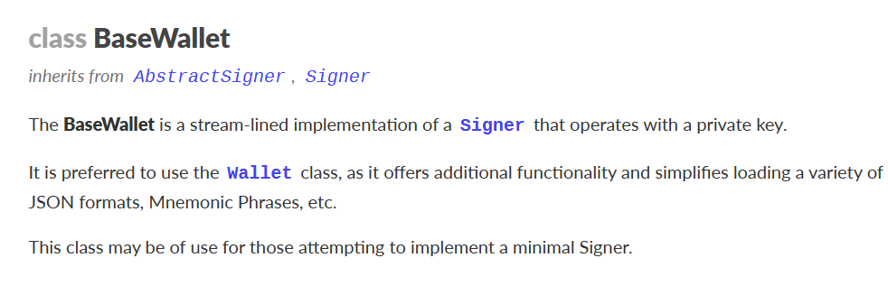
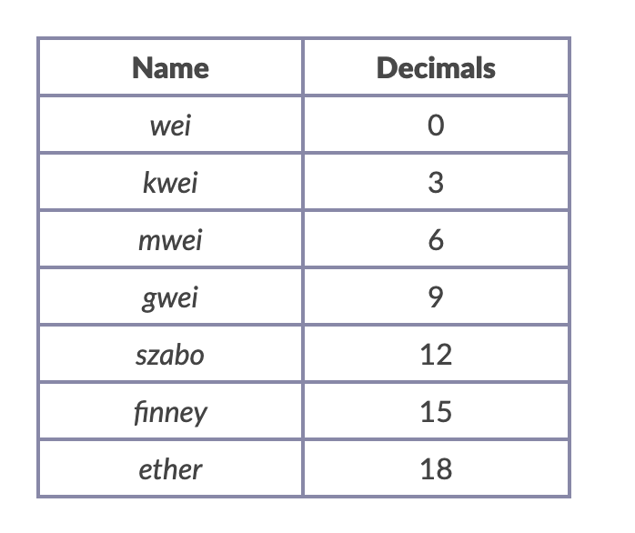

## Provider 链上查询操作

### 可读操作
`ehters.js` 内置的公共 `RPC`、或者自己申请的 `RPC` 新建 `provider`
```js
/* 个人 RPC */
const RPC_URL = '...'
const provider = new ethers.JsonRpcProvider (RPC_URL)

/* ethers 内置公共 RPC */
const providerDefault = ethers.GetDefaultProvider ();
```

链上查询操作
```js
/* 1. 查询链 */
const network = await provider.getNetwork();
console.log(`Current network: `, network.toJSON()); // 打印需要 toJSON，否则可能没法显示

/* 2. 查询区块高度 */
const blockNumber = await provider.getBlockNumber();
console.log(`Current block number: ${blockNumber}`);

// 3. 查询区块信息
const block = await provider.getBlock(blockNumber)
 console.log(`Block information: `, block);

// 4. 给定合约地址查询合约bytecode，例子用的WETH地址
const code = await provider.getCode(`0xC02aaA39b223FE8D0A0e5C4F27eAD9083C756Cc2`);
console.log(`WETH contract bytecode: `, code);

/* 5. 查询 vitalik 钱包余额 */
const balance = await provider.getBalance(`vitalik.eth`);
console.log(`ETH Balance of vitalik: ${ethers.formatEther(balance)} ETH`);

// 6. 查询 vitalik 钱包历史交易次数
const transactionCount = await provider.getTransactionCount(`vitalik.eth`);
console.log(`Transaction count of vitalik: ${transactionCount}`);

// 7. 查询当前建议的gas设置 feeData
const feeData = await provider.getFeeData();
console.log(`Current suggested fee data: `, feeData);
```

### Signer 可写操作

私钥生成数字签名（`Signer`），签名随信息一起发送，用来证明信息的来源及其完整性。
使任何人都可以使用公钥验证签名，确认信息是由私钥持有人发起，并且内容未被篡改。

使用浏览器 `BrowserProvider` 获取 `Signer`。会触发小狐狸交互
```js
const browserProvider = new BrowserProvider(ethereum: [Eip1193Provider], network?: [Networkish])
// new ethers.BrowserProvider(window.ethereum)

const signer = await browserProvider.getSigner(address?: number | string)⇒ Promise< JsonRpcSigner>
// const signer = await browserProvider.getSigner()
```

在 `ethers.js` 中，`Wallet` 类继承了 `Signer` 类，一般用 `Wallet` 对交易和消息进行签名。

## Wallet 钱包

在 `ethers.js` 中，`Wallet` 类继承了 `Signer` 类，一般用 `Wallet` 对交易和消息进行签名。
[]( https://docs.ethers.org/v6/api/wallet/#BaseWallet )
```js
/* 提供私钥、provider */
const wallet = new Wallet(privateKey: SigningKey, provider?: null | Provider)

/* 仅提供私钥，后续通过 connect 连接 Provider */
const wallet2 = new Wallet(privateKey: SigningKey)
wallet2.connect(provider) // connect 继承子 Signer
```


###  发起交易

```js
const tx = await wallet.sendTransaction(tx)
const receipt = await tx.wait() // 等待链上确认交易，获得收据
```

```js
// 利用私钥和provider创建wallet对象
const privateKey = '0x227dbb8586117d55284e26620bc76534dfbd2394be34cf4a09cb775d593b6f2b'
const wallet = new ethers.Wallet(privateKey, provider)

const address = '0xeBf9372997A1d7a14f4aDD0a80452B661b67a3f4'
const tx = {
	to: address,
	value: ethers.parseEther("0.001")
}
// 发送交易，获得交易响应
const tx = await wallet.sendTransaction(tx)
const receipt = await tx.wait() // 等待链上确认交易，获得收据
```


### 对消息进行签名，确认用户拥有某地址

```js
/* 客户端 */
// Our signer; Signing(签署) messages does not require a Provider 
wallet = new Wallet(privateKey) 
// Wallet { 
	// address: '0xC08B5542D177ac6686946920409741463a15dDdB', 
	// provider: null 
// }
message = "sign into ethers.org?" // Signing(签署) the message 
sig = await wallet.signMessage(message); 
// '0xefc6e1d2f21bb22b1013d05ecf1f06fd73cdcb34388111e4deec58605f3667061783be1297d8e3bee955d5b583bac7b26789b4a4c12042d59799ca75d98d23a51c' 

/* 服务端 */
// Validating a message; notice the address matches the signer 
// 校验信息成功，将会返回签名者的地址 
verifyMessage(message, sig) 
// '0xC08B5542D177ac6686946920409741463a15dDdB'
```


## Contract 合约

利用 `provider`（可读）、 `signer`（可读可写） 新建合约

### 可读

```js
new ethers.Contract(address, abi, provider)
```


```js
const abiERC20 = [
	"function name() view returns (string)",
	"function symbol() view returns (string)",
	"function totalSupply() view returns (uint256)",
	"function balanceOf(address) view returns (uint)",
];
const addressDAI = '0x6B175474E89094C44Da98b954EedeAC495271d0F' // DAI Contract
const contractDAI = new ethers.Contract(addressDAI, abiERC20, provider)
```

查询合约相关信息
```js
const nameDAI = await contractDAI.name() // 合约名称
const symbolDAI = await contractDAI.symbol() // 合约唯一代号
const totalSupplDAI = await contractDAI.totalSupply() //总供给
console.log("\n2. 读取DAI合约信息")
console.log(`合约地址: ${addressDAI}`)
console.log(`名称: ${nameDAI}`)
console.log(`代号: ${symbolDAI}`)
console.log(`总供给: ${ethers.formatEther(totalSupplDAI)}`)
const balanceDAI = await contractDAI.balanceOf('vitalik.eth') // 某人在合约内持仓
console.log(`Vitalik持仓: ${ethers.formatEther(balanceDAI)}\n`)
```


### 可写
```js
new ethers.Contract(address, abi, wallet)
```


```js
// 利用私钥和provider创建wallet对象
const wallet = new ethers.Wallet(privateKey, provider)

const abiWETH = [
"function balanceOf(address) public view returns(uint)",
"function deposit() public payable",
"function transfer(address, uint) public returns (bool)",
"function withdraw(uint) public",
];
// WETH合约地址（Goerli测试网）
const addressWETH = '0xb4fbf271143f4fbf7b91a5ded31805e42b2208d6' // WETH Contract

// 声明可写合约
const contractWETH = new ethers.Contract(addressWETH, abiWETH, wallet)
// 发起交易
const tx = await contractWETH.deposit({value: ethers.parseEther("0.001")})
// 等待交易上链
const receipt = await tx.wait()
```


### 模拟发起交易-检查 staticCall
`contract.函数名.staticCall()` ，模拟发起一笔交易，节省大量 gas。

以太坊节点有一个 `eth_call` 方法，让用户可以模拟一笔交易，并返回模拟的交易结果，但不真正在区块链上执行它。
```js
const tx = await contract.函数名.staticCall( 参数, {override})
console.log(tx)
```

`{override}`：选填，可包含以下参数：
- `from`：执行时的 `msg.sender`，也就是你可以模拟任何一个人的调用，比如 Vitalik。（`contract` 需要用 `provider` 构建，用 `wallet` 无法改）
- `value`：执行时的 `msg.value`。
- `blockTag`：执行时的区块高度。
- `gasPrice`
- `gasLimit`
- `nonce`


### 查询历史事件

```js
const transferEvents = await contract.queryFilter(eventName | contractFilter, fromBlock, toBlock)
```

查询某个事件名 `eventName`
```js
const block = await provider.getBlockNumber()
const transferEvents = await contract.queryFilter('Transfer', block - 10, block)
```


根据事件过滤器查询事件 `contractFilter`
```js
// 过滤器
const filter = contract.filters.EVENT_NAME( ...args )
```

```js
const filter = contract.filters.Transfer(null, myAddress)
const transferEvents = await contract.queryFilter(filter, block - 10, block)
```


### 监听事件
```js
contract.on(eventName | contractFilter, (...args) => {

})
```

可以传某个事件名 `eventName` 也可以传事件过滤器 `contractFilter`
```js
 contractUSDT.once('Transfer', (from, to, value)=>{
    // 打印结果
    console.log(
      `${from} -> ${to} ${ethers.formatUnits(ethers.getBigInt(value),6)}`
    )
  })
```


## BigInt 
### 场景

在 `ethers.js` 中，接受链上数据赋值时需要使用 `BigInt`，js 安全值 `Number.MAX_SAFE_INTEGER`。

```js
const oneGwei = ethers.getBigInt("1000000000")
```


> 许多计算都对超出 `JavaScript` 整数的安全值（js 中最大安全整数为 `9007199254740991`）。因此，` ethers.js ` 使用 JavaScript ES 2020 版本原生的 ` BigInt ` 类安全地对任何数量级的数字进行数学运算。


### 运算

```js
console.log("加法：", oneGwei + 1n)
console.log("减法：", oneGwei - 1n)
console.log("乘法：", oneGwei * 2n)
console.log("除法：", oneGwei / 2n)
```
> 数值带后缀 `n` 会自动转换成 `BigInt`

### 单位转换
`formatUnits(变量, 单位)`：格式化，小单位转大单位，用于显示余额。
```js
ethers.formatUnits(1000000000, "gwei")
```

`parseUnits`：解析，大单位转小单位，用于链上交互。
```js
ethers.parseUnits("1.0", "ether")
```


