## ETH -Ethereum

### 基本概念

以太坊，称为区块链 2.0，设计了新的共识机制 ghost，使得出块时间可以减少到十几秒。

以太坊的挖矿（Mine Puzzle）对内存要求很高，限制了 ASIC 芯片的使用（ASIC resistance），防止其在挖矿中占据绝对优势，使得普通人也可以参与挖矿。

PoS（Proof of Stake）权益证明，股份投票决定下一个区块怎么产生。

比特币（BTC）最小单位：Satoshi
以太币（Ether）最小单位：Wei

去中心化货币好处：
- 跨国交易（对比法币）

智能合约（Smart contract ）：去中心化合约
- 跨国，不担心司法不同
- 不可能违约（代码执行）
- 不可篡改

### 以太坊是一个交易驱动的状态机

通过执行区块里的交易，驱动系统的状态从当前的状态转移到下一个状态。

## 账户模式

### BTC 基于交易的模型

BTC 交易时需要说明资金来源且证明合法性，且必须将资金来源 UTXO 都花出去，创建新的 UTXO（支出和找钱），不能只花一部分。

BTC 没有余额状态，隐私保密性比较好。不知道某人有多少钱，得去查 UTXO 集合和追溯历史记录。

### 以太坊基于账户的模型

以太坊基于账户模型，全节点维护了余额状态，**交易时不需要说明资金来源**。可以只花一部分，不需要找钱。跟现实的银行相似。

天然防范了前后链形式的 Double Spending Attack。
但产生了对应的 Reply Attack（重放攻击），用计数器（Nonce）记录账号有史以来的交易次数，发布交易时包含这个计数器。

全节点利用状态树维护余额等状态。

状态树：
- 余额
- Nonce（交易次数，是一个计数器，理论上叫 Count 更好）：交易时携带，防范 Reply Attack

### 账户类型 

- Externally owned account：外部账户（普通账户），公私钥控制。
	- 余额
	- Nonce（交易次数，是一个计数器，理论上叫 Count 更好）：交易时携带，防范 Reply Attack
- Smart contract account：合约账户。合约可以调用合约，但不能主动发起交易。
	- 余额
    - Nonce（交易次数，是一个计数器，理论上叫 Count 更好）：合约可以调用合约，防范 Reply Attack
    - Code：代码
    - Storage：相关存储（变量），调用合约基本都是在修改存储（变量）。

### 为什么要有账户系统

以太坊需要支持智能合约，**要求参与者要有比较稳定的身份**，基于账户系统。

需要隐私性强时可以根据不同情况创建不同账户。


### 问题解答


一、合约需要稳定身份。比特币基于交易，隐私比较好，没有稳定身份。但是基于账户的以太坊也可以全部余额都花掉，打一枪换一个地方换一个账号。所以如何理解稳定身份。

BTC 是没有稳定身份的，没有一个稳定的值使得多笔交易可以联系起来。只有一个比特币地址，只能找到这个地址相关的交易记录的，那些未花费的 `P2SH` 甚者已花费但没有相同值的交易，是找不到的。

而以太坊的账户是一个稳定身份，所有交易都跟这个账户挂钩。一个账户地址是可以找到所有跟这个地址相关的记录的。

以太坊中换一个账号相当换一个身份，虽然换了身份，但这些身份是稳定的。合约可以跟这些稳定的身份进行交互。


## 以太坊的数据结构


### Block

区块的定义
```
header：块头的指针
uncles：叔父区块的指针，数组
transactions：交易列表
```
其他都不怎么重要

### Extblock


真正在以太坊区块链上发布的结构，还是这 3 项。

### Header


块头的定义
```
ParentHash：上一个区块块头 hash
UncleHash：叔父区块 hash
Coinbase：出块矿工的地址
Root：状态树根 hash
TxHash：交易树根 hash
ReceiptHash：收据树根 hash
Bloom：跟收据树相关，提供高效查询。由所有收据的Bloom Filter并集得到
Difficulty：挖矿难度，动态调整
Number：块序号
GasLimit：区块里所有交易总和最大消耗汽油费的上限，可以根据上个区块上下微调 1/1024。跟比特币最大不能超出1M类似，起到一个限制大小的作用。不同的是，以太坊中的 `GasLimit` 的最终大小是由区块链所有矿工共识的结果。
GasUsed：区块里所有交易消费的总汽油费
Time：出块时间
Extra：允许矿工放置一些额外的数据
MixDigest：经过Nonce计算得出的一个随机值，与以太坊的挖矿算法（Ethash）密切相关的
Nonce：挖矿随机数
```

？MixDigest 是啥


## 状态树

### 基本概念

状态树：账户地址到账户状态的映射 `addr -> state` 存储的数据结构

以太坊账户地址：160 bits（位） 即 20 bytes（字节），一般表示为 40 个 16 进制的数。（1 Bytes 等于 2 个 16 进制）

账户地址是由公钥取 hash 后的公钥哈希进行编码，截断用后面 160 位作为账户地址。
以太坊账号地址和 BTC 钱包地址是不通用的，公钥取 hash 算法不同。

### 哈希表 + Merkle Tree

哈希表 `addr: state`，哈希表的查询、更新和插入效率都很好。但是无法做到验证。

Merkle Tree 可以维护所有全节点的状态一致性，验证余额等状态可以用 Merkle Proof 验证。

使用哈希表存储 `addr: state` 的映射，这样方便更新和查找，随后使用哈希表构建 Merkle Tree ，可以解决验证问题。

**每次更新使用哈希表更新，随后用哈希表构建整个 Merkle Tree，方便后续进行 Merkle Proof 验证。**

但每次出块时会执行交易，只有很小一部分状态改变，需要更新这部分哈希表，还是需要重新构建整个 Merkle Tree，代价太大了。

**哈希表 + Merkle Tree**
**优势：查询、更新效率高**
**问题：哈希表重新构建整个 Merkle Tree，代价太大了。**

每次都用哈希表构建整个 Merkle Tree 成本太大了。那能不能直接使用 Merkle Tree 存储数据，放弃哈希表，这样就不需要每次都重新构建了。

> BTC 构建 Merkle Tree 只有区块内的相关交易，体量小，重新构建成本低。

### Merkle Tree

上一步是**每次更新使用哈希表更新，随后用哈希表构建整个 Merkle Tree，方便后续进行 Merkle Proof 验证。**

我们想要的是每次更新都是直接更新 Merkle Tree，而不是构建新的 Merkle Tree，所以此处舍弃哈希表。

使用 Merkle Tree 直接存储状态，这样出块时，区块内涉及的状态更改，只要能找到他们在 Merkle Tree 的位置，就能只更新 Merkle Tree 小部分 hash。

问题是，Merkle Tree 没有提供一个快速查询、更新的方法。找他们在 Merkle Tree 的位置成本大，需要遍历 `O(n)`，即遍历所有的账户。


**Merkle Tree**
**优势：如果有提供高效的查询、更新方法，就不需要重构整个 Merkle Tree**
**问题：**
- **没有提供高效的查询、更新方法**
- **没法高效证明一个账户不存在**
- **叶节点的顺序不一致，每个节点的 Merkle Tree 不是唯一的，导致计算后的 root hash 不一致。**


为了解决这些问题，需要最底下的那一层排序，即叶节点排序，Sorted Merkle Tree。

### Sorted Merkle Tree

BTC 不排序没有唯一性问题，是因为只有记账人选择交易，决定按怎样的顺序构建 Merkle Tree，确定了唯一的 Merkle Tree，其他人只需要对这个已确定的 Merkle Tree 进行验证。

以太坊所有账号的数据量太大了，没法跟 BTC 一样不排序由记账人发布到区块里，成本太大。

所以状态树需要使用 Sorted Merkle Tree，这样可以提供高效查询、更新的方法、能高效证明一个账户不存在、也能构建唯一的树。

但产生新账户进行插入时，会重新构建整个 Sorted Merkle Tree，成本太大。


**Sorted Merkle Tree**
**优势：提供高效查询、更新的方法、能高效证明一个账户不存在、也能构建唯一的树**
**问题：产生新账户进行插入时，会重新构建整个 Sorted Merkle Tree，成本太大。**

为了解决产生新账户进行插入时会重新构建的问题，可以使用前缀树 Trie

### Trie


Trie 数据结构（retrieval 信息检索，字典树，前缀树）是一棵多叉树，使用键值（key）查找。

特点：
- 开销较大，即使只有 1 分叉，也会单独存在节点。树的高度变得很大
- 查找效率由键值（key 账号地址）的长度决定，例如以太坊账户地址是 40 个 16 进制，就需要访问内存 40 次。
- 每个节点的分叉数目最多 17 个，根据键值（key）取值范围：`0-f`，加上结束标记位。
- 账户地址不一样，不会出现碰撞
- 可以高效查询、局部更新
- 不同节点利用相同输入，构成的 trie 是唯一的
- 插入新节点不需要重新构建整个树

**Trie**
**优势：可以高效查询、局部更新、也能构建唯一的树、插入新节点不需要重新构建整个树**
**问题：中间路径节点浪费存储，也降低了查找速度。**

为了解决中间路径节点浪费存储，降低查找速度的问题，可以使用路径压缩前缀树 Patricia Tree。

### Patricia Tree (PT)


路径压缩前缀树 Patricia Tree，压缩了路径的 trie。

Patricia Tree（PT）：
- 所有 1 分叉的路径会压缩成一个，树的高度降低，访问时内存读取次数减少。
- 如果添加新账号有新的 key 路径导致增加分叉，压缩的路径会扩展开。
- 键值（键这个值）分布比较稀疏的压缩效果比较好。

键：账户地址，160 位二进制，取值范围 2^160 特别特别大，抗碰撞性。所以账户地址在这个超大的取值范围内分布很稀疏。

**Patricia Tree（PT）**
**优势：具有 Trie 的优点，且压缩路径减小存储，提高查找效率。**


### Merkle Patricia Tree (MPT)

指针区别
- Binary Tree 是内存指针
- Merkle Tree 是哈希指针

同样的
- Patricia Tree (PT) 是内存指针
- **Merkle Patricia Tree (MPT) 是哈希指针**

Merkle Patricia Tree（MPT）：对比 PT 把普通指针换成 hash 指针，MPT 也是一棵 Merkle Tree

所有的账户组织成一棵 Patricia Tree（PT）用路径压缩提高效率，把普通指针换成哈希指针 Merkle Patricia Tree（MPT），这样就可以生成一个根 hash 放在 Block Header。

Root hash 作用：
- 防篡改，root hash 不变，所有用户的状态都没被篡改。
- 提供 Merkle Proof 可以验证状态
- 证明某个账户不存在（先假设其存在，用 Merkle Proof 去验证，验证失败就是不存在）


### Modify MPT


以太坊用的是 Modify MPT，对 MPT 做了些修改。
- 路径压缩时会产生 Extension Node。
- 产生分叉时，会产生 Branch Node。
- 大部分节点都是共享的。
- 状态修改通过新建分支修改


每次发布区块时，大部分节点都是共享的。

合约账号的存储（Storage）也是用 MPT 保存，以太坊是一棵大的 MPT，包含了很多小 MPT，每个合约账号的存储都是一棵小 MPT，也是会共享节点。

状态不是在原状态树上改的，而是新建分支进行修改，原来的状态会保留着（为了回滚）。例如上面的 29 改为 45，就是新建了这一条新分支，然后重新 hash 给它的父节点都更新 hash，原分支在上一个区块还是保留着。

每次新区块状态的修改，都是新建 MPT 不在原分支改，是为了保存历史状态便于回滚：
以太坊出块 10 几秒，临时性的分叉很常见，需要回滚。而智能合约执行相当复杂，回滚困难，需要保存历史状态便于回滚。

状态树将系统中**所有账户的状态**都包含进去，不管这些账户和本次区块交易有没有关系，区块里会共享节点，只有本次区块涉及状态修改的账户会新建分支，其他账号都是共享节点。

### RLP 递归长度前缀

Key 的管理方式解决了，状态 value 是如何存储的。
状态 value 是通过 RLP 编码去做序列化，无论原始数据是什么类型，结果都会是一个字节数组，再去存储。

RLP（Recursive Length Prefix）递归长度前缀：特点是简单，只支持字节数组。

### 问题解答

一、以太坊的状态为什么不跟 BTC 一样，由记账人用 Merkle Tree 形式写到区块里。
所有账户状态数据量太大了，成本太高。BTC 只写了当前区块的交易信息，而以太坊是所有账户状态数据，高了好几个数量级。

单纯的 Merkle Tree 解决不了问题，需要用到 Trie 构建唯一树，每个区块只存储本次区块涉及的交易状态，只有小部分状态改变，其他状态都是共享节点，这样可以避免每次出块重复发布。。

二、以太坊的 Modify MPT 是如何生成 root hash 的。BTC 底层都是交易，并没有路径节点存在，路径节点都是通过底部一层节点的 hash 后生成的路径节点，存的都是 hash，最后产出 root hash。那以太坊有路径节点，hash 怎么存


产生分叉时，会产生 Branch Node，里面存储的就是底部一层节点的 hash。路径压缩时会产生 Extension Node，它的 next node 存的也是底部一层节点的 hash。

有一个点注意，存 hash 也是需要内存地址去存的。MPT 只不过存的内容多一点。
即使是 BTC 的 Merkle Tree，也不是说没有路径节点，仅仅是单纯一个 hash 就能空放在那里，计算机的实现上也是分配了一个内存地址，上面的空间存储这个 hash。而以太坊的 Modify MPT 对应的路径节点存储的信息更多，占的空间大一点而已。


三、状态树能不能改成只包含区块里交易相关的状态，不含有公共节点，这样就跟交易树/收据树一致，且大幅度削减了大小

这么设计，每个区块都没有完整的状态树，只有当前区块交易涉及的状态。
当前区块的交易在验证时，要给收款人余额加钱，需要找到收款人余额状态。需要沿着区块链，一个个区块找，直到找到该状态。如果收款人是新账号，需要找到创世纪块，效率特别低。


## 交易树

### 基本概念
每次发布区块，区块里的交易组成交易树，跟 BTC 差不多，但用的是 MPT ，MPT 对比 Merkle Tree 的好处是可以利用路径快速查找。

路径不是用账号，而是交易在**区块里的序号**，由记账人决定的顺序。

每个交易树的叶节点都是一笔交易。

交易树只有**当前区块**的交易，交易树在不同区块里都是相互独立的，不会共享节点，也没有共享这个必要。收据树也一样。

### 作用

提供 Merkle Proof 供节点验证。

支持复杂的查询操作，例如查询限定时间内的某个智能合约的所有交易。


## 收据树

### 基本概念

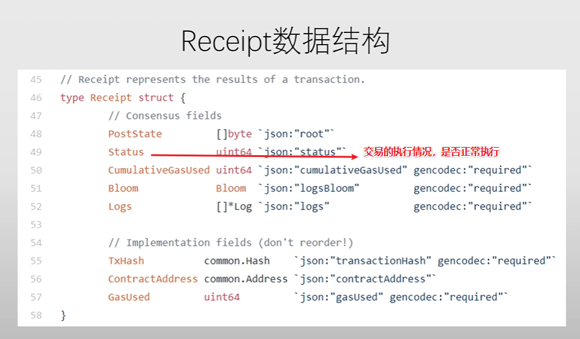

每个交易执行完，会形成一个收据，跟交易树的节点是一一对应的，数据结构也是 MPT。

每个收据树的叶节点都是一笔交易对应的收据，收据的 `logs` 存放了交易的元素，例如交易类型、交易地址等信息，`logs` 最后用来生成 `Bloom Filter`。

智能合约执行过程复杂，添加收据树有利于高效查询。

> 当合约函数执行，事件被触发时，事件会被记录在收据的日志（logs）中。这些日志信息随后被存储在区块链上，使得任何人都可以查询和监听这些事件。`logs` 中就有 `topics` 字段，用于记录事件的签名和所有索引事件参数的值，会映射在 `Bloom Filter` 中，便于快速检索。

###  Bloom Filter

**可以高效的查找某个元素是否在一个比较大的集合里**，可以用于快速过滤掉大量无关的区块，从而达到高效查询。

**每个交易会形成一个收据，收据里就有个 Bloom filter，简短地记录交易的类型、地址等信息。**

Bloom filter 本身是一个 128 位的摘要（digest），由集合里每个元素 hash 映射得出。具体实现：
每个元素 hash 后，映射到摘要里一个位置，将 0 改为 1，代表存在。（不是计数器，只是个标记，0 不存在，1 存在。）

注意，我这里讲的是**元素**，一笔交易是有很多元素的，例如交易类型，交易地址等，这些信息都是元素。所以**一个交易的许多元素都被哈希函数处理，并映射到 Bloom Filter 中的多个位置上。**
当使用 Bloom Filter 以检查某些特定的事件类型或地址的交易是否存在时，你会使用相同的哈希函数序列来计算这些查询元素的位置，如果这些位置都是 1，则证明满足要求的交易可能存在。

区块的块头也有一个总的 Bloom filter，是这个块里所有交易的 Bloom filter 的并集。

假设我们要查找一个具有特定类型交易：
- 先在区块块头的 Bloom filter 有想要查找的类型
	- 没有的话代表这个区块不是我们想找的。
	- 有的话，再去查找区块的收据树里每个收据的 Bloom filter，找到再向全节点索要更多其他信息进行确认，防止误报。

这样可以快速过滤掉大量无关的区块。

Bloom filter 特点：
- False positive 可能出现误报（出现哈希碰撞）。
- 不会出现漏报。

Bloom filter 计算用的哈希，可能是用 1 个哈希函数，也有可能是用 1 组哈希函数对一个元素进行映射。用 1 组哈希元素出现多个元素碰撞的概率比较低。

简单的 Bloom filter 不支持删除操作，因为里面不是一个计数器。


## Ghost 协议

### 基本概念

以太坊网络底层是 `P2P`，网络传播需要时间。以太坊缩短出块时间至 13~15s，就需要新的共识协议。

以太坊每一个区块的出块收益 `block reward` 是 3 以太币，以太坊没有规定出块收益减半。

设计叔父区块 `uncles` 的目的：
- 解决短时间出块频繁出现的临时性分叉
- 出现分叉时，矿池会沿着自己的区块挖，出块概率大，小矿工的区块大概率被舍弃。有了 `uncles` ，减少矿池相对于小矿工的优势，有利于网络的去中心化。


叔父区块 `uncles`，只认可 7 个共同祖先（抛开父级，也就 6 个层级。父级的子节点是当前节点的兄弟节点不算叔父），`uncle reward` 从 7/8 递减到 2/8。
`uncle reward` 递减，且只认可 7 个共同祖先：
- 鼓励系统出现分叉时，及时进行合并。
- 避免主动进行分叉

`uncle` 的只认可单独一个区块，`uncle` 后续的区块不认可：
- 避免降低发动 `Forking Attack` 的攻击成本。

记账人发布区块时，最多认领 2 个 `uncles`，每一个收益是 1/32。

为了避免交易冲突，`uncles` 区块的交易并不会被执行，所以 `uncles` 只有 `uncle reward`，没有 `gas fee` 收益。且不需要检查交易的合法性，只检查 `Block Header` 是否合法。

检查 `Block Header` 是否合法，只需要检查
- 挖矿难度没有篡改
- `Nonce` 符合挖矿难度 (实际上是整个块头 hash 满足挖矿难度)
- `Parent Hash` 正确
- `Time` 出块时间不会比父区块早
- `Number` 块号高度在 7 个区块内
不需要检查 3 个 root hash

> Uncles 是在 PoW 机制下才有的，以太坊目前已经转换成 PoS 了，不会再有 Uncles 产生。

### 记账人矿工的收益在铸币交易中获得，叔父区块的 uncle reward 是如何获得的

区块链浏览器找不到 Coinbase 也找不到 uncle reward 对应的交易。因为以太坊是账户模式，不是基于交易模式，比特币才需要有对应的交易以得到 UTXO，以太坊只要状态有变更即可。


上面会对 uncles 的出矿人账户添加 1.75 ETH，而本区块的出块人账户添加了 1 个 uncles 则加了 `2 * 1/32 = 0.0625`。

`0.35836` : 交易的手续费。

`-0.2714`: 基础费用。基础费用（base fee）机制。网络繁忙时，基础费用上升；网络空闲，基础费用下降。这个基础费用是自动计算的，避免交易费用急剧上升。这意味着每当有交易发生时，一定数量的以太币被自动销毁。这种机制的引入，理论上减少了以太坊的通货膨胀率。

> 在 PoW 机制的最后阶段，区块奖励 static reward 已经改成 2 了。以太坊转换到 `PoS`，不挖矿了，static reward 为 0。


## 扩展-挖矿算法（PoW）
### Memory hard mining puzzle

ASIC resistance：ASIC 硬件成本全投在计算，计算的优势大，但内存优势很小。提高挖矿算法的内存需求可以对 ASIC 芯片限制。

LiteCoin 的挖矿算法 scrypt：
**生成大内存数组**：使用内存去存储一个比较大的数组，这个数组由 hash 构成。使用 seed（种子）进行 hash 生成第一个元素，后续每一个元素由前一个元素 hash 得到。生成的数组，前后元素有依赖关系。
**挖矿**：随后用 Block Header 进行 hash 得到第一个坐标，取坐标上的值，后一个坐标靠前一个坐标上的值进行 hash 后计算得出，循环至第 128 次，对坐标上的值进行的 hash，最后与目标阈值对比，满足则挖矿成功。读取的顺序前后有依赖关系。

Scrypt 算法必须存储数组，否则计算复杂度大大提高。做到了挖矿难，需要大内存。但轻节点验证也很难，需要大内存。担心轻节点无法负担大内存，LiteCoin 定了 128 kb，到后期 128 kb 内存也无法做到 ASIC resistance。

LiteCoin 的思路是对的，用内存限制 ASIC，但还需要再提高挖矿的内存需求才能真正限制 ASIC，同时需要降低验证时的内存需求。

> 以太坊转换到 `PoS`，不挖矿了


### 以太坊挖矿算法 Ethash

为了解决验证时内存高的问题

以太坊用两个数据集
- 小数据集（`Cache`）：起始大小 16 M ，**用于轻节点验证**。
- 大数据集（Dataset 简称 `DAG`）：起始大小 1 G，由小数据集生成，**用于挖矿**。

数据集大小会定期增长，因为计算机内存容量也是定期增长。

每 3 w 个区块（大概 4 天）会重新生成 seed（对上一个 seed 进行 hash），用新的 seed 重新生成 `cache`，且 `cache` 的容量增大 128 kb。 `DAG` 也会因为 `cache` 重新生成而重新生成，`DAG` 容量增大 8 M。


### 生成 cache

`cache` 初始大小为 16 M，`cache` 每个元素都是 64 字节的 hash 值（即128 位 16 进制）。

`cache` 元素的生成非常简单：
- 第一个元素为种子 seed 的 hash
- 后续每一个元素是前一个元素的 hash。

`cache` 的作用：
- 生成 DAG
- 供轻节点验证

每 3 w 个区块（大概 4 天）会重新生成 seed（对上一个 seed 进行 hash），用新的 seed 重新生成 `cache`，且 `cache` 的容量增大 128 kb。

### cache 生成 DAG

`DAG` 初始大小为 1 G，由 `cache` 生成。下一次的位置都是用当前 `cache` 元素的值计算得到，访问顺序不可事先预知，满足伪随机性。

生成 `DAG` 第 i 个元素：
1. 生成初始哈希：使用 `cache[i]` 和 `i`  进行 hash 后得出一个哈希值
2. 哈希生成下标：这个哈希值经过处理后得到一个下标
3. 读取下标的值：在 `cache` 上读取该下标位置的值。
4. 生成哈希值：读取的值与前面的哈希进行处理得出新的哈希。
5. 上述 2-4 步操作迭代 256 轮，最后得到一个 64 字节的哈希值作为 DAG 第 `i` 个元素。

`cache` 和 `DAG` 每个元素都是 64 字节的 hash 值（即 128 位 16 进制）。

每 3 W 个块时（大概 4 天）由于 `cache` 更新而同步更新，且增大 8 M。

### 大数据集 DAG 前后两个元素有联系吗

没有什么联系，他们虽然相邻，但生成的过程是独立的。

根据其下标及 `cache` 对应下标的值生成初始哈希，哈希处理得到下一个下标，进行 256 次迭代生成。

### DAG 挖矿

挖矿时，用的是大数据集 `DAG`。根据 block header，算出初始 hash。映射到大数据集的一个坐标上，读取坐标上的值。随后用这个值 hash 后进行处理得到下一个坐标。且每次读取时连同相邻的值也读出，一次性读出两个值。循环 64 次，最后算出一个 hash，跟目标阈值对比，满足则挖矿成功。


挖矿：与 `cache` 生成 `DAG` 类似
参数：块头，nonce，`DAG` 元素个数，`DAG`
1. 生成初始哈希：块头和 nonce 进行哈希
2. 哈希生成下标：这个哈希值经过处理后得到一个下标
3. 读取下标的值：在 `DAG` 上读取该下标及其相邻位置的两个值
4. 生成哈希值：读取的值与前面的哈希值进行处理得出新的哈希值，两个值则进行两遍。
5. 上述 2-4 步操作循环 64 轮，最后进行哈希得到一个 32 位哈希值，与挖矿的目标阈值进行比较，满足则出块。


### 轻节点验证 cache

轻节点验证：与挖矿的区别，轻节点没有大数据集 `DAG`，而是**实时用 `cache` 算出所需位置对应的 `DAG`，相当于用时间换空间。** 

虽然验证代价比比特币高，但在可接受的范围内。

参数：块头，nonce，`DAG` 元素个数，`cache`
1. 生成初始哈希：块头和 nonce 进行哈希
2. 哈希生成下标：这个哈希值经过处理后得到一个下标
3. 读取下标的值：使用 `cache` 生成对应下标的 `DAG` 元素，读取该下标及其相邻位置的两个值
4. 生成哈希值：读取的值与前面的哈希值进行处理得出新的哈希值，两个值则进行两遍。
5. 上述 2-4 步操作迭代 64 轮，最后进行哈希得到一个 32 位哈希值，与挖矿的目标阈值进行比较，满足则验证成功。


### 伪代码

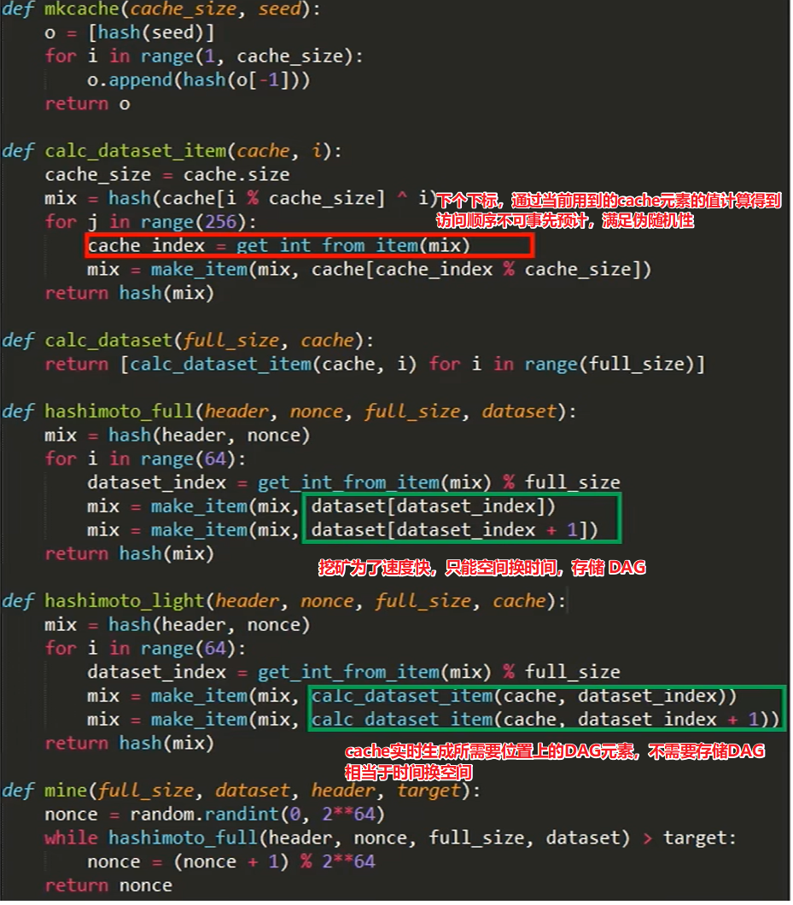


### Pre-mining (预挖矿)

不是真正的挖矿，而是当初发行货币的时候，在**创世纪块**里，
- Pre-sale：以众筹的形式，在以太坊发行时，别人可以购入这些预留货币，如果未来这个加密货币发展好，这些人可以赚一笔钱。
- 预留一部分给开发者，早起的以太坊开发者都很富有。

以太坊中的 pre-mining 量相当大，7200 万 ETH（6000 万是众筹，1200 万给社区或开发者），解决了冷启动的问题。

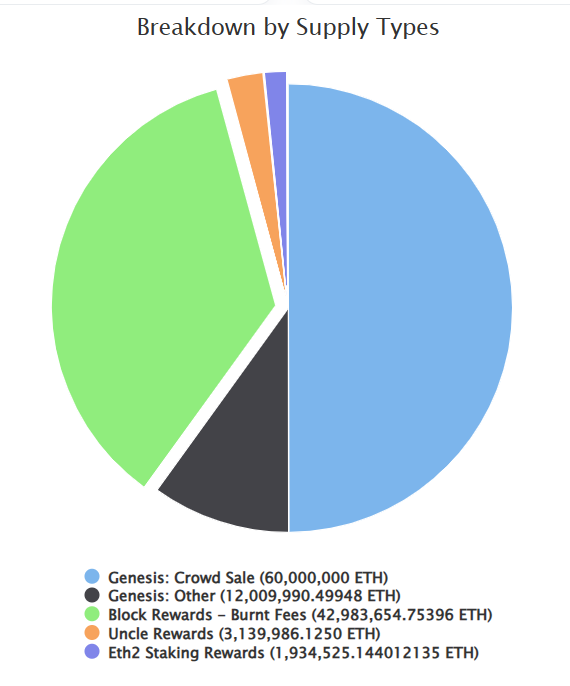


### 能否不验证其他区块的合法性，直接信任
 
 **独立验证**区块的合法性很重要，必须自己执行一遍所有交易，不能不验证而直接信任。否则危害区块链的安全性。
 而且最重要的是，跳过验证这个过程，本地的三棵树是不正确的，无法继续挖矿。必须自己执行一遍所有交易，更新本地三棵树，才能继续挖矿。

### 能否直接抄其他全节点的数据，这样也可以更新三棵树且不用验证

直接复制数据的来源，可能是一个恶意节点，恶意节点的目标是增大同伙数量，它希望感染你的本地数据增加它的攻击力度，代替它发动双花攻击等。而你却无法真正的挖矿了。

同步其他全节点数据的速度，远远不如自己执行验证区块的合法性来的快。


? 为什么说以太坊发布的区块里，没有 3 棵树的状态，只有块头的 3 个哈希，3 棵树的状态需要执行交易去更新。我认为最长合法链的区块里有 3 棵树的状态，否则存哪呢

## 扩展-难度调整

### 基本概念

比特币是 2016 个区块调整挖矿难度，使得出块时间维持在 10 分钟左右。

以太坊是**每个区块都有可能调整挖矿难度**，维持出块时间维持在 15 s 左右。

> 以太坊转换到 `PoS`，不挖矿了

### 计算公式


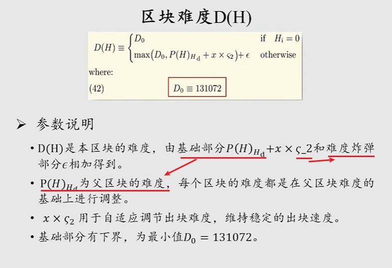

本区挖矿难度：基础部分 + 难度炸弹。

基础部分：上个区块的难度 + 加上自适应难度

### 自适应难度

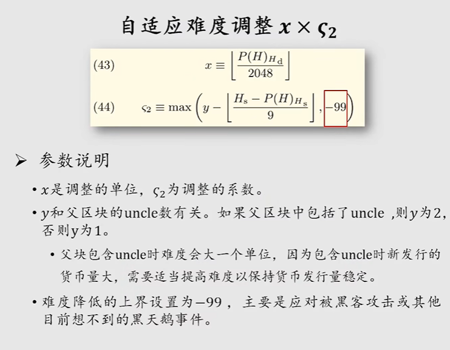

自适应难度：由调整单位（力度） x，和难度系数 `c` 决定。

难度系数 `c`： 由出块间隔，和有没有 uncle 决定。

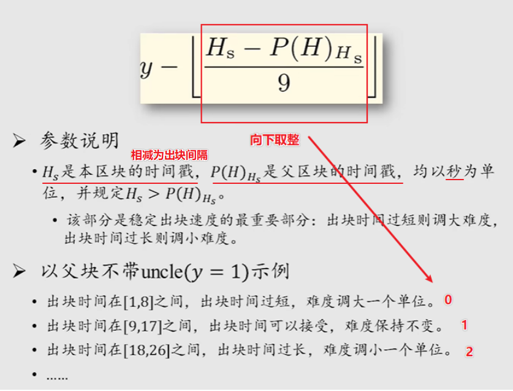


### 难度炸弹

服务于 PoS，避免矿工后续不愿意从 PoW 转入 PoS。

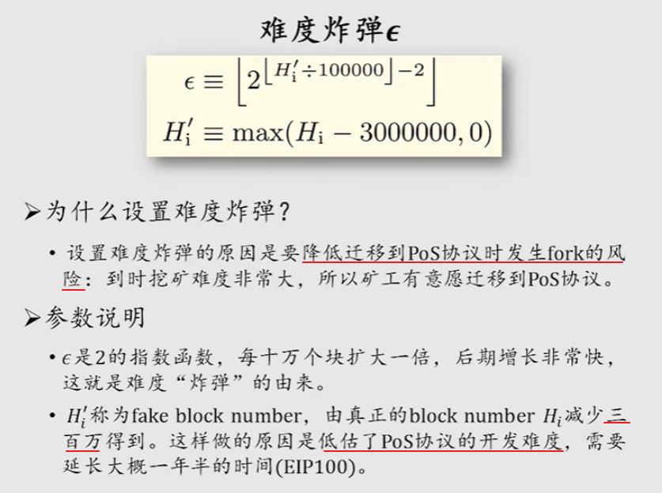

难度炸弹是指数函数
- 一开始区块少，block number 小，难度炸弹不显现，难度还是由自适应难度控制。
- 后续区块高度高了，block number 大，增长速度非常恐怖，难度炸弹的威力越来越明显，难度由难度炸弹控制。


由于低估了 PoS 开发难度，而难度炸弹威力越来越大，出块时间从 15 s 到 30 s。

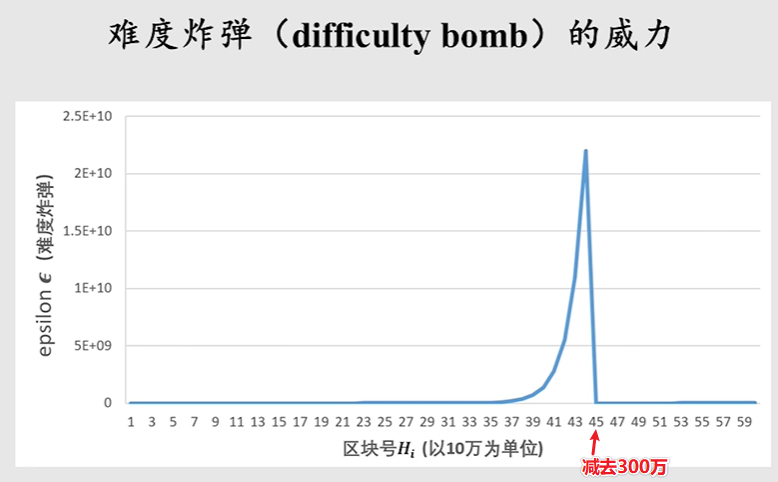

以太坊在 EIP (Ethereum Improvement Proposal)决定，计算区块高度时减去 300 万，为 PoS 开发争取时间，同时出块奖励从 5 个比特币改为 3 个比特币（难度降低，奖励需要降低维持稳定）。

>EIP： 以太坊社区提供一个公开、透明的改进机制，任何人都可以撰写提案。


## PoS（Proof of Stake 权益证明）

### 基本概念

**2022 年9 月15 日** 以太坊将其共识机制从工作量证明（PoW）过渡到权益证明（PoS）。

`PoS(Proof of Stake)` 不挖矿了，类似股份制公司用股票份额进行投票，真正 ASIC resistance，也解决了能耗问题，省电。

PoW：给矿工出块奖励，激励矿工参与区块链的维护。矿工投入资金买设备，设备具有越高的算力占比，最后会获得越高的收益。**本质上是投入的资金越高，获得的收益越高。**

PoS：舍弃算力，**按照投入资金的多少，来决定收益的分配**，这就是权益证明的基本思想，虚拟挖矿（Virtual mining）。
优点：
1. 解决能耗问题，省电。
2. 降低 51% 攻击的风险。


### PoS 为什么更能抵抗 51% 攻击

在 PoW 工作量证明中，**算力是投票权**。投票权可以从外界快速转化得到，通过外部资金可以换设备从而快速转换为算力。**维护安全的资源不是一个闭环**。

在 PoS 权益证明中，**币种份额是投票权**，**发动攻击的资源只能从加密货币系统内部得到**。外部资金需要买到获取该币种发行量 51% 的币才能发动攻击，而市场中有大量购入，币的价格会暴涨，难度进一步提高。**维护安全的资源是一个闭环**。


### Pos 设计的挑战 Nothing at Stake

两边下注的问题，出现分叉时：
- PoW 是沿着最长合法链挖，而不是两边都挖，因为算力分散出块概率低。
- PoS 投票人可以一份币在两个分叉上都使用，并不会影响出块概率。

PoS 用验证者（validator）作为投票人解决这个问题：
投入保证金成为验证者，职责是推动系统达成共识，通过 Casper FFG 投票决定哪一条是最长合法链，投票权重是保证金份额。

验证者：
- 履行职责后会得到奖励
- 不作为导致系统迟迟达不成共识，会扣除一定保证金（销毁以太币）
- 两边下注，乱投票，没收所有保证金（销毁以太币）

验证者任期满了后，需要经过等待期才能取回保证金和奖励，期间受其他节点的检举进行惩处。

？PoS 谁是记账人呢，那么多个验证者
### Casper the Friendly Finality Gadget (FFG)

Casper FFG 是 PoS 共识机制的重要组成部分，对区块链进行“最终确定”，这意味着一旦某个区块被 Casper FFG 验证过，就被永久性地接受到区块链上，不会被其他分支取代。

1 个 epoch（纪元） 为 50 区块，本 epoch 是上一个 epoch 的 commit message，是下一个 epoch 的 prepare message，两轮都得到 2/3 及以上份额的投票才算有效。

**拜占庭容错**：Casper FFG 的设计考虑到了拜占庭容错性，即在面对一定比例的恶意节点（最多 1/3）时，网络依然能够达成一致并正确运行。通过要求超过 2/3 的验证者达成共识，即使有最多 1/3 的验证者行为不当，系统的最终确定性也不会受到威胁。


？两个 message 是啥，对这个过程有什么帮助
？验证者投票 50 区块一次？这个过程是怎样的

### Static reward 为 0，谁去当记账人

静态区块奖励（即通过挖矿产生的新币）不再存在，取而代之的是基于质押和验证者参与度的奖励体系。

**随机选一位验证者去当记账人**：利用一种随机但可预测的算法来选择一个验证者提议下一个区块。这个算法会考虑各个验证者的质押量（即他们锁定的以太币数量），以及其他因素，确保选择过程是公平和去中心化的。

记账人对比其他验证者可以获得更多的收益：
- 交易费
- 区块提议奖励：根据网络的状态和质押经济动态调整。

其他验证者将检查这个新区块的有效性。如果区块被认为是有效的，其他验证者会在其上投票，通过这种方式为区块链添加这个新区块。


## 智能合约

### 基本概念

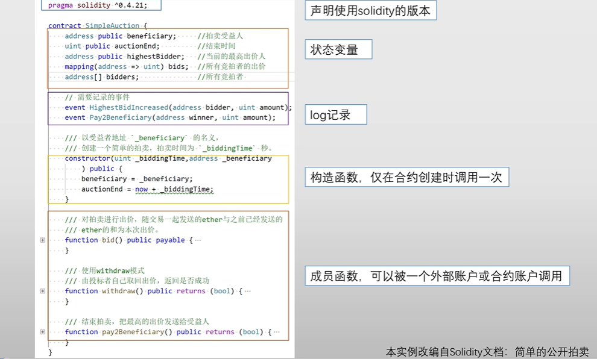

智能合约是运行在区块链上的一段代码，包含以下几部分
- 状态
- Log 记录
- 构造函数，只会在创建合约时调用一次
- 成员函数，可以被外部账户或合约账户调用

### 状态

智能合约账号保存了合约当前的状态：
- Balance：当前余额
- Nonce（交易次数，是一个计数器，理论上叫 Count 更好）：合约可以调用合约，防范 Reply Attack
- Code：代码
- Storage：相关存储（变量），调用合约基本都是在修改存储（变量）。

### Log 记录

`event`  声明了一些需要记录的事件，用来输出日志。合约执行成员函数时，将会用 `emit` 调用这些事件 `event`  去输出日志。
作用：对于程序的运行逻辑没有任何影响，仅仅输出日志。

### 构造函数

使用 `constructor` 定义一个构造函数，只会在创建合约时调用一次

### 成员函数

成员函数，可以被外部账户或合约账户调用，从而改变合约的状态。

标注：
- `payble`：以太坊规定合约账户的成员函数，如果**能接受外部转账**的话，必须标注 `payble`。

`fallback` 函数：一个匿名函数，没有函数名、参数、返回值，供缺省时调用（转账的 data 为空或者无匹配）。如果要能接受外部转账，需要标注 `payble`。

所以转账给智能合约账户，即使不添加任何 `data`，只要合约有 `fallback` 匿名函数，转账本身就会调用合约的函数。


### 外部账户调用智能合约

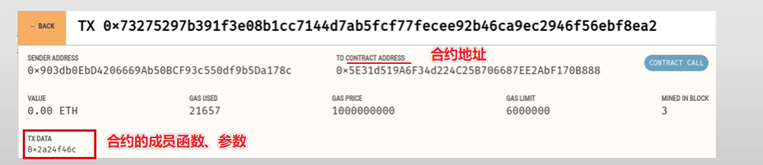

外部账户发起一笔转账，收款人为合约地址，在留言 data 数据中写明调用合约的哪个成员函数和参数，这样就可以调用智能合约。

### 智能合约调用智能合约
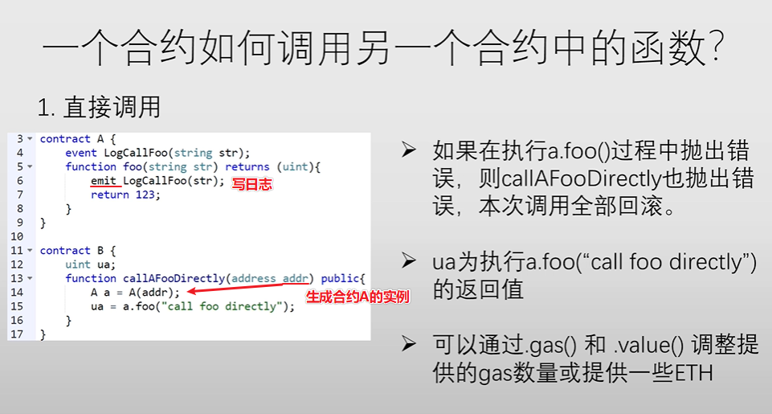

以太坊中规定，一笔交易只能由外部账户发起，合约调用合约的前提，是要有外部账户调起第一个合约。

**地址创建实例直接调用**：B 合约调用 A 合约时，属于地址创建实例直接调用。执行 A 合约的成员函数时，需要切换到 A 合约的环境中去执行。如果 A 合约的 foo 成员函数方法报错，整个交易包括 B 合约的操作都会回滚。


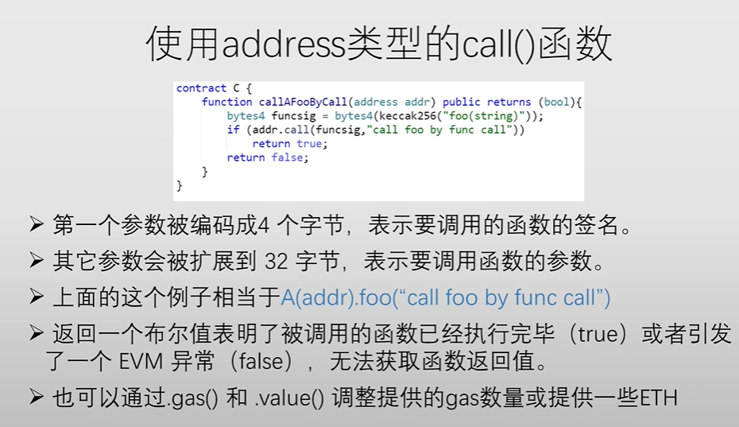

**地址 call 调用**：C 合约调用 A 合约时，使用地址 call 调用。执行 A 合约的成员函数时，需要切换到 A 合约的环境中去执行。如果 A 合约的 foo 成员函数方法报错，只有 A 合约的操作回滚，C 合约的操作不会被回滚。

前提要有 A 合约的签名。


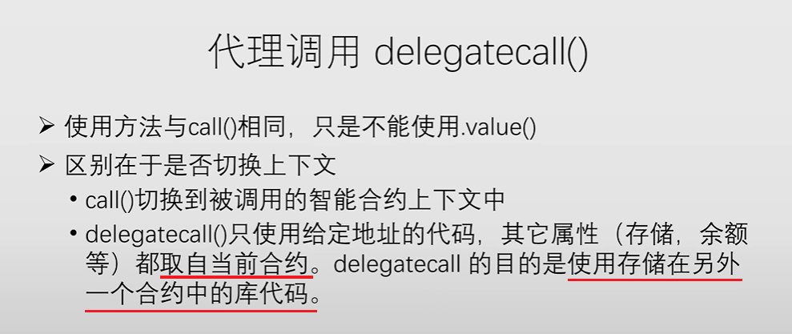

Delegatecall：与 call 类似，但无需切换调用合约的环境，状态都是本合约的状态。

？什么是 `call().value`


### 智能合约如何创建

外部账户发起一笔转账交易：
- 转给 `0x0` 地址
- 转账金额为 0，但要汽油费 gas fee
- 合约代码编译成 `bit code`，放在 ` data ` 中

智能合约运行在 EVM (Ethereum Virtual Machine 以太坊虚拟机) 上
- 给智能合约的运行提供一致性平台

### Gas fee 汽油费

发起交易者需要提供金额
- 转账金额：是给收款人的，可以为 0；
- 汽油费：是给发布区块的矿工的，为 0 则没有矿工会选择这笔交易；最大汽油费由 `gas limit` 和 `price` 决定。

交易的数据结构如下图：
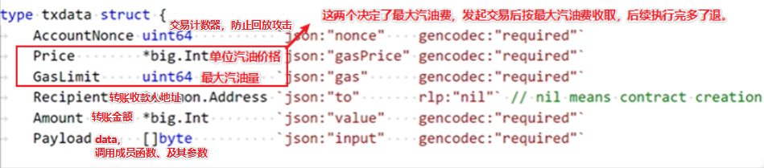
上面图不完整，还有个收款人地址（合约地址）。

比特币脚本没有循环，而以太坊的智能合约代码中可以有循环，所以需要最大执行次数来限制，避免遇到死循环后无限执行。

`GasLimit`：最大汽油量，限制最大汇编命令的执行次数。合约的指令会转成汇编语言的命令，而合约执行受参数影响，执行前命令执行数是不确定的，只能在执行前限制最大执行次数，真正执行合约时超过 `GasLimit` 则放弃本次合约的执行。
`Price`:  每次命令执行需要的费用，越高优先级越高。

存储状态、复杂的计算的指令汽油费都比较高，读取公共数据的指令是免费的。

`Block Header` 的 ` GasLimit`：定义了区块里所有交易总和最大消耗汽油费的上限，可以根据上个区块上下微调 1/1024。跟比特币最大不能超出 1 M 类似，起到一个限制大小的作用。不同的是，**以太坊中的 `GasLimit` 的最终大小是由区块链所有矿工共识的结果**。


> 比特币中是 `所有输入 - 所有输出`，剩余的就是给矿工的手续费。而以太坊中需要主动设定 gas。


### 单纯转账，不执行智能合约，也需要汽油费

单纯转账，不执行智能合约，也需要汽油费。不过 Gas 使用量是固定，21,000 个单位。

### 如何收取汽油费

**状态树、交易树、收据树三棵树都是全节点维护在本地的数据结构，当出块写入到最长合法链时，才会变成共识。依靠 `P2P` 网络广播，使得整个区块链上所有全节点的本地数据达成一致**。

状态树维护了所有账户的状态包括账户的余额，当收取汽油费时，全节点会在本地的状态树上减掉该账户的余额，并给自己账户的余额加上。

智能合约执行的过程中，任何状态的修改都是全节点在本地修改状态树。


### 全节点先挖矿还是先执行智能合约

先执行智能合约，因为挖矿前需要选择并验证合法的交易进行打包挖矿，验证的时候就需要执行智能合约。
- `GasLimit` 是否满足实际执行汇编命令次数
- 执行过程是否报错

执行智能合约后会修改本地的包括状态树在内的三棵树。且确定了 `Block Header` 的三个 root hash，随后修改 `Nonce` 进行挖矿。


### 智能合约的错误处理

智能合约的执行具有原子性，只有以下两种状态：
- 全部执行
- 全部不执行（报错）

执行出错时，已消耗的汽油费不会退，保障了矿工的权益，避免恶意节点发动计算量很大的交易。

报错场景：
- 执行代码异常
- `assert(condition)`：用于内部状态错误，条件不满足则抛出错误。
- `require(condition)`：用于输入或外部组件引起的错误，条件不满足则抛出错误。
- `reverse()`：无条件终止运行并回滚状态

嵌套调用合约时，是否连锁回滚，根据调用方式决定：
- 地址创建实例直接调用，会连锁回滚
- 地址 `call` 调用，不会连锁回滚
- `delegatecall`：与 `call` 类似，不会连锁回滚
一个合约转账给另一个合约账户，即使不添加任何 `data`，只要目标合约有 `fallback` 匿名函数，转账本身就会调用目标合约的函数，也是一个嵌套调用。


### 发布到区块链里的交易，是不是都是成功执行的

发布到区块链里的交易，不一定都是成功执行的。因为需要扣除汽油费，例如智能合约执行错误，也要发布到区块链上，这样才可以扣除汽油费。


### 智能合约支不支持多线程

以太坊是交易驱动的状态机，这个状态机需要是确定的。

如果是多线程执行多个智能合约，不同的执行顺序去访问状态，可能执行结果会不同。例如先加后扣，变成了先扣后加。

所以交易树是有序组织起来的唯一树，交易是有序的，验证也是且是单线程有序进行验证。

这也是 Solidity 不支持多线程的原因。

？也不允许出现真正的随机，例如链外数据算吧，不同全节点取得的链外数据可能不同


### 智能合约可获取的区块信息

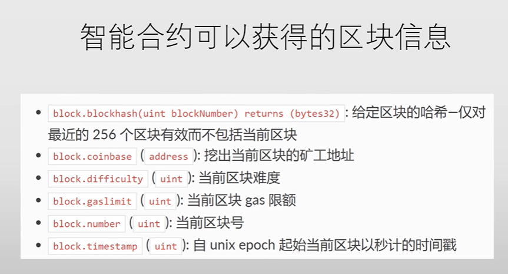


## 未解决疑问

？为什么说比特币是取两次哈希