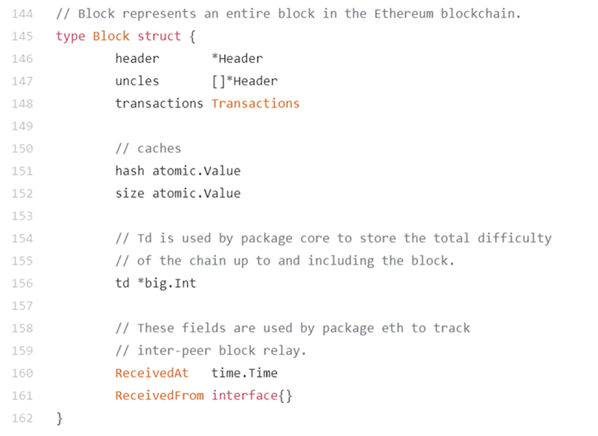
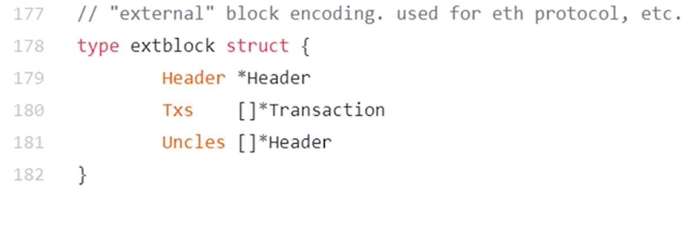
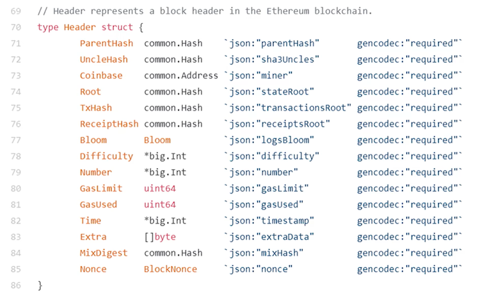
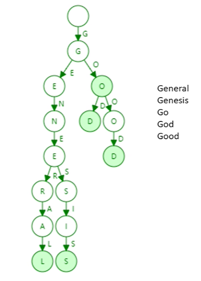
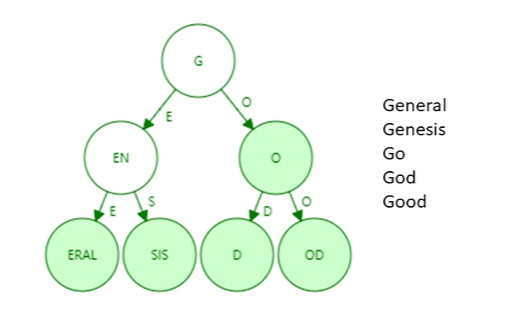
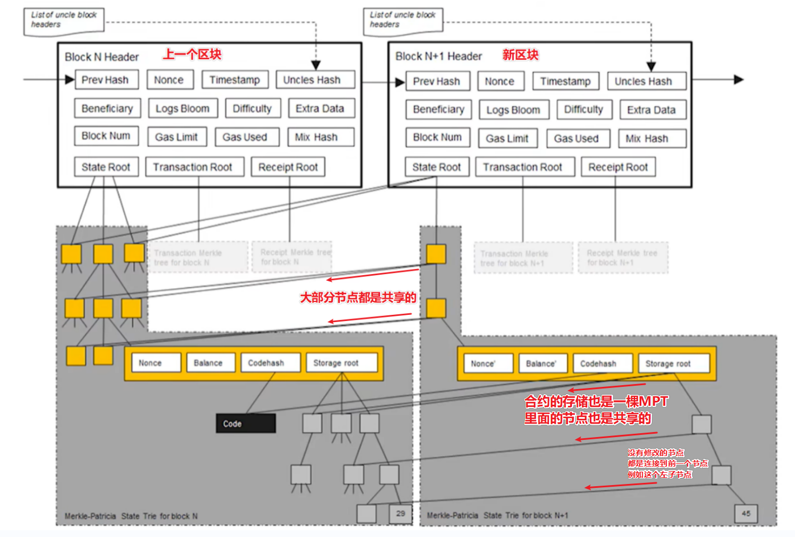
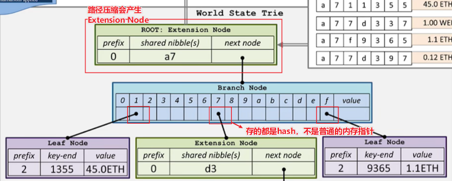
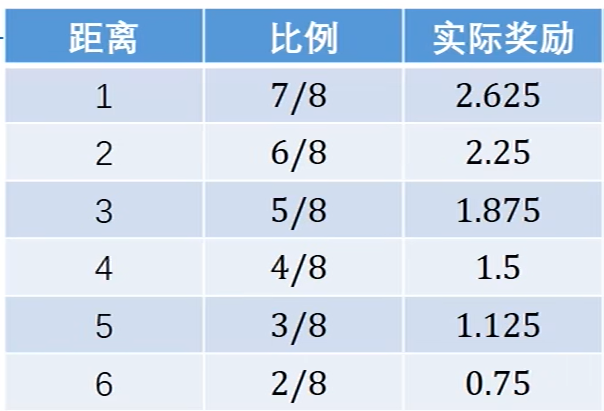

## ETH -Ethereum

### 基本概念

以太坊，称为区块链 2.0，设计了新的共识机制 ghost，使得出块时间可以减少到十几秒。

以太坊的挖矿（Mine Puzzle）对内存要求很高，限制了 ASIC 芯片的使用（ASIC resistance），防止其在挖矿中占据绝对优势，使得普通人也可以参与挖矿。

PoS（Proof of Stake）权益证明，股份投票决定下一个区块怎么产生。

比特币（BTC）最小单位：Satoshi
以太币（Ether）最小单位：Wei

去中心化货币好处：
- 跨国交易（对比法币）

智能合约（Smart contract ）：去中心化合约
- 跨国，不担心司法不同
- 不可能违约（代码执行）
- 不可篡改

### 以太坊是一个交易驱动的状态机

通过执行区块里的交易，驱动系统的状态从当前的状态转移到下一个状态。

## 账户模式

### BTC 基于交易的模型

BTC 交易时需要说明资金来源且证明合法性，且必须将资金来源 UTXO 都花出去，创建新的 UTXO（支出和找钱），不能只花一部分。

BTC 没有余额状态，隐私保密性比较好。不知道某人有多少钱，得去查 UTXO 集合和追溯历史记录。

### 以太坊基于账户的模型

以太坊基于账户模型，全节点维护了余额状态，**交易时不需要说明资金来源**。可以只花一部分，不需要找钱。跟现实的银行相似。

天然防范了前后链形式的 Double Spending Attack。
但产生了对应的 Reply Attack（重放攻击），用计数器（Nonce）记录账号有史以来的交易次数，发布交易时包含这个计数器。

全节点利用状态树维护余额等状态。

状态树：
- 余额
- Nonce（交易次数，是一个计数器，理论上叫 Count 更好）：交易时携带，防范 Reply Attack

### 账户类型 

- Externally owned account：外部账户（普通账户），公私钥控制。
	- 余额
	- Nonce（交易次数，是一个计数器，理论上叫 Count 更好）：交易时携带，防范 Reply Attack
- Smart contract account：合约账户。合约可以调用合约，但不能主动发起交易。
    - Nonce（交易次数，是一个计数器，理论上叫 Count 更好）：合约可以调用合约，防范 Reply Attack
    - Code：代码
    - Storage：相关存储（变量），调用合约基本都是在修改存储（变量）。

### 为什么要有账户系统

以太坊需要支持智能合约，**要求参与者要有比较稳定的身份**，基于账户系统。

需要隐私性强时可以根据不同情况创建不同账户。


### 问题解答


一、合约需要稳定身份。比特币基于交易，隐私比较好，没有稳定身份。但是基于账户的以太坊也可以全部余额都花掉，打一枪换一个地方换一个账号。所以如何理解稳定身份。

BTC 是没有稳定身份的，没有一个稳定的值使得多笔交易可以联系起来。只有一个比特币地址，只能找到这个地址相关的交易记录的，那些未花费的 `P2SH` 甚者已花费但没有相同值的交易，是找不到的。

而以太坊的账户是一个稳定身份，所有交易都跟这个账户挂钩。一个账户地址是可以找到所有跟这个地址相关的记录的。

以太坊中换一个账号相当换一个身份，虽然换了身份，但这些身份是稳定的。合约可以跟这些稳定的身份进行交互。


## 以太坊的数据结构


### Block

区块的定义
```
header：块头的指针
uncles：叔父区块的指针，数组
transactions：交易列表
```
其他都不怎么重要

### Extblock


真正在以太坊区块链上发布的结构，还是这 3 项。

### Header


块头的定义
```
ParentHash：上一个区块块头 hash
UncleHash：叔父区块 hash
Coinbase：出块矿工的地址
Root：状态树根 hash
TxHash：交易树根 hash
ReceiptHash：收据树根 hash
Bloom：跟收据树相关，提供高效查询。由所有收据的Bloom Filter并集得到
Difficulty：挖矿难度，动态调整
Number：块序号
GasLimit：智能合约燃油最大执行命令次数
GasUsed：智能合约单位燃油费
Time：出块时间
Extra：允许矿工放置一些额外的数据
MixDigest：经过Nonce计算得出的一个随机值，与以太坊的挖矿算法（Ethash）密切相关的
Nonce：挖矿随机数
```

？MixDigest 是啥


## 状态树

### 基本概念

状态树：账户地址到账户状态的映射 `addr -> state` 存储的数据结构

以太坊账户地址：160 bits（位） 即 20 bytes（字节），一般表示为 40 个 16 进制的数。（1 Bytes 等于 2 个 16 进制）

账户地址是由公钥取 hash 后的公钥哈希进行编码，截断用后面 160 位作为账户地址。
以太坊账号地址和 BTC 钱包地址是不通用的，公钥取 hash 算法不同。

### 哈希表 + Merkle Tree

哈希表 `addr: state`，哈希表的查询、更新和插入效率都很好。但是无法做到验证。

Merkle Tree 可以维护所有全节点的状态一致性，验证余额等状态可以用 Merkle Proof 验证。

使用哈希表存储 `addr: state` 的映射，这样方便更新和查找，随后使用哈希表构建 Merkle Tree ，可以解决验证问题。

**每次更新使用哈希表更新，随后用哈希表构建整个 Merkle Tree，方便后续进行 Merkle Proof 验证。**

但每次出块时会执行交易，只有很小一部分状态改变，需要更新这部分哈希表，还是需要重新构建整个 Merkle Tree，代价太大了。

**哈希表 + Merkle Tree**
**优势：查询、更新效率高**
**问题：哈希表重新构建整个 Merkle Tree，代价太大了。**

每次都用哈希表构建整个 Merkle Tree 成本太大了。那能不能直接使用 Merkle Tree 存储数据，放弃哈希表，这样就不需要每次都重新构建了。

> BTC 构建 Merkle Tree 只有区块内的相关交易，体量小，重新构建成本低。

### Merkle Tree

上一步是**每次更新使用哈希表更新，随后用哈希表构建整个 Merkle Tree，方便后续进行 Merkle Proof 验证。**

我们想要的是每次更新都是直接更新 Merkle Tree，而不是构建新的 Merkle Tree，所以此处舍弃哈希表。

使用 Merkle Tree 直接存储状态，这样出块时，区块内涉及的状态更改，只要能找到他们在 Merkle Tree 的位置，就能只更新 Merkle Tree 小部分 hash。

问题是，Merkle Tree 没有提供一个快速查询、更新的方法。找他们在 Merkle Tree 的位置成本大，需要遍历 `O(n)`，即遍历所有的账户。


**Merkle Tree**
**优势：如果有提供高效的查询、更新方法，就不需要重构整个 Merkle Tree**
**问题：**
- **没有提供高效的查询、更新方法**
- **没法高效证明一个账户不存在**
- **叶节点的顺序不一致，每个节点的 Merkle Tree 不是唯一的，导致计算后的 root hash 不一致。**


为了解决这些问题，需要最底下的那一层排序，即叶节点排序，Sorted Merkle Tree。

### Sorted Merkle Tree

BTC 不排序没有唯一性问题，是因为只有记账人选择交易，决定按怎样的顺序构建 Merkle Tree，确定了唯一的 Merkle Tree，其他人只需要对这个已确定的 Merkle Tree 进行验证。

以太坊所有账号的数据量太大了，没法跟 BTC 一样不排序由记账人发布到区块里，成本太大。

所以状态树需要使用 Sorted Merkle Tree，这样可以提供高效查询、更新的方法、能高效证明一个账户不存在、也能构建唯一的树。

但产生新账户进行插入时，会重新构建整个 Sorted Merkle Tree，成本太大。


**Sorted Merkle Tree**
**优势：提供高效查询、更新的方法、能高效证明一个账户不存在、也能构建唯一的树**
**问题：产生新账户进行插入时，会重新构建整个 Sorted Merkle Tree，成本太大。**

为了解决产生新账户进行插入时会重新构建的问题，可以使用前缀树 Trie

### Trie



Trie 数据结构（retrieval 信息检索，字典树，前缀树）是一棵多叉树，使用键值（key）查找。

特点：
- 开销较大，即使只有 1 分叉，也会单独存在节点。树的高度变得很大
- 查找效率由键值（key 账号地址）的长度决定，例如以太坊账户地址是 40 个 16 进制，就需要访问内存 40 次。
- 每个节点的分叉数目最多 17 个，根据键值（key）取值范围：`0-f`，加上结束标记位。
- 账户地址不一样，不会出现碰撞
- 可以高效查询、局部更新
- 不同节点利用相同输入，构成的 trie 是唯一的
- 插入新节点不需要重新构建整个树

**Trie**
**优势：可以高效查询、局部更新、也能构建唯一的树、插入新节点不需要重新构建整个树**
**问题：中间路径节点浪费存储，也降低了查找速度。**

为了解决中间路径节点浪费存储，降低查找速度的问题，可以使用路径压缩前缀树 Patricia Tree。

### Patricia Tree (PT)



路径压缩前缀树 Patricia Tree，压缩了路径的 trie。

Patricia Tree（PT）：
- 所有 1 分叉的路径会压缩成一个，树的高度降低，访问时内存读取次数减少。
- 如果添加新账号有新的 key 路径导致增加分叉，压缩的路径会扩展开。
- 键值（键这个值）分布比较稀疏的压缩效果比较好。

键：账户地址，160 位二进制，取值范围 2^160 特别特别大，抗碰撞性。所以账户地址在这个超大的取值范围内分布很稀疏。

**Patricia Tree（PT）**
**优势：具有 Trie 的优点，且压缩路径减小存储，提高查找效率。**


### Merkle Patricia Tree (MPT)

指针区别
- Binary Tree 是内存指针
- Merkle Tree 是哈希指针

同样的
- Patricia Tree (PT) 是内存指针
- **Merkle Patricia Tree (MPT) 是哈希指针**

Merkle Patricia Tree（MPT）：对比 PT 把普通指针换成 hash 指针，MPT 也是一棵 Merkle Tree

所有的账户组织成一棵 Patricia Tree（PT）用路径压缩提高效率，把普通指针换成哈希指针 Merkle Patricia Tree（MPT），这样就可以生成一个根 hash 放在 Block Header。

Root hash 作用：
- 防篡改，root hash 不变，所有用户的状态都没被篡改。
- 提供 Merkle Proof 可以验证状态
- 证明某个账户不存在（先假设其存在，用 Merkle Proof 去验证，验证失败就是不存在）


### Modify MPT


以太坊用的是 Modify MPT，对 MPT 做了些修改。
- 路径压缩时会产生 Extension Node。
- 产生分叉时，会产生 Branch Node。
- 大部分节点都是共享的。
- 状态修改通过新建分支修改




每次发布区块时，大部分节点都是共享的。

合约账号的存储（Storage）也是用 MPT 保存，以太坊是一棵大的 MPT，包含了很多小 MPT，每个合约账号的存储都是一棵小 MPT，也是会共享节点。

状态不是在原状态树上改的，而是新建分支进行修改，原来的状态会保留着（为了回滚）。例如上面的 29 改为 45，就是新建了这一条新分支，然后重新 hash 给它的父节点都更新 hash，原分支在上一个区块还是保留着。

每次新区块状态的修改，都是新建 MPT 不在原分支改，是为了保存历史状态便于回滚：
以太坊出块 10 几秒，临时性的分叉很常见，需要回滚。而智能合约执行相当复杂，回滚困难，需要保存历史状态便于回滚。

状态树将系统中**所有账户的状态**都包含进去，不管这些账户和本次区块交易有没有关系，区块里会共享节点，只有本次区块涉及状态修改的账户会新建分支，其他账号都是共享节点。

### RLP 递归长度前缀

Key 的管理方式解决了，状态 value 是如何存储的。
状态 value 是通过 RLP 编码去做序列化，无论原始数据是什么类型，结果都会是一个字节数组，再去存储。

RLP（Recursive Length Prefix）递归长度前缀：特点是简单，只支持字节数组。

### 问题解答

一、以太坊的状态为什么不跟 BTC 一样，由记账人用 Merkle Tree 形式写到区块里。
所有账户状态数据量太大了，成本太高。BTC 只写了当前区块的交易信息，而以太坊是所有账户状态数据，高了好几个数量级。

单纯的 Merkle Tree 解决不了问题，需要用到 Trie 构建唯一树，每个区块只存储本次区块涉及的交易状态，只有小部分状态改变，其他状态都是共享节点，这样可以避免每次出块重复发布。。

二、以太坊的 Modify MPT 是如何生成 root hash 的。BTC 底层都是交易，并没有路径节点存在，路径节点都是通过底部一层节点的 hash 后生成的路径节点，存的都是 hash，最后产出 root hash。那以太坊有路径节点，hash 怎么存



产生分叉时，会产生 Branch Node，里面存储的就是底部一层节点的 hash。路径压缩时会产生 Extension Node，它的 next node 存的也是底部一层节点的 hash。

有一个点注意，存 hash 也是需要内存地址去存的。MPT 只不过存的内容多一点。
即使是 BTC 的 Merkle Tree，也不是说没有路径节点，仅仅是单纯一个 hash 就能空放在那里，计算机的实现上也是分配了一个内存地址，上面的空间存储这个 hash。而以太坊的 Modify MPT 对应的路径节点存储的信息更多，占的空间大一点而已。


三、状态树能不能改成只包含区块里交易相关的状态，不含有公共节点，这样就跟交易树/收据树一致，且大幅度削减了大小

这么设计，每个区块都没有完整的状态树，只有当前区块交易涉及的状态。
当前区块的交易在验证时，要给收款人余额加钱，需要找到收款人余额状态。需要沿着区块链，一个个区块找，直到找到该状态。如果收款人是新账号，需要找到创世纪块，效率特别低。


## 交易树

### 基本概念
每次发布区块，区块里的交易组成交易树，跟 BTC 差不多，但用的是 MPT ，MPT 对比 Merkle Tree 的好处是可以利用路径快速查找。

路径不是用账号，而是交易在**区块里的序号**，由记账人决定的顺序。

每个交易树的叶节点都是一笔交易。

交易树只有**当前区块**的交易，交易树在不同区块里都是相互独立的，不会共享节点，也没有共享这个必要。收据树也一样。

### 作用

提供 Merkle Proof 供节点验证。

支持复杂的查询操作，例如查询限定时间内的某个智能合约的所有交易。


## 收据树

### 基本概念

每个交易执行完，会形成一个收据，跟交易树的节点是一一对应的，数据结构也是 MPT。

每个收据树的叶节点都是一笔交易对应的收据，收据的 `logs` 存放了交易的元素，例如交易类型、交易地址等信息，`logs` 最后用来生成 `Bloom Filter`。

智能合约执行过程复杂，添加收据树有利于高效查询。

> 当合约函数执行，事件被触发时，事件会被记录在收据的日志（logs）中。这些日志信息随后被存储在区块链上，使得任何人都可以查询和监听这些事件。`logs` 中就有 `topics` 字段，用于记录事件的签名和所有索引事件参数的值，会映射在 `Bloom Filter` 中，便于快速检索。

###  Bloom Filter

**可以高效的查找某个元素是否在一个比较大的集合里**，可以用于快速过滤掉大量无关的区块，从而达到高效查询。

**每个交易会形成一个收据，收据里就有个 Bloom filter，简短地记录交易的类型、地址等信息。**

Bloom filter 本身是一个 128 位的摘要（digest），由集合里每个元素 hash 映射得出。具体实现：
每个元素 hash 后，映射到摘要里一个位置，将 0 改为 1，代表存在。（不是计数器，只是个标记，0 不存在，1 存在。）

注意，我这里讲的是**元素**，一笔交易是有很多元素的，例如交易类型，交易地址等，这些信息都是元素。所以**一个交易的许多元素都被哈希函数处理，并映射到 Bloom Filter 中的多个位置上。**
当使用 Bloom Filter 以检查某些特定的事件类型或地址的交易是否存在时，你会使用相同的哈希函数序列来计算这些查询元素的位置，如果这些位置都是 1，则证明满足要求的交易可能存在。

区块的块头也有一个总的 Bloom filter，是这个块里所有交易的 Bloom filter 的并集。

假设我们要查找一个具有特定类型交易：
- 先在区块块头的 Bloom filter 有想要查找的类型
	- 没有的话代表这个区块不是我们想找的。
	- 有的话，再去查找区块的收据树里每个收据的 Bloom filter，找到再向全节点索要更多其他信息进行确认，防止误报。

这样可以快速过滤掉大量无关的区块。

Bloom filter 特点：
- False positive 可能出现误报（出现哈希碰撞）。
- 不会出现漏报。

Bloom filter 计算用的哈希，可能是用 1 个哈希函数，也有可能是用 1 组哈希函数对一个元素进行映射。用 1 组哈希元素出现多个元素碰撞的概率比较低。

简单的 Bloom filter 不支持删除操作，因为里面不是一个计数器。


## Ghost 协议

### 基本概念

以太坊网络底层是 `P2P`，网络传播需要时间。以太坊缩短出块时间至 13~15s，就需要新的共识协议。

以太坊每一个区块的出块收益 `block reward` 是 3 以太币，以太坊没有规定出块收益减半。

设计叔父区块 `uncles` 的目的：
- 解决短时间出块频繁出现的临时性分叉
- 出现分叉时，矿池会沿着自己的区块挖，出块概率大，小矿工的区块大概率被舍弃。有了 `uncles` ，减少矿池相对于小矿工的优势，有利于网络的去中心化。


叔父区块 `uncles`，只认可 7 个共同祖先（抛开父级，也就 6 个层级。父级的子节点是当前节点的兄弟节点不算叔父），`uncle reward` 从 7/8 递减到 2/8。
`uncle reward` 递减，且只认可 7 个共同祖先：
- 鼓励系统出现分叉时，及时进行合并。
- 避免主动进行分叉

`uncle` 的只认可单独一个区块，`uncle` 后续的区块不认可：
- 避免降低发动 `Forking Attack` 的攻击成本。

记账人发布区块时，最多认领 2 个 `uncles`，每一个收益是 1/32。

为了避免交易冲突，`uncles` 区块的交易并不会被执行，所以 `uncles` 只有 `uncle reward`，没有 `gas fee` 收益。且不需要检查交易的合法性，只检查 `Block Header` 是否合法。

检查 `Block Header` 是否合法，只需要检查
- 挖矿难度没有篡改
- `Nonce` 符合挖矿难度 (实际上是整个块头 hash 满足挖矿难度)
- `Parent Hash` 正确
- `Time` 出块时间不会比父区块早
- `Number` 块号高度在 7 个区块内
不需要检查 3 个 root hash

### 记账人矿工的收益在铸币交易中获得，叔父区块的 uncle reward 是如何获得的

？浏览器找不到 Coinbase 也找不到


## 挖矿算法
### Memory hard mining puzzle

ASIC resistance：增大内存，因为 ASIC 硬件成本全投在计算，计算优势大，内存优势很小。

LiteCoin 的挖矿算法 scrypt：
用内存去存一个比较大的数组。这个数组由伪随机（种子） hash 构成第一个元素，后续每一个元素由前一个元素 hash 得到。数组的前后元素有依赖关系。
随后用 Block Header 进行 hash 得到第一个坐标，取坐标上的值，后续坐标靠前一个坐标上的值的 hash 得出，在这个数组上多次读取直到 128 个值最后 hash，最后与目标阈值对比。读取的顺序前后有依赖关系。
缺点是这种方式轻节点验证也很难，需要比较大的内存。

Scrypt 算法，必须存储数组，否则计算复杂度大大提高。做到了挖矿难，但对验证也一样难。且担心轻节点无法负担大内存，LiteCoin 定了 128 kb，到后期 128 kb 内存也无法做到 ASIC resistance。

LiteCoin 的思路是对的，用内存限制 ASIC，但需要再提高内存限制 ASIC，且便于验证。


以太坊用两个数据集
- 小数据集：16 M cache
- 大数据集：1 G dataset（DAG） ，由小数据集生成

数据集大小会定期增长，因为计算机内存容量也是定期增长。

轻节点验证用小数据集，挖矿用大数据集。

种子节点经过运算得出第一个元素，第一个数取 hash 得到第二个元素…生成整个小数据数组。
大数据集，每个元素都是从小数据集，伪随机读取一个值，用这个值哈希得出下一个值的坐标，依次读取 256 次最后算出 1 个 hash 放在大数据集里作为一个元素。

？每一个值是一个哈希还是一个 16 进制还是什么格式
？伪随机
？内存定期增长时间点？增大多少

？为什么说比特币是取两次哈希

挖矿时，用的是大数据集。根据 block header，算出初始 hash。映射到大数据集的一个坐标上，读取坐标上的值。随后用这个值 hash 得到下一个坐标。且每次读取时连同相邻的值也读出，一次性读出两个值。读取 64 次，共 128 个值，算出一个 hash，跟目标阈值对比。

## 未解决疑问


？为什么说 key value 会出现碰撞。两个账户地址不一样，但有可能映射到 hash 表的同个位置？哈希表不是由账户地址映射到状态值吗？