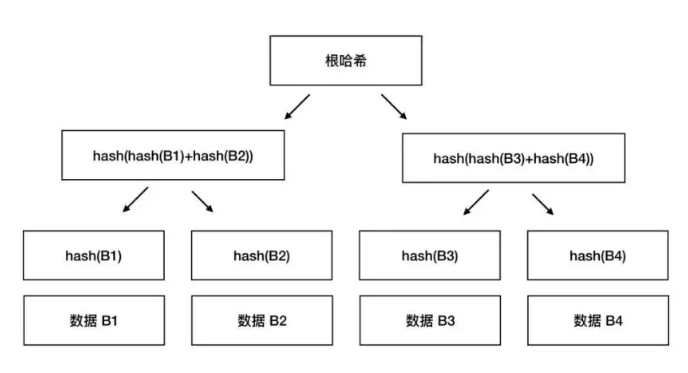
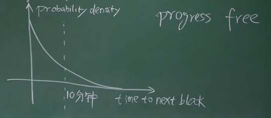
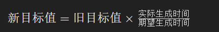

## 哈希

### 特性
- Puzzle friendly：通过某种方法预测或计算出特定的输出结果非常困难。没办法通过某种方法去人为控制输出结果的趋势。
- **不可逆性**(hiding)：从**哈希值无法直接推导出原始输入数据**。这意味着如果你只知道一个区块的哈希值，你不能确定是哪个特定的输入产生了这个哈希值。**要求输入要足够大，每个输入概率足够均匀。** 如果输入被限定范围，则可以遍历所有输入去暴力算出。
- **强抗碰撞性**：找到两个**不同的输入，它们产生相同的输出哈希值**，在计算上是**极其困难**的。这保证了区块链网络的安全性，防止了某些类型的攻击。
- **确定性**：对于**相同的输入数据**，哈希函数**总是产生相同的输出哈希值**。这意味着如果输入数据没有变化，无论执行多少次哈希运算，结果都是一致的。
- **高效性**：哈希函数能够**快速计算**出输入数据的哈希值，即使是对于很大的数据集也能高效处理。

> 签名用的随机源要确保随机，否则可能会泄露私钥（仅做了解，涉及密码学）
> （目前记得结论即可，签名的 Nonce 要随机，否则有风险。）签名由私钥、随机数、消息体 hash 生成。

## Merkle Tree

### 基础概念
Merkle Tree 是区块（ Block Body ）中用来存**交易**的数据结构。存的是交易，可以理解为区块链上所有的块加在一起存储了所有的交易记录历史，存储的不是 UTXO，UTXO 是根据这些交易记录去动态维护的。

Merkle Tree 生成的 root hash 存在了区块的 Block Head 里。用来验证 Block Body 里的交易是否被篡改，任何一个交易被修改，都会影响 root hash 生成。



### Merkle Proof

基于 Merkle Tree，Merkle proof 可以让轻节点验证一个交易是否在给定的区块中，是一个该交易数据到 root 的路径。全节点提供验证这个路径上所需要的其他 hash。


## 区块 Block
### Block Head

存储了宏观信息：
1. BTC 的版本 vision;
2. 前一个区块的 hash：指向上个区块的块头 Block Head，只有块头信息参与 hash;
3. root hash：Merkle Tree 的所有交易的 root hash，保障交易列表不被篡改。（挖矿时可以借用 Coinbase Commit 前 8 bytes 作为 Extra Nonce）;
4. ntime：区块的创建时间 ;
5. nBit: 目标值 Target 的压缩编码;
6. Nonce：当前区块的随机值（4 bytes）;

Hash 时只计算 Block Head，不包含 Block Body。

### Block Body

包含详细信息：
- Translaction List 交易列表/记录（一般用 Merkle Tree 数据结构读取）

> UTXO 集合不直接存储在 Block Body 中，而是全节点基于交易记录去动态维护的状态信息。UTXO 存放在全节点的内存中，以便快速读取检测。


### 验证交易存在 proof of inclusion

轻节点利用 Merkle proof 去验证交易是否存在区块中。
Merkle proof ：在 Merkle Tree 中这个交易到根节点的路径。

Merkle proof 可以证明 Merkle Tree 里包含某个交易。时间成本很低，O (log (n))。

如果你转钱到我的账户，你需要提供 Merkle Proof。我验证后 root hash 一致，证明你转钱成功写到区块链里了。

首先轻节点向别的全节点，获取 Merkle Proof（路径）上每个节点所需要的 hash 值。通过这笔交易生成的 hash，沿着 Merkle Proof 从下往上验证，加上全节点提供的所需 hash，就可以计算出 root hash，root hash 与轻节点 Block Head 的 root hash 一致，这笔交易就在这个区块中。


### 恶意节点，提供错误 hash
Merkle Proof 依赖全节点提供的 hash，如果提供 hash 的全节点是恶意节点，提供错误 hash，导致交易验证失败。

轻节点不只依赖于一个全节点提供的信息，而是通过**多节点验证** Merkle Proof，并进行比较。如果大部分全节点提供了一致的信息，而少数节点提供了不同的信息，轻节点可以判断那些少数节点很可能是恶意的。

### 验证交易不存在

笨办法：验证整棵树，这样知道叶节点交易没被篡改，没在叶节点交易里就是不存在。

全节点整颗 Merkle Tree 发给轻节点，轻节点进行整棵树计算验证，如果 root hash 一致，证明树没被篡改，叶节点只有这些，这笔交易不在叶节点里，交易不存在。时间复杂度 O (n)

好的解决方案：
叶节点有序（sorted merkle tree）（比特币没有实施），只验证 merkle proof。
如果叶节点有序（根据 hash 从小到大），则找到交易这个节点应该插入的位置，将左右两个交易去走完 merkle proof，如果 roof hash 一致，证明这两个交易没被篡改，他们中间确实没有我们要找的这个交易。这样时间复杂度 O (log (n))。也不用去验证整棵树。


## 账本模式

比特币网络基于 UTXO 的账本模式，系统记录的是交易记录。

Block Body 保留了本区块的交易记录，不管在未来这些交易的输出是已被花费还是未被花费，这些交易都会在区块链中永久保存。

UTXO 集合，我们指的是当前所有未被花费的交易输出的集合，由全节点动态维护。**一个 UTXO 如果已被花费，会从 UTXO 集合中移除**。

区块链所有区块的 Block Body 集合在一起保留的是**所有交易记录**，UTXO 集合只是**交易记录**中未被花费的交易输出集合，是根据区块链的所有交易记录去动态维护的。

UTXO 模型通过跟踪每个未花费的输出来确定账户的余额，在比特币系统中没有“账户”或“余额”的概念，**并没有一个全局变量记录了余额**。

虽然看起来通过钱包地址可以查询到“余额”，实际上这个余额是通过统计该钱包地址可以引用的所有 UTXO 计算出来的。

没有维护全局变量：
- 余额需要通过钱包地址可以引用的所有 UTXO 计算出来的
- 每次交易都需要给出资金来源。

## UTXO
### 基础概念

比特币网络通过 UTXO (`Unspent Transaction Outputs` 未花费的交易输出)实现。

每个输入都是之前交易的一个输出（UTXO），而每个交易输出可以成为未来交易的输入。

Alice 拥有 10 个比特币并想要支付给 Bob 4 个比特币：
在创建交易时，Alice 的钱包需要明确指出是哪些 UTXO 被用作本次支付的资金来源。
- `Input: Alice address, Referenced UTXO value (10)`
- `Output 1: Bob address, Amount (4)`
- `Output 2: Alice new address (找零地址), Amount (6)`

这样，Alice 原来的 10 个比特币的 UTXO 就被消费了，而新生成的两个 UTXO（一个是 Bob 的 4 个比特币，一个是 Alice 的 6 个比特币找零）则可以在未来的交易中使用。

每次交易可以有多个输入，多个输出。这些输入可以来源不同地址（属于不同账号），交易有 n 个输入就需要有 n 个签名和公钥。

UTXO 存放在全节点的内存中，以便快速读取检测。

### UTXO 的结构

1. **交易哈希（Transaction Hash）**：产生 UTXO 的那笔交易的唯一标识符，也就是那笔交易的哈希值。它用于唯一地定位包含该 UTXO 的交易。
2. **输出索引（Output Index）**：这是指 UTXO 在其产生交易的输出列表中的位置。因为一笔交易可以有多个输出，所以需要索引来指定哪一个输出是 UTXO。
4. **金额（Amount）**：这是 UTXO 所持有的比特币数量，表示了这个 UTXO 的价值。
5. **锁定脚本**：指定可以解锁该 UTXO 以进行消费的公钥。

### 资金来源

每次交易时，必须指明具体使用哪些 UTXO 作为资金来源。

指定资金来源 UTXO 时需要提供以下信息：
- 交易的 hash：指的是产生该 UTXO 的那笔交易的 hash 值。
- 输出下标：该 UTXO 在产生它的交易中作为第几个输出（从 0 开始计数）。

### 验证资金来源是否有效

全节点内存中维护了 UTXO 集合，方便快速读取检测。当一个 UTXO 被花费后，它就会从 UTXO 集合中删除，新产生的 UTXO 保存在 UTXO 集合中。

例如检验资金来源 UTXO 是否有效，只需要在 UTXO 集合中
- 验证 UTXO 是否花费过
- 验证是否发起人发起


验证是否发起人发起：利用 Id 和归属状态，在比特币中是通过产生该 UTXO 的交易 hash 和锁定脚本（公钥）进行验证的（分别对应 id 和归属状态）。
交易里面有一个公钥，发起交易者将会把公钥提供给接受者。币的来源指向的 UTXO 的输出，也有一个公钥指明了归属者。这两个公钥一对比就知道是否由币的拥有者发起的交易。

验证失败为不合法，不合法的交易将不会被占大多数的诚实节点认可。
- 把一个钱花两次（已经交易过了，不在 UTXO 集合里）
- 花别人的 UTXO（所属公钥/签名对不上）

### 验证余额的正确性

轻节点检测余额，需要依赖全节点查询 UTXO 集合，最后返回给轻节点，但轻节点只能通过多节点验证，多数返回一致则认为余额正确。没法凭着轻节点自身验证余额的正确性。

解决方案（没实施）：UTXO 集合也生成 Merkle Tree，这个 root hash 写在 Coinbase Commit 后面几位（前 8 位给 Extra Nonce 了）。这样轻节点就可以验证 root hash 看 UTXO (余额)是否被篡改过。（个人认为没实施的原因是增加维护和验证的复杂性和成本，Merkle Proof 也需要全节点提供其他 hash 验证，也依赖全节点。）

### 交易费

矿工的激励，矿工选择交易的动力，争夺记账权后可以获得出块奖励和交易费。

交易费 = 交易大小 x 费率
- **交易大小**：指的是交易数据的字节大小。一笔交易包括输入、输出和签名等信息，其大小不是固定的。一般来说，交易的输入（来源）越多，交易的大小就越大，因此交易费也可能更高。
- **费率**：通常以“satoshi/byte”（satoshi 是比特币的最小单位，1 BTC = 100,000,000 satoshi）为单位。由用户自己设定，当网络繁忙时，用户可能会选择支付更高的费率以加快交易确认。


## 交易

### 交易的结构
？补充交易结构，包含 vin，vout。Vin 里面有来源的 vout

### 验证交易
？验证 UTXO 是通过 UTXO 集验证存在，以及输入脚本和输出（锁定）脚本，签名验证归属。

### 比特币每秒的交易数目

一个交易的大小大概是 250 bytes，一个区块的大小是 1 M，大约可以存放 4000 个交易，比特币一个区块的出块时间是 600 s（10 min）。

`4000 / 600 ≈ 7`，每秒大概 7 个交易。

## 比特币共识（consensus in BitCode）

假设大多数节点是好的，以此设计共识协议。

### 投票-算力

选择交易（判断交易合法）后，广播给所有人，大多数节点同意，则成立。

问题：谁有投票权，如果恶意节点有投票权将会影响投票，例如女巫攻击（sybil  attack）（童话故事里女巫可以伪装任何人）。
解决方案：
1. 联盟链，能确保参与人都是好的，没有恶意节点。但中央了
2. 投票用算力决定，而不是数量决定。

比特币中不是按节点数量来决定投票结果，是用算力来决定。这样就解决了女巫攻击，女巫攻击只能伪装更多的节点，在节点数量上提高，但没法提高算力。

其他节点收到广播后验证，Block Head 正确性，里面的 Target 的 nBits 符合比特币规则，Nonce 符合 Target 等。

验证完认可新区块，继续新区块往下扩展。

比特币的共识是账本，而账本只能记账人通过新区块写入，新区块的产生只能靠 hash。
Hash 的 puzzle friendly 保证了没有捷径，只能靠算力。所以说投票权是看算力而不是节点数量。


### 最长链原则

有分叉时，以最长链为合法链。

同一时间产生新区块或广播延迟，产生不同节点视图时，也用最长链原则使得整个区块链一致。

**挖掘新区块的广播具有传播时间**，与网络延迟类似，新区块从源节点广播到全网所有节点需要一定的时间。在这个过程中，如果有多个新区块被挖掘，不同节点可能接收到不同的新区块，形成不同的下一区块，随后这些节点用下一区块继续往后面挖矿添加新区块，产生了一条分支。
 
这个过程区块链出现分叉，即形成了**节点间的不同视图**。

当产生分叉时，区块链按照“**最长链原则**”作为共识机制，接受最长的链作为合法链，其他分叉的区块被废弃（被废弃的区块通常被称为“孤块”），

因为孤块不在区块链主链上，所以交易不被节点认可。

### 确认交易成立 Six Confirmation（6 确认）

交易被认为是足够安全的标准是获得 6 次确认，这大约需要 60 分钟。可以认为该交易已经成立不会被篡改了。但只是被篡改的概率极其低，所以认为不会被篡改。

### Zero Confirmation（0 确认）

交易尚未得到正式确认，但却乐观认为交易完成了。

对于小额交易，攻击者进行双重支付的动机不大（潜在的收益不足以抵消所需的付出）的场景都可以接受这种交易。应用很广，因为现实中很多时间因素允许这种乐观成立，例如电商从确认交易后有发货时间，超过 1 h，如果 1 h 后交易没成功，可以不发货。

### Forking attack

分叉攻击，攻击者尝试创建一条竞争分支，以便暂时或永久地改变网络的共识。要求算力足够强


#### Selfish mining 自私挖矿
攻击者挖掘新的区块但不立即广播到网络，而是保留这个区块，创建一个私有链。攻击者希望能够在私有链上积累足够长的区块链，然后在适当的时候将其发布到公共网络上，以取代现有的区块链。

收益：获得这些区块的所有出块奖励，而其他矿工在无效区块上挖矿做无用功，减少竞争力。要求自身算力足够强。

风险：风险很大，如果中途被其他矿工出块且合法链的长度比私有链更长，攻击者一个区块的奖励都获取不到。

#### Double spending attack

双重支付攻击：恶意攻击者尝试将同一笔资产同时支付给两个或多个不同的接收者的行为。

Double spending attack 是通过 Soft attack，在交易写到区块后，同时发起一条由上一个区块的分叉，如果分叉在未来能够成为合法链，则回滚了交易。

例如：在交易写到区块链上后，电商发货了，攻击者发起一条由上一个区块的分叉，且扩展链的长度使其成为合法链，与电商这笔交易的区块就无效了，或者说被回滚了。这就达到一笔钱花两次的效果，攻击者可以获得货物和钱。

防范：等一段时间再确认交易，一般 6 个区块（1 小时）。这样攻击的成本会特别大，攻击成功的概率极其小。


在区块链之外还有很多因素，是允许乐观交易成立的，允许确认时间延后的。例如电商平台发货需要时间，快递也需要时间，如果交易失效了可以不发货或追回快递的。Double Spending Attack 随着区块链增长难度越大，一般 6 个区块认可后才视为这笔交易确认，即 1 小时后，理论上 Forking attack 成功可能性为 0。


### 恶意节点不认可一个有效的区块

恶意节点占少数，影响是有限的，因为不会影响其他遵守规则节点的共识。

当多数的计算能力（也就是说，多数的节点）认同某个区块链版本时，这个版本就会成为公认的最长链。

### 恶意节点制造欺诈性的交易

恶意节点占少数，影响是有限的，因为不会影响其他遵守规则节点的共识。

如果一个交易被认为是无效的，那么遵循规则的节点不会广播这个交易，也不会将其包含在一个区块中。即使恶意节点将其打包伪装成出块，其他遵守规则的节点对这个区块验证后，也会拒绝这个区块。

### 区块链是否被篡改，只需要核对最后区块的 hash

验证最后区块的 hash 的过程，需要沿着区块链从头到尾 hash 整条区块链进行验证，最后一个区块的 hash 是验证累计的结果。

即完整的安全性需要全节点执行全面的验证。其他时刻可以依赖于网络中的其他节点，进行快速验证。
如果一个节点本地的区块链，最后一个区块的 hash 与网络中大多数节点认可的 hash 相匹配，那么该节点的本地的区块链没被篡改过。（除非大多数节点是恶意节点）。

## 比特币是如何保证安全性的

1.	密码学：没有私钥，无法伪造签名，别人无法转走你的账。
2.	共识机制：区块链上大部分是诚实的节点，没有你的签名不会允许别人转走你的钱。

## 分叉

### Hard fork

硬分叉是永久的，特点是：旧节点对新规则不认可

新规则是新节点提倡的，新节点肯定认可新规则。只有新节点不认可旧规则才会产生分叉，如果新节点认可旧规则，那新旧节点都认可旧规则，新规则不可能占据优势替换旧规则的。

1 M => 2 M，旧节点对改后 2 M 不认可。

### Soft fork

软分叉是临时性的，特点是：旧节点对新规则认可

新规则是新节点提倡的，新节点肯定认可新规则。只有新节点不认可旧规则才会产生分叉，如果新节点认可旧规则，那新旧节点都认可旧规则，新规则不可能占据优势替换旧规则的。

1 M => 0.5 M，旧节点对改后 0.5 M 认可。

### Hard fork 的回放攻击

Hard fork 在分叉那一刻，两条链是一致的，用户的交易记录在两条链都有记录。分叉那一刻，用户在 A 链有多少余额，在 B 链就有多少余额。

在硬分叉后，如果用户在链 A 发起一笔交易（签名，UTXO，公钥都是公开的）交易给攻击者，攻击者可以拿去 B 链进行回放攻击，只要 B 链上用户没把这个 UTXO 花出去，攻击就可以成功。两条链在分叉点之前共享相同的交易历史，所以相同的交易签名在两条链上都是有效的。

防范是通过在交易中加入特定的标记 ChainId 区分两条链，当用户签署交易时，ChainId 会被包含在签名中，以确保一条链上的交易不会被另一条链接受。


## 比特币网络

### 基础概念

底层：P 2 P 网络，所有节点都是平等的。
比特币协议：运行在 P 2 P 的应用层。

节点加入网络：需要找到一个种子节点（seed node），会告诉你网络上的其他节点。节点之间通过 **TCP** 通信。
节点离开网络：别的节点没听到你的消息就会把你删除。

每个节点维护着邻居节点（不是地理位置上的邻居，可能距离很远跨洲），当节点收到消息时会传播给所有邻居节点，且标记已收过这条消息，下次再收到就不会重复传播。

特点：简单、鲁棒（稳定）。但低效，跟身边的人交易和跟美国转账速度差不多。

### Race condition 竞争条件

网络传播存在延迟，节点可能会收到两个冲突的合法交易，不同节点收到的顺序是不一样的。只会**按时间**接受最先收到的交易，另一个视为非法不进行广播。

如果当新发布区块后，资金来源 UTXO 被使用了，将会在 UTXO 集合中删除。后续收到交易信息，资金来源是这个 UTXO 的都视为非法。


### 区块大小限制 1 M

越大的区块，传播速度越慢。

比特币区块的大小限制是 1 M，限制区块大小的原因：
1. **避免网络拥堵，确保交易可以在合理的时间内得到确认**：因为传输一个超大区块需要更多的时间，当矿工选择大量的交易，将会导致区块链的效率降低。限制大小限制意味着一个区块只能包含有限数量的交易，促进了交易的高效处理。
2. **保持区块链的去中心化**：限制区块大小有助于保持网络的去中心化，因为如果区块过大，那么只有那些拥有高性能计算能力的个体或实体才能有效地参与挖矿，因为验证交易过程太长了，验证完才能挖矿。这将导致网络的中心化，损害区块链的基本原则。


## 节点

### 基础概念

比特币节网络中，任何机器都可以运行一个完整的比特币节点（全节点），包括: 
1. 钱包：用来发起交易，广播交易，跟踪和管理 UTXO。
2. 完整区块链：记录了所有交易历史，通过特殊的结构保证历史交易的安全性，并且用来验证新交易的合法性。
3. 矿工：通过记录交易及解密数学题来生成新区块，如果成功可以赚取奖励。
4. 路由功能：把其它节点传送过来的交易数据等信息再传送给更多的节点。

可以运行一个比特币的完整节点（全节点），当然这个比较消耗资源。一般用户都是使用**轻客户端或专用钱包软件**（轻节点），具备少量功能，可以进行交易创建。

### Full （validating）Node 全节点

- 一直在线
- 本地硬盘维护完整的区块链信息（Block Head、Block Body）占资源大。
- 内存里维护 UTXO 集合
- 监听比特币网络上的交易信息，验证每个交易的合法性
- 监听其他矿工挖出来的新区块，验证区块的合法性
	1. 区块中的所有交易都要合法，包括 Coinbase Transaction
	2. Block Head 中 nbit ，root hash 等是否被篡改，整个 Block Head hash 后满足目标阈值
	3. 区块在最长合法链上
- 决定哪些交易打包到区块里
- 决定沿着哪条链挖
	- 出现不等长分叉时，沿着最长合法链
	- 出现等长分叉时，沿着最先收到的分叉。

### Light （validating） Node 轻节点

区块链中大部分是轻节点，只有 Block Head，没法独立验证交易，需要利用区块链的信息（其他全节点的信息）做查询校验。最长见的是手机钱包 App。

- 不是一直在线
- 只保存 Block Head
- 只保存与自己相关的交易
- 只能检验与自己相关交易的合法性（依赖全节点提供的 hash）
- 可以验证新区块是否满足难度要求
- 无法验证新区块的合法性（不知道区块的交易信息，也就无法验证交易合法）
- 无法验证哪条是最长合法链（不知道区块的交易信息，也就无法验证交易合法），只能验证哪条是最长链（hash 只需要 Block Head）。
- 无法验证 Double Spending Attack (不知道区块的交易信息，没有 UTXO 集合)

## 挖矿

### 挖矿的动力

矿工会收到**铸币交易 Coinbase Transaction（出块奖励 Block Reward）** 以及区块中所有交易的**手续费**。

挖矿实际上是创建新区块的过程。矿工通过工作量证明 （PoW）挖矿，成功的矿工可以将新的交易打包成一个区块，然后将这个区块添加到区块链上。

**出块奖励通过一笔铸币交易（coinbase transaction）得到：这是唯一产生币的渠道。**

### 出块奖励减半

**出块奖励减半**是比特币协议的一部分，大约**每四年减少一半的出域奖励**。目的是确保了比特币不会因为过快的产生而失去稀缺性和价值，最终在 2140 年左右达到 2100 万比特币的总量上限。

一开始每个出块奖励 50 BTC，每有 21 w 个区块（大概 4 年）以后，出块奖励减半。

也解决了冷启动的问题，一开始收益丰富，大家积极性高。

>  比特币的区块奖励大约每 4 年减半一次，这个设计是通过精确的计划和计算得出的。比特币网络被设计为每 10 分钟产生一个新区块。当累计产生 21 万个新区块时，区块奖励就会减半。由于每 10 分钟产生一个区块，21 万个区块总共需要 210 万分钟，这大约等于四年的时间。


### 币的数量有限

币是有限的，不是因为技术问题，是因为人为规定了协议。比特币，协议规定最多只能存在 2100 万个比特币。

由于区块减半，币总量计算公式：
```
   21万 * 50 + 21万 * 25 + 21万 * 12.5 + ...
 = 21万 * 50 * (1 + 1/2 + 1/4 + ...)
 = 21万 * 50 * 2
 = 2100万
```

目的：
- **防止通货膨胀**：传统的法定货币可以由中央银行无限制地印制，可能导致通货膨胀。设定加密货币的最大供应量旨在避免由于货币过度发行而引起的通货膨胀。
- **提供价值存储**：通过限制总供应量，加密货币（如比特币）旨在提供一种长期的价值存储方式。就像黄金一样，其价值部分来自于其稀缺性。
- **激励机制**：在比特币的背景下，挖矿激励（区块奖励）随着时间的推移而减半，直到所有比特币都被挖掘出来。这种设计既鼓励了早期的网络参与者，又确保了比特币经济的长期可持续性。


币的总量如果要修改，需要更改区块链网络的基本共识规则，需要大多数节点达成一致同意，由于不同的利益相关者可能有不同的利益，**达成这样的共识通常非常困难**。

例如：比特币社区在 2015 年关于扩容问题，随着比特币用户数量的增长，网络的交易量也随之增加。这导致了交易确认时间变长，时间变长又导致手续费上涨的问题，比特币的区块大小限制为 1 MB，限制了每个区块可以包含的交易数量。
- **用户**：希望交易快速、费用低。对他们来说，提高网络吞吐量是优先考虑的事项。
- **矿工**：矿工从每个区块的交易费中获利。一方面，他们希望保持较高的交易费以增加收入；另一方面，太高的交易费可能减少用户使用比特币的意愿，从而影响矿工长期的利益。
- **节点运营者**（维护比特币网络的全节点）：更大的区块意味着需要更多的存储和带宽，支出更多。因此，他们可能对快速增加区块大小持保守态度。
- **开发者**：比特币核心开发者团队对网络的未来方向和技术改进有着显著的影响力。开发者间也存在分歧，关于如何平衡用户体验、网络安全和去中心化。

最终比特币通过分段见证、闪电网络解决方案来解决扩容问题。从 2015 年关于扩容问题产生，直到 2017 大多数节点意见一致并实施解决方案。讨论区块扩容就已经花了 2 年了，修改币总量带来的共识问题会困难无数倍。


### 成比例优势

Bernoulli trial：伯努利试验，每次 Bernoulli 试验的成功概率是固定的，记为 p，而失败的概率则为 1−p，例如抛硬币。

挖矿是一个进行 Bernoulli trial 的过程（Bernoulli process），概率上符合指数分布。具有无记忆性



**无记忆性：前面的结果对后续的结果是无影响的。也叫 Process Free，已经花费的时间是无用功的，对未来没影响。这确保了算力具有按比例的优势，即没有保底机制。**

如果不满足 Process Free，那高算力将会有不成比例的优势。例如游戏中的抽卡往往有保底机制，过去的过程对未来会产生影响。假设保底机制是 10 次卡一定会出一个 SSR，一个土豪抽 100 次卡，至少会获得 10 个 SSR，他的奖励范围是  `[10, 100]`。一个萌新抽 5 次卡，他的奖励范围是 
`[0, 5]`。

他们的优势对比是：
- 5 次： `[0, 5]`
- 100 次： `[10, 100]`

成比例的优势对比是：
- 5 次：`[0, 5]`
- 100 次：`[0, 100]`

 Process Free 可以确保成比例的优势，同时也意味着前面挖了多久矿，对未来出矿的时间不会有任何影响。
 
 比特币网络的出块时间 10 分钟是平均值，通过调整挖矿难度来保持这个平均时间，而不是通过调整单个出矿概率。矿工挖了 9 分钟，不影响下一次出矿的概率，每一次的尝试都是独立的，都有相同的成功概率。

"假设目前所有矿工花费了9分钟还没出块，那未来1分钟多应该很大概率出块了"是一个基于经验性的常见直觉误区，是长期平均看的结果，并不影响下一次出矿的概率。

也是因为 hash 的输入范围接近无限大，不会有筛选已用过的输入这种积累性，导致概率变动。
 
### Hash

Hash 时只计算 Block Head，不包含 Block Body。

挖矿是对 Block Head 进行 hash ，只要输出 hash 值满足目标值即挖矿成功，改变 Nonce 的目的也只是为了改变 Block Head。

### Nonce 取值范围不够

随着全网算力提高难度值一直在提高，Nonce 的取值范围已经不够，遍历完可能也找不到一个满足目标难度的，可以用 Merkle Tree 的铸币交易（Coinbase Transaction）的留言（Coinbase Commit）作为 Extra Nonce。

出块奖励是一笔 Coinbase Transaction，矿工会将一笔 Coinbase Transaction 连同选择的交易一起打包，存放到 Block Body 中，通过 Merkle Tree 计算出 Root Hash 存放在 Block Head 里。

对 Coinbase Transaction 的留言 Coinbase Commit 进行更改后，Merkle Tree 生成的 Root Hash 也会改变，对整个 Block Head 进行 hash 计算后的值也会改变，达到了扩展 Nonce 的目的。


真正挖矿调整两个值：
- Nonce
- Coinbase Commit


### 交易冲突

交易被使用过（已经写到区块链里了），就需要在选择进入打包的交易里删除。否则就是非法交易，即使出块了也会被其他遵守规则的节点拒绝。

### 区块 1 M 为什么不装满

理论上装满 1 M 大小的交易的收益是最大化的。

**越大的区块区块传播时间越慢**：如果一个区块包含了很多低费用的交易而变得很大，它可能会比较小的区块更慢地被网络接受。
多个矿工在临近时间一起出块时，越大的区块区块传播时间越慢，这可能会增加该区块被其他矿工的区块取代的风险，从而导致矿工失去区块奖励。

每个矿工对交易费率、交易大小这些因素的决策不同，决定着是否装满 1 M 以及选择交易的优先级。


### 恶意节点偷取 Nonce 是否有用

挖矿时是在尝试 Nonce，那如果恶意节点收到其他节点出块时要求验证的 Nonce，将其用于伪装成自己出块也去广播，与出块人比拼网络传播速度，是否有用？

结论：
偷 Nonce 是没用的，出块的奖励通过 Coinbase Transaction 里的收款人指定的，收款人一改，root hash 就变了，整个 Block Head 的 hash 也跟着变了。修改 Nonce 值也只是为了让 Block Head 的 hash 满足目标值，本质上是 Block Head 的 hash 满足目标值才算挖矿成功，并不是 Nonce 满足。


## 挖矿难度

### 基本概念

出块时要求：H (Block Head) <= target，目标阈值 target 越小挖矿难度越大，调整目标域值 target，实际上是调整目标空间在输出空间所占的比例。

目标阈值（代码中用的是目标阈值）调整公式：
`Target = target * 最近 2016 区块 actual time / expected time`


如何计算挖矿难度，挖矿难度和目标阈值成反比，挖矿难度最小为 1，计算公式：
`Difficult = difficult_1_target / target `
Difficult_1_target：挖矿难度等于 1 时的目标阈值，是一个常量，一般都设置得非常大。有了 Difficult_1_target 和 target 就可以计算挖矿难度。


比特币挖矿是用的 hash 算法是 SHA-256，产生的 hash 长度为 256 位。
通俗的说，检验时可以判断二进制前面 0 个数是否满足目标域值。因为难度越高，目标阈值越小，越小时前面 0 越多。

每次调整难度时有个最大限制，最大不超过 4 倍，最小不小于 1/4，避免遇到特殊情况，挖矿难度被设置得极大或极小


### 调整 target 的周期

调整 target 的目的是保持出块时间稳定，不会太短也不会太长。

比特币是根据前 2016 个区块的生成时间来调整挖矿难度的。

一个区块 10 分钟，2016 个区块，20160 分钟即两周调整一次。


### 出块时间太短产生的问题

网络传播需要时间，传播时间不够只能覆盖小范围，分叉严重且会成为常态，对区块链的达成共识不利。

总算力被分叉分散了，恶意节点可以集中算力扩展一个分叉，使得替换主链（Forking Attack）变得容易。

产生大量孤块，导致其他挖矿工作的浪费。

### 如何确保所有节点都同时调整 target

写在比特币系统代码中，每挖到 2016 个区块，都会去执行调整 target，不用广播。


### 恶意节点不调 target

在难度上升时恶意节点不调整 target，hash 速度会比别人快。

target（32 bytes） 压缩编码后写在 Block Head 的 nBit (4 bytes) 中，不调难度值则不合法，不被其他节点接受，相当于没法出块获得出块奖励。


## 比特币的匿名性

是伪匿名，并不是真正的匿名。

1. 与现实世界产生交接的会破坏匿名性，转入转出会产生联系，对应的银行卡有实名信息。
2. 区块链是公开的，账单都可以查到，如果知道你在某时候用比特币购物，可以在账单中缩小范围，从而确定哪些账号跟你相关，多几次就确定了。


## 扩展：分布式共识（distribute consensus）

### 理论 1： FLP 的不可能结论（ impossibility result ）

在一个异步系统里，网络传输有延迟，不可能存在共识。

### 理论 2： CAP Theorem

任何分布式系统，最多满足下面三个其中两个
- Consistency:  一致性，所有节点在同一时间看到的数据是一致的
- Availability: 可用性，每个请求都会收到一个响应，无论响应是成功还是失败。
- Partition Tolerance：分区容忍性，指系统能够持续提供服务。系统的某些部分之间的网络通信失败，仍然能够继续运行的能力。

### 分布式共识的实现

分布式哈希表（distribute hash table）：`Key：Value` 组成的一个分布式系统
Paxos 协议：一致性


## 待分类处理

第一种方式：pay to public key 最简便
Input script：
2. PUSHDATA (Sig)：签名入栈

Out script：
1. PUSHDATA (PubKey)：收款人公钥入栈。
2. CHECKSIG：前两指令弹出栈，公钥检验签名

后续使用 UTXO 时，直接给出私钥对交易的签名。

脚本执行：先执行输入脚本，再执行输出脚本，结果非零则成功。
1. PUSHDATA (Sig)：签名入栈 
2. PUSHDATA (PubKey)：收款人公钥入栈
3. CHECKSIG：前两指令弹出栈，公钥检验签名

第二种方式：pay to public key hash，最常用

？补充 input  out

第三种方式：pay to public script hash，最复杂

？补充 input  out


输入脚本 scriptSig：
- 签名
- 公钥（最方便的形式）
- 或者通过和交易输出中的 scriptPubKey（锁定脚本）共同执行。

输出脚本 scriptPubKey：
- 公钥（最方便的形式，type 指定 pubkeyHash），或者通过和交易输入中的 scriptSign 共同执行。


比特币脚本没有循环，不会出现死循环，以太坊合约图灵完备的语言，有循环，需要 gas 来限制避免死循环


P 2 SH：pay to script hash， soft fork 添加


交易所是中心化的机构，有的要求身份验证的，
这种在私钥丢失可以找回密码。（交易所也可能被黑，并不是它帮你保存密码就安全。交易所出现问题的事件也很多。）

区块链中私钥丢失是无法找回的。
私钥泄露时，要尽快将钱转走。因为无法修改私钥（密码）。
转钱转错了，也没办法取消。

Proof of Burn  OP_RETURN 会抛出错误，既然会抛出错误，那怎么验证通过的？只有验证通过才会写入区块链。
什么算验证通过？
这次交易的输入，与上个交易的输出组合在一起执行验证。
而 RETURN 是在输出脚本，得在想花出这笔交易的时候才会执行，一执行就报错，所以无法交易。
？这种和直接把信息 hash 后作为交易地址有什么区别，前者不推荐是因为在 UTXO 集里，给全节点带来负担，后者不在吗？
不在 UTXO 集里，为什么还需要去拼凑输入和输出后去执行？不在 UTXO 集还需要验证这笔交易？


