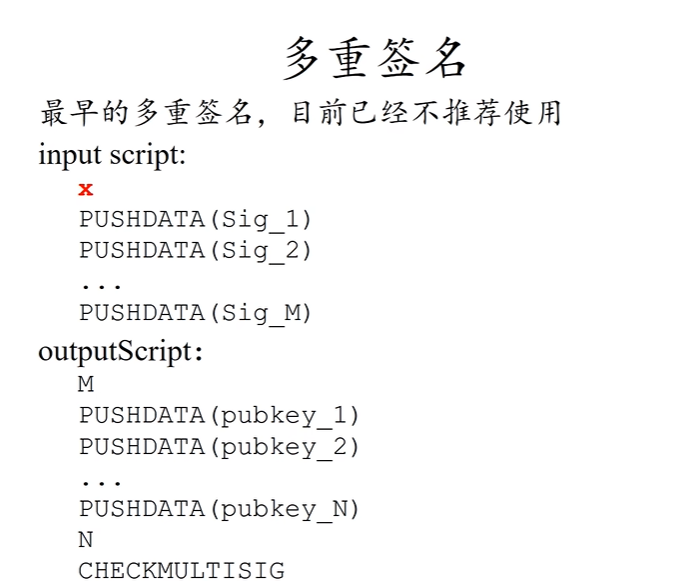

## 哈希

### 特性
- Puzzle friendly：通过某种方法预测或计算出特定的输出结果非常困难。没办法通过某种方法去人为控制输出结果的趋势。
- **不可逆性**(hiding)：从**哈希值无法直接推导出原始输入数据**。这意味着如果你只知道一个区块的哈希值，你不能确定是哪个特定的输入产生了这个哈希值。**要求输入要足够大，每个输入概率足够均匀。** 如果输入被限定范围，则可以遍历所有输入去暴力算出。
- **强抗碰撞性**：找到两个**不同的输入，它们产生相同的输出哈希值**，在计算上是**极其困难**的。这保证了区块链网络的安全性，防止了某些类型的攻击。
- **确定性**：对于**相同的输入数据**，哈希函数**总是产生相同的输出哈希值**。这意味着如果输入数据没有变化，无论执行多少次哈希运算，结果都是一致的。
- **高效性**：哈希函数能够**快速计算**出输入数据的哈希值，即使是对于很大的数据集也能高效处理。

> 签名用的随机源要确保随机，否则可能会泄露私钥（仅做了解，涉及密码学）
> （目前记得结论即可，签名的 Nonce 要随机，否则有风险。）签名由私钥、随机数、消息体 hash 生成。

### 比特币网络的 hash

比特币挖矿是用的 hash 算法是 SHA-256，产生的 hash 长度为 256 位。每 4 位二进制可以形成一个十六进制，所以区块一般是以 64 位 16 进制存在。


## Merkle Tree

### 基础概念
Merkle Tree 是区块（ Block Body ）中用来存**交易**的数据结构。存的是交易，可以理解为区块链上所有的块加在一起存储了所有的交易记录历史，存储的不是 UTXO，UTXO 是根据这些交易记录去动态维护的。

Merkle Tree 生成的 root hash 存在了区块的 Block Head 里。用来验证 Block Body 里的交易是否被篡改，任何一个交易被修改，都会影响 root hash 生成。


### Merkle Proof

基于 Merkle Tree，Merkle proof 可以让轻节点验证一个交易是否在给定的区块中，是一个该交易数据到 root 的路径。全节点提供验证这个路径上所需要的其他 hash。


## 区块 Block
### Block Head

存储了宏观信息：
1. BTC 的版本 vision;
2. 前一个区块的 hash：指向上个区块的块头 Block Head，只有块头信息参与 hash;
3. root hash：Merkle Tree 的所有交易的 root hash，保障交易列表不被篡改。（挖矿时可以借用 Coinbase Commit 前 8 bytes 作为 Extra Nonce）;
4. ntime：区块的创建时间 ;
5. nBit: 目标值 Target 的压缩编码（4 bytes）;
6. Nonce：当前区块的随机值（4 bytes）;

Hash 时只计算 Block Head，不包含 Block Body。

### Block Body

包含详细信息：
- Transaction List 交易列表/记录（一般用 Merkle Tree 数据结构读取）

> UTXO 集合不直接存储在 Block Body 中，而是全节点基于交易记录去动态维护的状态信息。UTXO 存放在全节点的内存中，以便快速读取检测。


### 验证交易存在 proof of inclusion

轻节点利用 Merkle proof 去验证交易是否存在区块中。
Merkle proof ：在 Merkle Tree 中这个交易到根节点的路径。

Merkle proof 可以证明 Merkle Tree 里包含某个交易。时间成本很低，O (log (n))。

如果你转钱到我的账户，你需要提供 Merkle Proof。我验证后 root hash 一致，证明你转钱成功写到区块链里了。

首先轻节点向别的全节点，获取 Merkle Proof（路径）上每个节点所需要的 hash 值。通过这笔交易生成的 hash，沿着 Merkle Proof 从下往上验证，加上全节点提供的所需 hash，就可以计算出 root hash，root hash 与轻节点 Block Head 的 root hash 一致，这笔交易就在这个区块中。


### 恶意节点，提供错误 hash

Merkle Proof 依赖全节点提供的 hash，如果提供 hash 的全节点是恶意节点，提供错误 hash，导致交易验证失败。

轻节点不只依赖于一个全节点提供的信息，而是通过**多节点验证** Merkle Proof，并进行比较。如果大部分全节点提供了一致的信息，而少数节点提供了不同的信息，轻节点可以判断那些少数节点很可能是恶意的。

### 验证交易不存在

笨办法：验证整棵树，这样知道叶节点交易没被篡改，没在叶节点交易里就是不存在。

全节点整颗 Merkle Tree 发给轻节点，轻节点进行整棵树计算验证，如果 root hash 一致，证明树没被篡改，叶节点只有这些，这笔交易不在叶节点里，交易不存在。时间复杂度 O (n)

好的解决方案：
叶节点有序（sorted merkle tree）（比特币没有实施），只验证 merkle proof。
如果叶节点有序（根据 hash 从小到大），则找到交易这个节点应该插入的位置，将左右两个交易去走完 merkle proof，如果 roof hash 一致，证明这两个交易没被篡改，他们中间确实没有我们要找的这个交易。这样时间复杂度 O (log (n))。也不用去验证整棵树。


## 账本模式

比特币网络基于 UTXO 的账本模式，系统记录的是交易记录。

Block Body 保留了本区块的交易记录，不管在未来这些交易的输出是已被花费还是未被花费，这些交易都会在区块链中永久保存。

UTXO 集合，我们指的是当前所有未被花费的交易输出的集合，由全节点动态维护。**一个 UTXO 如果已被花费，会从 UTXO 集合中移除**。

区块链所有区块的 Block Body 集合在一起保留的是**所有交易记录**，UTXO 集合只是**交易记录**中未被花费的交易输出集合，是根据区块链的所有交易记录去动态维护的。

UTXO 模型通过跟踪每个未花费的输出来确定账户的余额，在比特币系统中没有“账户”或“余额”的概念，**并没有一个全局变量记录了余额**。

虽然看起来通过钱包地址可以查询到“余额”，实际上这个余额是通过统计该钱包地址可以引用的所有 UTXO 计算出来的。

没有维护全局变量：
- 余额需要通过钱包地址可以引用的所有 UTXO 计算出来的
- 每次交易都需要给出资金来源。

## 比特币共识（consensus in BitCode）

假设大多数节点是好的，以此设计共识协议。

### 投票-算力

谁具有记账权，投票决定。但投票不能以数量决定，应该以算力决定。

问题：谁有投票权，如果恶意节点有投票权将会影响投票，例如女巫攻击（sybil  attack）（童话故事里女巫可以伪装任何人）。
解决方案：
1. 联盟链，能确保参与人都是好的，没有恶意节点。但中央了。这些人具有投票权，可以决定谁有记账权。
2. 记账权不要用投票权决定，不是用投票数量决定，而是用算力决定。

比特币中记账权不是按节点数量来决定投票结果，是用算力来决定。这样就解决了女巫攻击，女巫攻击只能伪装更多的节点，在节点数量上提高，但没法提高算力。

其他节点收到广播后验证，Block Head 正确性，里面的 Target 的 nBits 符合比特币规则，Nonce 符合 Target 等。

验证完认可新区块，继续新区块往下扩展。

比特币的共识是账本，而账本只能记账人通过新区块写入，新区块的产生只能靠 hash。
Hash 的 puzzle friendly 保证了没有捷径，只能靠算力。所以说投票权是看算力而不是节点数量。


### 最长链原则

有分叉时，以最长链为合法链。

同一时间产生新区块或广播延迟，产生不同节点视图时，也用最长链原则使得整个区块链一致。

**挖掘新区块的广播具有传播时间**，与网络延迟类似，新区块从源节点广播到全网所有节点需要一定的时间。在这个过程中，如果有多个新区块被挖掘，不同节点可能接收到不同的新区块，形成不同的下一区块，随后这些节点用下一区块继续往后面挖矿添加新区块，产生了一条分支。
 
这个过程区块链出现分叉，即形成了**节点间的不同视图**。

当产生分叉时，区块链按照“**最长链原则**”作为共识机制，接受最长的链作为合法链，其他分叉的区块被废弃（被废弃的区块通常被称为“孤块”），

因为孤块不在区块链主链上，所以交易不被节点认可。

### 确认交易成立 Six Confirmation（6 确认）

交易被认为是足够安全的标准是获得 6 次确认，这大约需要 60 分钟。可以认为该交易已经成立不会被篡改了。但只是被篡改的概率极其低，所以认为不会被篡改。

### Zero Confirmation（0 确认）

交易尚未得到正式确认，但却乐观认为交易完成了。

对于小额交易，攻击者进行双重支付的动机不大（潜在的收益不足以抵消所需的付出）的场景都可以接受这种交易。应用很广，因为现实中很多时间因素允许这种乐观成立，例如电商从确认交易后有发货时间，超过 1 h，如果 1 h 后交易没成功，可以不发货。

### Forking attack

分叉攻击，攻击者尝试创建一条竞争分支，以便暂时或永久地改变网络的共识。要求算力足够强


#### Selfish mining 自私挖矿
攻击者挖掘新的区块但不立即广播到网络，而是保留这个区块，创建一个私有链。攻击者希望能够在私有链上积累足够长的区块链，然后在适当的时候将其发布到公共网络上，以取代现有的区块链。

收益：获得这些区块的所有出块奖励，而其他矿工在无效区块上挖矿做无用功，减少竞争力。要求自身算力足够强。

风险：风险很大，如果中途被其他矿工出块且合法链的长度比私有链更长，攻击者一个区块的奖励都获取不到。

#### Double spending attack

双重支付攻击：恶意攻击者尝试将同一笔资产同时支付给两个或多个不同的接收者的行为。

Double spending attack 是通过 Soft attack，在交易写到区块后，同时发起一条由上一个区块的分叉，如果分叉在未来能够成为合法链，则回滚了交易。

例如：在交易写到区块链上后，电商发货了，攻击者发起一条由上一个区块的分叉，且扩展链的长度使其成为合法链，与电商这笔交易的区块就无效了，或者说被回滚了。这就达到一笔钱花两次的效果，攻击者可以获得货物和钱。

防范：等一段时间再确认交易，一般 6 个区块（1 小时）。这样攻击的成本会特别大，攻击成功的概率极其小。


在区块链之外还有很多因素，是允许乐观交易成立的，允许确认时间延后的。例如电商平台发货需要时间，快递也需要时间，如果交易失效了可以不发货或追回快递的。Double Spending Attack 随着区块链增长难度越大，一般 6 个区块认可后才视为这笔交易确认，即 1 小时后，理论上 Forking attack 成功可能性为 0。


### 恶意节点不认可一个有效的区块

恶意节点占少数，影响是有限的，因为不会影响其他遵守规则节点的共识。

当多数的计算能力（也就是说，多数的节点）认同某个区块链版本时，这个版本就会成为公认的最长链。

### 恶意节点制造欺诈性的交易

恶意节点占少数，影响是有限的，因为不会影响其他遵守规则节点的共识。

如果一个交易被认为是无效的，那么遵循规则的节点不会广播这个交易，也不会将其包含在一个区块中。即使恶意节点将其打包伪装成出块，其他遵守规则的节点对这个区块验证后，也会拒绝这个区块。

### 区块链是否被篡改，只需要核对最后区块的 hash

验证最后区块的 hash 的过程，需要沿着区块链从头到尾 hash 整条区块链进行验证，最后一个区块的 hash 是验证累计的结果。

即完整的安全性需要全节点执行全面的验证。其他时刻可以依赖于网络中的其他节点，进行快速验证。
如果一个节点本地的区块链，最后一个区块的 hash 与网络中大多数节点认可的 hash 相匹配，那么该节点的本地的区块链没被篡改过。（除非大多数节点是恶意节点）。

## 比特币是如何保证安全性的

1.	密码学：没有私钥，无法伪造签名，别人无法转走你的账。
2.	共识机制：区块链上大部分是诚实的节点，没有你的签名不会允许别人转走你的钱。

## 分叉

### State fork 状态分叉

对区块链的【状态】有分歧导致的分叉。
Forking Attack 也属于 State fork，只不过是故意人为的分叉。

### Protocol fork 协议分叉

协议上的修改，导致的分叉，分为：
- Hard fork
- Sort fork

#### Hard fork

硬分叉是永久的，特点是：旧节点对新规则不认可

新规则是新节点提倡的，新节点肯定认可新规则。只有新节点不认可旧规则才会产生分叉。
假设大多数算力的节点都更新了，即新节点占大多数，则新节点挖出大区块后会沿着最长链继续往下挖。
而旧节点认为大区块这条长链非法，继续沿着小区块链挖，形成了两条平行的链。

1 M => 2 M，旧节点对改后 2 M 不认可。

```
----A----B2----C2----D2-----E2
     |---B1----C1
 B2: 小明-> 小红 10
```

#### Soft fork

软分叉是临时性的，特点是：旧节点对新规则认可

新规则是新节点提倡的，新节点肯定认可新规则。只有新节点不认可旧规则才会产生分叉，如果新节点认可旧规则，那新旧节点都认可旧规则，新规则不可能占据优势替换旧规则的。

1 M => 0.5 M，旧节点对改后 0.5 M 认可。

```
----A1----B0.5----C0.5----D0.5-----E0.5----G0.5
             |---C1        |---E1      
```

#### Hard fork 的回放攻击

Hard fork 在分叉那一刻，两条链是一致的，用户的交易记录在两条链都有记录。分叉那一刻，用户在 A 链有多少余额，在 B 链就有多少余额。

在硬分叉后，如果用户在链 A 发起一笔交易（签名，UTXO，公钥都是公开的）交易给攻击者，攻击者可以拿去 B 链进行回放攻击，只要 B 链上用户没把这个 UTXO 花出去，攻击就可以成功。两条链在分叉点之前共享相同的交易历史，所以相同的交易签名在两条链上都是有效的。

防范是通过在交易中加入特定的标记 ChainId 区分两条链，当用户签署交易时，ChainId 会被包含在签名中，以确保一条链上的交易不会被另一条链接受。


## 比特币网络

### 基础概念

网络层/底层：P 2 P 网络（对等网络），所有节点都是平等的。
比特币协议：运行在 P 2 P 的应用层。

节点加入网络：需要找到一个种子节点（seed node），会告诉你网络上的其他节点。节点之间通过 **TCP** 通信。
节点离开网络：别的节点没听到你的消息就会把你删除。

每个节点维护着邻居节点（不是地理位置上的邻居，可能距离很远跨洲），当节点收到消息时会传播给所有邻居节点，且标记已收过这条消息，下次再收到就不会重复传播。

每个参与者既是客户端又是服务器，这意味着它们既可以请求资源也可以提供资源。

特点：去中心化、可扩展性、鲁棒（稳定）。但低效，跟身边的人交易和跟美国转账速度差不多。

### Race condition 竞争条件

网络传播存在延迟，节点可能会收到两个冲突的合法交易，不同节点收到的顺序是不一样的。只会**按时间**接受最先收到的交易，另一个视为非法不进行广播。

如果当新发布区块后，资金来源 UTXO 被使用了，将会在 UTXO 集合中删除。后续收到交易信息，资金来源是这个 UTXO 的都视为非法。


### 区块大小限制 1 M

越大的区块，传播速度越慢。

比特币区块的大小限制是 1 M，限制区块大小的原因：
1. **避免网络拥堵，确保交易可以在合理的时间内得到确认**：因为传输一个超大区块需要更多的时间，当矿工选择大量的交易，将会导致区块链的效率降低。限制大小限制意味着一个区块只能包含有限数量的交易，促进了交易的高效处理。
2. **保持区块链的去中心化**：限制区块大小有助于保持网络的去中心化，因为如果区块过大，那么只有那些拥有高性能计算能力的个体或实体才能有效地参与挖矿，因为验证交易过程太长了，验证完才能挖矿。这将导致网络的中心化，损害区块链的基本原则。


## 节点

### 基础概念

比特币节网络中，任何机器都可以运行一个完整的比特币节点（全节点），包括: 
1. 钱包：用来发起交易，广播交易，跟踪和管理 UTXO。
2. 完整区块链：记录了所有交易历史，通过特殊的结构保证历史交易的安全性，并且用来验证新交易的合法性。
3. 矿工：通过记录交易及解密数学题来生成新区块，如果成功可以赚取奖励。
4. 路由功能：把其它节点传送过来的交易数据等信息再传送给更多的节点。

可以运行一个比特币的完整节点（全节点），当然这个比较消耗资源。一般用户都是使用**轻客户端或专用钱包软件**（轻节点），具备少量功能，可以进行交易创建。

### Full （validating）Node 全节点

- 一直在线
- 本地硬盘维护完整的区块链信息（Block Head、Block Body）占资源大。
- 内存里维护 UTXO 集合
- 监听比特币网络上的交易信息，验证每个交易的合法性
- 监听其他矿工挖出来的新区块，**独立验证**区块的合法性
	1. Block Body 区块中的所有交易都要合法，包括 Coinbase Transaction
	2. Block Head 中 nbit ，root hash 等是否被篡改，整个 Block Head hash 后满足目标阈值
	3. 区块在最长合法链上
- 决定哪些交易打包到区块里
- 决定沿着哪条链挖
	- 出现不等长分叉时，沿着最长合法链
	- 出现等长分叉时，沿着最先收到的分叉。

> **独立验证**区块的合法性很重要，必须自己执行一遍所有交易，不能不验证而直接信任。否则危害区块链的安全性。而且最重要的是，跳过验证这个过程，本地的 UTXO 集合是不正确的，无法继续挖矿。
### Light （validating） Node 轻节点

区块链中大部分是轻节点，只有 Block Head，没法独立验证交易，需要利用区块链的信息（其他全节点的信息）做查询校验。最长见的是手机钱包 App。

- 不是一直在线
- 只保存 Block Head
- 只保存与自己相关的交易
- 只能检验与自己相关交易的合法性（依赖全节点提供的 hash）
- 可以验证新区块是否满足难度要求
- 无法验证新区块的合法性（不知道区块的交易信息，也就无法验证交易合法）
- 无法验证哪条是最长合法链（不知道区块的交易信息，也就无法验证交易合法），只能验证哪条是最长链（hash 只需要 Block Head）。
- 无法验证 Double Spending Attack (不知道区块的交易信息，没有 UTXO 集合)

## 挖矿

### 挖矿的动力

矿工会收到**铸币交易 Coinbase Transaction（出块奖励 Block Reward）** 以及区块中所有交易的**手续费**。

挖矿实际上是创建新区块的过程。矿工通过工作量证明 （PoW）挖矿，成功的矿工可以将新的交易打包成一个区块，然后将这个区块添加到区块链上。

**出块奖励通过一笔铸币交易（coinbase transaction）得到：这是唯一产生币的渠道。**

### 出块奖励减半

**出块奖励减半**是比特币协议的一部分，大约**每四年减少一半的出域奖励**。目的是确保了比特币不会因为过快的产生而失去稀缺性和价值，最终在 2140 年左右达到 2100 万比特币的总量上限。

一开始每个出块奖励 50 BTC，每有 21 w 个区块（大概 4 年）以后，出块奖励减半。

也解决了冷启动的问题，一开始收益丰富，大家积极性高。

>  比特币的区块奖励大约每 4 年减半一次，这个设计是通过精确的计划和计算得出的。比特币网络被设计为每 10 分钟产生一个新区块。当累计产生 21 万个新区块时，区块奖励就会减半。由于每 10 分钟产生一个区块，21 万个区块总共需要 210 万分钟，这大约等于四年的时间。


### 币的数量有限

币是有限的，不是因为技术问题，是因为人为规定了协议。比特币，协议规定最多只能存在 2100 万个比特币。

由于区块减半，币总量计算公式：
```
   21万 * 50 + 21万 * 25 + 21万 * 12.5 + ...
 = 21万 * 50 * (1 + 1/2 + 1/4 + ...)
 = 21万 * 50 * 2
 = 2100万
```

目的：
- **防止通货膨胀**：传统的法定货币可以由中央银行无限制地印制，可能导致通货膨胀。设定加密货币的最大供应量旨在避免由于货币过度发行而引起的通货膨胀。
- **提供价值存储**：通过限制总供应量，加密货币（如比特币）旨在提供一种长期的价值存储方式。就像黄金一样，其价值部分来自于其稀缺性。
- **激励机制**：在比特币的背景下，挖矿激励（区块奖励）随着时间的推移而减半，直到所有比特币都被挖掘出来。这种设计既鼓励了早期的网络参与者，又确保了比特币经济的长期可持续性。


币的总量如果要修改，需要更改区块链网络的基本共识规则，需要大多数节点达成一致同意，由于不同的利益相关者可能有不同的利益，**达成这样的共识通常非常困难**。

例如：比特币社区在 2015 年关于扩容问题，随着比特币用户数量的增长，网络的交易量也随之增加。这导致了交易确认时间变长，时间变长又导致手续费上涨的问题，比特币的区块大小限制为 1 MB，限制了每个区块可以包含的交易数量。
- **用户**：希望交易快速、费用低。对他们来说，提高网络吞吐量是优先考虑的事项。
- **矿工**：矿工从每个区块的交易费中获利。一方面，他们希望保持较高的交易费以增加收入；另一方面，太高的交易费可能减少用户使用比特币的意愿，从而影响矿工长期的利益。
- **节点运营者**（维护比特币网络的全节点）：更大的区块意味着需要更多的存储和带宽，支出更多。因此，他们可能对快速增加区块大小持保守态度。
- **开发者**：比特币核心开发者团队对网络的未来方向和技术改进有着显著的影响力。开发者间也存在分歧，关于如何平衡用户体验、网络安全和去中心化。

最终比特币通过分段见证、闪电网络解决方案来解决扩容问题。从 2015 年关于扩容问题产生，直到 2017 大多数节点意见一致并实施解决方案。讨论区块扩容就已经花了 2 年了，修改币总量带来的共识问题会困难无数倍。


### 成比例优势

Bernoulli trial：伯努利试验，每次 Bernoulli 试验的成功概率是固定的，记为 p，而失败的概率则为 1−p，例如抛硬币。

挖矿是一个进行 Bernoulli trial 的过程（Bernoulli process），概率上符合指数分布。具有无记忆性


**无记忆性：前面的结果对后续的结果是无影响的。也叫 Process Free，已经花费的时间是无用功的，对未来没影响。这确保了算力具有按比例的优势，即没有保底机制。**

如果不满足 Process Free，那高算力将会有不成比例的优势。例如游戏中的抽卡往往有保底机制，过去的过程对未来会产生影响。假设保底机制是 10 次卡一定会出一个 SSR，一个土豪抽 100 次卡，至少会获得 10 个 SSR，他的奖励范围是  `[10, 100]`。一个萌新抽 5 次卡，他的奖励范围是 
`[0, 5]`。

他们的优势对比是：
- 5 次： `[0, 5]`
- 100 次： `[10, 100]`

成比例的优势对比是：
- 5 次：`[0, 5]`
- 100 次：`[0, 100]`

 Process Free 可以确保成比例的优势，同时也意味着前面挖了多久矿，对未来出矿的时间不会有任何影响。
 
 比特币网络的出块时间 10 分钟是平均值，通过调整挖矿难度来保持这个平均时间，而不是通过调整单个出矿概率。矿工挖了 9 分钟，不影响下一次出矿的概率，每一次的尝试都是独立的，都有相同的成功概率。

"假设目前所有矿工花费了9分钟还没出块，那未来1分钟多应该很大概率出块了"是一个基于经验性的常见直觉误区，是长期平均看的结果，并不影响下一次出矿的概率。

也是因为 hash 的输入范围接近无限大，不会有筛选已用过的输入这种积累性，导致概率变动。

### Hash

Hash 时只计算 Block Head，不包含 Block Body。

挖矿是对 Block Head 进行 hash ，只要输出 hash 值满足目标值即挖矿成功，改变 Nonce 的目的也只是为了改变 Block Head。

### Nonce 取值范围不够

随着全网算力提高难度值一直在提高，Nonce 的取值范围已经不够，遍历完可能也找不到一个满足目标难度的，可以用 Merkle Tree 的铸币交易（Coinbase Transaction）的留言（Coinbase Commit）作为 Extra Nonce。

出块奖励是一笔 Coinbase Transaction，矿工会将一笔 Coinbase Transaction 连同选择的交易一起打包，存放到 Block Body 中，通过 Merkle Tree 计算出 Root Hash 存放在 Block Head 里。

对 Coinbase Transaction 的留言 Coinbase Commit 进行更改后，Merkle Tree 生成的 Root Hash 也会改变，对整个 Block Head 进行 hash 计算后的值也会改变，达到了扩展 Nonce 的目的。


真正挖矿调整两个值：
- Nonce
- Coinbase Commit


### 交易冲突

交易被使用过（已经写到区块链里了），就需要在选择进入打包的交易里删除。否则就是非法交易，即使出块了也会被其他遵守规则的节点拒绝。

### 区块 1 M 为什么不装满

理论上装满 1 M 大小的交易的收益是最大化的。

**越大的区块区块传播时间越慢**：如果一个区块包含了很多低费用的交易而变得很大，它可能会比较小的区块更慢地被网络接受。
多个矿工在临近时间一起出块时，越大的区块区块传播时间越慢，这可能会增加该区块被其他矿工的区块取代的风险，从而导致矿工失去区块奖励。

每个矿工对交易费率、交易大小这些因素的决策不同，决定着是否装满 1 M 以及选择交易的优先级。


### 恶意节点偷取 Nonce 是否有用

挖矿时是在尝试 Nonce，那如果恶意节点收到其他节点出块时要求验证的 Nonce，将其用于伪装成自己出块也去广播，与出块人比拼网络传播速度，是否有用

结论：
偷 Nonce 是没用的，出块的奖励通过 Coinbase Transaction 里的收款人指定的，收款人一改，root hash 就变了，整个 Block Head 的 hash 也跟着变了。修改 Nonce 值也只是为了让 Block Head 的 hash 满足目标值，本质上是 Block Head 的 hash 满足目标值才算挖矿成功，并不是 Nonce 满足。


### 矿机

目前都是用挖矿专用芯片  ASIC，算力远高于 GPU。
但这使得中心化了，部分区块链用 AISC resistance（抗 AISC 芯片化），使得通用计算机也能参与挖矿。

### 矿池

一个矿池管理成千上万的矿工
- 矿池：全节点除了计算 hash 之外所有全节点职责
- 矿工：只计算 hash

挖矿难度高是因为目标值 Target 太小了，矿池适当增大 Target 作为一个 share（可以理解矿池自己的 target）给矿工，矿工挖出满足的区块就证明工作量了，这个区块对矿池没有任何作用，仅用来证明矿工的工作量。直到真正找到比 Target 小的区块才是真的出块了。

矿池将不同 Coinbase Commit 和 Nonce 取值范围，交给不同矿工去尝试。

对于矿工的好处：
- 减轻了负担：矿工只需要计算 hash。
- 收入稳定：矿池按照 PoW 给矿工分红，即使自己没出块，也能按照工作量证明参与分红。

**矿池的出现对去中心化不利**，使得 Forking Attack 变得容易：
- Double Spending Attack
- Boycott (封锁禁欲)，所有跟某人相关的交易都不准上链，一打包就分叉。

### 矿工在矿池领任务后出块，可以偷这笔钱吗

矿池将不同 Coinbase Commit 和 Nonce 取值范围，交给不同矿工去尝试。其他内容是不可修改的，Coinbase Transaction 的收款人地址也是不能修改的，否则就不算这个矿池的 PoW。

如果一开始挖矿就是写自己的收款地址，从始至终都是在单干。


## 挖矿难度

### 基本概念

出块时要求：H (Block Head) <= target，目标阈值 target 越小挖矿难度越大，调整目标域值 target，实际上是调整目标空间在输出空间所占的比例。

目标阈值（代码中用的是目标阈值）调整公式：
`Target = target * 最近 2016 区块 actual time / expected time`


如何计算挖矿难度，挖矿难度和目标阈值成反比，挖矿难度最小为 1，计算公式：
`Difficult = difficult_1_target / target `
Difficult_1_target：挖矿难度等于 1 时的目标阈值，是一个常量，一般都设置得非常大。有了 Difficult_1_target 和 target 就可以计算挖矿难度。


比特币挖矿是用的 hash 算法是 SHA-256，产生的 hash 长度为 256 位。
通俗的说，检验时可以判断二进制前面 0 个数是否满足目标域值。因为难度越高，目标阈值越小，越小时前面 0 越多。


每次调整难度时有个最大限制，最大不超过 4 倍，最小不小于 1/4，避免遇到特殊情况，挖矿难度被设置得极大或极小


### 调整 target 的周期

调整 target 的目的是保持出块时间稳定，不会太短也不会太长。

比特币是根据前 2016 个区块的生成时间来调整挖矿难度的。

一个区块 10 分钟，2016 个区块，20160 分钟即两周调整一次。


### 出块时间太短产生的问题

网络传播需要时间，传播时间不够只能覆盖小范围，分叉严重且会成为常态，对区块链的达成共识不利。

总算力被分叉分散了，恶意节点可以集中算力扩展一个分叉，使得替换主链（Forking Attack）变得容易。

产生大量孤块，导致其他挖矿工作的浪费。

### 如何确保所有节点都同时调整 target

写在比特币系统代码中，每挖到 2016 个区块，都会去执行调整 target，不用广播。


### 恶意节点不调 target

在难度上升时恶意节点不调整 target，hash 速度会比别人快。

target（32 bytes） 压缩编码后写在 Block Head 的 nBit (4 bytes) 中，不调难度值则不合法，不被其他节点接受，相当于没法出块获得出块奖励。


## UTXO
### 基础概念

比特币网络通过 UTXO (`Unspent Transaction Outputs` 未花费的交易输出)实现。

每个输入都是之前交易的一个输出（UTXO），而每个交易输出可以成为未来交易的输入。

Alice 拥有 10 个比特币并想要支付给 Bob 4 个比特币：
在创建交易时，Alice 的钱包需要明确指出是哪些 UTXO 被用作本次支付的资金来源。
- `Input: Alice address, Referenced UTXO value (10)`
- `Output 1: Bob address, Amount (4)`
- `Output 2: Alice new address (找零地址), Amount (6)`

这样，Alice 原来的 10 个比特币的 UTXO 就被消费了，而新生成的两个 UTXO（一个是 Bob 的 4 个比特币，一个是 Alice 的 6 个比特币找零）则可以在未来的交易中使用。

每次交易可以有多个输入，多个输出。这些输入可以来源不同地址（属于不同账号），交易有 n 个输入就需要有 n 个签名和公钥。

UTXO 存放在全节点的内存中，以便快速读取检测。

### UTXO 的结构

1. **交易哈希（Transaction Hash）**：产生 UTXO 的那笔交易的唯一标识符，也就是那笔交易的哈希值。它用于唯一地定位包含该 UTXO 的交易。
2. **输出索引（Output Index）**：这是指 UTXO 在其产生交易的输出列表中的位置。因为一笔交易可以有多个输出，所以需要索引来指定哪一个输出是 UTXO。
4. **金额（Amount）**：这是 UTXO 所持有的比特币数量，表示了这个 UTXO 的价值。
5. **锁定脚本**：指定可以解锁该 UTXO 以进行消费的公钥。

### 资金来源

每次交易时，必须指明具体使用哪些 UTXO 作为资金来源。

指定资金来源 UTXO 时需要提供以下信息：
- 交易的 hash：指的是产生该 UTXO 的那笔交易的 hash 值。
- 输出下标：该 UTXO 在产生它的交易中作为第几个输出（从 0 开始计数）。
- 签名：用来验证是否该 UTXO 的所属人

### 验证资金来源是否有效

全节点内存中维护了 UTXO 集合，方便快速读取检测。当一个 UTXO 被花费后，它就会从 UTXO 集合中删除，新产生的 UTXO 保存在 UTXO 集合中。

例如检验资金来源 UTXO 是否有效，只需要在 UTXO 集合中
- 验证 UTXO 是否花费过
- 验证是否发起人发起


验证是否发起人发起：利用 Id 和归属状态，在比特币中是通过产生该 UTXO 的交易 hash 和锁定脚本（公钥）进行验证的（分别对应 id 和归属状态）。
交易里面有一个公钥，发起交易者将会把公钥提供给接受者。币的来源指向的 UTXO 的输出，也有一个公钥指明了归属者。这两个公钥一对比就知道是否由币的拥有者发起的交易。

验证失败为不合法，不合法的交易将不会被占大多数的诚实节点认可。
- 把一个钱花两次（已经交易过了，不在 UTXO 集合里）
- 花别人的 UTXO（所属公钥/签名对不上）

### 验证余额的正确性

轻节点检测余额，需要依赖全节点查询 UTXO 集合，最后返回给轻节点，但轻节点只能通过多节点验证，多数返回一致则认为余额正确。没法凭着轻节点自身验证余额的正确性。

解决方案（没实施）：UTXO 集合也生成 Merkle Tree，这个 root hash 写在 Coinbase Commit 后面几位（前 8 位给 Extra Nonce 了）。这样轻节点就可以验证 root hash 看 UTXO (余额)是否被篡改过。（个人认为没实施的原因是增加维护和验证的复杂性和成本，Merkle Proof 也需要全节点提供其他 hash 验证，也依赖全节点。）


### UTXO 集合在多个节点中是如何保持一致的

全节点拥有完整的整条最长合法链，可以通过最长合法链来得到 UTXO 集合存放到内存中，这样所有的全节点都可以保持一致。
后续只要监听新的出块消息，去维护 UTXO 集合即可。

## 交易

### 交易费

矿工的激励，矿工选择交易的动力，争夺记账权后可以获得出块奖励和交易费。

1. **用户自定义费用**：所有输入减去所有输出，剩余的就是给矿工的手续费
	`Fee = totalInputs -  totalOutputs`

2. **按字节计算的费用**：钱包平台提供实时的交易费推荐，帮助用户选择合适的手续费水平。比如，如果当前网络条件下推荐的费率是每字节 1 聪，那么一个 250 字节的交易就应该设置 250 聪的手续费。最后落实到交易里还是 `Fee = totalInputs -  totalOutputs`。
	交易费 = 交易大小 x 费率
	- **交易大小**：指的是交易数据的字节大小，一般来说，交易的输入（来源）越多，交易的大小就越大，因此交易费也可能更高。
	- **费率**：通常以“satoshi/byte”（satoshi 是比特币的最小单位，1 BTC = 100,000,000 satoshi）为单位。由用户自己设定，当网络繁忙时，用户可能会选择支付更高的费率以加快交易确认。


### 交易的结构


一个交易最终写在区块上的结构包含以下 Meta Data（元数据）
- "txid": 交易 id，一般是交易的 hash
- "hash": 交易的 hash
- "version": 比特币协议的版本号
- "size":  交易的大小
- "locktime":  交易的生效时间，一般 0，立即生效。可以是时间戳，代表过了这个时间戳，这个交易**才可以被矿工选择打包进块**。也可以是整数代表，代表得过 10 个区块。（ block time 会与 time 对比验证是否时间到了。）
- "vin": 输入，描述了资金来源，包含了输入脚本
- "vout": 输出，包含了输出脚本
- "blockhash": 这个交易所在区块的 hash
- Confirmations": 确认数，代表后续产生了多少个新区块，越大越不可能被 Forking Attack
- "time": 交易产生的时间，单位是 s
- "blocktime": 区块产生的时间，单位是 s

交易不是 UTXO，交易的输入 vin 和交易的输出 vout 是 UTXO。

> `locktime`：用来“取消”交易。虽然比特币网络本身不允许取消已经广播的交易，但通过设置 `locktime`，发送方可以在交易被锁定期间创建另一个具有更高交易费的交易（即使用相同的输入），以此来“替换”原先的交易。

### Vin 输入，描述了资金来源


输入 vin 是一个数组，一个交易可以有多个输入，代表多个资金来源。

每个输入都可以理解为是一个 UTXO

每个输入的结构为：
- "txid": 指的是产生该 UTXO 的那笔交易的 hash 值。
- "vout": 该 UTXO 在产生它的交易中作为第几个输出（从 0 开始计数）。
- "scriptsig": { 
	- "asm": 脚本内容（汇编）
	- "hex": 脚本内容（16 进制）
	}

scriptsig 输入脚本，可以理解为签名脚本，最简单就是给个签名作为输入来验证。

### Vout 输出，描述了资金数额和所属


输入 vout 是一个数组，一个交易可以有多个输出，代表多个资金去向。

每个输出都可以理解为是一个 UTXO

> 注意：交易输入 vin 里面的 vout ，跟交易输出 vout 不是一个东西。交易输入 vin 里的 vout 值的是该 UTXO 在产生它的交易中作为第几个输出（从 0 开始计数），对应的是交易输出 vout 里的 n，即 `vin.vout => vout.n`。

每个输出的结构为：
- "value": 输出的金额 00
- "n": 作为这个交易的第几个输出，对应后续使用该 UTXO 时，vin 里的 vout。
- "scriptPubkey":{
	- "asm": 脚本内容（汇编）
	- "hex":  脚本内容（16 进制）
	- "reqSigs": 这个输出需要多少个签名才能兑现，一般是 1，多重签名大于 1
	- "type": 输出的类型，最容易的就是公钥 hash，值为"pubkeyhash"
	- "addresses": 输出的地址，收款人钱包地址。(主要用于提高人类用户的可读性和钱包软件的友好性)
	}
	
ScriptPubkey 输出脚本，可以理解为锁定脚本，用来验证是否该 UTXO 的所属人，最简单就是给个公钥作为输出用来验证。


### 交易过程


每一笔交易输入对应着前一笔交易的输出。每个输入都是之前交易的一个输出（UTXO），而每个交易输出可以成为未来交易的输入。

交易不是 UTXO，交易的输入 vin 、交易的输出 vout 是 UTXO。

交易输入 vin 里面的 vout ，跟交易输出 vout 不是一个东西：
- 交易输入 vin 里的 vout ：是该 UTXO 在产生它的交易中作为第几个输出（从 0 开始计数），对应的是交易输出 vout 里的 n，即 `vin.vout => vout.n`。
- 交易输入的 txid ：是产生该 UTXO 的那笔交易的 hash 值。

每次交易需要先执行输入脚本，不报错时，继续执行输出脚本，不报错时，栈顶的值为非 0 值（true），验证通过，交易合法。

### 验证交易


1. 通过 UTXO 集验证 UTXO 存在
2. 分别执行输入脚本和输出（锁定）脚本，验证是否有错误，结果为 `TRUE` 则通过。

这次交易的输入，与上个交易的输出组合在一起执行验证。

### 签名与公钥

在传统的加密和解密过程中，加密是使用公钥进行的，只有持有私钥能够解密信息。这种方式确保了信息的保密性。

数字签名过程与此不同，它主要用于验证信息的完整性和来源，而不是保护信息内容的私密性，所以一般用私钥生成签名，公钥对签名进行验证。
- 加密的目的是为了保护信息内容不被未授权的人看到。
- 数字签名的目的是为了验证信息的来源和完整性。

在比特币脚本中，交易者会对交易信息进行 hash（目的是确保了交易数据可以被压缩成一个固定大小的摘要，便于处理），用私钥对交易信息 hash 生成签名，放到输入脚本中（这也是为什么用来 hash 的交易信息不能包含输入脚本）。

验证时，输出脚本会对交易信息进行 hash，同时使用公钥验证签名得到签名里的交易信息 hash，这两个 hash 一致则证明签名和公钥匹配。


### 比特币脚本

基于栈的语言，没有全局变量、局部变量。

输入/输出脚本的形式
- `P2Pk`
- `P2PkH`
- `P2SH`

比特币脚本没有循环，不会出现死循环。
以太坊合约图灵完备的语言，有循环，需要 gas 来限制避免死循环

### P2PK（Pay to Public Key）

最简单的方式，输出给收款人的公钥，输入给出签名。


```
PUSHDATA (Sig)  # 输入脚本-签名推入栈顶

# 先执行输入脚本，后输出脚本分别执行的，在同一个栈

PUSHDATA (PubKey) # 输出脚本-公钥推入栈顶
CHECKSIG # 弹出栈顶两个元素，并进行签名公钥校验，正确返回true。
```


### P2PKH (Pay to Public Key Hash)

最常用的方式，输出给收款人的公钥的 hash，输入给出签名和公钥。


每一次交易，都是拿输入脚本，去验证上笔交易（资金来源）的输出脚本。这一点理解好，不要当成本场交易的输出验证本场交易的输入。

以下脚本执行时，可以将输入脚本理解为花钱者的信息，而前一个交易的输出脚本，理解为验证信息，这两个信息是一致才算验证成功。

```
PUSHDATA (Sig)  # 输入脚本-签名推入栈顶
PUSHDATA (PubKey) # 输入脚本-公钥推入栈顶

# 先执行输入脚本，后输出脚本分别执行的，在同一个栈

DUP # 复制栈顶元素并推入栈顶
HASH160 # 栈顶元素出栈，取 hash，再入栈
PUSHDATA(PubKeyHash) # 输出脚本-公钥hash推入栈顶
EQUALVERIFY # 弹出栈顶两个元素，比较是否相等，相等则继续执行。
CHECKSIG # 弹出栈顶两个元素，并进行签名公钥校验，正确返回true。
```

依靠 EQUALVERIFY 对比两个公钥 hash 相等，防止冒名顶替。


### P2SH (Pay to Script Hash)

最复杂的方式，输出给收款人的赎回脚本的 hash，输入给出签名和序列化后的赎回脚本。

跟上面两个对比，没有给出公钥/公钥 hash，而是脚本 hash。


```
...
PUSHDATA (Sig)  # 输入脚本-签名推入栈顶，用于给赎回脚本正确运行
...
PUSHDATA (serialized redeemScript) # 输入脚本-赎回脚本具体内容

# 先执行输入脚本，后输出脚本分别执行的，在同一个栈

HASH160 # 栈顶元素出栈，取 hash，再入栈
PUSHDATA(redeemScriptHash) # 输出脚本-赎回脚本的 hash 推入栈顶
EQUAL # 验证 对比赎回脚本hash是否一致，一致则执行赎回脚本。
```

验证分为两步:
1. 验证输入序列化的 `redeemScript` hash 后是否与 `output script` 中的 `redeemScriptHash` 匹配。
2. 反序列化并执行 `redeemScript`，验证是否报错。

对于使用体验跟 `P2PKH` 相似
- `P2PKH` 用户需要提供：签名、公钥
- `P2SH` 用户需要提供：  签名、序列化的 redeemScript (赎回脚本)

`redeemScript` 的形式：
- `P2PK` 形式
- `P2PKH` 形式 
- 多重签名形式

`P2SH` 目的是封装脚本，降低使用门槛。具体参考 `P2SH` 多重签名

### 多重签名
目前已经不推荐，都是用 `P2SH` 多重签名。



里面主要的是 `CHECKMULTISIG` 脚本，检验多个签名。

```
FALSE # 兼容 CHECKMULTISIG 代码bug，会多弹出一个元素
PUSHDATA(Sig_1) # 输入脚本-签名推入栈顶
PUSHDATA(Sig_2)
...
PUSHDATA(Sig_M)

# 先执行输入脚本，后输出脚本分别执行的，在同一个栈

M # 需要验证签名的个数
PUSHDATA(pubkey_1) # 输出脚本-公钥推入栈顶，与签名顺序一致
PUSHDATA(pubkey_2)
PUSHDATA(pubkey_N)
N # 总签名个数
CHECKMULTISIG # 检验多个签名
```

**多重签名是为了能够共同控制资金**，验证 N 个签名里面包含 M 个签名。

多重签名的应用场景：
大型商户一般都有多个合伙人，而资金不能掌握在一个人身上，基本都会用多重签名。

例如电商平台，普通用户消费时，会在 `input script` 写上他资金来源 UTXO 的验证脚本，而 `output script` 会写上电商要求的锁定脚本，如以下

```
M # 需要验证签名的个数
PUSHDATA(pubkey_1) # 输出脚本-公钥推入栈顶，与签名顺序一致
PUSHDATA(pubkey_2)
PUSHDATA(pubkey_N)
N # 总签名个数
CHECKMULTISIG # 检验多个签名
```

为了使电商的资金能由多个合伙人掌握，就需要要求用户写他们指定的锁定脚本，相当于给用户负担了。
例如普通用户不关心 `M`、`N` 的值是多少，电商的公钥是什么。

每个大型商户的多重签名 `m-of-n` 规则不同，这对普通用户负担太重了。所以就有了  ` P2SH ` 多重签名出现。


### P2SH 多重签名


`P2SH` 目的是封装脚本，降低使用门槛，复杂度都转移到赎回脚本 redeemScript 里面。

用户在电商平台消费时，`output script` 就只需要按照电商平台要求更改 `RedeemScriptHash`。

永远记得一点，当前交易的 input script 是为了验证资金来源的 output script，验证成功则有使用 UTXO 的权利。
用户在电商平台消费时，会在 `input script` 写上他资金来源 UTXO 的验证脚本，而 `output script` 会写上电商要求的锁定脚本。
之前的多重签名锁定脚本太繁重，现在改成只要 redeemScript hash (赎回脚本 hash)，用户的负担大大降低，这就是 `P2SH` 的优势。


而电商在使用这笔 UTXO 时，提供多个签名和序列化后的 `redeemScript`，验证成功可正常使用，相当于减轻了用户的负担，将来电商要修改多重签名规则，只要改完公布 `redeemScriptHash` 即可，普通用户不关心 `M`、`N` 的值是多少。


### 多重签名是在一个 vin，那跟多个 vin 有什么区别

多重签名是为了实现共同控制资金的需求，重点在于输出脚本里的多重签名验证脚本 `CHECKMULTISIG`。

而多个输入 `vin` 是为了方便用户使用多个的 UTXO 进行支付。

他们的目的有本质区别。


### Proof of Burn

输出脚本以  `Return` 开头，被执行时无条件返回错误。


永远记得一点，当前交易的 `input script` 是为了验证资金来源的 `output script`，验证成功则有使用 UTXO 的权利。

`output script` 是在被使用时执行的，而 `output script` 执行会报错，意味着这笔钱永远花不了。

运用场景：
1. Alternative Coin (AltCoin)：小币种（除了比特币/以太币其他都可以认为是小币种），通过销毁比特币来证明付出了代价，来得到小币种。
2. Digital commitment：往区块链写入内容。例如具有知识产权的知识内容 hash，写入区块链，后面要证明时提供输入给大家去验证，证明在某个时间点已经知道某个知识，且不用提前泄露知识内容。

谁都发布交易，谁都可以往区块链里写入内容（Digital commitment），而 Coinbase Commit 只有记账人能写。

全节点只要排查 `output script` 是 `OP_RETURN` 开头就不会维护在 UTXO 集合里，对全节点友好。所以用 `OP_RETURN` 是比较提倡的。

有些人为了往区块链里写入内容，会把内容 hash 后当成转账地址使用（全节点是不会验证转账地址是否正确的），这个输出会永久保存在 UTXO 集合中，不提倡这种行为。

### Proof of Burn  OP_RETURN 会抛出错误，那怎么验证通过写入区块链

这次交易的输入，与上个交易的输出，组合在一起执行验证。
而 `OP_RETURN` 是在输出脚本，收款人想花出这笔 UTXO，发起交易的时候才会执行，一执行就报错，所以无法交易。

当前这个交易的输出脚本，在验证这个交易的合法性的时候是不会执行的，只有在花费这个输出时才会执行。


### 公钥与钱包地址

公钥经过 hash 函数生成了公钥哈希，公钥哈希再按照比特币的规则进行一些编码处理得到一个比特币地址（钱包地址）。

比特币地址实际上是公钥哈希的编码表示，这也是为什么钱包 APP 可以只在知道钱包地址时，可以知道公钥哈希，自动生成输出脚本。


### 钱包应用程序 （APP）

当一个钱包地址钱不够时，会使用多个钱包地址即多个输入，这个时候可以判断这两个钱包地址有关联，因为这笔交易的发起者掌握了两个钱包的签名。找零地址也可以认为是有关联的。

钱包应用程序（APP）通过生成新的找零地址来增强隐私性。
钱包 APP 是本地存储，不上传到云端。钱包 APP 上，助记词相当于密码对应一个钱包账号，一个账号对应多个私钥，一旦私钥忘记，可以用助记词访问钱包 APP 获取私钥。（助记词是自然语言，例如英语单词、中文词组）

现在基本交易都是由钱包 APP 发起，很少有人工发起交易的。

钱包软件自动为用户生成地址和相应的输出脚本，这些脚本是基于对方公钥或公钥哈希创建的。
有些情况下，用户可能想要创建特定的输出脚本，例如多重签名，用户需要使用支持这些高级功能的钱包。

### 比特币每秒的交易数目

一个交易的大小大概是 250 bytes，一个区块的大小是 1 M，大约可以存放 4000 个交易，比特币一个区块的出块时间是 600 s（10 min）。

`4000 / 600 ≈ 7`，每秒大概 7 个交易。


### 交易相关的疑问


一、交易肯定需要出款人签名，那交易需要出款人的钱包地址吗
不需要出款人的钱包地址，而是引用之前的交易输出

二、需要收款人钱包地址吗
校验时不需要，但最好提供收款人钱包地址，用于 `vout.scriptPubkey.addresses` 主要用于提高人类用户的可读性和钱包软件的友好性。
真正的验证过程是输出脚本/锁定脚本 `scriptPubkey` 的形式 `scriptPubkey.type` 和 `scriptPubkey.asm` 汇编脚本执行决定的。

三、需要收款人公钥或签名吗
`P2PK`（Pay to Public Key）需要收款人 `PublicKey`
`P2PKH` (Pay to Public Key Hash)：需要的是收款人 `PublicKeyHash`
`P2SH` (Pay to Script Hash)：需要的 `redeemScriptHash`

都不需要签名，签名只在收款人想要花费这笔 UTXO 时才需要，因为这时他们需要证明他们有权使用这些币。


四、`P2PKH` 收款人不需要提供公钥，那 vout 的输出脚本是如何产生收款人的公钥的

所有锁定脚本都是由收款人提供的，`P2PKH` 收款人会提供 `PublicKeyHash`。


## 私钥丢失、泄露


区块链中私钥丢失是无法找回的。
交易所是中心化的机构，有的要求身份验证，交易所会帮你保管私钥，这种在私钥丢失可以找回。（交易所也可能被黑或监守自盗，并不是它帮你保存密码就安全。交易所出现问题的事件也很多。）

私钥泄露时，要尽快将钱转走，因为无法修改私钥（密码）。
转钱转错了（写入区块链里），也没办法取消。


## 比特币的匿名性

是伪匿名，并不是真正的匿名。

### 交易-跟现实产生关联

1. **出入链会产生联系**：与现实世界产生交接的会破坏匿名性，转入转出会产生联系，对应的银行卡有实名信息。
2. **缩小范围**：区块链是公开的，账单都可以查到，如果知道你在某时候用比特币购物，可以在账单中缩小范围，从而确定哪些账号跟你相关，多几次就确定了。


### 技术-与现实产生关联

网络层/底层：P 2 P 网络（对等网络）
比特币协议：运行在 P 2 P 的应用层

网络层的匿名性：
- Ip 地址跟现实身份有强关联性
- 如果知道一些交易从哪个节点发出，就知道这些交易是现实世界的谁发出的。

网络层的匿名性的解决方案：
**匿名发起人**，使用**多路径转发**，发送的时候不是直接发给目标节点，而是通过很多个中间节点最后才抵达。中间每个节点都只知道他上一个节点，并不知道最早是谁发出来。这样就可以把最初的发起人匿名。例如洋葱路由（TOR）

但没办法解决与现实世界产生交接的出入链。

### 交易-不同账号产生关联

当一个钱包地址钱不够时，会使用多个钱包地址即多个输入，这个时候可以判断这两个钱包地址有关联，因为这笔交易的发起者掌握了两个钱包的签名。找零地址也可以认为是有关联的。

只要一笔交易暴露了多个账号的关联性，就永久暴露了（写在区块链不可篡改）。


### 技术-不同账号产生关联

应用层的匿名性：
币的来源可以追溯到源头，导致不同钱包地址可以关联起来。（通过 coin mixing 解决）

Coin mixing：机构提供的服务，客户将币存入，机构将币收集在一起进行混合多笔交易重组，最后再还给客户。（但这些机构也可能捐款跑路）

在线钱包（跟本地钱包不一样）、交易所：有天然 Coin mixing 特征，存进去钱和拿出来的不是同一个。


### 相关疑问

一、比特币没有稳定身份，为什么

比特币没有账户概念，只有一个公私钥对，处理交易时验证的是脚本，而不是验证地址。

**BTC 的交易，并不对应钱包地址。一笔交易是可以没有收款地址的，处理交易时验证的是脚本。并没有一个稳定的值使得多笔交易可以联系起来。**

我们说某些 UTXO 属于谁的，是一种人思维逻辑上的归属。如果输出脚本不是标准的脚本，那么比特币浏览器等工具是无法从输出脚本中解析出一个明确的地址，但这并不影响交易的有效性。

交易的输入脚本包含签名，而输出脚本中可以是 `P2SH` 方式的赎回脚本 hash。这些信息里，并没有一个稳定的值使得多笔交易可以联系起来。这些设计使得比特币交易具有很高的匿名性和安全性，但同时也意味着没有一个固定的“身份”可以显式地与特定的比特币地址关联。

BTC 没有稳定身份，我们说【某个 UTXO 属于某个人】【某个 UTXO 属于某个私钥】都是一种人思维逻辑上的归属，真正的所属是由输入脚本和输出脚本验证决定的。


二、“交易的输入脚本包含签名，而输出脚本中可以是 `P2SH` 方式的赎回脚本 hash。这些信息里，并没有一个稳定的值使得多笔交易可以联系起来”，那 BTC 的伪匿名是怎么回事，为什么还需要去 coin mixing

结论：**BTC 并没有一个稳定的值使得多笔交易可以联系起来，所有没有稳定身份。当他使用 UTXO 时，多笔交易是有可能通过一个值被关联起来，从而认定同一个身份的，所以他是伪匿名的。**

"这些信息里，并没有一个稳定的值使得多笔交易可以联系起来"，在交易完成后不花费的情况下，你拥有了多笔 `P2SH` 输出，且每笔赎回脚本 hash 都写不同，其他人是没办法知道这些 UTXO 属于同一个人的。而你拥有这些赎回脚本，你是能使用他们的。**可以做到【隐藏身份】**。只有一个比特币地址，只能找到这个地址相关的交易记录的，那些未花费的 `P2SH` 甚者已花费但没有相同值的交易，是找不到的。

在 `P2SH` 交易中资金被实际花费时，赎回脚本的具体条件会被公开。任何人都可以看到赎回条件，如果赎回条件里含有相同公钥、公钥 hash 或者赎回脚本结构重复出现，则可以关联起多笔交易。**BTC 是伪匿名的，使用 UTXO 时，多笔交易是有可能被关联起来的从而认定同一个身份的。**
Coin Mixing 是一种提高匿名性的方法，它通过混合大量的交易，重新分配币，以此来断开原有交易的直接联系，增加追踪的难度，从而提升隐私保护。


### 扩展：零知识证明

零知识证明：证明者向验证者证明一个陈述是正确的，无需透露除该陈述是正确的外的任何信息。

例如证明我拥有这个私钥，假设你拥有公钥，我用私钥生成一个签名给你，你用公钥去验证。

零知识证明的数学基础：同态隐藏


如果 `E (x) === E(Y)` 那么 `x === y`。


但上面这个有个缺点，可以通过遍历 `E(x)` 去猜，例如已知 `E(x) = 3`, 就可以遍历 `x`。解决方案对 `x` 进行随机化处理再发送，当然要保证随机化后 `E (x) + E(y) === E(7)`


以下仅做了解


盲签的特点：在不知道内容的时候还要对其签名。

？以下内容未整理
1. A 的信息不会直接提供给银行，而是通过盲化因子 SerialNum 盲化信息，将盲化信息提供给银行，银行对盲化的信息进行签名。盲化因子 SerialNum 也不会提供给银行。
2. A 将盲化因子 SerialNum 和签名给 B
3. B 将盲化因子 SerialNum 和签名给银行，银行用盲化因子对签名进行 “揭盲” 取得一个对应原始信息的签名，


匿名性：零币、零钞


## 扩展：分布式共识（distribute consensus）

### 理论 1： FLP 的不可能结论（ impossibility result ）

在一个异步系统里，网络传输有延迟，不可能存在共识。

### 比特币网络的共识-不可能变为可能

理论上的异步系统，网络传输有延迟，不可能存在共识。

例如一个请求一段时间没响应，无法确认对方是网络挂了还是网络延迟。


但比特币网络可以借助外界，例如电话、其他网络通信等去确认。这时候比特币网络不是理论上的异步模型，便脱离了不可能限制。

### 理论 2： CAP Theorem

任何分布式系统，最多满足下面三个其中两个
- Consistency:  一致性，所有节点在同一时间看到的数据是一致的
- Availability: 可用性，每个请求都会收到一个响应，无论响应是成功还是失败。
- Partition Tolerance：分区容忍性，指系统能够持续提供服务。系统的某些部分之间的网络通信失败，仍然能够继续运行的能力。


### 扩展-分布式共识的实现

分布式哈希表（distribute hash table）：`Key：Value` 组成的一个分布式系统
Paxos 协议：一致性


## 待分类处理


货币量 2100 W

区块奖励减半：每 21 W 个区块
```
21 w * 50  + 21 w * 25 + 21 w * 12.5 + ...
= 21w * 50 * (1 + 1/2 + 1/4....)
= 21w * 50 * 2
= 21w * 100
= 2100w
```


调整难度（出块时间） 2016 区块

双重支付攻击的过程及造成的结果，如何防范
0----A-----B  ----.....-----G----
|-----C-----D

交易
UTXO
Vin: {
	TrianId: 
	Index  Nonce   UTXO	
	 Input script: {
		 Assign
	 }
}
Out {
	OutputScirpt : {
		 收款人的 publick key
	}
}


花 UTXO

Vin: {
	TrianId: 
	Index  Nonce   UTXO	
	 Input script: {
		 Assign
	 }
}
Out {
	OutputScirpt : {
		 Asm: '' "" 收款人的 publick key
		 Addresses:  钱包地址
	}
}


比特币脚本
Checksign  '123'


Publick key
Assign


私钥 -> 公钥 -> 钱包地址（公钥 hash）

比特币网络
- 成千上万的节点组成。
- 一个个区块链接起来的。

轻节点： 钱包 app
App，发起交易，交易写钱包地址，节点 ≠ 钱包地址

节点 ≠ 区块


